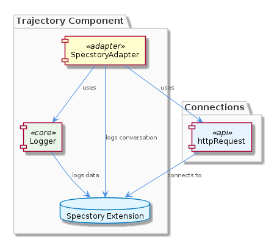

# Trajectory

**Type:** Component

[LLM] The Trajectory component's design decisions, such as the use of adapters and the execute(input, context) pattern, reflect a focus on flexibility and modularity. The component's architecture is designed to enable it to adapt to different extensions and services, while also providing a high degree of flexibility and modularity. The use of adapters, such as the SpecstoryAdapter, enables the component to connect to different extensions and services, while the execute(input, context) pattern allows for lazy initialization and execution. This design approach enables the component to maintain its functionality and adapt to changing requirements, making it a robust and reliable solution.

## What It Is  

The **Trajectory** component lives under the `lib/integrations/` folder of the Coding project and is materialised primarily by the **SpecstoryAdapter** class defined in `lib/integrations/specstory-adapter.js`.  This adapter is the concrete bridge between the core Trajectory logic and external extensions such as *Specstory*.  All logging of conversational data is delegated to the `logConversation` method (line 134) which in turn uses the logger created by `createLogger` from `../logging/Logger.js`.  The component therefore resides at the intersection of **integration**, **logging**, and **execution orchestration** within the broader *Coding* hierarchy.  

  

The component’s primary responsibilities are:  

1. **Connecting** to the Specstory extension via HTTP (`connectViaHTTP`) or, as a safety net, via a file‑watch based fallback (`connectViaFileWatch`).  
2. **Executing** user‑driven work through the `execute(input, context)` entry point, which lazily initialises any required resources.  
3. **Logging** conversation payloads through `logConversation`, leveraging the shared `Logger` infrastructure.  

These capabilities are encapsulated in a small, focused codebase that deliberately avoids hard‑coded dependencies, making Trajectory a reusable integration point for any future extensions that conform to the same adapter contract.

---

## Architecture and Design  

Trajectory’s architecture is built around the **Adapter pattern**.  The `SpecstoryAdapter` implements a well‑defined interface (implicit in the codebase) that isolates the rest of the system from the specifics of the Specstory service.  By swapping out this adapter with another implementation, the component can connect to completely different back‑ends without touching the surrounding logic.  

A second, complementary design choice is the **lazy‑initialisation / command pattern** embodied in the `execute(input, context)` method (line 56).  Rather than performing work at construction time, the adapter postpones heavyweight operations—such as establishing an HTTP client or setting up file watchers—until `execute` is called with concrete input and execution context.  This makes the component lightweight to instantiate and easy to compose in larger workflows.  

The fallback mechanism (`connectViaFileWatch` at line 246) demonstrates a **Strategy‑like fallback**: if the primary HTTP connection (`connectViaHTTP`) cannot be established, the adapter silently switches to a file‑system based transport.  This design improves resilience without requiring callers to manage error handling themselves.  

All of these patterns are echoed across sibling components.  For example, **LiveLoggingSystem** also uses a `TranscriptAdapter` to abstract over different agent transcript formats, and **KnowledgeManagement** employs a `GraphDatabaseAdapter` to hide persistence details.  This consistent use of adapters across the codebase reinforces a shared architectural language within the *Coding* parent component.  

  

---

## Implementation Details  

### Core Class – `SpecstoryAdapter` (`lib/integrations/specstory-adapter.js`)  
* **Constructor** – Sets up internal state but does not immediately open network connections, adhering to lazy initialisation.  
* **`execute(input, context)`** – The public entry point.  It validates the incoming payload, selects the appropriate transport (HTTP or file‑watch), and then forwards the request to the Specstory extension.  Because the method receives both *input* and *context*, it can adapt its behaviour based on runtime conditions (e.g., testing vs. production).  

### Connection Strategies  
* **`connectViaHTTP`** – Builds an HTTP request using the helper `httpRequest` (line 304).  The helper abstracts away low‑level request configuration (method, headers, body) and returns a promise that resolves with the response.  By centralising HTTP logic, the component avoids duplication and can evolve the request handling (e.g., adding retries) in a single place.  
* **`connectViaFileWatch`** – Acts as a graceful degradation path.  It watches a predefined file for updates and streams those updates to the Specstory service when the HTTP route is unavailable.  This fallback is invoked automatically when `connectViaHTTP` throws or returns an error, as indicated by the conditional flow around line 246.  

### Logging – `logConversation` (`lib/integrations/specstory-adapter.js:134`)  
* The method receives a conversation object, enriches it with metadata (timestamp, adapter name), and forwards it to a logger instance created by `createLogger` from `../logging/Logger.js`.  The logger is deliberately modular: different transports (console, file, remote) can be swapped by configuring the `Logger` module, allowing the Trajectory component to fit into varied deployment environments.  

### Child Component – `ConversationLogger`  
* The `ConversationLogger` child simply exposes the `logConversation` method, making it reusable for any other adapter that needs to record dialogue.  This thin wrapper reinforces the single‑responsibility principle and keeps logging concerns isolated from transport logic.  

### Shared Infrastructure  
* The `Logger` module (`../logging/Logger.js`) provides `createLogger`, a factory that returns an object with methods such as `info`, `error`, and `debug`.  Because the same factory is used across multiple components (e.g., LiveLoggingSystem), logging conventions remain consistent throughout the *Coding* ecosystem.  

---

## Integration Points  

1. **Specstory Extension** – The primary external dependency.  Communication occurs over HTTP via `httpRequest` or, when that fails, via a file‑watch interface.  The adapter’s contract is deliberately thin, exposing only `execute`, `connectViaHTTP`, `connectViaFileWatch`, and `logConversation`.  

2. **Logging Subsystem** – Through `createLogger`, Trajectory plugs into the central logging facility located at `../logging/Logger.js`.  Any changes to logger configuration (e.g., adding a remote log sink) automatically propagate to Trajectory without code changes.  

3. **Parent – Coding** – As a child of the *Coding* root component, Trajectory inherits project‑wide conventions such as TypeScript/JavaScript linting, error‑handling policies, and shared utility libraries (e.g., the `httpRequest` helper).  

4. **Sibling Components** – The adapter pattern aligns Trajectory with siblings like **LiveLoggingSystem** (which uses `TranscriptAdapter`) and **KnowledgeManagement** (which uses `GraphDatabaseAdapter`).  This uniformity means new adapters can be introduced following the same scaffolding, simplifying onboarding for developers familiar with other parts of the system.  

5. **Child – ConversationLogger** – Exposes the `logConversation` API to any downstream consumer that wishes to persist or forward conversation data, fostering reuse across future adapters or analytics modules.  

---

## Usage Guidelines  

* **Instantiate via the adapter, not the raw HTTP client.**  Always create a `SpecstoryAdapter` instance and call its `execute(input, context)` method; this guarantees that the fallback logic and logging are correctly wired.  
* **Provide a rich `context` object.**  The `context` parameter can carry flags such as `isTest` or `preferredTransport`.  Supplying this information enables the adapter to choose the optimal connection strategy without additional branching in calling code.  
* **Do not bypass `logConversation`.**  All conversational payloads should be routed through the `ConversationLogger` child to preserve a single source of truth for logging and to keep audit trails consistent.  
* **Handle promises correctly.**  Both `connectViaHTTP` and `connectViaFileWatch` return promises; callers should `await` the `execute` call or attach `.then/.catch` handlers to propagate errors upstream.  
* **Configure the logger centrally.**  Adjust log levels or destinations in `../logging/Logger.js` rather than scattering configuration across adapters.  This ensures that any change (e.g., switching from console to a remote log aggregation service) automatically applies to Trajectory.  

---

### Summary of Requested Points  

**1. Architectural patterns identified**  
* Adapter pattern (SpecstoryAdapter abstracts external service)  
* Lazy‑initialisation/Command pattern (`execute(input, context)`)  
* Fallback/Strategy pattern (`connectViaFileWatch` as a secondary transport)  

**2. Design decisions and trade‑offs**  
* *Decision*: Centralise all external‑service interactions behind an adapter → *Trade‑off*: Slight overhead of indirection but gains in testability and extensibility.  
* *Decision*: Use lazy initialisation → *Trade‑off*: Initial call incurs setup latency, but overall memory footprint stays low.  
* *Decision*: Provide an automatic HTTP‑to‑file‑watch fallback → *Trade‑off*: Added complexity in error‑path handling, but dramatically improves resilience in constrained environments.  

**3. System structure insights**  
* Trajectory is a leaf component under the *Coding* parent, sharing the adapter‑centric philosophy with siblings.  
* Its child, `ConversationLogger`, isolates logging concerns, reinforcing single‑responsibility boundaries.  
* The component’s public surface (`execute`, `logConversation`) is deliberately small, enabling easy composition with other services (e.g., analytics pipelines).  

**4. Scalability considerations**  
* Because HTTP requests are performed via the reusable `httpRequest` helper, connection pooling or retry policies can be introduced centrally without modifying the adapter.  
* The file‑watch fallback scales with the underlying file system; in high‑throughput scenarios the primary HTTP path should be preferred, and the fallback can be disabled via context flags.  
* Logging is decoupled via `createLogger`; swapping to an async, batched logger (e.g., sending logs to a message queue) can handle increased volume without impacting the adapter logic.  

**5. Maintainability assessment**  
* High maintainability: clear separation of concerns (transport vs. logging), minimal public API, and reuse of shared utilities (`httpRequest`, `Logger`).  
* Consistent adapter usage across the codebase means new integrations follow an established template, reducing learning curve.  
* The only potential maintenance hotspot is the fallback logic; developers should keep the file‑watch implementation in sync with any changes to the Specstory protocol to avoid silent mismatches.

## Hierarchy Context

### Parent
- [Coding](./Coding.md) -- Root node of the coding project knowledge hierarchy, encompassing all development infrastructure knowledge. The project consists of 8 major components: LiveLoggingSystem: [LLM] The LiveLoggingSystem component's modular architecture allows for easy extension and modification of agent-specific transcript formats. This is ; LLMAbstraction: [LLM] The LLMAbstraction component utilizes the LLMService class (lib/llm/llm-service.ts) as a single entry point for all LLM operations. This class i; DockerizedServices: [LLM] The DockerizedServices component utilizes a microservices architecture, with each sub-component responsible for a specific service or functional; Trajectory: [LLM] The Trajectory component's architecture is characterized by its use of adapters, such as the SpecstoryAdapter, to connect to different extension; KnowledgeManagement: [LLM] The KnowledgeManagement component utilizes the GraphDatabaseAdapter (integrations/mcp-server-semantic-analysis/src/storage/graph-database-adapte; CodingPatterns: [LLM] The CodingPatterns component utilizes the GraphDatabaseAdapter class in storage/graph-database-adapter.ts for persistence, allowing for automati; ConstraintSystem: [LLM] The ConstraintSystem component utilizes the GraphDatabaseAdapter for persistence, which is implemented in the storage/graph-database-adapter.ts ; SemanticAnalysis: [LLM] The SemanticAnalysis component utilizes a multi-agent system architecture, with agents such as OntologyClassificationAgent, SemanticAnalysisAgen.

### Children
- [ConversationLogger](./ConversationLogger.md) -- The logConversation method in SpecstoryAdapter (lib/integrations/specstory-adapter.js:134) implements logging functionality for conversation entries.

### Siblings
- [LiveLoggingSystem](./LiveLoggingSystem.md) -- [LLM] The LiveLoggingSystem component's modular architecture allows for easy extension and modification of agent-specific transcript formats. This is achieved through the use of the TranscriptAdapter, which is implemented in the lib/agent-api/transcript-api.js file. The TranscriptAdapter provides a standardized interface for handling different agent formats, such as Claude Code and Copilot CLI, and converting them to the unified LSL format. For example, the ClaudeCodeTranscriptAdapter class in lib/agent-api/transcripts/claudia-transcript-adapter.js extends the TranscriptAdapter class and provides a specific implementation for handling Claude Code transcripts.
- [LLMAbstraction](./LLMAbstraction.md) -- [LLM] The LLMAbstraction component utilizes the LLMService class (lib/llm/llm-service.ts) as a single entry point for all LLM operations. This class is responsible for managing mode routing, caching, and provider fallback. For instance, the LLMService class includes a method for making LLM requests, which first checks the cache for a valid response before proceeding to make an actual request. This is evident in the use of the cache object within the LLMService class, where it attempts to retrieve a cached response before making a request to the provider. The cache is implemented using a simple in-memory object, where the keys are the request parameters and the values are the corresponding responses.
- [DockerizedServices](./DockerizedServices.md) -- [LLM] The DockerizedServices component utilizes a microservices architecture, with each sub-component responsible for a specific service or functionality. For instance, the LLM Service (lib/llm/llm-service.ts) acts as a high-level facade for all LLM operations, handling mode routing, caching, circuit breaking, and provider fallback. This modular design enables efficient and scalable operation, as well as easier maintenance and updates. The Service Starter (lib/service-starter.js) provides robust service startup with retry, timeout, and graceful degradation, using exponential backoff and health verification. This ensures that services are started reliably and with minimal downtime.
- [KnowledgeManagement](./KnowledgeManagement.md) -- [LLM] The KnowledgeManagement component utilizes the GraphDatabaseAdapter (integrations/mcp-server-semantic-analysis/src/storage/graph-database-adapter.ts) for persisting data in a graph database with automatic JSON export synchronization. This design decision enables efficient storage and retrieval of knowledge entities and relationships, which is crucial for the system's overall goals of knowledge discovery and insight generation. Furthermore, the use of Graphology+LevelDB persistence ensures a scalable and performant solution for managing the knowledge graph.
- [CodingPatterns](./CodingPatterns.md) -- [LLM] The CodingPatterns component utilizes the GraphDatabaseAdapter class in storage/graph-database-adapter.ts for persistence, allowing for automatic JSON export sync. This design decision enables seamless data synchronization and provides a robust foundation for the project's data management. The GraphDatabaseAdapter class is responsible for handling graph data storage and retrieval, making it a critical component of the project's architecture. By using this adapter, the CodingPatterns component can focus on its primary functionality, leaving data management to the GraphDatabaseAdapter.
- [ConstraintSystem](./ConstraintSystem.md) -- [LLM] The ConstraintSystem component utilizes the GraphDatabaseAdapter for persistence, which is implemented in the storage/graph-database-adapter.ts file. This adapter enables the system to store and manage constraints in a graph database, utilizing Graphology and LevelDB for efficient data storage and retrieval. The adapter also features automatic JSON export sync, allowing for seamless data exchange between the graph database and other components. For example, the ContentValidationAgent, located in integrations/mcp-server-semantic-analysis/src/agents/content-validation-agent.ts, relies on the GraphDatabaseAdapter to retrieve and validate entity content against configured rules.
- [SemanticAnalysis](./SemanticAnalysis.md) -- [LLM] The SemanticAnalysis component utilizes a multi-agent system architecture, with agents such as OntologyClassificationAgent, SemanticAnalysisAgent, and CodeGraphAgent, to process git history and LSL sessions. This is evident in the code files, such as integrations/mcp-server-semantic-analysis/src/agents/ontology-classification-agent.ts, integrations/mcp-server-semantic-analysis/src/agents/semantic-analysis-agent.ts, and integrations/mcp-server-semantic-analysis/src/agents/code-graph-agent.ts, which define the respective agents and their responsibilities. The use of multiple agents allows for a modular and scalable design, enabling the processing of large amounts of data and the integration of new agents as needed.

---

*Generated from 6 observations*
