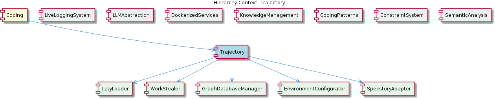
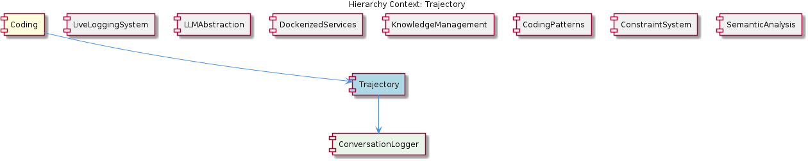

# Trajectory

**Type:** Component

[LLM] The Trajectory component's utilization of the Code Graph RAG system, as mentioned in integrations/code-graph-rag/README.md, implies a graph-based approach to code analysis and understanding. This approach enables the system to capture complex relationships between code entities, such as functions, classes, and variables, and to reason about the code's structure and behavior. The Code Graph RAG system's SSE port, specified in CODE_GRAPH_RAG_SSE_PORT, and its port, specified in CODE_GRAPH_RAG_PORT, demonstrate the system's ability to communicate with other components and services, facilitating the exchange of information and the coordination of actions. The SpecstoryAdapter's interaction with the Code Graph RAG system, although not directly implemented, highlights the potential for integrating multiple components and services to achieve a comprehensive understanding of the codebase.

## What It Is  

The **Trajectory** component lives primarily in the file `lib/integrations/specstory‑adapter.js`.  This module implements a **SpecstoryAdapter** class that is responsible for logging conversational data to the external Specstory service.  The adapter pulls in a centralized logger from `../logging/Logger.js` and is driven by configuration that can be supplied through environment variables or the various `integrations/*` markdown files (e.g., `integrations/copi/INSTALL.md`, `integrations/code-graph-rag/README.md`).  Trajectory therefore acts as the bridge between the core Coding platform and the Specstory logging endpoint, while also exposing a set of helper children – **AdapterPattern**, **ConcurrencyManager**, **LLMInitializer**, and **SpecstoryLogger** – that encapsulate distinct concerns such as connection strategy, work‑stealing task execution, lazy LLM boot‑strapping, and the concrete logging API.

---

## Architecture and Design  

Trajectory is built around a **modular, adapter‑centric architecture**.  The central `SpecstoryAdapter` follows the **Adapter Pattern**: it presents a stable, internal interface (`logConversation`, `initialize`, `connect…`) while translating calls to the concrete Specstory transport mechanisms.  The adapter’s connection logic is ordered by preference – HTTP first, then IPC, and finally a file‑watch fallback – as implemented in the methods `connectViaHTTP`, `connectViaIPC`, and `connectViaFileWatch`.  This ordered‑fallback strategy is a classic **Chain‑of‑Responsibility** style decision, ensuring the most efficient channel is used while preserving resilience.

Concurrency within Trajectory is handled by a **work‑stealing model** (observed in the sibling component **ConcurrencyManager** and hinted at by the description of “work‑stealing concurrency for efficient processing”).  Idle workers can pull pending logging tasks, which keeps the logging pipeline saturated without over‑committing threads.  This model dovetails with the parent **Coding** component’s broader use of work‑stealing in other sub‑systems (e.g., KnowledgeManagement), indicating a system‑wide preference for this concurrency style.

Initialization of heavy resources – notably the large language model (LLM) used to enrich logged conversations – follows a **lazy initialization** approach.  The `initialize` method of `SpecstoryAdapter` defers creation of the extension API until the first log request arrives, mirroring the lazy LLM pattern seen in the sibling **LiveLoggingSystem** and **LLMInitializer** child.  This decision reduces start‑up latency and memory pressure, especially in environments where logging may be sporadic.

Finally, configuration is externalized via **environment variables** (e.g., `ANTHROPIC_API_KEY`, `BROWSERBASE_API_KEY`) and markdown‑based install guides, allowing the same binary to be re‑used across dev, CI, and production contexts without code changes.  The presence of dedicated README and EXAMPLES files under each `integrations/*` folder reinforces a **self‑documenting, convention‑over‑configuration** philosophy.

---

## Implementation Details  

1. **SpecstoryAdapter (lib/integrations/specstory‑adapter.js)**  
   - **Connection strategy** – The adapter defines three private helpers: `connectViaHTTP`, `connectViaIPC`, and `connectViaFileWatch`.  At runtime `initialize` attempts each in turn, stopping at the first successful handshake.  The HTTP path likely uses a standard `fetch`/`axios` client; the IPC path uses Node’s `net` or `child_process` sockets; the file‑watch fallback writes JSON payloads into a monitored directory, where a separate consumer can ingest them.  
   - **Lazy API initialization** – Inside `initialize`, the adapter checks for an existing `extensionApi` instance.  If absent, it loads the module on demand, wiring it to the selected transport.  This guards against unnecessary allocation of network sockets or file watchers when the component is instantiated but never used.  
   - **Logging** – `logConversation` formats the payload into a standardized JSON schema (the “standardized logging format” mentioned) before delegating to the active transport.  Errors in the primary channel trigger a fallback to the file‑watch mechanism, ensuring no loss of data.  

2. **Centralized Logger (../logging/Logger.js)**  
   - All adapter actions funnel through this logger, providing a single point for log level control, output destination configuration, and potential integration with the broader **LiveLoggingSystem**.  By re‑using this class, Trajectory inherits the same async buffering and non‑blocking I/O guarantees that other components enjoy.  

3. **ConcurrencyManager (child component)**  
   - Though the concrete class is not listed, the description aligns it with the work‑stealing pattern used elsewhere (e.g., `WaveController.runWithConcurrency()`).  The manager likely maintains a pool of worker promises that pull tasks from a shared queue; when a worker finishes, it “steals” work from another busy worker’s queue, minimizing idle time.  

4. **LLMInitializer (child component)**  
   - Mirrors the lazy LLM initialization seen in **LiveLoggingSystem**.  The initializer probably wraps the LLM service (found in `lib/llm/llm-service.ts` under the sibling **LLMAbstraction**) and only constructs the model when `logConversation` requests enriched data.  

5. **SpecstoryLogger (child component)**  
   - Provides a thin façade over `SpecstoryAdapter`, exposing a simple `log` method for higher‑level callers.  By separating the façade from the adapter, the system can swap out the underlying logging implementation without touching consumer code.  

6. **Configuration & Environment**  
   - The component reads variables such as `CODE_GRAPH_RAG_PORT`, `CODE_GRAPH_RAG_SSE_PORT`, and the various API keys from `process.env`.  The presence of markdown install guides (`integrations/copi/INSTALL.md`, `integrations/copi/MIGRATION.md`) indicates that these variables are expected to be set by deployment scripts or CI pipelines rather than hard‑coded.  

---

## Integration Points  

- **Specstory Service** – The ultimate external dependency; communication occurs via HTTP, IPC, or file‑watch as dictated by the adapter.  
- **Code Graph RAG** – Though not directly invoked, the presence of `CODE_GRAPH_RAG_PORT` and `CODE_GRAPH_RAG_SSE_PORT` in the environment suggests that Trajectory may emit logs that are later consumed by the graph‑based retrieval‑augmented generation (RAG) subsystem, enabling richer analysis of conversation context.  
- **LLMAbstraction (lib/llm/llm-service.ts)** – Provides the LLM capabilities that Trajectory can embed into logged conversations (e.g., summarisation, sentiment).  The lazy initializer ensures this service is only pulled in when needed.  
- **LiveLoggingSystem** – Shares the same `Logger` implementation, meaning that logs from Trajectory are co‑alesced with live logs from other components, giving a unified view in any monitoring dashboard.  
- **DockerizedServices** – Since DockerizedServices expose a façade for LLM operations, any LLM‑related enrichment performed by Trajectory will pass through the same façade, preserving consistency across the platform.  
- **Configuration Files** – The markdown files under `integrations/*` act as contracts; developers modify these to enable/disable the Specstory integration, adjust ports, or switch fallback mechanisms.  

---

## Usage Guidelines  

1. **Prefer the default connection order** – Do not manually reorder the fallback chain; the adapter’s built‑in preference (HTTP → IPC → file‑watch) has been tuned for latency and reliability.  
2. **Set environment variables early** – Ensure all required keys (`ANTHROPIC_API_KEY`, `BROWSERBASE_API_KEY`, `CODE_GRAPH_RAG_PORT`, etc.) are defined before the first call to `logConversation`.  Missing variables will cause the adapter to fall back to the slower file‑watch path.  
3. **Leverage the SpecstoryLogger façade** – When adding new logging points in the codebase, import `SpecstoryLogger` rather than the raw adapter.  This isolates callers from transport details and makes future swaps (e.g., to a different logging backend) trivial.  
4. **Respect lazy initialization** – Do not pre‑emptively call `initialize` unless you need to verify connectivity at start‑up.  Allow the lazy path to allocate resources only when a real conversation needs logging; this conserves memory and reduces start‑up time.  
5. **Handle back‑pressure** – The work‑stealing concurrency model will queue log tasks automatically, but extremely high‑volume bursts may still saturate the underlying transport.  If you anticipate such loads, consider increasing the size of the worker pool or configuring a dedicated HTTP endpoint with higher throughput.  
6. **Maintain configuration documentation** – Whenever you add a new environment variable or change a port, update the corresponding `README.md` or `EXAMPLES.md` under the relevant `integrations/*` folder.  This keeps the self‑documenting nature of the system intact.  

---

### Architectural Patterns Identified  

1. **Adapter Pattern** – `SpecstoryAdapter` abstracts multiple transport mechanisms behind a single interface.  
2. **Chain‑of‑Responsibility** – Connection attempts cascade through HTTP → IPC → file‑watch.  
3. **Work‑Stealing Concurrency** – `ConcurrencyManager` distributes logging tasks among idle workers.  
4. **Lazy Initialization** – Both the LLM extension API and the Specstory connection are created on first use.  
5. **Facade Pattern** – `SpecstoryLogger` offers a simplified logging API to callers.  

### Design Decisions & Trade‑offs  

- **Fallback Transport** – Adding a file‑watch fallback improves resilience but introduces eventual‑consistency latency; logs may be delayed until the watcher processes the file.  
- **Lazy Loading** – Reduces startup cost and memory usage, at the expense of a small first‑call latency when the connection or LLM is finally instantiated.  
- **Work‑Stealing** – Maximizes CPU utilization under bursty logging loads, but requires careful queue management to avoid starvation of high‑priority tasks.  
- **Environment‑Driven Config** – Enables flexible deployments but places the burden of correct env‑var management on operators; missing keys silently degrade to slower paths.  

### System Structure Insights  

Trajectory sits under the **Coding** root component and shares the same modular conventions as its siblings (LiveLoggingSystem, LLMAbstraction, DockerizedServices, etc.).  Its children break the responsibilities into focused units: the **AdapterPattern** encapsulates transport logic, **ConcurrencyManager** handles task scheduling, **LLMInitializer** provides on‑demand model loading, and **SpecstoryLogger** presents a clean public API.  This separation mirrors the architecture of other siblings, reinforcing a consistent, component‑based mental model across the codebase.  

### Scalability Considerations  

- **Horizontal Scaling** – Because the adapter’s transport is stateless (HTTP) or uses OS‑level IPC, multiple Trajectory instances can run behind a load balancer without coordination.  
- **Back‑pressure Handling** – The work‑stealing pool can be sized based on the expected logging throughput; adding more workers scales linearly until the underlying network or disk I/O becomes the bottleneck.  
- **Fallback Path Load** – In a failure scenario where HTTP/IPC are unavailable, the file‑watch fallback may become a hotspot; provisioning a high‑performance shared volume mitigates this risk.  

### Maintainability Assessment  

Trajectory’s design is **highly maintainable**:

- **Modularity** – Clear separation of concerns means changes to transport logic, concurrency, or LLM loading can be made in isolation.  
- **Centralized Logging** – Re‑using `../logging/Logger.js` provides a single place to adjust log format, rotation, or destination.  
- **Documentation‑Driven Configuration** – The extensive markdown guides in `integrations/*` act as living contracts, reducing the need to read source code for deployment details.  
- **Pattern Consistency** – The same adapter and lazy‑init patterns appear across siblings, lowering the learning curve for new contributors.  

Potential maintenance risks include the need to keep fallback mechanisms in sync (e.g., ensuring the file‑watch directory schema matches what downstream consumers expect) and the reliance on environment variables, which can become fragmented across deployment scripts if not centrally audited. Regular integration tests that simulate each transport fallback will help keep the component robust as the surrounding ecosystem evolves.

## Diagrams

### Relationship

## Architecture Diagrams

## Hierarchy Context

### Parent
- [Coding](./Coding.md) -- Root node of the coding project knowledge hierarchy, encompassing all development infrastructure knowledge. The project consists of 8 major components: LiveLoggingSystem: [LLM] The LiveLoggingSystem component utilizes lazy LLM initialization, as seen in the integrations/mcp-server-semantic-analysis/src/agents/ontology-c; LLMAbstraction: [LLM] The LLMAbstraction component's architecture is designed with dependency injection in mind, as seen in the LLMService class (lib/llm/llm-service.; DockerizedServices: [LLM] The DockerizedServices component utilizes a high-level facade for LLM operations, with the LLMService (lib/llm/llm-service.ts) acting as the sin; Trajectory: [LLM] The Trajectory component utilizes the SpecstoryAdapter in lib/integrations/specstory-adapter.js for logging conversations via Specstory, demonst; KnowledgeManagement: The KnowledgeManagement component is responsible for managing the knowledge graph, which includes storing, querying, and updating entities and relatio; CodingPatterns: [LLM] The CodingPatterns component utilizes a modular approach to hook management, as seen in the HookConfigLoader class in lib/agent-api/hooks/hook-c; ConstraintSystem: [LLM] The ConstraintSystem component's architecture is designed to be modular and scalable, with multiple sub-components working together to validate ; SemanticAnalysis: [LLM] The SemanticAnalysis component employs a modular architecture with various agents, each responsible for a specific task, such as ontology classi.

### Children
- [AdapterPattern](./AdapterPattern.md) -- The SpecstoryAdapter class in lib/integrations/specstory-adapter.js employs connection methods in order of preference, starting with HTTP, then IPC, and finally file watch, as seen in the connectViaHTTP, connectViaIPC, and connectViaFileWatch methods.
- [ConcurrencyManager](./ConcurrencyManager.md) -- The ConcurrencyManager may use a work-stealing concurrency model, allowing idle workers to pull tasks immediately, similar to the WaveController.runWithConcurrency() method.
- [LLMInitializer](./LLMInitializer.md) -- The LLMInitializer may use a lazy loading approach to initialize LLMs, delaying initialization until the model is actually needed, reducing memory usage and improving system responsiveness.
- [SpecstoryLogger](./SpecstoryLogger.md) -- The SpecstoryLogger may use the SpecstoryAdapter class in lib/integrations/specstory-adapter.js to log conversations via Specstory.

### Siblings
- [LiveLoggingSystem](./LiveLoggingSystem.md) -- [LLM] The LiveLoggingSystem component utilizes lazy LLM initialization, as seen in the integrations/mcp-server-semantic-analysis/src/agents/ontology-classification-agent.ts file, which defines the OntologyClassificationAgent class. This approach enables the system to handle diverse log data and ensures data consistency. The use of lazy initialization allows for more efficient resource allocation and improves the overall performance of the system. Furthermore, the LoggingMechanism in integrations/mcp-server-semantic-analysis/src/logging.ts employs async buffering and non-blocking file I/O to prevent event loop blocking, ensuring that the logging process does not interfere with other system operations.
- [LLMAbstraction](./LLMAbstraction.md) -- [LLM] The LLMAbstraction component's architecture is designed with dependency injection in mind, as seen in the LLMService class (lib/llm/llm-service.ts), which allows for the incorporation of various trackers and classifiers. This design decision enables a high degree of flexibility and testability, as different components can be easily swapped out or mocked. For instance, the budget tracker and sensitivity classifier can be replaced with mock implementations for testing purposes. The use of dependency injection also facilitates the addition of new providers, as the core service logic remains unchanged. The LLMService class extends EventEmitter, which provides a way to handle initialization, mode resolution, and completion requests in an event-driven manner.
- [DockerizedServices](./DockerizedServices.md) -- [LLM] The DockerizedServices component utilizes a high-level facade for LLM operations, with the LLMService (lib/llm/llm-service.ts) acting as the single public entry point for all LLM operations, handling mode routing and provider fallback. This design decision allows for a clear separation of concerns and makes it easier to manage and maintain the component. The LLMService class is responsible for handling incoming requests, determining the appropriate mode and provider, and delegating the work to the corresponding provider. For example, the handleRequest function in lib/llm/llm-service.ts is responsible for handling incoming requests and delegating the work to the corresponding provider.
- [KnowledgeManagement](./KnowledgeManagement.md) -- The KnowledgeManagement component is responsible for managing the knowledge graph, which includes storing, querying, and updating entities and relationships. It utilizes a Graphology+LevelDB database for persistence and provides a JSON export sync feature. The component's architecture is designed to handle concurrent access and provides an intelligent routing mechanism for storing and retrieving data. Key patterns include the use of adapters for database interactions, lazy initialization of LLM (Large Language Model) providers, and work-stealing concurrency for efficient data processing.
- [CodingPatterns](./CodingPatterns.md) -- [LLM] The CodingPatterns component utilizes a modular approach to hook management, as seen in the HookConfigLoader class in lib/agent-api/hooks/hook-config.js. This class loads and merges hook configurations, allowing for a flexible and scalable hook system. The ensureLLMInitialized() method in base-agent.ts further promotes efficient resource utilization by ensuring lazy LLM initialization. This pattern is also observed in the Wave agents, which follow a consistent structure for agent implementation, comprising a constructor, ensureLLMInitialized(), and execute() method.
- [ConstraintSystem](./ConstraintSystem.md) -- [LLM] The ConstraintSystem component's architecture is designed to be modular and scalable, with multiple sub-components working together to validate code actions and file operations. For example, the ContentValidationAgent (integrations/mcp-server-semantic-analysis/src/agents/content-validation-agent.ts) is responsible for validating entity content against the current codebase, while the HookConfigLoader (lib/agent-api/hooks/hook-config.js) loads and merges hook configurations from multiple sources. This modular design allows for easy maintenance and extension of the system.
- [SemanticAnalysis](./SemanticAnalysis.md) -- [LLM] The SemanticAnalysis component employs a modular architecture with various agents, each responsible for a specific task, such as ontology classification, semantic analysis, and content validation. The OntologyClassificationAgent, located in integrations/mcp-server-semantic-analysis/src/agents/ontology-classification-agent.ts, is responsible for classifying observations against the ontology system. This agent utilizes the LLMService, found in lib/llm/dist/index.js, for large language model operations, such as text generation and classification. The GraphDatabaseAdapter, located in storage/graph-database-adapter.js, is used for interacting with the graph database, which stores knowledge entities and their relationships.

---

*Generated from 6 observations*
