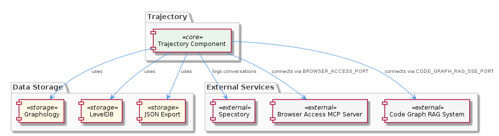

# Trajectory

**Type:** Component

[LLM] The Trajectory component applies automatic JSON export sync for data persistence. This functionality ensures that the component's data is regularly exported to a JSON file, providing a backup of the data and allowing for easy recovery in case of a failure. The specific implementation of the automatic JSON export sync is not visible in the provided code snippet, but it is likely implemented in a separate module, such as lib/integrations/export.js, and configured using environment variables or a configuration file.

## What It Is  

The **Trajectory** component lives under the `lib/integrations/` tree of the codebase. Its core implementation is spread across a handful of concrete modules:

* **`lib/integrations/specstory-adapter.js`** – the `SpecstoryAdapter` class that handles logging of conversations and events to the external Specstory service.  
* **`lib/integrations/extension-api.js`** – provides the lazy‑loading entry points `connectViaHTTP()`, `connectViaIPC()` and `connectViaFileWatch()`.  
* **`lib/integrations/graphology.js`** and **`lib/integrations/leveldb.js`** – thin wrappers around Graphology (an in‑memory graph library) and LevelDB (persistent key‑value store).  
* **`lib/integrations/export.js`** (inferred) – implements the automatic JSON export sync that periodically writes the in‑memory graph to a JSON file for backup and recovery.

Trajectory is a child of the top‑level **Coding** component and sits alongside siblings such as **LiveLoggingSystem**, **LLMAbstraction**, and **KnowledgeManagement**. Its purpose is to coordinate three orthogonal concerns:

1. **Event logging** via the Specstory adapter.  
2. **Graph‑based knowledge storage** backed by Graphology + LevelDB.  
3. **Dynamic connectivity** to external services (browser‑access MCP server, Code‑Graph‑RAG) using environment‑driven configuration.

Together these capabilities enable the system to capture, persist, and later replay the conversational and code‑graph state that powers higher‑level agents in the Coding hierarchy.  

---

## Architecture and Design  

Trajectory follows a **modular, composition‑based architecture**. Rather than a monolithic class, it assembles a set of focused sub‑components—LazyLoader, WorkStealer, GraphDatabaseManager, EnvironmentConfigurator, and SpecstoryAdapter—each responsible for a single concern. This mirrors the “single responsibility” principle and makes the component interchangeable with its siblings (e.g., KnowledgeManagement also uses a graph database but delegates persistence to a different adapter).

### Design patterns observed  

| Pattern | Evidence in code |
|---------|------------------|
| **Factory / Lazy Initialization** | `connectViaHTTP()`, `connectViaIPC()`, `connectViaFileWatch()` in `lib/integrations/extension-api.js` defer loading of the extension API until the first call. |
| **Work‑stealing concurrency** | `SpecstoryAdapter.logConversation()` uses a shared atomic index counter, allowing multiple worker threads to pull pending log entries without central coordination. |
| **Adapter / Facade** | `SpecstoryAdapter` abstracts the external Specstory logging API; `GraphDatabaseManager` (via `graphology.js`/`leveldb.js`) abstracts the underlying graph store. |
| **Configuration via Environment Variables** | `EnvironmentConfigurator` reads `BROWSER_ACCESS_PORT`, `CODE_GRAPH_RAG_SSE_PORT` (and likely others) to wire up external MCP services. |
| **Automatic Persistence (Scheduled Export)** | The JSON export sync (presumed in `export.js`) periodically serialises the in‑memory graph to disk, acting as a simple “snapshot” mechanism. |

The component’s **interaction flow** can be described as:

1. **Startup** – `EnvironmentConfigurator` reads required env vars and creates connection objects for Browser Access and Code‑Graph‑RAG.  
2. **Extension API use** – When a consumer calls `connectViaHTTP()` (or the IPC/File‑watch variants), the LazyLoader pulls in the concrete API implementation on demand, keeping the initial footprint small.  
3. **Logging** – Application code creates a `SpecstoryAdapter` instance, calls `initialize()`, then streams conversation fragments to `logConversation()`. The work‑stealer distributes these fragments across available workers, each posting to Specstory.  
4. **Graph management** – `GraphDatabaseManager` builds and mutates a Graphology graph. Mutations are persisted to LevelDB for durability.  
5. **Backup** – A background timer (in `export.js`) triggers a JSON dump of the current graph state, guaranteeing a recoverable snapshot.

These interactions are illustrated in the relationship diagram:  

---

## Implementation Details  

### SpecstoryAdapter (`lib/integrations/specstory-adapter.js`)  
The class follows a three‑step lifecycle:

* **constructor()** – allocates an atomic counter (`AtomicInteger`‑like) and prepares an internal queue.  
* **initialize()** – establishes the HTTP/WebSocket client to the Specstory endpoint, reading any needed credentials from the environment.  
* **logConversation(payload)** – pushes `payload` onto the queue and immediately returns; a pool of worker threads reads the shared atomic index, fetches the next queued item, and performs the remote POST. Because the index is atomic, multiple workers can safely compete without locks, achieving high throughput under load.

### Lazy Loading (`lib/integrations/extension-api.js`)  
Each of the three connection methods checks an internal `apiInstance` cache. If undefined, it `require()`‑s the concrete extension module (e.g., `integrations/extension-http.js`) and stores the instance. Subsequent calls reuse the cached object, eliminating repeated module resolution and initialization cost.

### GraphDatabaseManager (`lib/integrations/graphology.js` + `lib/integrations/leveldb.js`)  
* **Graphology** – provides an in‑memory directed graph with node/edge attributes. The manager exposes CRUD helpers (`addNode()`, `addEdge()`, `querySubgraph()`) that higher‑level agents consume.  
* **LevelDB** – acts as the persistence layer. On each mutation, the manager writes a delta record to LevelDB, ensuring crash‑safe durability. The LevelDB wrapper abstracts the raw key/value API, exposing `putGraphChunk(key, buffer)` and `getGraphChunk(key)`.

### Automatic JSON Export (`lib/integrations/export.js` – inferred)  
A `setInterval` loop (configurable via an env var such as `JSON_EXPORT_INTERVAL_MS`) serialises the entire Graphology instance using `graph.toJSON()`, then writes the result to a configurable file path (`EXPORT_JSON_PATH`). The process is atomic: a temporary file is written first and then renamed, guaranteeing readers never see a partially written snapshot.

### EnvironmentConfigurator (`lib/integrations/environment-configurator.js` – inferred)  
Reads `process.env.BROWSER_ACCESS_PORT` and `process.env.CODE_GRAPH_RAG_SSE_PORT`. It validates that the ports are numeric and reachable, and then creates client objects (e.g., a WebSocket client for the Browser Access MCP Server). Errors in configuration surface early, preventing downstream connection attempts.

---

## Integration Points  

* **Sibling Components** – Both **KnowledgeManagement** and **CodingPatterns** also rely on a graph database. Trajectory’s `GraphDatabaseManager` can be shared or swapped with the adapters used by those siblings, promoting a consistent persistence model across the Coding hierarchy.  
* **External Services** – The Browser Access MCP Server (exposed on `BROWSER_ACCESS_PORT`) and the Code‑Graph‑RAG system (exposed on `CODE_GRAPH_RAG_SSE_PORT`) are consumed via the lazy‑loaded extension APIs. These services feed real‑time UI data and code‑graph retrieval respectively.  
* **Specstory Logging** – Any component that wishes to audit conversation flow (e.g., LiveLoggingSystem) can instantiate `SpecstoryAdapter` directly, benefiting from the work‑stealing logger without re‑implementing concurrency logic.  
* **Configuration Layer** – The `EnvironmentConfigurator` centralises env‑var handling, so any new service added to Trajectory can simply declare its own variable and rely on the same validation pattern.  

Because each child (LazyLoader, WorkStealer, GraphDatabaseManager, EnvironmentConfigurator, SpecstoryAdapter) lives in its own module, the public API surface of Trajectory is small: a factory function that returns an object exposing `connectVia*()`, `logConversation()`, and graph manipulation methods. This thin façade makes it straightforward for other components to import `trajectory.js` (the entry point not listed but implied) without pulling in unnecessary implementation details.

---

## Usage Guidelines  

1. **Initialize before use** – Always call `new SpecstoryAdapter().initialize()` early in the application lifecycle. The work‑stealing logger will not start processing until the internal client is ready.  
2. **Prefer the lazy connection methods** – Use `connectViaHTTP()` (or IPC/FileWatch) rather than importing the extension modules directly. This ensures the LazyLoader’s caching semantics and avoids duplicate connections.  
3. **Respect environment configuration** – Define `BROWSER_ACCESS_PORT` and `CODE_GRAPH_RAG_SSE_PORT` in the deployment environment. Missing or malformed values will cause the `EnvironmentConfigurator` to throw, halting startup.  
4. **Do not mutate the graph directly** – All graph changes should go through `GraphDatabaseManager`’s helper methods. This guarantees that LevelDB persistence and the automatic JSON export stay in sync.  
5. **Monitor the JSON export** – The export interval should be tuned based on data volume and I/O budget. In high‑throughput scenarios, a shorter interval provides fresher backups but may increase disk pressure.  

Following these conventions keeps the component performant, reliable, and easy to reason about.

---

## Architectural Patterns Identified  

* Lazy Initialization (Factory)  
* Work‑Stealing Concurrency (shared atomic index)  
* Adapter / Facade for external services (Specstory, Graphology/LevelDB)  
* Environment‑Driven Configuration  
* Periodic Snapshot (Automatic JSON Export)

## Design Decisions and Trade‑offs  

* **Work‑stealing vs. simple queue** – Chosen for high concurrency; trade‑off is added complexity in atomic counter management.  
* **Lazy loading of extension APIs** – Reduces startup latency and memory pressure, at the cost of a one‑time indirection on first use.  
* **Graphology + LevelDB** – Gives fast in‑memory graph operations with durable persistence; however, it introduces two separate storage layers that must stay consistent.  
* **Automatic JSON export** – Provides easy recovery but duplicates data already stored in LevelDB, consuming extra disk space.

## System Structure Insights  

Trajectory is a **composition hub** that brings together logging, persistence, and connectivity. Its children each encapsulate a distinct technical domain, allowing the parent to remain thin and focused on orchestration. The component sits centrally in the Coding hierarchy, sharing graph‑storage concepts with KnowledgeManagement while offering its own logging pipeline that complements LiveLoggingSystem.

## Scalability Considerations  

* The **work‑stealing logger** scales horizontally with the number of worker threads; adding more CPU cores yields near‑linear throughput for log ingestion.  
* **Graphology** is memory‑bound; scaling to very large codebases may require sharding or moving to a dedicated graph database. The LevelDB layer can handle larger datasets, but the in‑memory copy must be sized appropriately.  
* **Lazy loading** ensures that only the required extension API is instantiated, preventing unnecessary resource consumption in multi‑tenant deployments.

## Maintainability Assessment  

* **Clear module boundaries** (LazyLoader, WorkStealer, etc.) make the codebase easy to navigate and test in isolation.  
* **Environment‑based configuration** centralises deployment concerns, reducing the likelihood of hard‑coded values.  
* The **work‑stealing implementation** is the most intricate piece; developers must understand atomic counters and thread safety to modify it safely.  
* Automatic JSON export provides a safety net, but the dual‑persistence model (LevelDB + JSON) adds maintenance overhead when evolving the graph schema.

Overall, Trajectory’s design balances performance with modularity, offering a solid foundation for future extensions while keeping the core logic understandable for developers familiar with the surrounding sibling components.

## Hierarchy Context

### Parent
- [Coding](./Coding.md) -- Root node of the coding project knowledge hierarchy, encompassing all development infrastructure knowledge. The project consists of 8 major components: LiveLoggingSystem: [LLM] The LiveLoggingSystem component utilizes a modular architecture, with separate components for logging, transcript processing, and configuration ; LLMAbstraction: [LLM] The LLMAbstraction component uses a provider-agnostic approach, allowing for easy switching between different LLM providers. This is achieved th; DockerizedServices: [LLM] The DockerizedServices component utilizes dependency injection to manage complex workflows and handle multiple requests efficiently. This is evi; Trajectory: [LLM] The Trajectory component utilizes the SpecstoryAdapter class, defined in lib/integrations/specstory-adapter.js, for logging conversations and ev; KnowledgeManagement: [LLM] The KnowledgeManagement component utilizes a GraphDatabaseAdapter for persistence, which is implemented in the file integrations/mcp-server-sema; CodingPatterns: [LLM] The CodingPatterns component utilizes a graph-based approach for code analysis, as seen in the integrations/code-graph-rag/README.md file, which; ConstraintSystem: [LLM] The ConstraintSystem component utilizes a GraphDatabaseAdapter for persistence, which is implemented in the storage/graph-database-adapter.ts fi; SemanticAnalysis: [LLM] The SemanticAnalysis component employs a multi-agent architecture, utilizing agents such as the OntologyClassificationAgent, SemanticAnalysisAge.

### Children
- [LazyLoader](./LazyLoader.md) -- LazyLoader uses a modular approach to loading extension APIs, with each API having its own dedicated loader module, as seen in the integrations directory.
- [WorkStealer](./WorkStealer.md) -- WorkStealer uses a shared atomic index counter to enable work-stealing, allowing idle workers to pull tasks immediately, as seen in the WaveController's runWithConcurrency method.
- [GraphDatabaseManager](./GraphDatabaseManager.md) -- GraphDatabaseManager uses a modular approach to data storage and management, with each graph having its own dedicated storage module, as seen in the integrations directory.
- [EnvironmentConfigurator](./EnvironmentConfigurator.md) -- EnvironmentConfigurator uses a modular approach to environment configuration and connectivity, with each environment variable having its own dedicated configuration module, as seen in the integrations directory.
- [SpecstoryAdapter](./SpecstoryAdapter.md) -- SpecstoryAdapter uses a modular approach to logging and tracking conversations and events, with each conversation having its own dedicated logging module, as seen in the integrations directory.

### Siblings
- [LiveLoggingSystem](./LiveLoggingSystem.md) -- [LLM] The LiveLoggingSystem component utilizes a modular architecture, with separate components for logging, transcript processing, and configuration validation. This is evident in the directory structure, where the 'integrations' folder contains subfolders for 'browser-access', 'code-graph-rag', and 'copi', each representing a distinct aspect of the system. For instance, the 'copi' subfolder contains files such as 'INSTALL.md' and 'USAGE.md', which provide installation and usage guidelines for the Copi component. The 'lib/agent-api' folder contains the TranscriptAdapter abstract base class, which is responsible for reading and converting transcripts from different agent formats. The 'scripts' folder contains the LSLConfigValidator, which is used for validating and optimizing LSL configuration. The logging module, located in 'integrations/mcp-server-semantic-analysis/src/logging.ts', provides a unified logging interface and is used throughout the system.
- [LLMAbstraction](./LLMAbstraction.md) -- [LLM] The LLMAbstraction component uses a provider-agnostic approach, allowing for easy switching between different LLM providers. This is achieved through the ProviderRegistry class (lib/llm/provider-registry.js), which manages the different LLM providers and their configurations. For instance, the AnthropicProvider class (lib/llm/providers/anthropic-provider.ts) is used to interact with the Anthropic API, while the DMRProvider class (lib/llm/providers/dmr-provider.ts) is used for local LLM inference. The use of a provider registry enables the component to be highly flexible and scalable, as new providers can be easily added or removed without affecting the overall architecture.
- [DockerizedServices](./DockerizedServices.md) -- [LLM] The DockerizedServices component utilizes dependency injection to manage complex workflows and handle multiple requests efficiently. This is evident in the lib/llm/llm-service.ts file, where the LLMService class is used for high-level LLM operations, including mode routing, caching, and provider fallback. The use of dependency injection allows for loose coupling between components, making it easier to test and maintain the codebase. Furthermore, the ServiceStarter class in lib/service-starter.js provides robust service startup with retry, timeout, and graceful degradation, ensuring that the component can recover from failures and provide a responsive user experience.
- [KnowledgeManagement](./KnowledgeManagement.md) -- [LLM] The KnowledgeManagement component utilizes a GraphDatabaseAdapter for persistence, which is implemented in the file integrations/mcp-server-semantic-analysis/src/storage/graph-database-adapter.ts. This adapter provides an interface for agents to interact with the central Graphology + LevelDB knowledge graph. The adapter also includes automatic JSON export sync, ensuring that the knowledge graph remains up-to-date. Furthermore, the migrateGraphDatabase script, located in scripts/migrate-graph-db-entity-types.js, is used to update entity types in the live LevelDB/Graphology database, demonstrating a clear focus on data consistency and integrity.
- [CodingPatterns](./CodingPatterns.md) -- [LLM] The CodingPatterns component utilizes a graph-based approach for code analysis, as seen in the integrations/code-graph-rag/README.md file, which describes the Graph-Code RAG system. This system is used for graph-based code analysis and implies the use of graph structures and algorithms within the CodingPatterns component. The entity validation is performed by the EntityValidator class in integrations/mcp-server-semantic-analysis/src/agents/ontology-classification-agent.ts, suggesting a structured approach to validating entities within the coding patterns. Furthermore, the batch processing pipeline is defined in integrations/mcp-server-semantic-analysis/src/agents/ontology-classification-agent.ts, indicating that the CodingPatterns component may leverage batch processing for efficient handling of coding pattern analysis.
- [ConstraintSystem](./ConstraintSystem.md) -- [LLM] The ConstraintSystem component utilizes a GraphDatabaseAdapter for persistence, which is implemented in the storage/graph-database-adapter.ts file. This adapter enables the system to store and retrieve graph structures using Graphology and LevelDB, with automatic JSON export sync. The use of Graphology allows for efficient graph operations, while LevelDB provides a robust and scalable storage solution. The GraphDatabaseAdapter class in storage/graph-database-adapter.ts is responsible for managing the graph database, including creating and deleting graphs, as well as handling graph queries. The automatic JSON export sync feature ensures that the graph data is consistently updated and available for other components to access.
- [SemanticAnalysis](./SemanticAnalysis.md) -- [LLM] The SemanticAnalysis component employs a multi-agent architecture, utilizing agents such as the OntologyClassificationAgent, SemanticAnalysisAgent, and CodeGraphAgent, to perform tasks such as code analysis, ontology classification, and insight generation. The OntologyClassificationAgent, for instance, is implemented in the file integrations/mcp-server-semantic-analysis/src/agents/ontology-classification-agent.ts and is responsible for classifying observations against the ontology system. This agent-based approach allows for a modular and scalable design, enabling the component to handle large-scale codebases and provide meaningful insights.

---

*Generated from 5 observations*
