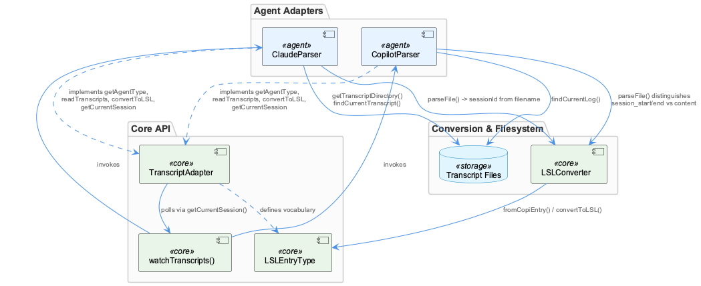
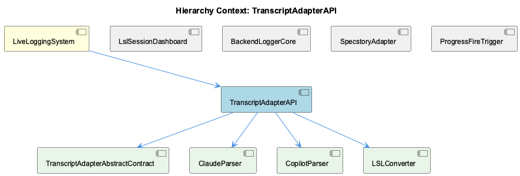

# TranscriptAdapterAPI

**Type:** SubComponent

TranscriptAdapter is an abstract base class in transcript-api.js that throws on direct instantiation via `new.target === TranscriptAdapter` check, forcing agent-specific subclasses to implement getAgentType, readTranscripts, convertToLSL, getCurrentSession

# TranscriptAdapterAPI — Technical Insight Document

## What It Is

TranscriptAdapterAPI is a subcomponent of the broader LiveLoggingSystem, implemented around the abstract base class `TranscriptAdapter` defined in `transcript-api.js`. It establishes a shared contract for reading, normalizing, and watching agent-specific conversation transcripts — currently realized through two concrete implementations, `ClaudeParser` and `CopilotParser` — and a common output format produced via `LSLConverter`. Where the parent LiveLoggingSystem's `logging.ts` acts as the authoritative ingestion point for live Claude Code conversation data, TranscriptAdapterAPI is the layer responsible for translating heterogeneous on-disk transcript formats into that system's normalized representation.

## Architecture and Design

The core architectural pattern is the **Template Method / Abstract Factory contract**: `TranscriptAdapter` (child entity `TranscriptAdapterAbstractContract`) enforces subclassing by throwing when `new.target === TranscriptAdapter`, guaranteeing that only agent-specific subclasses like `ClaudeParser` and `CopilotParser` can be instantiated. Each subclass must implement `getAgentType`, `readTranscripts`, `convertToLSL`, and `getCurrentSession`, giving the system a uniform interface regardless of the underlying agent's log format.

A shared vocabulary, `LSLEntryType` (user, assistant, tool_use, tool_result, system, error), decouples downstream consumers from agent-specific schemas — this is the same normalization philosophy that lets `LSLConverter.toMarkdown()` render any session uniformly via header block plus `entryToMarkdown()` per-entry rendering, regardless of whether the source was Claude or Copilot data.

Polling-based change detection is implemented once, generically, in `watchTranscripts()`, using `setInterval` plus `getCurrentSession()` and a `lastEntryCount` cursor to slice only newly appended entries before firing watcher callbacks — avoiding duplicated polling logic in each adapter subclass.

## Implementation Details

`ClaudeParser.getTranscriptDirectory()` reconstructs Claude Code's own on-disk naming convention, replacing non-alphanumeric characters with dashes and prefixing with `-`, ensuring directory resolution stays consistent with Claude's native tooling. Both `ClaudeParser.findCurrentTranscript()` and `CopilotParser.findCurrentLog()` apply a shared `maxSessionAge` threshold (default 7,200,000ms / 2 hours) to determine whether the most recently modified file still represents an active session — a heuristic-based liveness check rather than an explicit session-close signal.

`CopilotParser.parseFile()` adds format-specific handling by distinguishing `session_start`/metadata and `session_end` control entries from regular content entries before delegating actual conversion to `LSLConverter.fromCopiEntry()`. Both `ClaudeParser.parseFile()` and `CopilotParser.parseFile()` derive `sessionId` directly from the transcript filename (minus extension), making the filesystem itself the source of session identity rather than relying on in-content session markers.

## Integration Points

TranscriptAdapterAPI sits under LiveLoggingSystem alongside siblings such as SpecstoryAdapter (which uses a distinct fallback-chain connection strategy: HTTP, then IPC, then file-watch) and BackendLoggerCore (which caches config via `loadConfig()`/`reloadConfig()`). While these siblings solve adjacent problems — session dashboards (LslSessionDashboard), progress heuristics (ProgressFireTrigger) — TranscriptAdapterAPI's specific concern is transcript ingestion normalization. Its children — `TranscriptAdapterAbstractContract`, `ClaudeParser`, `CopilotParser`, and `LSLConverter` — form a closed, cohesive unit: the abstract contract defines the interface, the two parsers implement agent-specific file discovery and parsing, and `LSLConverter` provides the shared output rendering (`toMarkdown`, `fromCopiEntry`) consumed by both.

## Usage Guidelines

Developers extending agent support must subclass `TranscriptAdapter` rather than instantiate it directly — the `new.target` guard will throw otherwise. New adapters should implement all four required methods (`getAgentType`, `readTranscripts`, `convertToLSL`, `getCurrentSession`) and emit only `LSLEntryType` values to remain compatible with `LSLConverter` and downstream consumers. Session liveness logic should reuse the `maxSessionAge` pattern (default 7200000ms) rather than inventing new thresholds, and sessionId derivation should continue to follow the filename-based convention established by both existing parsers for consistency. Any change to `LSLEntryType`'s vocabulary or the polling behavior in `watchTranscripts()` has cascading effects across all adapters and should be treated as a shared-contract change.

## Hierarchy Context

### Parent
- [LiveLoggingSystem](./LiveLoggingSystem.md) -- [LLM] The LiveLoggingSystem centers around logging.ts, which owns the core responsibilities of session windowing, file routing, and transcript capture. This module acts as the single ingestion point for live Claude Code conversation data, meaning any change to session lifecycle semantics (e.g., how a 'session window' is defined or when it rolls over to a new file) has cascading effects on downstream consumers like the classification agent and config validation tooling. New developers should treat logging.ts as the authoritative source of truth for how raw conversation events are structured before they are persisted to disk.

### Children
- [TranscriptAdapterAbstractContract](./TranscriptAdapterAbstractContract.md) -- The constructor checks `if (new.target === TranscriptAdapter) throw new Error('TranscriptAdapter is abstract and cannot be instantiated directly')`, preventing direct instantiation.
- [ClaudeParser](./ClaudeParser.md) -- getTranscriptDirectory() computes Claude's directory naming convention: `-${project.replace(/[^a-zA-Z0-9]/g, '-')}` under path.join(os.homedir(), '.claude', 'projects').
- [CopilotParser](./CopilotParser.md) -- getLogDirectory() resolves log location via options.logDir, then COPI_LOG_DIR env var, falling back to path.join(codingPath, 'integrations', 'copi', 'logs').
- [LSLConverter](./LSLConverter.md) -- toMarkdown(session) builds a header block (Agent, Session ID, Project, Started/Ended, Time Window) followed by per-entry rendering via entryToMarkdown().

### Siblings
- [LslSessionDashboard](./LslSessionDashboard.md) -- lsl-sessions.mjs defines a chain as an hourly tranche including rotation parts, not a single file, because legacy '-N_' markdown parts are headerless fragments split mid-token and pi-format parts are linked via parentSession
- [BackendLoggerCore](./BackendLoggerCore.md) -- Logger.js loads config/logging-config.json once via loadConfig(), caching it in module-level sharedConfig and exposing reloadConfig() to force a refresh
- [SpecstoryAdapter](./SpecstoryAdapter.md) -- SpecstoryAdapter.initialize() tries three connection methods in fallback order: connectViaHTTP(), then connectViaIPC(), then connectViaFileWatch()
- [ProgressFireTrigger](./ProgressFireTrigger.md) -- progressFireDecision() fires on EITHER of two independent triggers: a token-delta trigger (cumulative output tokens grown by >= thresholdTokens since last mark) or a wall-clock trigger (elapsed ms >= elapsedThresholdMs)

---

*Generated from 7 observations*
