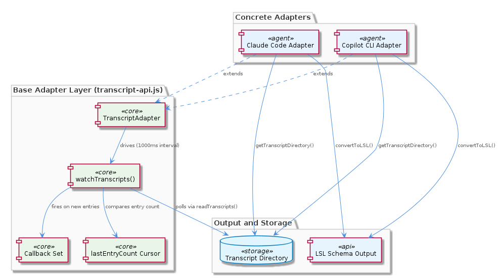
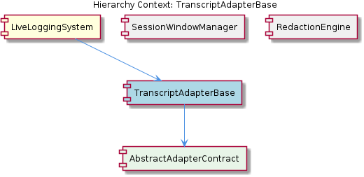

# TranscriptAdapterBase

**Type:** SubComponent

TranscriptAdapter in lib/agent-api/transcript-api.js declares five abstract methods — getAgentType(), getTranscriptDirectory(), readTranscripts(), convertToLSL(), and getCurrentSession() — that every concrete adapter must implement, providing a single extension point for adding new agent integrations

# TranscriptAdapterBase — Technical Insight Document

## What It Is

`TranscriptAdapterBase` is implemented as the `TranscriptAdapter` abstract base class in `lib/agent-api/transcript-api.js`. It serves as the foundational contract and polling infrastructure for all agent transcript integrations within the `LiveLoggingSystem`. The class defines a strict interface via five abstract methods — `getAgentType()`, `getTranscriptDirectory()`, `readTranscripts()`, `convertToLSL()`, and `getCurrentSession()` — which every concrete adapter (such as those for Claude Code and Copilot CLI) must implement.

Beyond defining the contract, `TranscriptAdapter` provides the shared runtime machinery for transcript change detection: a polling loop (`watchTranscripts()`), an in-memory cursor (`lastEntryCount`) for tracking processed entries, and a callback registration system that fires subscribers when new transcript entries appear. This dual role — interface definition plus reusable infrastructure — makes it the single extension point through which new agent integrations are added to the system.

## Architecture and Design

The class follows the classic **Template Method** pattern combined with the **Abstract Base Class** pattern. The base class owns the invariant control flow (polling, cursor comparison, callback dispatch) while delegating all variant behavior — directory discovery, file parsing, schema mapping, and session identification — to subclasses through the abstract method contract embodied in its child entity, `AbstractAdapterContract`. This separation cleanly isolates the agent-agnostic "what changed and when" concern from the agent-specific "how do I read and interpret this format" concern.

Callback registration uses a `Set`, which provides automatic deduplication of subscriber functions but deliberately omits priority ordering — all callbacks are equal participants and fire in insertion order. This is a deliberate simplicity trade-off: there is no built-in mechanism for guaranteed ordering between, for example, a UI refresh callback and a persistence callback. Consumers requiring ordering must coordinate it externally.

The polling cadence in `watchTranscripts()` is hardcoded as a `setInterval` with a 1000ms interval. This makes the frequency a class-level constant rather than a per-adapter or per-consumer configuration — a notable architectural rigidity. All agent types share the same polling rhythm regardless of how frequently their underlying transcript files actually change, which contrasts with sibling components like `RedactionEngine` that externalize behavior via `.specstory/config/redaction-config.yaml`.

## Implementation Details

The core polling mechanic in `watchTranscripts()` is intentionally minimalist: on each tick, it invokes the concrete adapter's `readTranscripts()`, compares the returned entry count against the in-memory `lastEntryCount` cursor, and fires all registered callbacks only when the count has grown. Crucially, the comparison is purely numeric — it tracks neither content hashes nor timestamps. This means any concrete adapter that **reorders or replaces existing entries without changing the total count will silently suppress callbacks**, which is a documented correctness hazard that adapter implementors must guard against in their own `readTranscripts()` logic.

The `lastEntryCount` cursor is initialized to zero only on adapter instantiation and is never persisted to disk. Consequently, every process restart causes `readTranscripts()` to interpret the entire historical transcript as "new" on the first poll cycle. Mitigating this responsibility is pushed onto the concrete adapter: each adapter's `readTranscripts()` implementation must itself filter out already-processed entries, typically by consulting whatever persistent state the surrounding `LiveLoggingSystem` provides (such as session metadata managed by the sibling `SessionWindowManager`).

The `convertToLSL()` method is abstract, meaning the LSL schema mapping is fully delegated to each concrete adapter. This deliberately permits Claude Code and Copilot CLI adapters to produce structurally different LSL representations if their implementors choose. Combined with `getCurrentSession()` — which surfaces the active session identity — this allows downstream consumers (including `SessionWindowManager`, which buckets entries into hourly windows like `'0800-0900'`) to operate on a normalized LSL stream regardless of agent origin.

## Integration Points

`TranscriptAdapterBase` sits as a direct child of `LiveLoggingSystem` and serves as the contract its child, `AbstractAdapterContract`, formalizes. The five abstract methods constitute the sole extension surface for adding new agent integrations — there is no plugin registry, no dynamic dispatch table, just direct inheritance. Concrete adapters for Claude Code and Copilot CLI subclass this base to participate in the system.

Downstream, `TranscriptAdapterBase` integrates with sibling components through the LSL records it produces via `convertToLSL()`. `SessionWindowManager` consumes these records and assigns them to hourly time-window buckets embedded directly in LSL metadata. `RedactionEngine`, the other sibling, processes the LSL stream against rules loaded from `.specstory/config/redaction-config.yaml` before persistence — meaning a malformed redaction config can block all output even when adapters are functioning correctly.

The callback dispatch mechanism is the primary outbound integration point: consumers register handler functions, and the base class invokes them whenever new entries are detected. Because callbacks live in a `Set`, deduplication is automatic, but consumers must not rely on registration order for execution priority. The `getCurrentSession()` method provides a synchronous query interface for components needing the active session context without subscribing to the change stream.

## Usage Guidelines

When implementing a new concrete adapter, all five abstract methods — `getAgentType()`, `getTranscriptDirectory()`, `readTranscripts()`, `convertToLSL()`, and `getCurrentSession()` — must be provided. The contract is enforced structurally by `AbstractAdapterContract`; missing implementations will fail at runtime when the base class attempts to invoke them. Developers should treat `readTranscripts()` as the most consequential method: it must return entries in a stable, append-only order, and it must internally filter out entries the adapter has already processed in prior process lifetimes, since `lastEntryCount` provides no cross-restart durability.

Be deeply aware of the count-only change detection. If your transcript source supports edits, deletions, or reordering of historical entries, the base class will not detect these changes when the total count is unchanged. Adapters in this situation should either (a) augment their `readTranscripts()` to surface only genuinely new tail entries, or (b) coordinate with consumers through an out-of-band mechanism — the base class's `setInterval` polling will not help.

Do not assume the 1000ms polling cadence is tunable from outside the class. If a use case requires faster or slower detection, the current design forces a code modification to `lib/agent-api/transcript-api.js` rather than a configuration change. This contrasts with the externalized configuration model used by `RedactionEngine` and is a known rigidity that future refactoring may address.

Finally, callbacks registered via the `Set`-based subscription should be idempotent and order-independent. Because there is no priority mechanism, do not register callbacks that depend on another callback having executed first within the same poll cycle. For ordering-sensitive workflows, compose multiple effects within a single callback rather than relying on registration sequence.

## Summary Insights

**Architectural patterns identified:** Template Method (base class owns control flow, delegates specifics), Abstract Base Class with explicit five-method contract, Observer pattern via `Set`-based callback registration, and Polling-based change detection.

**Design decisions and trade-offs:** Count-based change detection trades correctness-under-mutation for implementation simplicity; hardcoded 1000ms cadence trades configurability for predictability; in-memory cursor trades restart-resilience for state-management simplicity; `Set`-based callbacks trade ordering control for automatic deduplication.

**System structure insights:** `TranscriptAdapterBase` is the single chokepoint for agent integration within `LiveLoggingSystem`, with its `AbstractAdapterContract` child formalizing the extension surface. The base class normalizes diverse agent transcript formats into an LSL stream consumed by sibling components `SessionWindowManager` and `RedactionEngine`.

**Scalability considerations:** The fixed 1000ms polling per adapter instance means runtime cost scales linearly with the number of registered adapters. The count-only cursor avoids hash computation overhead but provides no horizontal scaling story — each adapter must run in-process to maintain its cursor. The restart-replay behavior means startup cost is proportional to historical transcript size unless adapters implement their own persistent filtering.

**Maintainability assessment:** The five-method contract is small enough to reason about and document exhaustively, which is a maintainability strength. However, the hardcoded polling cadence, the non-persistent cursor, and the count-only change detection are three latent correctness and flexibility liabilities that any significant evolution of the system will likely need to address. Concrete adapters carry substantial implicit responsibility (filtering already-processed entries, ensuring count monotonicity) that is not enforced by the contract — making thorough documentation and adapter-level testing essential.

## Hierarchy Context

### Parent
- [LiveLoggingSystem](./LiveLoggingSystem.md) -- [LLM] The TranscriptAdapter abstract base class in lib/agent-api/transcript-api.js enforces a strict interface contract via five abstract methods: getAgentType(), getTranscriptDirectory(), readTranscripts(), convertToLSL(), and getCurrentSession(). Concrete adapters for Claude Code and Copilot CLI must implement all five. The base class itself provides the polling infrastructure via watchTranscripts(), which calls setInterval at a default 1000ms cadence, reads transcripts, compares the new entry count against an in-memory lastEntryCount cursor, and fires all registered callbacks (stored in a Set) only when new entries are detected. This design means the polling loop is entirely stateless with respect to entry content — it tracks only counts, not hashes or timestamps — so any adapter that reorders or replaces existing entries without changing the total count would silently suppress callbacks. New developers should be aware that lastEntryCount is reset only on adapter instantiation, not across process restarts persisted to disk, meaning a restart always replays all entries from the beginning unless the adapter's readTranscripts() implementation itself filters already-processed entries.

### Children
- [AbstractAdapterContract](./AbstractAdapterContract.md) -- TranscriptAdapter in lib/agent-api/transcript-api.js defines these five methods as the sole extension point for adding new agent integrations, meaning any new agent (e.g., Claude Code, Copilot CLI) must provide concrete implementations of all five.

### Siblings
- [SessionWindowManager](./SessionWindowManager.md) -- SessionWindowManager assigns LSL session entries to hourly time-window buckets (e.g., '0800-0900') that are embedded directly in LSL metadata, meaning the window label becomes part of the persisted file identity rather than a query-time annotation
- [RedactionEngine](./RedactionEngine.md) -- RedactionEngine reads its rule set from .specstory/config/redaction-config.yaml, meaning redaction behavior is fully externalized and can be changed without code deployment, but an invalid config can block all persistence if LSLConfigValidator rejects it

---

*Generated from 6 observations*
