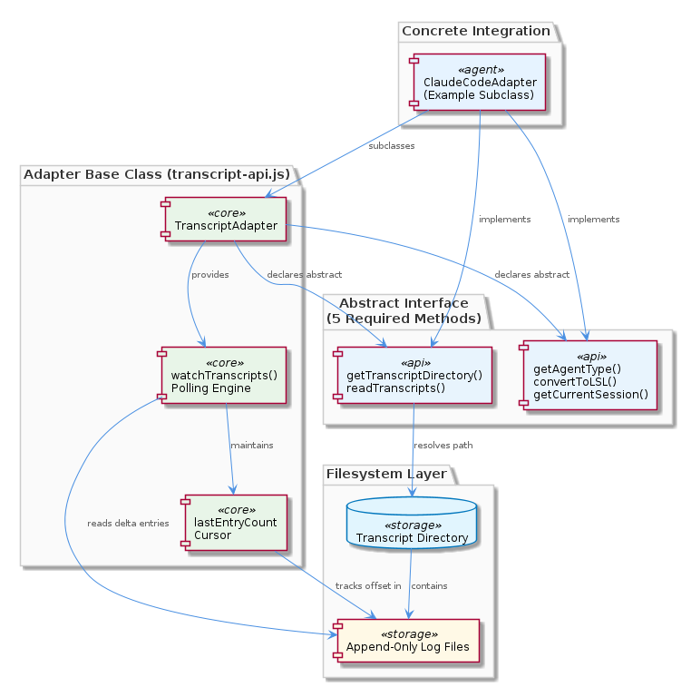
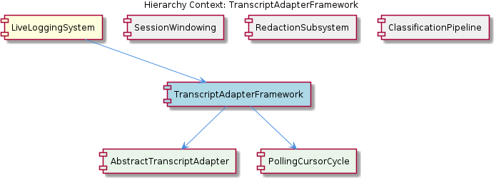

# TranscriptAdapterFramework

**Type:** SubComponent

TranscriptAdapter in lib/agent-api/transcript-api.js declares five abstract methods — getAgentType(), getTranscriptDirectory(), readTranscripts(), convertToLSL(), and getCurrentSession() — forming the mandatory interface for any new agent integration

# TranscriptAdapterFramework — Technical Insight Document

## What It Is

The `TranscriptAdapterFramework` is a SubComponent implemented primarily in `lib/agent-api/transcript-api.js`, where the `TranscriptAdapter` abstract base class establishes the polymorphic contract for ingesting transcripts from heterogeneous agent sources. It sits inside the broader `LiveLoggingSystem` and provides the extensibility seam through which agent-specific transcript formats (such as Claude Code's, and potentially others) are normalized and fed into downstream processing.

Structurally, the framework decomposes into two child concerns: `AbstractTranscriptAdapter`, which codifies the five-method contract that every concrete adapter must implement, and `PollingCursorCycle`, which encapsulates the recurring ingestion loop driven by `watchTranscripts()`. Together these define both the *shape* of an adapter (what it must declare) and the *lifecycle* of an adapter (when and how it is invoked).

This framework is the system's answer to the question of how to onboard new agent integrations without forking or duplicating ingestion logic. By presenting a stable abstract surface and inheriting the polling and deduplication machinery, it makes new agent support an exercise in implementing five methods rather than re-architecting the ingestion pipeline.

## Architecture and Design

The architectural approach is a textbook **Template Method** pattern combined with a plugin-style extensibility model. The `TranscriptAdapter` base class in `lib/agent-api/transcript-api.js` declares five abstract methods — `getAgentType()`, `getTranscriptDirectory()`, `readTranscripts()`, `convertToLSL()`, and `getCurrentSession()` — which subclasses must implement. The base class itself owns the concrete `watchTranscripts()` method, ensuring the scheduling and cursor-management mechanics remain centralized and consistent across all adapters. This deliberate split between abstract (per-agent variance) and concrete (cross-cutting invariant) is the design's defining decision.

The interaction model is inversion-of-control: the framework owns the loop, and subclasses provide the data-extraction primitives. When `watchTranscripts()` ticks, it calls into the subclass's `readTranscripts()` to obtain the current transcript list, slices new entries using its internally-tracked `lastEntryCount` cursor, and feeds them through `convertToLSL()` for normalization. Subclasses cannot accidentally diverge in polling frequency, deduplication strategy, or cursor semantics because they never reimplement the loop itself.

Relative to its siblings within `LiveLoggingSystem`, the `TranscriptAdapterFramework` plays a complementary role: where `SessionWindowing` manages time-bucket rotation of transcript files, `RedactionSubsystem` applies categorized redaction rules, and `ClassificationPipeline` runs the five-layer ordered classification, this framework is the upstream *intake* layer that produces the raw normalized stream all those subsequent stages consume. Its design intentionally has no opinion about what downstream consumers do with the LSL output — it only guarantees correct, deduplicated ingestion.

## Implementation Details

The `AbstractTranscriptAdapter` child entity is realized as the `TranscriptAdapter` class in `lib/agent-api/transcript-api.js`. Its five-method contract partitions concerns cleanly: `getAgentType()` identifies the agent (used for routing and labeling), `getTranscriptDirectory()` returns the filesystem location to monitor, `readTranscripts()` performs the actual filesystem read and entry parsing, `convertToLSL()` transforms agent-native entries into the unified LSL format, and `getCurrentSession()` resolves the active session context. Critically, because both `getTranscriptDirectory()` and `readTranscripts()` are abstract, the base class contains no hardcoded paths — each adapter is free to target a completely different directory structure and file layout.

The `PollingCursorCycle` child entity is realized by `watchTranscripts()`, which implements a `setInterval` polling loop. On each tick, the method invokes `readTranscripts()` to obtain the full current entry list, then uses the `lastEntryCount` cursor to slice only newly appended entries — `entries.slice(lastEntryCount)` — before updating the cursor to the new total. This makes the per-tick work proportional to the number of *new* entries rather than the total transcript length, yielding O(new entries) cost per poll instead of O(total entries). The tick frequency is configurable, allowing operators to tune the latency-versus-overhead trade-off between transcript writes and LSL emission.

The cursor-based deduplication is explicitly optimized for **append-only log files**. The implementation tracks only a monotonically increasing count; it does not maintain any per-entry identity or content hash. As a direct consequence, deletions from the middle of a transcript or out-of-order insertions would not be detected correctly — the cursor would either skip legitimate new entries or fail to recognize that prior entries had shifted. This is a deliberate simplification that matches the actual write patterns of agent transcript logs, and it is documented as a constraint that new adapter authors must respect.

## Integration Points

The framework's primary integration point is its parent, `LiveLoggingSystem`, which composes the `TranscriptAdapterFramework` together with `SessionWindowing`, `RedactionSubsystem`, and `ClassificationPipeline` to form the complete logging pipeline. Output from `convertToLSL()` flows downstream into these sibling subsystems — session boundaries are interpreted by `SessionWindowing`'s rotation thresholds (as configured in `lsl-config.json`), redaction categories from `.specstory/config/redaction-config.yaml` are applied by `RedactionSubsystem`, and the resulting entries enter the ordered five-layer flow described in `docs/puml/lsl-5-layer-classification.puml`.

The framework's *internal* integration is between its two children: `AbstractTranscriptAdapter` defines the surface that `PollingCursorCycle` invokes. The `watchTranscripts()` method is the bridge — it lives in the base class (the abstract adapter) but depends on the subclass-provided `readTranscripts()` to function. This means any concrete adapter implementation is simultaneously a participant in both child entities: it satisfies the abstract contract and it is the data source for the cursor cycle.

Externally, each concrete adapter integrates with the filesystem of its target agent. Because `getTranscriptDirectory()` is per-adapter, the framework imposes no constraint on where transcripts live — a Claude Code adapter, for example, points at Claude Code's transcript directory, while a hypothetical adapter for another agent would point elsewhere entirely. The base class is filesystem-layout-agnostic by design.

## Usage Guidelines

To add support for a new agent, subclass `TranscriptAdapter` in `lib/agent-api/transcript-api.js` and implement all five abstract methods: `getAgentType()`, `getTranscriptDirectory()`, `readTranscripts()`, `convertToLSL()`, and `getCurrentSession()`. Do not override `watchTranscripts()` — the polling lifecycle, cursor management, and entry deduplication are inherited intentionally so that all adapters share identical scheduling and incremental-read semantics. Overriding the loop would defeat the centralization that the framework's design depends on.

Be aware of the append-only assumption baked into the cursor strategy. The `lastEntryCount` cursor will misbehave if your `readTranscripts()` implementation returns lists where entries can be deleted, reordered, or inserted in positions other than the end. If your target agent's transcript format does not satisfy the append-only invariant, you will need to either pre-process entries to a stable append-only view inside `readTranscripts()`, or extend the framework with an alternative deduplication strategy — but the latter is outside the scope of the current design.

Ensure that `readTranscripts()` returns entries in a consistent order across ticks so that the slice-from-cursor logic remains valid. Likewise, `convertToLSL()` should be a pure transformation that does not depend on global state, since it will be invoked once per new entry per tick. Keep `getCurrentSession()` cheap to call — it is consulted on each ingestion pass to attach session context to emitted LSL records.

**Scalability** considerations: the per-poll cost is O(new entries), which scales well for high-throughput transcripts as long as the polling interval is short enough that the new-entry batch stays bounded. The full transcript list is read on every tick, however, so for very large transcript files the cost of `readTranscripts()` itself may dominate — concrete adapters can mitigate this by reading incrementally from disk where the underlying format permits.

**Maintainability** assessment: the framework scores well on the dimensions that matter most for an extension point. The five-method contract is small, the responsibilities are sharply partitioned, and the inherited lifecycle eliminates an entire class of subtle bugs that would otherwise arise from each adapter re-implementing polling. The principal maintainability risk is the implicit append-only contract — it is enforced only by convention and documentation rather than by the type system, so reviewers of new adapter submissions should verify that the target agent's transcript format actually satisfies the assumption.

## Hierarchy Context

### Parent
- [LiveLoggingSystem](./LiveLoggingSystem.md) -- [LLM] The TranscriptAdapter abstract base class (lib/agent-api/transcript-api.js) establishes a well-defined polymorphic contract for all agent-specific transcript integrations. The class mandates five abstract methods — getAgentType(), getTranscriptDirectory(), readTranscripts(), convertToLSL(), and getCurrentSession() — which subclasses must implement to describe their agent-specific filesystem layout and data format. Crucially, the base class contributes a concrete, shared implementation of watchTranscripts() that uses a setInterval polling loop with a lastEntryCount cursor to track new entries since the previous tick. This design decision deliberately centralizes the polling mechanism so that every adapter (e.g., one for Claude Code, potentially others for different agents) benefits from the same incremental-read logic without duplicating it. The cursor-based approach means the adapter never re-processes already-seen entries on each interval tick — it reads the full transcript list, slices from lastEntryCount onward, and updates the cursor, a lightweight but effective strategy for append-only log files. A new developer extending this system should be aware that adding a new agent integration requires only implementing the five abstract methods; the polling lifecycle and entry deduplication are inherited for free.

### Children
- [AbstractTranscriptAdapter](./AbstractTranscriptAdapter.md) -- TranscriptAdapter in lib/agent-api/transcript-api.js defines the five-method contract that all concrete adapters must fulfill, establishing a plugin-style extensibility pattern for agent integrations.
- [PollingCursorCycle](./PollingCursorCycle.md) -- watchTranscripts() in transcript-api.js establishes a setInterval loop that drives the recurring transcript ingestion cycle, with tick frequency configurable to control latency between transcript writes and LSL emission.

### Siblings
- [SessionWindowing](./SessionWindowing.md) -- lsl-config.json defines fileManager rotation thresholds that trigger time-slot bucket transitions, preventing unbounded growth of individual transcript files
- [RedactionSubsystem](./RedactionSubsystem.md) -- .specstory/config/redaction-config.yaml organizes redaction rules by named categories, allowing operators to enable or disable entire rule groups without modifying individual patterns
- [ClassificationPipeline](./ClassificationPipeline.md) -- docs/puml/lsl-5-layer-classification.puml diagrams five discrete classification layers, establishing a strict ordered pipeline where each layer's output can inform subsequent layers rather than operating independently

---

*Generated from 6 observations*
