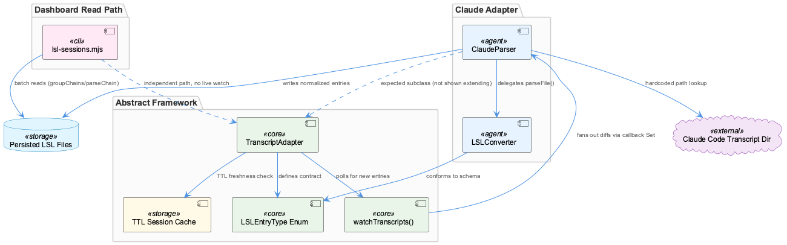
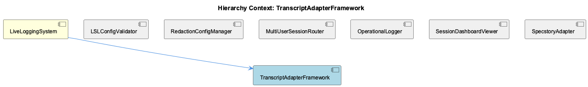

# TranscriptAdapterFramework

**Type:** SubComponent

[Architecture Notes] TranscriptAdapter is an abstract base in lib/agent-api/transcript-api.js; concrete implementations are expected under lib/agent-api/transcripts/ (e.g. claude-parser.js) but the shown ClaudeParser does not visibly extend it, suggesting either truncation or a wrapper adapter not shown; Two independent staleness/freshness mechanisms coexist: TTL session cache (transcript-api.js, cacheTimeout) vs. mtime-based maxSessionAge (claude-parser.js) — not unified; Claude Code's on-disk transcript directory convention is hardcoded in ClaudeParser rather than injected via the generic TranscriptConfig.transcriptDir option, creating tight coupling to Claude's specific naming scheme; The dashboard's lsl-sessions.mjs is a fully separate read path over already-persisted LSL files, not a consumer of the live TranscriptAdapter/watchTranscripts mechanism; LSLEntryType enum and LSLMetadata shape (transcript-api.js) form the contract boundary that all adapter output must satisfy before flowing into the parent LiveLoggingSystem's mandatory classification/redaction schema

# TranscriptAdapterFramework — Technical Insight Document

## What It Is

TranscriptAdapterFramework is implemented primarily in `lib/agent-api/transcript-api.js`, which defines the abstract `TranscriptAdapter` base class, and in per-agent implementations under `lib/agent-api/transcripts/` (currently `claude-parser.js`, containing `ClaudeParser`). It exists to normalize heterogeneous coding-agent transcript formats (Claude, Copilot, etc.) into a unified LSL (Live Logging System) schema, defined via the `LSLEntryType` enum (`USER`, `ASSISTANT`, `TOOL_USE`, `TOOL_RESULT`, `SYSTEM`, `ERROR`) and the `LSLMetadata` shape. As a SubComponent, it sits within the broader **LiveLoggingSystem**, providing the ingestion layer that feeds normalized transcript entries into that parent system's classification and redaction pipeline.

## Architecture and Design

The framework combines several classic patterns evident directly in the code structure. `TranscriptAdapter` follows a **Template Method / Abstract Base Class** pattern: it uses a `new.target` guard to prevent direct instantiation and throws from stub methods to force subclasses to implement the real behavior. Concrete format handlers act as an **Adapter pattern**, translating agent-specific transcript formats into the shared LSL schema. Live updates are handled through an **Observer-like** mechanism in `watchTranscripts()`, which registers callbacks in a `Set` and fans out new entries — but notably this is **polling-based rather than event-driven**, using `setInterval` combined with entry-count slicing to detect new content rather than subscribing to filesystem events.

A clear separation of concerns exists between parsing and conversion: `ClaudeParser` owns file I/O responsibilities, while a distinct `converter` object (`LSLConverter`, via `fromClaudeEntry()`) owns per-entry schema translation. This decoupling allows the on-disk parsing logic to evolve independently of the LSL schema mapping logic. However, one architectural gap stands out: the shown `ClaudeParser` does not visibly extend `TranscriptAdapter`, suggesting either truncated code or an unshown wrapper adapter — this is worth verifying, since it undermines the enforceability of the abstract base class contract if concrete implementations don't actually inherit from it.

## Implementation Details

`TranscriptAdapter` (transcript-api.js) provides the framework's contract surface: abstract method stubs, the `LSLEntryType` enum, `watchTranscripts()`/`stopWatching()` for polling-based live updates, and a TTL-based in-memory session cache (`getCachedSession()`, `cacheSession()`, `clearCache()`) backed by a `Map` and timestamp comparisons.

`ClaudeParser` (claude-parser.js) implements the Claude-specific side: `getTranscriptDirectory()` hardcodes Claude Code's on-disk transcript directory convention rather than sourcing it from the generic `TranscriptConfig.transcriptDir` option — a tight-coupling trade-off that simplifies the single-agent case but limits reusability of the config surface. `parseFile()` delegates entry-level translation to `this.converter.fromClaudeEntry()`, keeping conversion logic out of the parser itself. `watchFile()` performs incremental reads via byte-offset tracking with `fd.read()`, avoiding full-file re-reads on each poll cycle. `findCurrentTranscript()` implements a `maxSessionAge` staleness check based on filesystem mtime — a mechanism that is **not unified** with the TTL-based `cacheTimeout` cache in transcript-api.js. These two independent freshness mechanisms (mtime-based vs. TTL-based) coexist without a shared abstraction, which is a maintainability concern worth flagging for future consolidation.

## Integration Points

TranscriptAdapterFramework is a child SubComponent of **LiveLoggingSystem**, and its LSL output must conform to the classification/redaction schema enforced by that parent — the same system whose configuration is validated by the sibling **LSLConfigValidator** via `scripts/validate-lsl-config.js`, which fails closed if any required config section (version, multiUser, fileManager, operationalLogger, classification) is missing.

A significant cross-cutting concern surfaces here: `ClaudeParser.parseFile()` sets `userHash: process.env.USER || 'unknown'` as session metadata — the **raw, unhashed OS username**, not the SHA-256-truncated pseudonymized hash expected by LSL's `validateUserEnvironment()` convention. This is a direct contradiction of the privacy pattern the sibling **RedactionConfigManager** is presumably meant to enforce, and represents a potential plaintext-username leak unless corrected downstream.

Separately, `integrations/system-health-dashboard/lsl-sessions.mjs` (associated with sibling **SessionDashboardViewer**) implements a **read-only batch consumer pattern** using `groupChains`/`concatChain`/`parseChain` — this is a fully independent read path over already-persisted LSL files and does *not* consume the live `TranscriptAdapter`/`watchTranscripts()` mechanism, meaning changes to the live adapter framework do not automatically propagate to dashboard consumption logic.

## Usage Guidelines

Developers adding new agent adapters (e.g., for Copilot) should extend `TranscriptAdapter` explicitly and verify the `new.target` guard behaves as intended — the current ambiguity around `ClaudeParser`'s inheritance should be resolved before using it as a template. New adapters should route configuration (especially transcript directory paths) through `TranscriptConfig.transcriptDir` rather than hardcoding paths as `ClaudeParser.getTranscriptDirectory()` currently does, to avoid replicating the same tight coupling. Any session metadata fields, particularly user identifiers, must be verified against RedactionConfigManager's pseudonymization rules before persistence — the current raw `process.env.USER` usage in `parseFile()` should be treated as a known issue requiring remediation. Finally, because the TTL cache and mtime-based staleness checks are independent, developers should not assume cache invalidation and session-liveness are synchronized — consolidating these into one freshness mechanism would reduce the risk of subtle bugs where a session appears "cached-fresh" but is filesystem-stale, or vice versa.

## Hierarchy Context

### Parent
- [LiveLoggingSystem](./LiveLoggingSystem.md) -- [LLM] The LiveLoggingSystem's configuration validation is centralized in scripts/validate-lsl-config.js through the LSLConfigValidator class, which acts as a schema enforcement gatekeeper for two distinct config artifacts: .specstory/config/lsl-config.json (structural/behavioral settings) and .specstory/config/redaction-config.yaml (privacy/classification rules). This separation reflects a deliberate architectural decision to decouple 'how the logger behaves' from 'what the logger is allowed to record', allowing redaction policy to be iterated on independently from file-management or session-windowing logic. The initializeSchemas() method enumerates five required top-level sections (version, multiUser, fileManager, operationalLogger, classification), meaning any config missing even one of these fails validation outright—this is a strict fail-closed design rather than a permissive fail-open one, which is notable for a system handling potentially sensitive session transcripts.

### Siblings
- [LSLConfigValidator](./LSLConfigValidator.md) -- [CGR] LSLConfigValidator (class) in validate-lsl-config.js
- [RedactionConfigManager](./RedactionConfigManager.md) -- [LLM] lib/agent-api/transcripts/claude-parser.js:parseFile() sets session metadata `userHash: process.env.USER || 'unknown'` — this is the RAW, unhashed OS username, not a SHA-256 truncated hash. This directly contradicts the pseudonymization pattern described for LSL's `validateUserEnvironment()` (hash+truncate to 6 chars) referenced in the parent LiveLoggingSystem context. If ClaudeParser's output metadata is persisted or surfaced without passing back through a redaction/hashing step, this is a plaintext-username leak in exactly the kind of session transcript metadata the classification schema is meant to guard, and is worth verifying against whatever RedactionConfigManager rules apply downstream of this adapter.
- [MultiUserSessionRouter](./MultiUserSessionRouter.md) -- [LLM] [object Object]
- [OperationalLogger](./OperationalLogger.md) -- [CGR] OperationalLogger (class) in OperationalLogger.js
- [SessionDashboardViewer](./SessionDashboardViewer.md) -- [LLM] [object Object]
- [SpecstoryAdapter](./SpecstoryAdapter.md) -- [CGR] SpecstoryAdapter (class) in specstory-adapter.js

---

*Generated from 11 observations*
