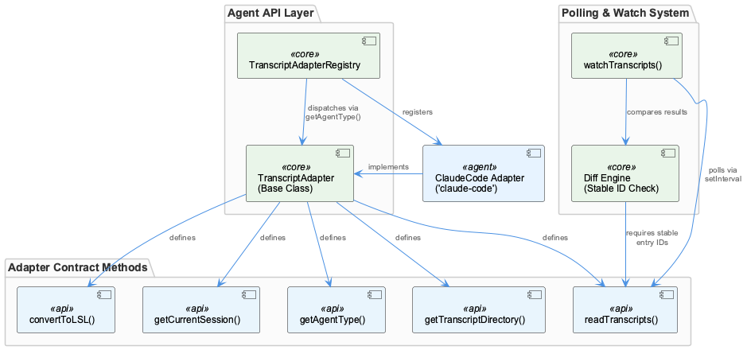
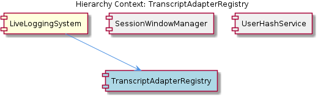

# TranscriptAdapterRegistry

**Type:** SubComponent

The `TranscriptAdapter` base class in `lib/agent-api/transcript-api.js` defines the five mandatory methods: `getAgentType()`, `getTranscriptDirectory()`, `readTranscripts()`, `convertToLSL()`, and `getCurrentSession()`, making it the single contract point for all agent integrations

## What It Is

`TranscriptAdapterRegistry` is a sub-component of `LiveLoggingSystem` responsible for managing the collection of agent-specific transcript adapters and dispatching to the correct one at runtime. It is defined within the `lib/agent-api/transcript-api.js` file, which also houses the `TranscriptAdapter` base class that serves as its child contract — `TranscriptAdapterContract`. The registry sits alongside `SessionWindowManager` and `RedactionEngine` within `LiveLoggingSystem`, occupying the role of routing layer between raw agent transcript sources and the unified LSL pipeline.

Rather than hardcoding knowledge of specific agent integrations, the registry relies on each adapter self-identifying via `getAgentType()`, which returns a stable string identifier such as `'claude-code'`. This string becomes the dispatch key, allowing the registry to remain open to new integrations without modification.

## Architecture and Design

The registry is built around a **string-keyed dispatch model** rather than type-based polymorphism. When an adapter is registered, its `getAgentType()` return value becomes the lookup key. This avoids `instanceof` checks, which would couple the registry to concrete class hierarchies, and instead treats adapters as interchangeable implementations of `TranscriptAdapterContract`. The practical effect is that new agent integrations can be added dynamically — registered at startup or even at runtime — without the registry needing any prior knowledge of them.

The central design tension the registry navigates is **portability versus immediacy** in transcript capture. Rather than relying on `fs.watch`-style filesystem event APIs — which carry well-documented failure modes on Docker-mounted and network filesystems — the polling architecture in `watchTranscripts()` uses `setInterval` to periodically invoke `readTranscripts()`. This is a deliberate trade: the system accepts a configurable latency window between an agent writing a transcript entry and the LSL pipeline capturing it, in exchange for predictable cross-platform behavior. The registry orchestrates this polling lifecycle across whichever adapters are active.

The registry's relationship to its siblings is complementary. `SessionWindowManager` produces hourly window labels (e.g., `'0800-0900'`) used in `LSLMetadata` for time-based routing — metadata that the adapter's `getCurrentSession()` output feeds into. `RedactionEngine` operates downstream, consuming LSL output after the registry's adapters have converted raw entries via `convertToLSL()`. The registry's role is strictly upstream: acquire, identify, and normalize; it does not concern itself with redaction or windowing logic.

## Implementation Details

The contract each adapter must satisfy is defined by the `TranscriptAdapter` base class in `lib/agent-api/transcript-api.js` and documented fully under `TranscriptAdapterContract`. Five methods are mandatory:

- **`getAgentType()`** — returns the string dispatch key (e.g., `'claude-code'`)
- **`getTranscriptDirectory()`** — returns the filesystem path where raw transcripts reside
- **`readTranscripts()`** — reads and parses raw transcript files from that directory
- **`convertToLSL()`** — transforms parsed entries into the unified LSL typed format
- **`getCurrentSession()`** — returns session metadata for the active session

The polling mechanism in `watchTranscripts()` is the most mechanically interesting piece. It calls `readTranscripts()` on a `setInterval` cadence and diffs the result against a record of previously seen entries. For this diff to be correct, entries returned by `readTranscripts()` must carry **deterministic, stable identifiers** — either sequence numbers derived from file position, content hashes, or some other scheme that survives repeated reads of the same file. Without stable identity, the diff cannot distinguish a genuinely new entry from an already-processed one, which would cause either missed captures or duplicate emissions into the LSL stream.

The polling interval is configurable, exposing a tunable tradeoff between capture freshness and system load. A shorter interval reduces the latency between an agent writing a transcript entry and the system capturing it, at the cost of more frequent filesystem reads. This parameter should be treated as an operational concern — the appropriate value depends on the agent's write cadence and the acceptable lag for the use case.

## Integration Points

The registry's primary upstream dependency is the filesystem: each adapter's `getTranscriptDirectory()` defines the path the polling loop will read. The downstream consumer is the broader `LiveLoggingSystem`, which receives LSL-formatted entries produced by `convertToLSL()` and session metadata from `getCurrentSession()`.

`SessionWindowManager` consumes session metadata indirectly — the hourly window labels it produces are applied to `LSLMetadata` objects that originate from the session context each adapter provides via `getCurrentSession()`. `RedactionEngine` operates on the LSL output after registry adapters have normalized it, reading its rule set from `.specstory/config/redaction-config.yaml` independently of the registry.

The registry's interface contract is entirely defined through `TranscriptAdapterContract` — any new adapter that correctly implements the five methods in `lib/agent-api/transcript-api.js` and registers under a unique `getAgentType()` string is a first-class citizen of the system.

## Usage Guidelines

**Stable entry identity is non-negotiable.** Any adapter implementation must ensure that entries returned by `readTranscripts()` carry identifiers that are consistent across repeated calls. If an adapter reads a file and assigns IDs based on in-memory state or timestamps, the diff logic in `watchTranscripts()` will produce incorrect results. Sequence numbers derived from file byte offsets or line numbers are safer than wall-clock timestamps.

**Agent type strings must be globally unique within a registry instance.** Since `getAgentType()` is the sole dispatch key, two adapters returning the same string will collide. By convention, strings should be lowercase hyphenated identifiers tied to the agent product (e.g., `'claude-code'`), not generic labels like `'ai-agent'`.

**Polling interval tuning should be explicit.** The configurable latency parameter in `watchTranscripts()` is an operational variable, not a set-and-forget default. Developers integrating a new agent should characterize that agent's typical transcript write frequency and set the interval accordingly — polling too aggressively on a slow-writing agent wastes I/O, while polling too infrequently on a high-velocity agent creates unacceptable lag in the LSL stream.

**Do not bypass the contract to add agent-specific behavior.** The five-method interface in `TranscriptAdapterContract` is the stable surface. Adding methods to a concrete adapter and calling them directly from outside the registry would reintroduce the coupling that `getAgentType()`-based dispatch is designed to eliminate. Any behavior that needs to vary by agent type should be expressed through the existing contract methods, with adapter implementations encoding agent-specific logic internally.

## Hierarchy Context

### Parent
- [LiveLoggingSystem](./LiveLoggingSystem.md) -- [LLM] The LiveLoggingSystem is built around a strict abstract interface defined by the `TranscriptAdapter` class in `lib/agent-api/transcript-api.js`. Every agent-specific adapter must implement five methods: `getAgentType()` (returns a string identifier like `'claude-code'`), `getTranscriptDirectory()` (returns the filesystem path where raw agent transcripts reside), `readTranscripts()` (reads and parses raw transcript files), `convertToLSL()` (transforms raw entries into the unified LSL typed format), and `getCurrentSession()` (returns metadata for the active session). Live capture is achieved not through filesystem watchers (like `fs.watch`) but through a polling loop: `watchTranscripts()` uses `setInterval` to periodically invoke `readTranscripts()` and diff against previously seen entries. This design trades immediacy for portability—`fs.watch` has known cross-platform inconsistencies, especially in Docker containers and network-mounted filesystems, so polling avoids those failure modes at the cost of introducing a configurable latency between an agent writing a transcript entry and the LSL system capturing it.

### Children
- [TranscriptAdapterContract](./TranscriptAdapterContract.md) -- The `TranscriptAdapter` base class in `lib/agent-api/transcript-api.js` declares five methods — `getAgentType()`, `getTranscriptDirectory()`, `readTranscripts()`, `convertToLSL()`, and `getCurrentSession()` — that each agent-specific subclass must override.

### Siblings
- [SessionWindowManager](./SessionWindowManager.md) -- SessionWindowManager produces hourly window labels (e.g., '0800-0900') used as routing keys in LSLMetadata, enabling time-based file retrieval without scanning entire transcript directories
- [RedactionEngine](./RedactionEngine.md) -- RedactionEngine reads its rule set from `.specstory/config/redaction-config.yaml`, externalizing secret and PII patterns so new redaction rules can be added without code changes

---

*Generated from 5 observations*
