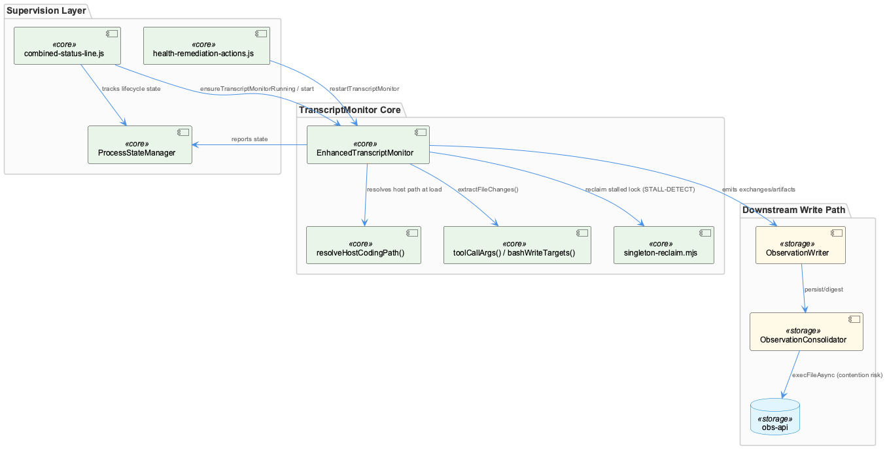
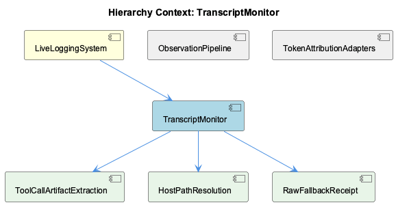

# TranscriptMonitor

**Type:** SubComponent

# TranscriptMonitor — Technical Insight Document

## What It Is

TranscriptMonitor is implemented primarily as `EnhancedTranscriptMonitor`, a class defined in `scripts/enhanced-transcript-monitor.js`. It is the capture layer of the parent **LiveLoggingSystem**, responsible for observing session transcripts, extracting tool-call artifacts and file-write side effects, and handing off structured exchanges to downstream persistence. It is not self-scheduling: it is externally launched and supervised by `combined-status-line.js` via `ensureTranscriptMonitorRunning`, `startTranscriptMonitor`, `ensureAllTranscriptMonitorsRunning`, and `getRunningTranscriptMonitorsSync`, and it can be forcibly restarted by `restartTranscriptMonitor` in `health-remediation-actions.js` or validated/culled by `isValidTranscriptMonitor` in `cleanup-orphaned-processes.js`. Its lifecycle transitions are recorded through `event-logger.js`'s `transcriptMonitorStarted`/`transcriptMonitorStopped` hooks, and its coordination behavior under concurrency is exercised in `multi-user-collision.test.js` via `testEnhancedTranscriptMonitorCoordination`.

## Architecture and Design

The component embodies several deliberate, evidence-driven design patterns rather than generic assumptions. First, it uses a **singleton lock with liveness-based reclaim**: rather than relying on simple PID checks, it imports `computeObservationStalled`, `evaluateHolderLiveness`, and `decideReclaim` from `lib/live-logging/singleton-reclaim.mjs`, layering a "heartbeating-but-not-writing" stall classification on top of `proper-lockfile`'s baseline lock semantics. This distinguishes a process that is alive but has stopped producing observations from one that is truly dead — a failure mode plain liveness checks miss.

Second, the module guards against a specific environmental hazard first: `resolveHostCodingPath()` is defined immediately after dotenv setup, before any other initialization, because ETM runs on the host while the `claude-mcp` launcher exports a container-oriented `CODING_TOOLS_PATH=/coding`, which previously caused silent `mkdir` failures against `/coding/.health`. Placing this guard first signals that host/container path confusion is treated as the most probable startup failure.

Third, lifecycle management is externalized: `combined-status-line.js` decides whether an ETM instance should run, while `ProcessStateManager` (imported from `./process-state-manager.js`) gives the monitor its own internal state tracking, decoupled from the singleton-reclaim locking mechanism. This separation of "who launches" from "who tracks state" from "who owns the lock" is a clear structural decision favoring modularity over a single monolithic lifecycle object.

## Implementation Details

Two child components capture the monitor's most hard-won logic. **ToolCallArtifactExtraction**, implemented as `toolCallArgs()` and governed by `PATH_ARG_KEYS`, normalizes tool-call argument shapes across agents: Claude/opencode readers (`StreamingTranscriptReader`, `AdaptiveExchangeExtractor`) supply arguments under `input`, while `PiSessionReader` supplies `{name, type, content}` with `content` as a serialized JSON string and no `input` key. This was a reactive fix to a measured defect — 0 of 21 pi observations since 2026-09-01 carried any artifact — discovered via corpus audit, not exception traces, motivating a defensive multi-shape parser over a single-format assumption.

**HostPathResolution** (`resolveHostCodingPath()`) is the concrete host/container path guard described above, and **RawFallbackReceipt** spans `raw-fallback.js`, `ObservationWriter.js`, and `ObservationExporter.js` — defining `RAW_FALLBACK_PREFIX` ('[Raw]') and `isRawFallbackSummary()` as the shared contract that marks and preserves low-quality receipts (e.g., when an LLM proxy is unreachable) rather than silently dropping them from export.

A further internal mechanism, `bashWriteTargets()`, extracts shell-redirect artifacts with intentionally narrow scope: heredoc bodies are stripped and quoted spans blanked before scanning, reducing 175 candidate targets from a 1667-call corpus to 15 with no measured true-positive loss. The guiding principle, stated explicitly in comments — "a missed artifact is a gap, an invented one is a lie" — codifies a precision-over-recall trade-off backed by quantified measurement rather than default heuristics. `extractFileChanges()` consumes both `toolCallArgs()` and `bashWriteTargets()` to assemble file-change records.

## Integration Points

TranscriptMonitor sits beneath **LiveLoggingSystem** as a capture-tier component, distinct from the summarization pipeline that later synthesizes `.specstory/history/` logs into continuity summaries — raw per-exchange captures must not be conflated with those higher-level narrative artifacts. Downstream, its outputs feed sibling **ObservationPipeline** components (`ObservationWriter`, `ObservationConsolidator`, `ObservationExporter`), which persist, digest, and export what the monitor produces — a clean separation of capture from write/consolidation concerns. Notably, `ObservationConsolidator.js`'s handling of `execFileAsync` (replacing a previously synchronous `execFileSync` git call that froze obs-api for 7.5 minutes) confirms that anything downstream sharing the obs-api process is vulnerable to single-threaded contention, a risk documented independently in the Typed-Views test suite's obs-api timeout findings. The sibling **TokenAttributionAdapters** component shares no observed overlap with TranscriptMonitor's source files.

## Usage Guidelines

Developers should treat TranscriptMonitor as externally supervised, not autonomous — always route start/stop/health operations through `combined-status-line.js` or `health-remediation-actions.js` rather than invoking `EnhancedTranscriptMonitor` directly. Path-related failures should first be checked against `resolveHostCodingPath()` assumptions, especially when running host-side against a container-configured `CODING_TOOLS_PATH`. When extending tool-call handling for new agent readers, follow the `toolCallArgs()` precedent of adding a new shape branch rather than assuming a single canonical format, and preserve the precision-biased philosophy of `bashWriteTargets()` — new artifact-extraction logic should favor documented, measured false-negative acceptance over speculative pattern matching. Finally, raw fallback receipts (`[Raw]`-prefixed) must be preserved through export paths despite low quality scores, per the contract shared with ObservationWriter and ObservationExporter.

## Code Evidence

Key code artifacts grounding this entity's analysis:

**Structural:**
- EnhancedTranscriptMonitor (class) in enhanced-transcript-monitor.js
- ensureTranscriptMonitorRunning (method) in combined-status-line.js
- startTranscriptMonitor (method) in combined-status-line.js
- ensureAllTranscriptMonitorsRunning (method) in combined-status-line.js
- getRunningTranscriptMonitorsSync (method) in combined-status-line.js
- restartTranscriptMonitor (method) in health-remediation-actions.js
- isValidTranscriptMonitor (function) in cleanup-orphaned-processes.js
- transcriptMonitorStarted (method) in event-logger.js
- transcriptMonitorStopped (method) in event-logger.js
- testEnhancedTranscriptMonitorCoordination (method) in multi-user-collision.test.js

**Relationships:**
- Calls: f, execAsync, log, sleep, info, generateLSLFilename, initialize, redact, generateMockTranscript
- Imports: process-state-manager.js
- `enhanced-transcript-monitor.js` imports `ProcessStateManager` from `./process-state-manager.js`, which the code graph independently surfaces as an import target and pairs with `ensureTranscriptMonitorRunning`/`startTranscriptMonitor` in `combined-status-line.js`. This shows the monitor is not self-launching: some other process (the status line) is responsible for deciding whether an ETM instance should be running and starting it, while `ProcessStateManager` gives the monitor itself a way to track its own lifecycle state independent of that external launcher. The two files were not both supplied in full, so the exact handshake between `ensureTranscriptMonitorRunning` and the monitor's own state object cannot be traced beyond this import relationship.

**Other:**
- The code graph names `EnhancedTranscriptMonitor` in `enhanced-transcript-monitor.js` as the key class, and the supplied source confirms this file is the monitor's actual home: it resolves a host-safe filesystem root via `resolveHostCodingPath()` specifically because ETM runs on the host while the `claude-mcp` launcher exports a container-oriented `CODING_TOOLS_PATH=/coding`, which previously made every poll fail silently when ETM tried to `mkdir('/coding/.health')` on a path that doesn't exist outside the container. This function precedes all other initialization in the file, indicating the monitor's authors treat host/container path confusion as the single most likely startup failure mode worth guarding against first.

## Work Record

What working sessions recorded about this entity — decisions taken, problems hit, and why things are the way they are:

- The 'LSL Continuity Summaries' record establishes that LiveLoggingSystem's output is post-processed into periodic continuity summaries that synthesize `.specstory/history/` logs into a narrative of work phases, surfacing unresolved items like stopped services or blocked test suites — this means TranscriptMonitor's raw captures are one input tier below a distinct summarization pipeline, and consumers must not conflate the monitor's live per-exchange output with these higher-level synthesized artifacts.
- The 'Typed-Views Test Suite — obs-api Contention Timeout' record documents that concurrent Jest workers contend on a shared, effectively single-threaded obs-api backend, causing test timeouts — this is corroborated in the supplied `ObservationConsolidator.js`, whose comment on `execFileAsync` states that a synchronous `execFileSync` git call previously froze every obs-api HTTP route and its 2-second consolidation heartbeat for 7.5 minutes, confirming that anything downstream of TranscriptMonitor sharing obs-api's process is vulnerable to the same single-threaded contention the test-suite record describes.

## Hierarchy Context

### Parent
- [LiveLoggingSystem](./LiveLoggingSystem.md) -- [LLM] The classification layer for LiveLoggingSystem is implemented in ontology-classification-agent.ts, which categorizes captured session content as it flows through the logging pipeline. Its hierarchy-root validation logic is tested separately in ontology-classification-agent.hierarchy-roots.test.ts, indicating that root-node classification (i.e., correctly assigning top-level ontology categories rather than leaf nodes) is treated as a distinct correctness concern from general classification accuracy — likely because incorrect root assignment cascades into misfiled session data across the entire per-person or per-project vault structure.

### Children
- [ToolCallArtifactExtraction](./ToolCallArtifactExtraction.md) -- [LLM] `toolCallArgs()` in `scripts/enhanced-transcript-monitor.js` is the component's core normalization function: it checks `tc.input` first (the shape `StreamingTranscriptReader` and `AdaptiveExchangeExtractor` produce for Claude and opencode), then falls back to parsing `tc.arguments` or `tc.content` as a JSON string (the shape `PiSessionReader` produces: `{name, type, content}` with content pre-serialized). The docstring states this was reactive to a measured defect — 0 of 21 pi observations since 2026-09-01 carried any artifact — meaning the original code silently dropped an entire agent's tool-call arguments rather than erroring, and the fix generalizes to three input shapes precisely so no agent-specific reader can structurally starve the extractor again.
- [HostPathResolution](./HostPathResolution.md) -- [LLM+CGR] The `resolveHostCodingPath()` function in `scripts/enhanced-transcript-monitor.js` is the concrete implementation of the HostPathResolution component. The code graph's parent context establishes that `EnhancedTranscriptMonitor` lives in this file and imports `process-state-manager.js`, and the supplied source confirms `resolveHostCodingPath()` is defined at the top of that same file, immediately after dotenv setup and before any other import or initialization — placing host/container path confusion as the very first failure mode the module guards against.
- [RawFallbackReceipt](./RawFallbackReceipt.md) -- [LLM] The 'RawFallbackReceipt' concept is concretely implemented across raw-fallback.js, ObservationWriter.js, and ObservationExporter.js: raw-fallback.js defines RAW_FALLBACK_PREFIX ('[Raw]') and isRawFallbackSummary() as the single shared contract, ObservationWriter._fallbackSummary() (referenced in comments, not shown in the truncated excerpt) presumably stamps this prefix when the LLM proxy is unreachable, and ObservationExporter.keepInExport() consumes isRawFallbackSummary() to prevent these receipt rows from being silently dropped from the JSON export despite carrying quality:'low'.

### Siblings
- [ObservationPipeline](./ObservationPipeline.md) -- [LLM] ObservationWriter.js implements the write side of the pipeline as a hard cutover from SQLite to km-core: `legacyObservationToEntity`, `legacyDigestToEntity`, and `legacyInsightToEntity` (imported from `@fwornle/km-core/adapters/legacy-ingest`) are the single source of truth for mapping SQLite-row shapes onto km-core `Entity` objects written via `GraphKMStore.putEntity`. The class comment documents that this eliminated a dual-source problem from Plan 44-07's read-only cutover, where the dashboard read km-core while new writes still landed in SQLite and were invisible until a manual migration ran. The `ANCHOR_FOR_KIND` map (observation→'ObservationWriter', digest/insight→'ObservationConsolidator') refines every `capturedBy` edge away from a single undifferentiated `ANCHOR_ROOT` ('LiveLoggingSystem') once the code measured that all 1,244 existing edges split cleanly by writer subsystem — with `ANCHOR_ROOT` retained as fallback because losing the anchor entirely orphaned 22 Insights on 2026-06-15.
- [TokenAttributionAdapters](./TokenAttributionAdapters.md) -- [LLM] None of the supplied source files (enhanced-transcript-monitor.js, ObservationConsolidator.js, ObservationExporter.js, ObservationWriter.js, raw-fallback.js) define or reference any 'TokenAttributionAdapters' class, module, or naming convention. The files cover transcript capture, observation consolidation, JSON export, and raw-fallback marking — none of which mention token attribution, adapter interfaces, or per-token routing logic.

---

*Generated from 22 observations*
