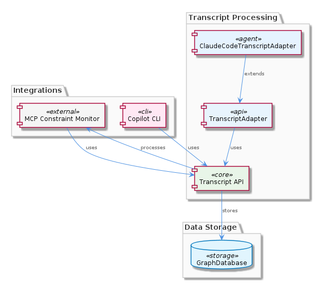
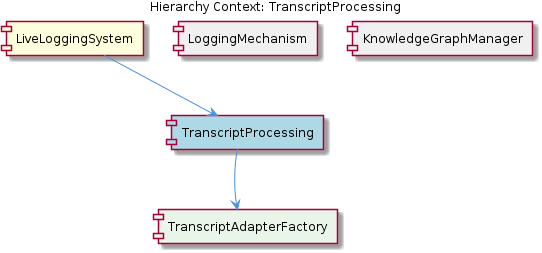

# TranscriptProcessing

**Type:** SubComponent

The TranscriptAdapter class is likely used in conjunction with the integrations/copi/USAGE.md and integrations/copi/docs/hooks.md to handle Copilot CLI transcripts.

## What It Is  

**TranscriptProcessing** is the sub‑component responsible for normalising the raw output of various LLM‑driven agents into a unified *Live‑Logging System* (LLS) format.  Its core implementation lives in **`lib/agent-api/transcript-api.js`**, where the abstract **`TranscriptAdapter`** class is defined together with a **`TranscriptAdapterFactory`** that selects the appropriate concrete adapter at runtime.  One concrete adapter, **`ClaudeCodeTranscriptAdapter`**, resides in **`lib/agent-api/transcripts/claudia-transcript-adapter.js`** and implements the Claude Code‑specific parsing logic.  

The component sits inside the **LiveLoggingSystem** parent, sharing its modular philosophy with sibling sub‑components such as **LoggingMechanism**, **KnowledgeGraphManager**, and **TranscriptAdapterFactory**.  Its child, the **TranscriptAdapterFactory**, encapsulates the creation logic for the various adapters, keeping the processing pipeline extensible for future agent formats.

---

## Architecture and Design  

The design of **TranscriptProcessing** follows a classic **Adapter** pattern, exposing a stable interface (`convertTranscript()`, `parseTranscript()` – inferred from the file’s purpose) while delegating format‑specific work to subclasses like `ClaudeCodeTranscriptAdapter`.  This abstraction permits the LiveLoggingSystem to remain agnostic of the underlying agent’s transcript schema.  

Complementing the adapter is a **Factory** pattern embodied by `TranscriptAdapterFactory`.  The factory inspects metadata (e.g., a `format` identifier) and instantiates the correct adapter, ensuring that the rest of the system interacts with a single entry point.  This two‑layer pattern (Factory → Adapter) is reflected in the hierarchy diagram and reinforces the modularity highlighted in the parent component description.  

Interaction flows are orchestrated through the **LiveLoggingSystem**.  When a new transcript arrives—whether from a Copilot CLI run (referenced in `integrations/copi/USAGE.md` and `integrations/copi/docs/hooks.md`) or a Claude Code execution (see `integrations/mcp-constraint-monitor/docs/CLAUDE-CODE-HOOK-FORMAT.md`)—the LiveLoggingSystem forwards the payload to **TranscriptProcessing**.  The factory selects the appropriate adapter, which then normalises the data and hands it back to the logging pipeline.  

---

## Implementation Details  

At the heart of the implementation is the **`TranscriptAdapter`** abstract class defined in `lib/agent-api/transcript-api.js`.  Although the source code isn’t directly listed, the observations indicate it provides key methods such as `convertTranscript()` and `parseTranscript()`.  Concrete subclasses override these hooks to handle agent‑specific quirks.  

The **`ClaudeCodeTranscriptAdapter`** (`lib/agent-api/transcripts/claudia-transcript-adapter.js`) extends `TranscriptAdapter` and implements the parsing rules required for Claude Code’s hook format.  It likely consumes the format description in `integrations/mcp-constraint-monitor/docs/CLAUDE-CODE-HOOK-FORMAT.md`, extracting fields such as code snippets, execution metadata, and LLM responses, then re‑structures them into the LLS schema.  

The **`TranscriptAdapterFactory`**, also located in `lib/agent-api/transcript-api.js`, acts as a registry of available adapters.  When the LiveLoggingSystem supplies a transcript with a known `type` (e.g., `"claude-code"` or `"copilot-cli"`), the factory returns an instantiated adapter ready to process the payload.  This lazy‑instantiation approach reduces upfront coupling and keeps the memory footprint modest.  

Environment variables **`ANTHROPIC_API_KEY`** and **`BROWSERBASE_API_KEY`** are mentioned as required for API interactions.  While the exact usage isn’t detailed, it is reasonable to infer that adapters may need to call external services (e.g., Anthropic’s API for post‑processing or Browserbase for session management) during conversion, and these keys are injected at runtime to keep credentials out of source code.  

Finally, the **KnowledgeGraphManager** sibling may consume the normalised transcripts to enrich the graph‑based knowledge store described in `integrations/code-graph-rag/README.md`.  This downstream flow is visualised in the relationship diagram.  

---

## Integration Points  

**TranscriptProcessing** integrates tightly with three surrounding areas:

1. **LiveLoggingSystem (parent)** – The parent orchestrates the end‑to‑end logging pipeline.  It hands raw transcripts to the `TranscriptAdapterFactory`, receives the unified LLS payload, and forwards it to the **LoggingMechanism** for persistence.  

2. **Copilot CLI Hooks** – Documentation in `integrations/copi/USAGE.md` and `integrations/copi/docs/hooks.md` describes how Copilot CLI emits transcripts.  Those hooks feed directly into the factory, which selects a (presumed) `CopilotCliTranscriptAdapter` to perform conversion.  

3. **KnowledgeGraphManager (sibling)** – After conversion, the unified transcript may be indexed by the graph‑code system outlined in `integrations/code-graph-rag/README.md`.  This enables downstream RAG (retrieval‑augmented generation) queries that rely on the structured knowledge extracted from transcripts.  

The component also depends on external APIs guarded by `ANTHROPIC_API_KEY` and `BROWSERBASE_API_KEY`.  These keys are injected via the environment, allowing the adapters to remain stateless and testable.  No direct file‑system dependencies are observed beyond the configuration and documentation files that describe transcript formats.

---

## Usage Guidelines  

* **Instantiate via the Factory** – Call `TranscriptAdapterFactory.create(format)` (or the equivalent exported function) rather than directly constructing adapters.  This guarantees that any future adapters are automatically discoverable.  

* **Supply a Known Format Identifier** – The factory expects a string that matches a supported transcript type (e.g., `"claude-code"`).  Ensure that the identifier aligns with the documentation in the respective `*_HOOK_FORMAT.md` files to avoid fallback errors.  

* **Provide Required API Keys** – Before processing transcripts that may invoke external services, set `ANTHROPIC_API_KEY` and `BROWSERBASE_API_KEY` in the environment.  Missing keys will cause runtime failures in adapters that rely on those services.  

* **Treat the Output as Immutable LLS Records** – Once an adapter returns the unified transcript, treat it as read‑only.  Modifications should be performed downstream (e.g., by **LoggingMechanism** or **KnowledgeGraphManager**) to preserve the integrity of the original conversion.  

* **Extend via New Adapter Subclasses** – When adding support for a new agent, create a subclass of `TranscriptAdapter` in `lib/agent-api/transcripts/`, implement the required methods, and register the class in `TranscriptAdapterFactory`.  Follow the same pattern used by `ClaudeCodeTranscriptAdapter` to keep the architecture consistent.  

---

### Summary of Insights  

1. **Architectural patterns identified** – Adapter pattern for format‑specific processing; Factory pattern for adapter instantiation; modular, extensible hierarchy within LiveLoggingSystem.  
2. **Design decisions and trade‑offs** – Centralising conversion logic behind a stable interface reduces coupling but adds an indirection layer; the factory keeps creation logic simple at the cost of maintaining a registration map.  
3. **System structure insights** – TranscriptProcessing sits as a child of LiveLoggingSystem, shares a sibling relationship with LoggingMechanism and KnowledgeGraphManager, and owns the TranscriptAdapterFactory child that mediates adapter creation.  
4. **Scalability considerations** – Adding new transcript formats scales linearly: only a new adapter subclass and factory entry are required.  Stateless adapters and environment‑driven API keys support horizontal scaling of the processing service.  
5. **Maintainability assessment** – The clear separation of concerns (factory vs. adapters) and reliance on documented format specifications make the subsystem easy to maintain.  As long as adapters remain thin wrappers around format parsing, the codebase stays approachable; however, any heavy business logic should be kept out of adapters to avoid bloating them.

## Hierarchy Context

### Parent
- [LiveLoggingSystem](./LiveLoggingSystem.md) -- [LLM] The LiveLoggingSystem component's modular architecture allows for easy extension and modification of agent-specific transcript formats. This is achieved through the use of the TranscriptAdapter, which is implemented in the lib/agent-api/transcript-api.js file. The TranscriptAdapter provides a standardized interface for handling different agent formats, such as Claude Code and Copilot CLI, and converting them to the unified LSL format. For example, the ClaudeCodeTranscriptAdapter class in lib/agent-api/transcripts/claudia-transcript-adapter.js extends the TranscriptAdapter class and provides a specific implementation for handling Claude Code transcripts.

### Children
- [TranscriptAdapterFactory](./TranscriptAdapterFactory.md) -- The TranscriptAdapterFactory is suggested by the parent analysis as a key component in the TranscriptProcessing sub-component, indicating its importance in handling agent-specific transcripts.

### Siblings
- [LoggingMechanism](./LoggingMechanism.md) -- The LoggingMechanism sub-component may utilize the integrations/copi/USAGE.md and integrations/copi/docs/hooks.md to handle logging for Copilot CLI.
- [KnowledgeGraphManager](./KnowledgeGraphManager.md) -- The KnowledgeGraphManager sub-component may utilize the integrations/code-graph-rag/README.md Graph-Code system for graph-based knowledge storage and querying.
- [TranscriptAdapterFactory](./TranscriptAdapterFactory.md) -- The TranscriptAdapterFactory class may be implemented in the lib/agent-api/transcript-api.js file.

---

*Generated from 7 observations*
