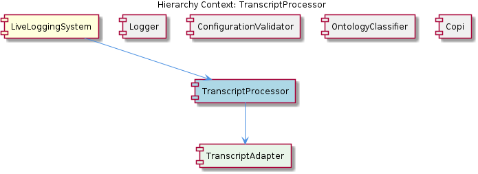

# TranscriptProcessor

**Type:** SubComponent

The TranscriptProcessor provides a standardized way of processing transcript data, ensuring consistency across the system.

## What It Is  

The **TranscriptProcessor** is a sub‑component of the **LiveLoggingSystem**.  It lives inside the LiveLoggingSystem codebase (the exact source‑file locations are not disclosed in the observations, but it is clearly defined as a child of the LiveLoggingSystem component).  Its primary responsibility is to receive raw transcript data produced by a variety of agents, convert that data into a **unified transcript format**, and then run the data through a **processing pipeline** that prepares the transcript for downstream consumption.  The unified format is deliberately **configurable**, allowing the system to adapt the shape of the transcript to the needs of other components such as the **OntologyClassificationAgent**, **LoggingMechanism**, or any future analytics modules.  The component also encapsulates a **TranscriptUnifier** child, which houses the concrete logic that performs the conversion from source‑specific structures into the shared format.

## Architecture and Design  

The design of the TranscriptProcessor follows a **pipeline architecture**: raw input enters the component, is transformed, and then flows through a series of processing stages.  This pipeline is built around a **conversion mechanism** that maps heterogeneous transcript representations into a single, canonical model.  The existence of a configurable unified format indicates the use of a **configuration‑driven data model**; the processor can be tuned at runtime (or via configuration files) to emit fields, naming conventions, or metadata that match the expectations of downstream services.  

The component is also an example of **composition**: the TranscriptProcessor **contains** a **TranscriptUnifier**, delegating the actual transformation work to this child.  By separating the unification logic from the surrounding pipeline orchestration, the design promotes single‑responsibility and makes the unifier reusable by other parts of the system if needed.  The parent‑child relationship with **LiveLoggingSystem** suggests that the processor is part of a larger logging workflow, sharing the same high‑throughput concerns as its sibling **LoggingMechanism**, which uses async buffering to cope with volume.  Consequently, the TranscriptProcessor inherits the same scalability mindset—its pipeline is explicitly described as “designed to handle high‑volume transcript data.”  

No explicit architectural styles such as micro‑services or event‑driven messaging are mentioned; the observations only point to a **modular, in‑process pipeline** that lives inside the LiveLoggingSystem monolith.

## Implementation Details  

Even though the source does not expose concrete class or function names, the observations give a clear picture of the internal mechanics.  The **conversion mechanism** is the heart of the component: it inspects incoming transcript payloads, extracts relevant fields (speaker identifiers, timestamps, utterance text, confidence scores, etc.), and assembles them into the **unified format**.  Because the format is **configurable**, the conversion step likely consults a configuration object or schema that defines which source fields map to which unified fields, and possibly which optional enrichment steps to apply (e.g., language detection, sentiment tagging).  

The **processing pipeline** then operates on the unified transcript.  Typical stages—though not enumerated in the observations—might include validation (ensuring required fields are present), enrichment (adding ontology tags via the **OntologyClassificationAgent**), and routing (forwarding the transcript to storage, real‑time dashboards, or downstream analytics).  The pipeline is built to be **high‑throughput**, implying that stages are lightweight, possibly asynchronous, and that data structures are reused to minimize allocation overhead.  

The **TranscriptUnifier** child component encapsulates the transformation logic.  By housing the conversion code in a dedicated sub‑module, the system can evolve the unification rules independently of the surrounding pipeline.  This also makes unit testing easier: the unifier can be exercised with a suite of source‑specific transcript fixtures to verify that the unified output conforms to the configured schema.

## Integration Points  

The TranscriptProcessor sits at the intersection of several system boundaries.  Its **parent**, **LiveLoggingSystem**, supplies raw transcript streams generated by various agents (e.g., the **OntologyClassificationAgent** that classifies observations).  The processor receives these streams, normalizes them, and then passes the unified transcripts back to the LiveLoggingSystem for further handling—most likely to the **LoggingMechanism**, which buffers and persists high‑volume logs.  Because the unified format is shared, other siblings such as **OntologyManager** and **LSLConfigManager** can safely read or augment the transcript without needing to understand each source’s native schema.  

The **TranscriptUnifier** may expose a public API (e.g., `unify(rawTranscript): UnifiedTranscript`) that other components could call directly if they need to perform ad‑hoc conversion outside the normal pipeline.  Configuration for the unified format is probably sourced from the **LSLConfigManager**, ensuring that any changes to the schema are propagated consistently across the system.  The processor also relies on the **OntologyClassificationAgent** for semantic enrichment, indicating a downstream dependency where the unified transcript is fed into the classification agent to attach ontology tags before final logging.

## Usage Guidelines  

1. **Provide raw transcripts in the expected input shape** – the processor assumes that each incoming payload conforms to one of the known source formats.  Supplying malformed data will cause the conversion mechanism to fail validation, potentially halting the pipeline.  

2. **Configure the unified format centrally** – use the configuration facilities supplied by **LSLConfigManager** to define the field mapping and any optional enrichments.  Changing the configuration does not require code changes; however, ensure that all downstream consumers (e.g., LoggingMechanism, OntologyClassificationAgent) are aware of the new schema.  

3. **Treat the processor as a high‑throughput, streaming component** – avoid inserting heavyweight, blocking operations inside custom pipeline stages.  If additional processing is required, implement it as a non‑blocking step or offload it to a background worker to preserve the pipeline’s throughput guarantees.  

4. **Leverage the TranscriptUnifier for unit testing** – when adding new source agents or altering existing ones, write tests that feed representative raw transcripts into the unifier and assert that the output matches the configured unified schema.  This isolates conversion logic from the rest of the pipeline and helps maintain correctness as the system evolves.  

5. **Coordinate schema changes with sibling components** – because the unified format is shared across the LiveLoggingSystem ecosystem, any modification to the format should be communicated to the owners of **OntologyManager**, **LoggingMechanism**, and other consumers to avoid runtime mismatches.  

---

### Architectural patterns identified  
* Pipeline architecture for staged processing of transcript data.  
* Configuration‑driven unified data model.  
* Composition (TranscriptProcessor → TranscriptUnifier).  

### Design decisions and trade‑offs  
* **Unified format** simplifies integration but introduces a configuration burden and a single point of schema truth.  
* **High‑volume pipeline** favors lightweight, possibly asynchronous stages, at the cost of limiting complex, blocking logic within the pipeline.  
* **Separation of unification logic** into a child component improves testability and modularity, though it adds an extra indirection layer.  

### System structure insights  
* TranscriptProcessor is a child of LiveLoggingSystem and a peer to OntologyManager, LoggingMechanism, LSLConfigManager, and OntologyClassificationAgent.  
* It encapsulates a child component (TranscriptUnifier) that performs the core transformation.  

### Scalability considerations  
* The pipeline is explicitly described as capable of handling high‑volume data, implying design choices such as async buffering, minimal object allocation, and configurable parallelism.  
* Configuration‑driven format allows the system to adapt the payload size (e.g., dropping optional fields) to meet performance targets.  

### Maintainability assessment  
* Clear separation between conversion (TranscriptUnifier) and pipeline orchestration aids maintainability.  
* Centralized configuration reduces code churn when schema changes are needed, but requires disciplined change management across all consumers.  
* Lack of exposed code symbols suggests that documentation and tests around the unifier and pipeline stages are critical to preserve understandability as the component evolves.

## Diagrams

### Relationship

## Architecture Diagrams

## Hierarchy Context

### Parent
- [LiveLoggingSystem](./LiveLoggingSystem.md) -- [LLM] The LiveLoggingSystem component utilizes the OntologyClassificationAgent, which is defined in the integrations/mcp-server-semantic-analysis/src/agents/ontology-classification-agent.ts file, for classifying observations against the ontology system. This agent is crucial in providing a standardized way of categorizing and understanding the interactions within the Claude Code conversations. The OntologyClassificationAgent follows a specific constructor and initialization pattern to ensure proper setup of the ontology system and classification capabilities. For instance, the agent initializes the ontology system by loading the necessary configuration files and setting up the classification models. This is evident in the code, where the constructor of the OntologyClassificationAgent class calls the initOntologySystem method, which in turn loads the configuration files and sets up the classification models.

### Children
- [TranscriptUnifier](./TranscriptUnifier.md) -- The parent analysis suggests the existence of a TranscriptUnifier component, which is a key aspect of the TranscriptProcessor sub-component.

### Siblings
- [OntologyManager](./OntologyManager.md) -- The OntologyClassificationAgent follows a specific constructor and initialization pattern to ensure proper setup of the ontology system and classification capabilities.
- [LoggingMechanism](./LoggingMechanism.md) -- The LoggingMechanism uses async buffering to handle high-volume logging scenarios.
- [LSLConfigManager](./LSLConfigManager.md) -- The LSLConfigManager uses a validation mechanism to ensure configuration data is correct and consistent.
- [OntologyClassificationAgent](./OntologyClassificationAgent.md) -- The OntologyClassificationAgent follows a specific constructor and initialization pattern to ensure proper setup of the ontology system and classification capabilities.

---

*Generated from 7 observations*
