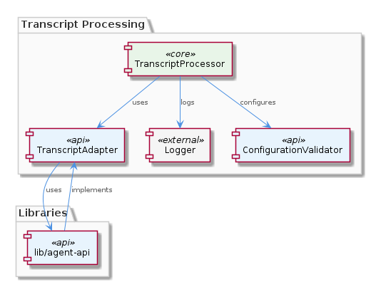

# TranscriptProcessor

**Type:** SubComponent

The TranscriptProcessor uses the TranscriptAdapter abstract base class in 'lib/agent-api' to read and convert transcripts from various agent formats.

## What It Is  

The **TranscriptProcessor** lives inside the **LiveLoggingSystem** and is the core sub‑component responsible for ingesting, validating, and normalising transcript data that originates from a variety of agent formats. Its implementation relies on the abstract base class **TranscriptAdapter** found in `lib/agent-api/TranscriptAdapter.ts` (or the equivalent file under `lib/agent-api`). By delegating the format‑specific parsing to concrete adapters that inherit from this base class, the processor can treat every incoming transcript as a uniform internal representation.  

The processor is built for high‑throughput scenarios: it operates on **batches** of transcripts, which reduces per‑item overhead and enables downstream components to work with sizable chunks of data rather than a stream of single records. Configuration of its behaviour—such as batch size, validation rules, and error‑handling policies—is driven by the **ConfigurationValidator** component (implemented in the `scripts` folder via the `LSLConfigValidator` script). All operational events, warnings, and failures are emitted through the unified logging interface supplied by the **Logger** component (`integrations/mcp-server-semantic-analysis/src/logging.ts`).  

Together, these pieces make the TranscriptProcessor a configurable, extensible, and observable gateway for transcript data within the broader LiveLoggingSystem architecture.  

---

## Architecture and Design  

The design of the TranscriptProcessor follows a **modular, layered architecture** that isolates concerns into distinct, reusable artifacts. At the heart of the design is the **Adapter pattern**: `TranscriptAdapter` defines a standardized contract (`read()`, `convert()`, `validate()`, etc.) that concrete adapters implement for each agent format. This abstraction enables the processor to remain agnostic of source specifics while still supporting easy addition of new formats—simply drop a new subclass into `lib/agent-api` and register it.  

Batch handling introduces a **Batch Processing pattern**, where the processor accumulates incoming transcripts up to a configurable threshold before invoking the adapter pipeline. This reduces the frequency of I/O and validation calls, yielding better CPU cache utilisation and lower latency per transcript when the system is under heavy load.  

Error handling and observability are centralised through the **Logger** component. By funneling all log statements through `integrations/mcp-server-semantic-analysis/src/logging.ts`, the system achieves a **single source of truth for logging**, making it straightforward to route logs to files, consoles, or external monitoring services.  

Configuration validation is performed by the **ConfigurationValidator** sibling, which runs the `LSLConfigValidator` script from the `scripts` folder. This reflects a **validation‑before‑execution** approach: the processor refuses to start with malformed or out‑of‑range settings, preventing runtime failures and providing early feedback to developers.  

These patterns collectively promote **separation of concerns**, **extensibility**, and **operational robustness** without introducing heavyweight architectural styles such as micro‑services or event‑driven messaging, which are not mentioned in the source observations.  

---

## Implementation Details  

The primary class, **TranscriptProcessor**, orchestrates three key collaborators:

1. **TranscriptAdapter (abstract)** – Located in `lib/agent-api/TranscriptAdapter.ts`. It declares methods for:
   * **Reading** raw transcript blobs from various agent sources.
   * **Converting** those blobs into a common internal model.
   * **Validating** the resulting model against schema rules (e.g., required fields, timestamp formats).  
   Concrete subclasses (e.g., `ChromeAgentAdapter`, `CopilotAdapter`) reside in the same folder and implement these methods.

2. **Logger** – Implemented in `integrations/mcp-server-semantic-analysis/src/logging.ts`. The processor obtains a logger instance (typically via dependency injection or a static accessor) and logs:
   * Batch start/end markers.
   * Validation failures per transcript.
   * Unexpected exceptions that bubble up from adapters.

3. **ConfigurationValidator** – Executed via the `LSLConfigValidator` script in the `scripts` directory. Before the processor begins, it reads a JSON/YAML configuration file, checks for required keys such as `batchSize`, `maxRetries`, and `allowedFormats`, and aborts start‑up with a clear error if validation fails.

During runtime, the processor follows this flow:

* **Initialisation** – The configuration file is passed to `ConfigurationValidator`. Upon success, the processor creates a pool of `TranscriptAdapter` instances based on the `allowedFormats` list.
* **Batch Accumulation** – Incoming transcript payloads are queued until the `batchSize` threshold is reached or a timeout fires.
* **Processing Loop** – For each transcript in the batch:
  * The appropriate adapter’s `read()` method fetches raw data.
  * `convert()` normalises the data.
  * `validate()` ensures the transcript conforms to the internal schema; invalid items are logged and omitted from further processing.
* **Commit/Forward** – The batch of validated transcripts is handed off to downstream components (e.g., storage, analytics) – this hand‑off is not detailed in the observations but is implied by the “large volumes” handling requirement.

No explicit functions are listed in the observations, but the described methods give a clear picture of the internal mechanics.

---

## Integration Points  

The TranscriptProcessor sits directly under the **LiveLoggingSystem** parent, making it one of the three primary pillars alongside **Logger** and **ConfigurationValidator**. Its **child** relationship with **TranscriptAdapter** means any new agent format must be introduced as a subclass in `lib/agent-api`, preserving the same public API.  

* **Logger** – All logging calls are routed through the unified interface, ensuring consistency with other siblings like **OntologyClassifier** and **Copi**, which also use the same logger implementation. This shared dependency simplifies log aggregation across the system.  

* **ConfigurationValidator** – The processor reads its operational parameters from the same configuration source validated by the `LSLConfigValidator` script. This creates a tight coupling to the validation logic, guaranteeing that any change to configuration schema is automatically reflected in processor behaviour.  

* **LiveLoggingSystem** – As a container component, LiveLoggingSystem likely orchestrates the lifecycle of the processor, starting it after configuration validation succeeds and stopping it gracefully during shutdown.  

* **Sibling Components** – While not directly invoked by the processor, components such as **OntologyClassifier** may consume the normalized transcripts downstream for classification, and **Copi** may generate transcripts that the processor later ingests. The shared architecture (modular folders, common logging) ensures these interactions are low‑friction.  

No external services or databases are explicitly referenced, so integration is confined to in‑process module calls and shared configuration files.

---

## Usage Guidelines  

1. **Add New Agent Formats via the Adapter** – To support a new transcript source, create a subclass of `TranscriptAdapter` in `lib/agent-api` that implements the required `read`, `convert`, and `validate` methods. Register the new adapter in the processor’s initialisation routine (typically via a mapping keyed by format name).  

2. **Configure Batch Parameters Carefully** – The `batchSize` setting, validated by `ConfigurationValidator`, should reflect the expected throughput and memory budget of the host environment. Larger batches improve throughput but increase memory pressure; tune this value based on observed load.  

3. **Respect Validation Rules** – The adapter’s `validate` method enforces schema constraints. Developers should extend these rules only when absolutely necessary, as stricter validation reduces the risk of downstream errors but may increase the number of rejected transcripts.  

4. **Leverage the Unified Logger** – All diagnostic messages must be emitted through the `Logger` component (`integrations/mcp-server-semantic-analysis/src/logging.ts`). Use appropriate log levels (`info` for batch start/end, `warn` for recoverable validation issues, `error` for unexpected exceptions). This ensures consistency with other siblings and facilitates centralized monitoring.  

5. **Run Configuration Validation Before Deployment** – Never start the processor without first executing the `LSLConfigValidator` script. Automated CI pipelines should include this step to catch misconfigurations early.  

6. **Monitor Batch Processing Metrics** – Although not part of the observations, it is advisable to instrument the processor (via the logger or a metrics exporter) with counters for “transcripts received”, “transcripts validated”, and “transcripts rejected”. This aids capacity planning and helps maintain the system’s scalability guarantees.  

---

### Summary Items  

- **Architectural patterns identified**  
  * Adapter pattern (`TranscriptAdapter` abstract base class)  
  * Batch Processing pattern (large‑volume, batch‑oriented handling)  
  * Centralised Logging (shared `Logger` component)  
  * Configuration Validation (pre‑run `LSLConfigValidator`)  

- **Design decisions and trade‑offs**  
  * Decoupling format handling via adapters improves extensibility but adds a layer of indirection.  
  * Batch processing boosts throughput at the cost of increased latency for the first items in a batch and higher memory usage.  
  * Strict validation prevents bad data from propagating but may reject borderline transcripts, requiring careful schema design.  

- **System structure insights**  
  * TranscriptProcessor is a child of LiveLoggingSystem and a sibling to Logger, ConfigurationValidator, OntologyClassifier, and Copi, sharing common utilities (logging, config validation).  
  * Its only direct child is TranscriptAdapter, which encapsulates all format‑specific logic.  

- **Scalability considerations**  
  * Batch size and concurrency can be tuned to match hardware resources; larger batches improve I/O efficiency but demand more RAM.  
  * Adding new adapters does not affect existing processing pipelines, supporting horizontal scaling of supported formats.  

- **Maintainability assessment**  
  * Clear separation of concerns (adapter, logging, configuration) makes the codebase easy to navigate and modify.  
  * Centralised validation and logging reduce duplicated error‑handling logic.  
  * The reliance on abstract base classes means that any change to the adapter contract must be coordinated across all concrete adapters, requiring disciplined versioning.

## Hierarchy Context

### Parent
- [LiveLoggingSystem](./LiveLoggingSystem.md) -- [LLM] The LiveLoggingSystem component utilizes a modular architecture, with separate components for logging, transcript processing, and configuration validation. This is evident in the directory structure, where the 'integrations' folder contains subfolders for 'browser-access', 'code-graph-rag', and 'copi', each representing a distinct aspect of the system. For instance, the 'copi' subfolder contains files such as 'INSTALL.md' and 'USAGE.md', which provide installation and usage guidelines for the Copi component. The 'lib/agent-api' folder contains the TranscriptAdapter abstract base class, which is responsible for reading and converting transcripts from different agent formats. The 'scripts' folder contains the LSLConfigValidator, which is used for validating and optimizing LSL configuration. The logging module, located in 'integrations/mcp-server-semantic-analysis/src/logging.ts', provides a unified logging interface and is used throughout the system.

### Children
- [TranscriptAdapter](./TranscriptAdapter.md) -- The TranscriptProcessor uses the TranscriptAdapter abstract base class in 'lib/agent-api' to read and convert transcripts from various agent formats, as indicated by the hierarchy context.

### Siblings
- [Logger](./Logger.md) -- The Logger component is implemented in 'integrations/mcp-server-semantic-analysis/src/logging.ts', providing a unified logging interface.
- [ConfigurationValidator](./ConfigurationValidator.md) -- The ConfigurationValidator is implemented in the 'scripts' folder, using the LSLConfigValidator script to validate and optimize configuration.
- [OntologyClassifier](./OntologyClassifier.md) -- The OntologyClassifier uses a modular design, allowing for easy integration of new ontology systems and classification mechanisms.
- [Copi](./Copi.md) -- The Copi component is implemented in the 'integrations/copi' folder, providing a GitHub Copilot CLI wrapper with logging and Tmux integration.

---

*Generated from 7 observations*
