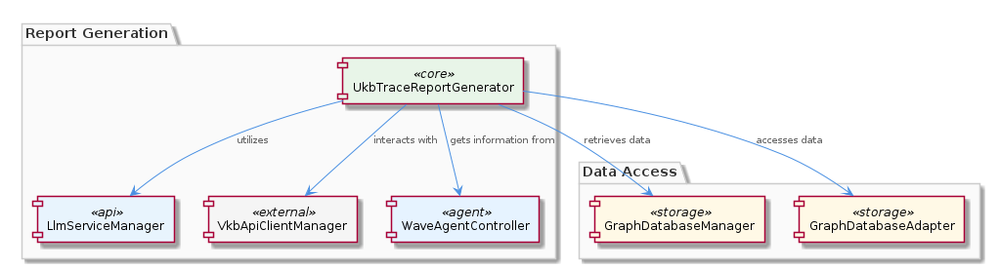
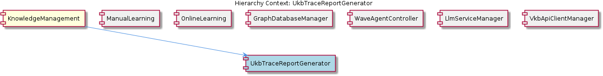

# UkbTraceReportGenerator

**Type:** SubComponent

UkbTraceReportGenerator probably relies on the WaveAgentController for information about Wave agent execution and workflows.

## What It Is  

UkbTraceReportGenerator is a **sub‑component** of the **KnowledgeManagement** layer. Although the exact source file is not listed among the observed symbols, its placement inside the KnowledgeManagement hierarchy makes it a logical partner to the other knowledge‑centric services such as **GraphDatabaseManager**, **LlmServiceManager**, **VkbApiClientManager**, and **WaveAgentController**. Its primary responsibility is to synthesize trace reports that capture the flow of information through the system – pulling graph data, enriching it with large‑language‑model (LLM) insights, and optionally augmenting the report with VKB (Virtual Knowledge Base) API data. The component therefore acts as a “reporting façade” that coordinates several lower‑level managers to produce a coherent, consumable artifact for downstream analysis or debugging.

## Architecture and Design  

The design of UkbTraceReportGenerator follows a **coordinator‑orchestrator** pattern. Rather than embedding data‑access or LLM logic directly, it delegates those concerns to dedicated managers:

* **GraphDatabaseManager** – supplies raw knowledge graph entities and relationships.  
* **GraphDatabaseAdapter** – the concrete persistence layer used by the manager, located at `integrations/mcp-server-semantic-analysis/src/storage/graph-database-adapter.ts`. This adapter couples Graphology with LevelDB, offering scalable, fast graph storage that the report generator can query without worrying about underlying I/O details.  
* **LlmServiceManager** – provides LLM‑driven summarisation, explanation, or insight generation that enriches the trace data.  
* **VkbApiClientManager** – optionally fetches external VKB resources that may be referenced in the trace.  
* **WaveAgentController** – contributes execution metadata (e.g., workflow steps, agent status) that contextualises the trace.

By keeping these interactions explicit, the component remains **thin** and **testable**: each manager can be mocked in isolation, and the report generation logic can be exercised as a pure transformation pipeline. The architecture thus leans on **separation of concerns** and **dependency inversion**—UkbTraceReportGenerator depends on abstractions (the managers) rather than concrete implementations.

## Implementation Details  

Even though no concrete classes or functions are enumerated in the observation set, the implied implementation flow can be described:

1. **Initialization** – UkbTraceReportGenerator obtains references to the sibling managers, likely through constructor injection or a service locator provided by the KnowledgeManagement container.  
2. **Data Retrieval** – It calls into **GraphDatabaseManager** (which itself uses **GraphDatabaseAdapter**) to fetch the sub‑graph relevant to the trace request. The adapter’s JSON export synchronization ensures that the retrieved snapshot reflects the latest persisted state.  
3. **Workflow Context** – Via **WaveAgentController**, the generator extracts execution timestamps, agent identifiers, and workflow transitions, embedding them as metadata within the report structure.  
4. **LLM Enrichment** – The raw trace is passed to **LlmServiceManager**, which may invoke a prompt‑template to generate natural‑language explanations, risk assessments, or actionable recommendations.  
5. **External Augmentation** – If the trace references external knowledge items, **VkbApiClientManager** is consulted to pull the latest VKB entries, which are then merged into the report payload.  
6. **Report Assembly** – A dedicated module (not named in the observations) likely defines the report schema—perhaps a JSON or Markdown document that combines graph nodes, LLM‑generated prose, and VKB excerpts. The final artifact is then returned to the caller or persisted for later consumption.

The component’s **stateless** nature—relying exclusively on manager services for mutable state—facilitates horizontal scaling and simplifies lifecycle management.

## Integration Points  

UkbTraceReportGenerator sits at the nexus of several core services:

* **GraphDatabaseManager ↔ GraphDatabaseAdapter** – The adapter (`integrations/mcp-server-semantic-analysis/src/storage/graph-database-adapter.ts`) is the low‑level bridge to the LevelDB‑backed graph store. Any change in storage technology would ripple through the manager but leave the report generator untouched.  
* **LlmServiceManager** – Provides an interface for LLM operations; the generator must adhere to the manager’s contract (e.g., `generateInsight(prompt: string): Promise<string>`). This coupling enables swapping out the underlying model (OpenAI, Anthropic, etc.) without modifying report logic.  
* **VkbApiClientManager** – Exposes API calls to the VKB service. The generator likely passes identifiers extracted from the trace to this client and incorporates the returned payloads.  
* **WaveAgentController** – Supplies execution context. Because the controller also interacts with **LlmServiceManager**, there is a shared dependency that could be leveraged for coordinated logging or tracing.  

The relationship diagram below visualises these connections:

## Usage Guidelines  

1. **Prefer Constructor Injection** – When instantiating UkbTraceReportGenerator, inject the concrete manager instances rather than creating them internally. This preserves testability and aligns with the dependency‑inversion principle observed across the KnowledgeManagement component.  
2. **Handle Asynchronous Calls Gracefully** – All manager interactions (graph queries, LLM calls, VKB fetches) are inherently I/O‑bound. Use `async/await` patterns and implement timeout/retry logic to avoid blocking the report generation pipeline.  
3. **Limit Report Scope** – Fetch only the sub‑graph necessary for the trace; overly broad queries can degrade performance, especially given the LevelDB‑backed Graphology store.  
4. **Cache LLM Results When Appropriate** – If the same trace is generated repeatedly, consider caching the LLM‑generated prose to reduce cost and latency. The cache layer should sit between UkbTraceReportGenerator and LlmServiceManager.  
5. **Validate External VKB Data** – Since VkbApiClientManager may return mutable external content, always perform schema validation before merging it into the final report to maintain structural integrity.  

---

### Architectural Patterns Identified  
* Coordinator/Orchestrator pattern (UkbTraceReportGenerator as the orchestrator).  
* Dependency Inversion – managers are injected as abstractions.  
* Separation of Concerns – distinct managers handle persistence, LLM, API, and workflow data.

### Design Decisions and Trade‑offs  
* **Stateless orchestration** improves scalability but requires careful handling of async failures.  
* **Delegating storage to GraphDatabaseAdapter** locks the component into a Graphology‑LevelDB stack; swapping storage would need adapter replacement but not report‑generator changes.  
* **LLM enrichment** adds valuable insight but introduces latency and cost; optional use via configuration mitigates impact.

### System Structure Insights  
UkbTraceReportGenerator is positioned centrally within KnowledgeManagement, acting as a bridge between the graph‑centric data layer and the higher‑level insight services. Its sibling components each specialise in a single domain (graph management, LLM handling, VKB access, workflow control), reinforcing a modular architecture.

### Scalability Considerations  
* Because the generator is stateless, multiple instances can run in parallel behind a load balancer.  
* The underlying LevelDB store scales horizontally with sharding, but query breadth must be limited to keep latency low.  
* LLM calls are the primary scalability bottleneck; employing batching or asynchronous streaming can alleviate pressure.

### Maintainability Assessment  
The clear separation between UkbTraceReportGenerator and its managers yields high maintainability: changes to graph schema, LLM provider, or VKB API can be isolated within their respective managers. The lack of embedded business logic in the generator simplifies unit testing and reduces the risk of regression. However, the absence of explicit type contracts in the observations suggests that rigorous interface definitions (e.g., TypeScript interfaces) would further improve long‑term maintainability.

## Hierarchy Context

### Parent
- [KnowledgeManagement](./KnowledgeManagement.md) -- [LLM] The KnowledgeManagement component utilizes the GraphDatabaseAdapter (integrations/mcp-server-semantic-analysis/src/storage/graph-database-adapter.ts) for persisting data in a graph database with automatic JSON export synchronization. This design decision enables efficient storage and retrieval of knowledge entities and relationships, which is crucial for the system's overall goals of knowledge discovery and insight generation. Furthermore, the use of Graphology+LevelDB persistence ensures a scalable and performant solution for managing the knowledge graph.

### Siblings
- [ManualLearning](./ManualLearning.md) -- ManualLearning likely interacts with the GraphDatabaseManager to store and retrieve manually created knowledge entities and relationships.
- [OnlineLearning](./OnlineLearning.md) -- OnlineLearning likely employs the GraphDatabaseManager to store and manage automatically extracted knowledge entities and relationships.
- [GraphDatabaseManager](./GraphDatabaseManager.md) -- GraphDatabaseManager likely utilizes the GraphDatabaseAdapter for interacting with the graph database.
- [WaveAgentController](./WaveAgentController.md) -- WaveAgentController likely interacts with the LlmServiceManager for LLM operations and initialization.
- [LlmServiceManager](./LlmServiceManager.md) -- LlmServiceManager likely interacts with other components for LLM-related tasks, such as the GraphDatabaseManager and WaveAgentController.
- [VkbApiClientManager](./VkbApiClientManager.md) -- VkbApiClientManager likely interacts with the GraphDatabaseManager for storing and retrieving data related to VKB API interactions.

---

*Generated from 6 observations*
