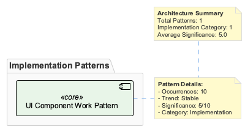

# UiComponentWorkPattern

**Type:** Technical Pattern

Repository-specific development challenge identified through code analysis

## Implementation

Configuration-driven development approach

- Standardize configuration management across 22 config files
- Implement validation schemas for configuration
- Create centralized configuration loading
- Add environment-specific configuration support
- Establish configuration documentation patterns

## Technologies

- JSON Schema validation
- Environment variable management
- Configuration templating
- Documentation
- TypeScript/JavaScript

## Architecture

---
*Generated via fallback analysis*