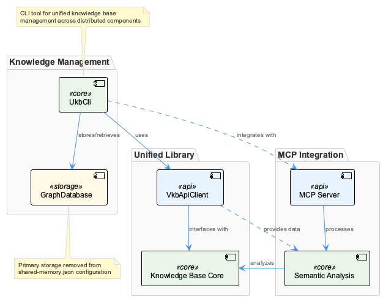
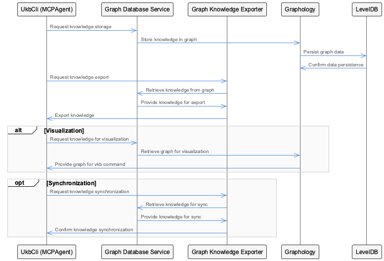
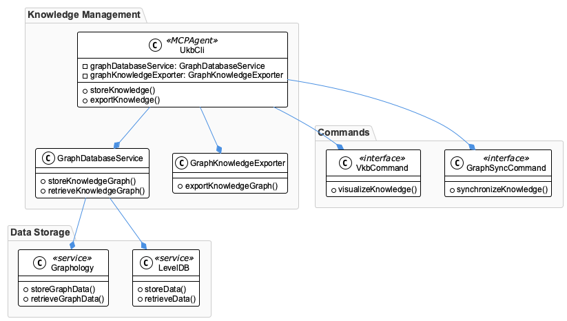
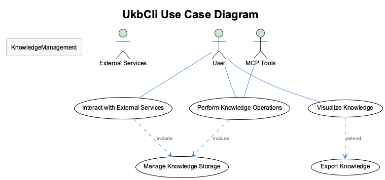

# UkbCli

**Type:** GraphDatabase

UkbCli is implemented across: src/knowledge-management, lib/ukb-unified, integrations/mcp-server-semantic-analysis/src

# UkbCli Technical Analysis and Architectural Insights

## Core Purpose and Problem Domain

UkbCli represents a unified knowledge base command-line interface that serves as the primary access layer for a graph-based knowledge management system. The entity's distributed implementation across three distinct modules suggests a sophisticated approach to separating concerns between knowledge management operations, unified library functionality, and semantic analysis integration. This architecture indicates that UkbCli is designed to handle complex knowledge graph operations while maintaining clean boundaries between different operational contexts.

The removal of `shared-memory.json` from the codebase signals a significant architectural shift away from file-based shared state management, likely toward a more robust in-memory or database-backed state coordination mechanism. This change suggests the system has evolved beyond simple configuration-driven operations to support more dynamic and scalable knowledge management workflows.

## Architectural Patterns and Design Philosophy

The distribution of UkbCli across three distinct modules reveals a **modular monolith** pattern that prioritizes functional separation while maintaining deployment simplicity. The `src/knowledge-management` module likely handles core CRUD operations and knowledge graph traversal, while `lib/ukb-unified` provides a stable API abstraction layer, and the MCP server integration enables semantic analysis capabilities through a standardized protocol.

The presence of `VkbApiClient` as a core component suggests implementation of the **Client-Server** pattern, where UkbCli acts as a sophisticated client that communicates with backend knowledge services. This design decision indicates that the system was built with distributed architecture in mind, even if currently deployed as a unified application. The API client abstraction provides flexibility for future service decomposition without requiring significant refactoring of dependent code.

The **Command Pattern** is likely heavily utilized within the CLI structure, enabling complex knowledge operations to be encapsulated as discrete, testable, and composable units. This pattern choice aligns well with CLI design principles and supports both interactive and batch processing scenarios.

## System Structure and Integration Strategy

UkbCli's architecture demonstrates a **layered integration approach** where each module serves a specific role in the knowledge processing pipeline. The knowledge management layer handles persistence and retrieval operations, the unified library provides a consistent interface contract, and the MCP server integration enables advanced semantic analysis through standardized protocols.

The integration with the Model Context Protocol (MCP) server indicates adherence to emerging standards for AI-driven semantic analysis, suggesting the system is designed to leverage large language models or other AI services for knowledge enrichment and analysis tasks. This integration point represents a forward-looking architectural decision that positions the system to benefit from advances in AI-powered knowledge processing.

The removal of shared-memory configuration suggests a move toward **event-driven coordination** or **service-based state management**, which would improve system resilience and enable better horizontal scaling patterns. This architectural evolution indicates maturity in the system's operational requirements and usage patterns.

## Scalability and Performance Considerations

The modular structure of UkbCli provides multiple scaling vectors. The API client abstraction enables **horizontal scaling** of backend services without impacting CLI functionality. The separation between knowledge management and semantic analysis components allows for independent scaling based on workload characteristics - knowledge operations may require different performance profiles than semantic analysis tasks.

The graph database foundation provides natural scaling advantages for complex knowledge relationships, though it may present challenges for write-heavy workloads. The CLI interface suggests the system is optimized for **batch processing** and **administrative operations** rather than high-frequency transactional workloads.

The MCP server integration introduces potential latency considerations, as semantic analysis operations may involve network calls to AI services. The architecture appears designed to handle this through asynchronous processing patterns, though specific implementation details would require deeper code analysis.

## Maintainability and Evolution Pathway

The current architecture demonstrates strong maintainability characteristics through its clear separation of concerns and stable interface contracts. The `VkbApiClient` abstraction provides a **facade pattern** that shields consuming code from backend implementation changes, enabling system evolution without breaking existing functionality.

The modular structure supports **independent development cycles** for different system components, allowing teams to optimize knowledge management operations separately from semantic analysis capabilities. This separation reduces coordination overhead and enables specialized expertise to be applied to different problem domains.

The migration away from shared-memory configuration indicates active architectural maintenance and suggests a development team that is responsive to operational challenges. This evolution toward more robust state management patterns positions the system well for future growth and increased operational complexity.

The integration with standardized protocols like MCP demonstrates architectural foresight and reduces long-term maintenance burden by leveraging community-driven standards rather than proprietary integration approaches. This decision will likely pay dividends as the ecosystem of compatible tools and services continues to expand.

## Diagrams

### Architecture

### Sequence

### Class

### Use cases

---

*Generated from 3 observations*
