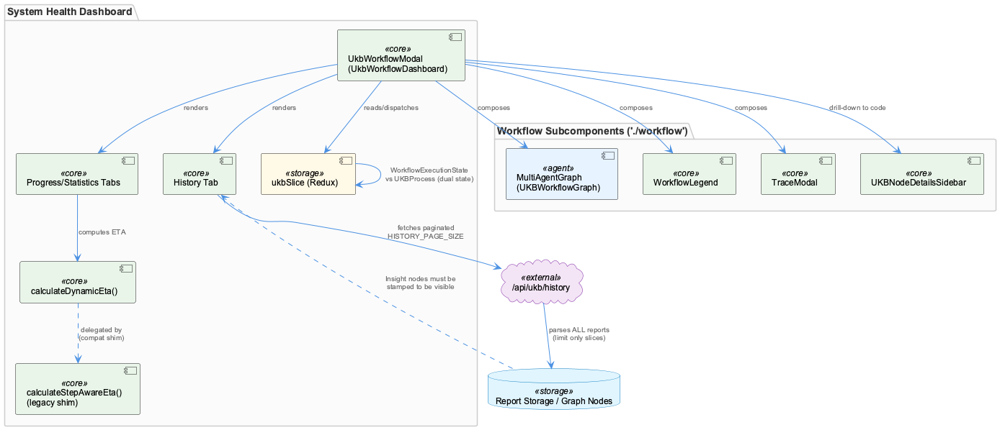
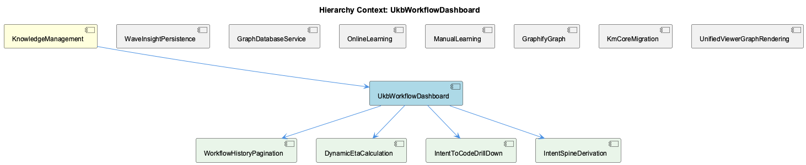

# UkbWorkflowDashboard

**Type:** SubComponent

# UkbWorkflowDashboard: Architectural Insight Document

## What It Is

UkbWorkflowDashboard is the operator-facing visualization and control surface for the UKB (Unified Knowledge Base) workflow, implemented primarily in `integrations/system-health-dashboard/src/components/ukb-workflow-modal.tsx`, with supporting state in `integrations/system-health-dashboard/src/store/slices/ukbSlice.ts` and graph rendering delegated to `multi-agent-graph.tsx` and, in the unified-viewer, `D3GraphCanvas.tsx` / `color-fallback.ts`. As a SubComponent of the parent **KnowledgeManagement** domain, it is the layer that turns the batch/wave-based knowledge extraction pipeline — driven by siblings like **CodeGraphAgent**, **GraphifyGraph**, and **WaveInsightPersistence** — into something a human operator can watch progress, inspect history for, and debug in real time.

The modal composes several sub-pieces from a shared `workflow` module — `MultiAgentGraph`, `WorkflowLegend`, `TraceModal`, `UKBNodeDetailsSidebar` — and combines a WebSocket hook (`useWorkflowWebSocket`) for live push updates with Redux (`ukbSlice.ts`) for durable state, making it a hybrid push/pull orchestration component rather than a purely reactive or purely polling one.

## Architecture and Design

The dashboard exhibits several recurring architectural idioms shared across the broader codebase. Most prominently, it is mid-migration from a polling model to an event-driven one: `ukbSlice.ts` maintains two structurally parallel state trees, the legacy `UKBProcess` (with `steps`, `batchProgress`, `batchIterations`) and the newer `WorkflowExecutionState` (with `stepStatuses`, `substepStatuses`, `currentStep`/`currentSubstep`). Each tracks LLM mode independently — `llmMode` on the process versus `llmIntendedMode`/`llmActualMode`/`llmModeFallback` on `EventStepStatusInfo` — and nothing yet forces these trees to agree, meaning a step's status could theoretically diverge between them until consolidation completes.

A Strangler Fig pattern recurs at multiple granularities. `calculateStepAwareEta` in `ukb-workflow-modal.tsx` is retained purely "for compatibility with existing call sites," delegating entirely to the newer `calculateDynamicEta`. The same shim philosophy appears in the parent context around `CodeGraphAgent`'s `checkMemgraphConnection`, and in `UKBProcess.llmMode` being deliberately left optional and uncoerced from the legacy `mockLLM` boolean rather than forcibly mapped — preserving a semantic distinction ("no mode stated" vs. "public") the old type couldn't express.

The estimator design in `calculateDynamicEta` embodies a "trust but clamp" philosophy: a sophisticated per-batch/per-step learned ETA is computed, then bounded to 0.3x–2.0x of a much simpler linear-interpolation baseline. This is a deliberate admission that the richer model can produce wild outliers from anomalous batches, and rather than fix the model, the design wraps it in a sanity-check envelope.

## Implementation Details

`HISTORY_PAGE_SIZE` in `ukb-workflow-modal.tsx` documents a real production incident directly in a source comment: at its old value of 50, `/api/ukb/history` silently truncated the report list even though 119+ reports existed, permanently hiding a key batch-analysis run at position ~51. Because the API route parses every report and slices only at the end, raising the constant to 500 costs only response payload size, not server work — a case where a UI paging constant created a data-loss illusion (the data was never gone, just unreachable).

`multi-agent-graph.tsx` hoists `WAVE_AGENTS` and `KG_OPERATOR_CHILDREN` to module scope specifically to avoid a subtle React footgun: an inline array literal declared inside the component body gets a new reference every render, which — if used in a `useMemo` dependency list — silently defeats memoization. The same file's `AGENT_SUBSTEPS` record encodes 11 agent types with 2–4 substeps each, tagging `llmUsage` tiers (`none`/`fast`/`standard`/`premium`) and `techNote` documentation strings inline; this doubles as both runtime configuration and embedded engineering commentary, though it has visibly drifted — the `code_graph` substep's `techNote` still reads "Cypher queries on Memgraph," contradicting the sibling **GraphifyGraph**'s migration to a static `graph.json` reader, an issue also flagged in **CodeGraphAgent**'s and **KmCoreAdapter**'s own insight documents.

In the unified-viewer, `D3GraphCanvas.tsx` carries dated, phase-numbered comments functioning as an in-source changelog, and its `deriveAncestryFromStorePath` function implements a fast/slow-path reconciliation: it trusts a locally recomputed BFS (`computeAncestryPath`) when it agrees with the Zustand store's `pathToSelected`, but defers to the store's authoritative membership when they disagree ("the writer's intent wins"). `color-fallback.ts` implements a parallel idiom — `nodeFillColor`/`nodeShapeFor` walk `ClassRegistryEntry.parent` chains (with a `seen` cycle guard) checking registry `display.color`, then `BATCH_PALETTE`, before falling back to a slate default — directly paralleling the `findBestParent()` orphan-anchoring fallback described for wave-controller.ts in the parent context. `isOnlineSource()` is explicitly marked deprecated in favor of `isOnlineLearned()`, with a specific stated reason: it cannot see subsystem/digest-shape fallbacks needed to classify ~138 sourceless entities.

## Integration Points

`ukbSlice.ts` imports a shared `WorkflowState`/`StepDefinition` type schema from `@/shared/workflow-types`, indicating a type contract shared between this frontend store and a backend workflow coordinator. The dashboard's `MultiAgentGraph` visualization reflects the same wave/agent/substep taxonomy used by **WaveInsightPersistence** (w1/w2/w3 persistence sub-steps declaring `llmUsage: 'none'`) and by **CodeGraphAgent**, meaning any drift in `AGENT_SUBSTEPS` techNotes directly surfaces as operator-visible misinformation about backend architecture. `color-fallback.ts` is explicitly the single canonical resolver shared by `D3GraphCanvas`, a Sigma/WebGL canvas (`buildGraph`), and `LegendPanel`, replacing three previously divergent implementations — centralizing visual truth across render engines. The dashboard's dependence on graph artifacts ultimately traces back through **GraphifyGraph**'s mtime-cached `graph.json`, meaning the visualization layer inherits the batch-consistency limitations of that upstream component.

## Usage Guidelines

Developers should treat `HISTORY_PAGE_SIZE` as a hard functional limit, not just a UI tuning knob — undercounting it silently hides real data rather than erroring. When modifying ETA logic, preserve the clamping behavior in `calculateDynamicEta` unless the underlying per-batch model's outlier problem is fixed at the source; do not remove the linear-baseline sanity check. Any new array or object literal consumed by a `useMemo` dependency list in `multi-agent-graph.tsx` should be hoisted to module scope, following the `WAVE_AGENTS`/`KG_OPERATOR_CHILDREN` precedent. `techNote` fields in `AGENT_SUBSTEPS`, particularly for `code_graph`, need auditing against the actual GraphifyGraph/Memgraph migration status before being trusted as documentation. Finally, when reconciling the dual `UKBProcess`/`WorkflowExecutionState` trees in `ukbSlice.ts`, prefer treating `WorkflowExecutionState` as the forward-looking source of truth, consistent with the event-driven direction of the migration, and use `isOnlineLearned()` rather than the deprecated `isOnlineSource()` in any new color-fallback consumer code.

## Hierarchy Context

### Parent
- [KnowledgeManagement](./KnowledgeManagement.md) -- [LLM] The GraphifyGraph reader (integrations/semantic-analysis/src/agents/graphify-graph.ts) represents a deliberate architectural simplification: rather than maintaining a live graph database connection (Memgraph via Cypher), the component now treats a static graph.json artifact produced by the graphify service as the source of truth for code-structure knowledge. This file, a NetworkX node-link JSON export, can be tens of megabytes, so GraphifyGraph implements mtime-based lazy caching — it stat()s the file and only re-parses when the mtime has changed since the last load. This pattern trades real-time graph mutation capability for drastically simpler deployment (no separate DB process) and fast repeated reads, at the cost of only picking up graph changes when the underlying analysis pipeline re-writes graph.json.

### Siblings
- [GraphifyGraph](./GraphifyGraph.md) -- [LLM] GraphifyGraph (integrations/semantic-analysis/src/agents/graphify-graph.ts) inverts the conventional graph-database architecture by treating a flat, periodically-regenerated graph.json file as the system of record instead of a live queryable store. The mtime-based lazy-caching strategy — stat() the file, compare against the last-seen mtime, and only re-parse the (potentially tens-of-megabytes) NetworkX node-link export when it changes — is a classic read-heavy optimization, but it also means GraphifyGraph is fundamentally a batch-consistency component: it cannot see a code-structure change until the separate graphify analysis pipeline finishes a full re-write of the JSON artifact. This is architecturally similar to the mtime/staleness problem the dashboard integration explicitly worked around elsewhere in this codebase (system-health-dashboard's bind-mount VirtioFS caching required a forced container restart to invalidate a stale read) — both are instances of 'a file on disk is the API' trading real-time correctness for operational simplicity.
- [CodeGraphAgent](./CodeGraphAgent.md) -- [LLM] There is a concrete documentation-drift artifact visible in integrations/system-health-dashboard/src/components/workflow/multi-agent-graph.tsx: the `AGENT_SUBSTEPS['code_graph']` array still describes its `query` sub-step with `techNote: 'Cypher queries on Memgraph'` (multi-agent-graph.tsx, code_graph entry, 'query' id). This directly contradicts the parent-context claim that CodeGraphAgent now delegates every call to GraphifyGraph's static graph.json reader and no longer speaks Cypher to a live Memgraph instance. Because this dashboard copy is what renders in the UKB workflow visualization modal (ukb-workflow-modal.tsx via MultiAgentGraph), any operator inspecting the live workflow graph is shown stale technology labels for a component whose backend was already migrated — exactly the kind of subtle trap the parent observation warned about with `checkMemgraphConnection` being a preserved-but-stubbed method name.
- [KmCoreAdapter](./KmCoreAdapter.md) -- [LLM] The provided code files (ukb-workflow-modal.tsx, multi-agent-graph.tsx, ukbSlice.ts, D3GraphCanvas.tsx, color-fallback.ts) belong to system-health-dashboard and unified-viewer, not directly to the KmCoreAdapter/GraphifyGraph pipeline described in the parent observations. This suggests KmCoreAdapter's output (graph.json, entity types, relationship taxonomy) is consumed downstream by visualization layers like D3GraphCanvas and the AGENT_SUBSTEPS 'code_graph' definitions in multi-agent-graph.tsx, which explicitly reference 'Cypher queries on Memgraph' as a techNote — a stale artifact from before the GraphifyGraph migration described in the parent context, meaning the UI's descriptive text has not been updated to reflect the Memgraph-to-graphify strangler-fig migration.
- [LevelDbMigrationScripts](./LevelDbMigrationScripts.md) -- [LLM] The two migration scripts referenced in the parent context — migrate-graph-db-entity-types.js and migrate-leveldb-to-kmcore.mjs — represent sequential, non-idempotent phases of the same underlying transition: first a taxonomy simplification (collapsing TransferablePattern/WorkflowPattern/TechnicalIssue into System/Project/Pattern) performed in-place against the live Graphology in-memory graph, then a structural re-platforming that assigns UUIDv7 identifiers, a layer='evidence' classification, and a legacyId.system='B' backward-reference tag to every entity. Because the second script depends on entities already conforming to the three-category taxonomy (any code still testing for the old fine-grained type strings would silently fail), these scripts form an implicit ordering contract that is not enforced by any shared orchestration file — a developer running migrate-leveldb-to-kmcore.mjs before migrate-graph-db-entity-types.js has completed would migrate stale/incorrect type data into the new km-core shape with no runtime error to signal the mistake.
- [WaveInsightPersistence](./WaveInsightPersistence.md) -- [LLM] The 'persistence' entry in AGENT_SUBSTEPS (integrations/system-health-dashboard/src/components/workflow/multi-agent-graph.tsx) models WaveInsightPersistence as three explicit, sequential sub-steps — w1 ('Wave 1 Persist', L0 Project + L1 Component entities), w2 ('Wave 2 Persist', L2 SubComponent entities), and w3 ('Wave 3 Persist', L3 Detail entities plus operator-refined fields and embeddings). All three declare llmUsage: 'none' and techNote: 'GraphDB + LevelDB storage', confirming that persistence itself is a pure storage operation with no LLM calls — the LLM work (pattern discovery, entity extraction, classification) happens upstream in kg_operators/semantic_analysis/insight_generation, and persistence's job is purely to commit already-synthesized entities. Notably w3's techNote uniquely adds 'direct attribute merge', implying Wave 3 does not simply insert new nodes but merges operator-enriched fields (e.g. embeddings) onto entities that may already exist from earlier waves — a detail not present in w1/w2, suggesting Wave 3 is where duplicate-entity reconciliation actually happens rather than at insight-generation time.
- [ManualLearning](./ManualLearning.md) -- [LLM] The ukb-workflow-modal.tsx file documents its own evolution through inline comments rather than commit messages — the HISTORY_PAGE_SIZE constant carries a multi-paragraph comment explaining that raising it from 50 to 500 was 'close to free' because /api/ukb/history parses every report regardless of limit and only slices at the end. This is a case of manual/institutional learning being encoded directly in source as a durable artifact: a future maintainer who considers lowering this constant for 'performance' will read the comment and understand the tradeoff (response size vs. server work) before making that mistake again, effectively preventing regression of a fix that had no automated test to catch it.
- [OnlineLearning](./OnlineLearning.md) -- [LLM] The 'OnlineLearning' distinction is implemented as a data-driven color/shape overlay rather than a structural entity type: `integrations/unified-viewer/src/graph/color-fallback.ts` defines two parallel palettes, `BATCH_PALETTE` (teal/blue shades keyed by hierarchy depth: System/Project/Component/SubComponent/Detail) and `ONLINE_PALETTE` (red/pink shades for the same hierarchy levels), and `classColor()` picks between them purely based on whether `isOnlineLearned({ metadata: { source } })` returns true. This means 'online-learned' is not a first-class ontology class but a metadata flag (`source: 'auto'` or `'online'`) riding along on any entity, decoupled from what class/type that entity otherwise has.
- [GraphViewerHierarchy](./GraphViewerHierarchy.md) -- [LLM] D3GraphCanvas.tsx (integrations/unified-viewer/src/graph/D3GraphCanvas.tsx) is an explicit, well-documented port of a Redux-based component (memory-visualizer's GraphVisualization.tsx) into a Zustand-store-driven architecture, but it does not simply swap state libraries — it re-derives a large amount of selection/ancestry logic to keep two independently-maintained rendering paths (this D3/SVG canvas and a parallel Sigma/WebGL canvas referenced in comments as 'graph-builder.ts') in sync. The `deriveAncestryFromStorePath()` function is the clearest evidence of this: rather than trusting either the store's `pathToSelected` set or its own inline `computeAncestryPath()` BFS in isolation, it runs both and reconciles them with a 'writer's intent wins' rule — nodes the store claims are in-path but the local BFS can't reach get a synthetic max-depth slot so they still render, while nodes the BFS finds but the store doesn't tag are dropped. This reconciliation is a symptom of maintaining two rendering engines against one shared selection model without a shared traversal implementation.
- [GraphVisualRendering](./GraphVisualRendering.md) -- [LLM] The GraphVisualRendering surface is split across two independently-evolved implementations that never share code: `integrations/system-health-dashboard/src/components/workflow/multi-agent-graph.tsx` renders the UKB workflow pipeline as a fixed-topology SVG (`WAVE_AGENTS`, `KG_OPERATOR_CHILDREN`, `MULTI_AGENT_EDGES` from `./constants`), while `integrations/unified-viewer/src/graph/D3GraphCanvas.tsx` renders the knowledge graph itself as a force-directed D3 simulation (`d3.forceSimulation` + `d3.forceLink(150)` + `d3.forceManyBody(-500)`). The former is a static, hand-authored process diagram; the latter is a dynamic layout engine over live entity/relation data pulled through `useGraphData`. They happen to share the word 'graph' and the general shape of node/edge rendering, but there is no common rendering abstraction, color resolver, or type between them — any visual-consistency fix (e.g. dark-mode palette) has to be applied twice.

---

*Generated from 9 observations*
