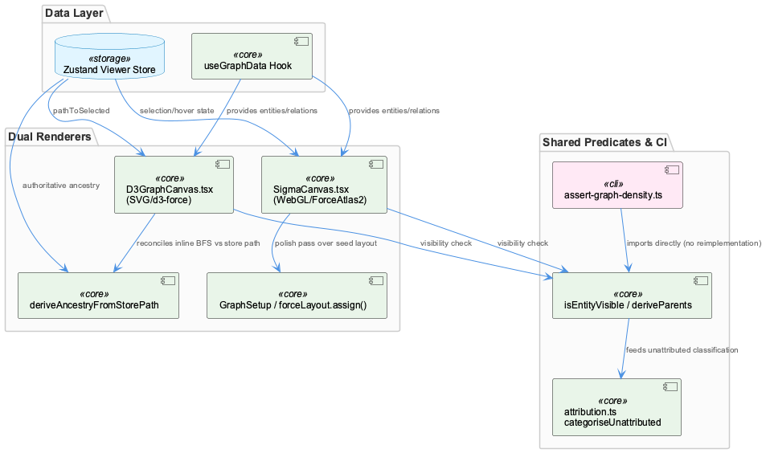
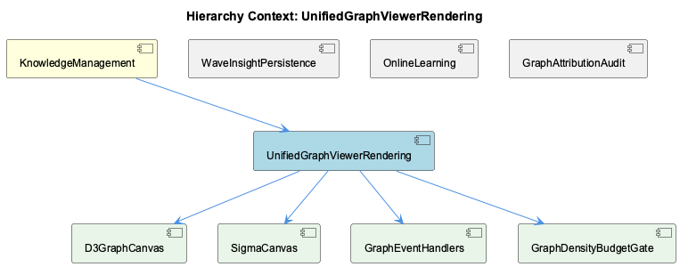

# UnifiedGraphViewerRendering

**Type:** SubComponent

# UnifiedGraphViewerRendering

## What It Is

UnifiedGraphViewerRendering is implemented in `integrations/unified-viewer/src/graph/`, and it is best understood not as a single renderer but as an umbrella over two deliberately independent rendering backends: `D3GraphCanvas.tsx` (SVG, via `d3.forceSimulation`) and `SigmaCanvas.tsx` (WebGL, via `@react-sigma/core` and a graphology-layout-force polish pass). Both children read from the same `useGraphData` hook and the Zustand viewer-store, but each computes its own derived visual state — ancestry traces, node visibility — through separate code paths. A CI health-check gate, `assert-graph-density.ts` (the script behind the `GraphDensityBudgetGate` entity), and an attribution taxonomy in `attribution.test.ts` round out the component by enforcing invariants that the renderers themselves must not violate.

## Architecture and Design

The defining decision here is the dual-renderer strategy pattern: SigmaCanvas and D3GraphCanvas implement the same rendering contract against divergent engines, not as a migration-in-progress but as a permanent trade-off. D3GraphCanvas's header explains the reasoning directly — it is a deliberate port of memory-visualizer's `GraphVisualization.tsx`, kept because every attempt to reproduce that tool's `d3.forceLink(150)/d3.forceManyBody(-500)` look using Sigma plus graphology-layout-* "drifted further from the reference." Fidelity to a prior tool's visual behavior, in other words, outweighed the cost of maintaining two rendering stacks.

Within SigmaCanvas, `GraphSetup` layers a short, low-repulsion graphology-layout-force "polish pass" (repulsion:5, attraction:0.001, gravity:0.0, maxIterations:100) on top of a deterministic hierarchical seed layout from `buildGraph()` (System at origin, Projects ringed around it, per-Project discs). This is a structural-vs-cosmetic separation: an aggressive force layout would "destroy the cluster structure," so the force pass is tuned only to de-overlap nodes within a disc. That same separation is enforced at the effect level — the layout-rebuilding `useEffect` (keyed on entities/relations/ontology/theme) is kept apart from a selection/hover reducer effect, an audit-locked invariant documented in-code as "Contract #3," specifically so clicking a node cannot restart the simulation.

A second pattern is shared-predicate extraction to prevent drift. `assert-graph-density.ts` imports `isEntityVisible` and `deriveParents` directly from `src/graph/` rather than reimplementing them, because the visibility rule is an "eleven-field rule that has already drifted once" — the footer diverged from the canvas in five ways, and `useGraphVisibility` diverged in a sixth. This tight coupling between the CI gate and internal viewer modules is by design, trading black-box test isolation for drift prevention.

## Implementation Details

`deriveAncestryFromStorePath` in D3GraphCanvas.tsx is the component's clearest reconciliation mechanism: it compares an inline BFS (`computeAncestryPath`) computed by the D3 renderer against a store-authoritative `pathToSelected` set written by every writer of `selectedNodeId` (graph click, history click, timeline tick). When the two disagree, the function prunes the inline BFS output down to store membership rather than trusting either computation — a fix traced to audit finding S3 ("duplicated source-of-truth") in the `b29bdb34c` state-flow audit. This exists precisely because maintaining D3GraphCanvas and SigmaCanvas as parallel implementations previously let visual selection state diverge between them.

`GraphSetup`'s `forceLayout.assign()` polish pass and its dependency-partitioned effects (child: SigmaCanvas) are the WebGL-side implementation detail; the event wiring for that setup calls `makeEventHandlers`, imported from a sibling `./events` module — the likely implementation site for the `GraphEventHandlers` entity, though its internals weren't directly observed.

`categoriseUnattributed`, tested in `attribution.test.ts`, implements a four-category taxonomy (`recordedParent`, `wrongClass`, `danglingRef`, `unclaimed`) for why a visible node lacks a project root, asserted mutually exclusive. Notably, when a recorded parent name resolves to two rooted entities — a "twin," true for 40 of 98 live cases — the classifier withholds a placement suggestion rather than guess, treating ambiguity as equivalent to no match.

`assert-graph-density.ts` (child: GraphDensityBudgetGate) walks every visible node's parent chain via `rootOf`/`categoriseUnattributed`/`CATEGORY_LABEL`, tallying unrooted nodes separately and failing hard (`unrooted > 0`) rather than treating them as budget exemptions — a correction of an earlier bug where 201 of 202 "projects" were actually unparented rows. The script also documents a subtler regression: seeding `selectedClasses` as an empty Set produced a false PASS with zero rendered nodes, because empty-Set reads as "nothing visible" in this predicate, inverting the empty-means-all convention used elsewhere in the same filter object.

## Integration Points

Both child renderers integrate with `useGraphData` and the Zustand viewer-store as their shared upstream data source, but the rendering layer is a pure consumer of that data's correctness — per the Wave Insight Persistence record (parent: KnowledgeManagement, sibling: WaveInsightPersistence), when 73 Wave 4 insight documents were written without corresponding Insight-typed graph nodes, no defensive logic in the canvas components could compensate; the History sidebar's strict `entityType === 'Insight'` filter simply left them invisible. This is a hard integration boundary: the renderer trusts whatever entityType the write path assigned.

The sibling GraphAttributionAudit is effectively the audit-side counterpart of `assert-graph-density.ts`'s attribution walk, sharing the same `rootOf`/`categoriseUnattributed` imports. The Viewer Data Contract Repair work record further notes that entity source enrichment previously diverged between CLI tooling and the viewer's evidence preview panel (docsOnly/edgesOnly/noSource buckets computed inconsistently), requiring alignment across both consumers of km-core data — another instance of the same drift-prevention theme seen in the visibility-predicate extraction.

## Usage Guidelines

Developers touching either renderer must preserve the effect-partitioning contract in SigmaCanvas: never merge the layout-rebuilding effect with the selection/hover reducer effect, since this is an audit-locked invariant ("Contract #3") preventing simulation restarts on click. Any change to visibility or ancestry logic should go through the shared `isEntityVisible`/`deriveParents` module and `deriveAncestryFromStorePath`, not a local reimplementation — the codebase's history shows this rule has already drifted six ways across footer, canvas, and `useGraphVisibility`. When writing tests or CI checks against graph density, always seed `selectedClasses` with the app's actual "all classes present" default, never an empty Set, to avoid a false PASS. Finally, any new entity-generation pathway must create corresponding graph nodes with correct `entityType` values, since the rendering layer has no mechanism to recover documents that exist without them.

## Work Record

What working sessions recorded about this entity — decisions taken, problems hit, and why things are the way they are:

- The Wave Insight Persistence work record establishes that the History sidebar UI filters strictly on entityType 'Insight', which made Wave 4's 73 generated insight documents invisible to graph-based views because zero corresponding Insight-typed graph nodes were created — a divergence between document generation and graph-node creation that the rendering layer's node-type filtering cannot detect or work around, since it consumes whatever entityType the write path assigned.
- The Viewer Data Contract Repair work record establishes that entity source enrichment was inconsistent between CLI tooling and the viewer's evidence preview panel, with entities falling into 'docsOnly', 'edgesOnly', or 'noSource' buckets that the two consumers of km-core data did not compute the same way — meaning the same rendered node could show different source attribution depending on which tool queried it, until a multi-phase repair aligned the enrichment logic across both.

## Hierarchy Context

### Parent
- [KnowledgeManagement](./KnowledgeManagement.md) -- [SESSION] Wave Insight Persistence work record establishes that Wave 4 wrote 73 insight documents but zero Insight graph nodes, because the History sidebar filters strictly to entityType 'Insight' — documents alone are invisible to graph queries

### Children
- [D3GraphCanvas](./D3GraphCanvas.md) -- [CGR] D3GraphCanvas (function) in D3GraphCanvas.tsx
- [SigmaCanvas](./SigmaCanvas.md) -- [CGR] SigmaCanvas (function) in SigmaCanvas.tsx
- [GraphEventHandlers](./GraphEventHandlers.md) -- [LLM] The code files supplied do not contain a component, file, class, or function named "GraphEventHandlers" anywhere. The closest artifact is `makeEventHandlers` in SigmaCanvas.tsx:145-152, which is imported from a sibling module `./events` (i.e. presumably `integrations/unified-viewer/src/graph/events.ts`) but whose implementation is never shown — only its call site inside `GraphSetup`'s data-load `useEffect`. Everything below is therefore inferred from that call site plus the parent observations, not from reading the handler module itself.
- [GraphDensityBudgetGate](./GraphDensityBudgetGate.md) -- [LLM] No code in the supplied files implements or is named 'GraphDensityBudgetGate'. The closest artifact — integrations/unified-viewer/scripts/assert-graph-density.ts — is a standalone CLI health-check script, not a component class, hook, or React module named GraphDensityBudgetGate. Its own header explicitly documents a rename history ('this file used to be called assert-aggregated-node-budget.ts') that never produced a name resembling 'GraphDensityBudgetGate', suggesting the requested entity is either a higher-level wrapper (e.g. a health-check registration, a dashboard-side gate consumer, or a CI job definition) that was not retrieved, or a name coined at the knowledge-graph/documentation layer to describe this script's function rather than a literal identifier in the codebase.

### Siblings
- [WaveInsightPersistence](./WaveInsightPersistence.md) -- [SESSION] Wave Insight Persistence work record establishes that Wave 4 wrote 73 insight documents but zero Insight graph nodes, because the History sidebar filters strictly to entityType 'Insight' — documents alone are invisible to graph queries.
- [OnlineLearning](./OnlineLearning.md) -- [LLM] The supplied files (ukb-workflow-modal.tsx, assert-graph-density.ts, D3GraphCanvas.tsx, SigmaCanvas.tsx, attribution.test.ts) belong to viewer/dashboard infrastructure and testing scaffolding, not to any 'OnlineLearning' component. None of the classes/functions define online/incremental learning logic, learning-rate parameters, model updates, or training loops.
- [GraphAttributionAudit](./GraphAttributionAudit.md) -- [LLM] assert-graph-density.ts (integrations/unified-viewer/scripts/assert-graph-density.ts) is the executable form of the graph attribution audit: it imports `rootOf`, `categoriseUnattributed`, and `CATEGORY_LABEL` from '@/graph/attribution' and walks every currently-visible node's parent chain to determine which Project or System it lands under, tallying nodes that resolve to no root separately (`unrooted`) rather than folding them into a pseudo-project. The script's own comments record that an earlier version of this walk reported '1/202 projects over budget' when 201 of those 'projects' were actually single unparented rows — the unrooted count is checked as `unrooted > 0` in `overBudget`, treating any free-floating node as a hard failure of the hierarchy rather than an exemption from the per-project node budget.

---

*Generated from 10 observations*
