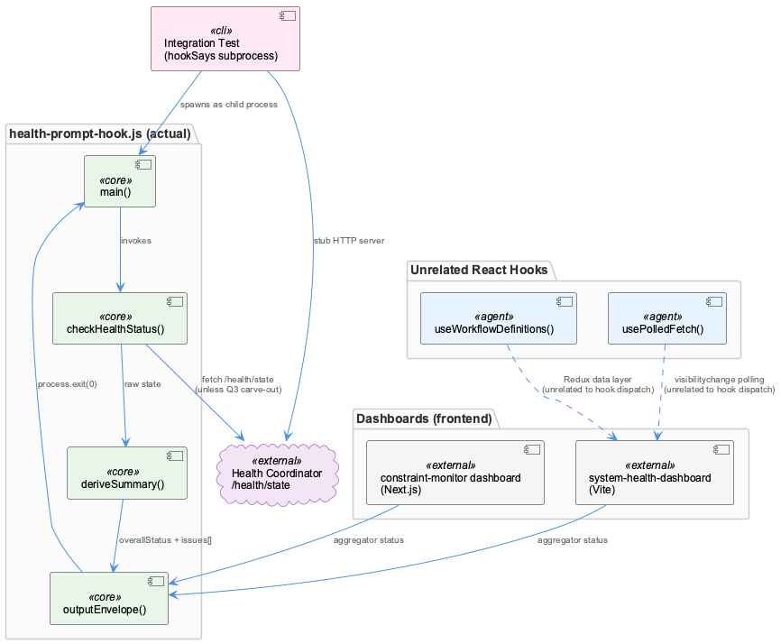
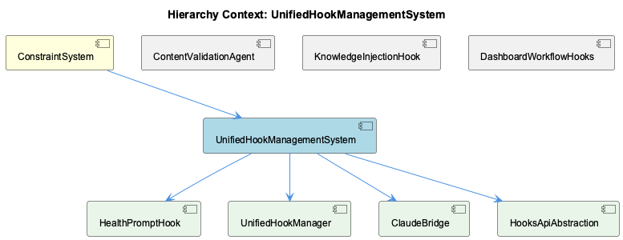

# UnifiedHookManagementSystem

**Type:** SubComponent

## What It Is

The retrieved observations do not substantiate a distinct "UnifiedHookManagementSystem" implementation. What the retrieval actually surfaces is `scripts/health-prompt-hook.js` — a single-purpose `UserPromptSubmit` hook — plus a scattering of unrelated files (dashboard React hooks in `integrations/system-health-dashboard/src/components/workflow/hooks.ts` and `src/hooks/usePolledFetch.ts`, and a CLI feature-gate test in `tests/features/cli-and-rules-gating.test.mjs`) that match on the word "hook" but implement none of the registration/dispatch machinery (`hook-config.js`, `hook-manager.js`, `registerHandler()`, `UnifiedHookManager.loadConfig()`) that the parent context attributes to this component. Every child entity retrieval (HealthPromptHook, ClaudeBridge, HooksApiAbstraction) independently confirms the same gap: no dispatch table, no handler interface, no bridging logic to Claude's tool-calling layer was found in the files provided.

## Architecture and Design

Not documented in the available observations — the architectural patterns described (fail-open exit contract, Q3 environment carve-out, status-reduction summary pattern) belong to `health-prompt-hook.js`/HealthPromptHook specifically, not to a unifying management layer.

## Implementation Details

Not documented in the available observations for this component itself.

## Integration Points

Not documented in the available observations for this component itself; what is documented (HealthPromptHook feeding the tmux statusline click-report and constraint-monitor dashboard under ConstraintSystem) pertains to a sibling/child, not to UnifiedHookManagementSystem's own integration surface.

## Usage Guidelines

Not documented in the available observations.

INSUFFICIENT_EVIDENCE: The retrieved files implement HealthPromptHook (health-prompt-hook.js) and unrelated dashboard/CLI code, not the UnifiedHookManagementSystem's own dispatch/registration logic (hook-config.js, hook-manager.js, registerHandler(), loadConfig()) described by the parent context.

## Work Record

What working sessions recorded about this entity — decisions taken, problems hit, and why things are the way they are:

- The tmux Statusline Copy-Mode / Mouse Configuration record and Tmux Pane Badge — ETM Entry Selection Logic record are both filed under HookManagementSystem, indicating this component's scope extends beyond agent tool hooks into tmux pane/statusline click-hook wiring.
- The Statusline Click-Report Feature record establishes that clicking the 'constraints' field in the tmux statusline opens or focuses the constraint-monitor dashboard tab, which ties the hook/violation-capture backend directly to a frontend affordance living outside the dashboard itself. This means the effective surface area of hook-driven constraint enforcement includes the statusline click-handling code even though none of that code is present in the files retrieved for this component.
- The HealthDashboard architecture record establishes that the constraint-monitor dashboard (Next.js) and system-health-dashboard (Vite) are both reachable through the shared health-prompt-hook.js status aggregator — the one file in this retrieval that actually exists on disk and matches a component name. This is the strongest evidence that 'UnifiedHookManagementSystem' as described in the parent context (hook-config.js, hook-manager.js, registerHandler(), UnifiedHookManager.loadConfig()) is a distinct module from health-prompt-hook.js, which implements only a single UserPromptSubmit hook rather than a dispatch/registration system.

## Diagrams

## Hierarchy Context

### Parent
- [ConstraintSystem](./ConstraintSystem.md) -- [SESSION] The Statusline Click-Report Feature record establishes that clicking the 'constraints' field in the tmux statusline opens or focuses the constraint-monitor dashboard tab, tying ConstraintSystem violation state directly into the click-driven statusline UX

### Children
- [HealthPromptHook](./HealthPromptHook.md) -- [LLM] scripts/health-prompt-hook.js:main() is built around a single invariant stated in its own header comment — 'The hook MUST always process.exit(0) so Claude never blocks on errors' — and every code path honours it literally: the outer try/catch calls outputEnvelope('') and exits 0 on a JSON.parse failure of stdin, checkHealthStatus() never throws (it swallows fetch failures into an 'unknown' status object instead), and even the top-level main().catch() handler at the bottom of the file repeats the same outputEnvelope('')+exit(0) sequence as a last-ditch fallback. This triple-redundant error handling (inner try/catch, checkHealthStatus's own try/catch, and the outer .catch()) shows the author treating 'never block Claude' as a correctness property worth defending at three separate layers rather than a single top-level guard.
- [UnifiedHookManager](./UnifiedHookManager.md) -- [CGR] UnifiedHookManager (class) in hook-manager.js
- [ClaudeBridge](./ClaudeBridge.md) -- [LLM] None of the four retrieved files implement, import, or reference anything named 'ClaudeBridge'. scripts/health-prompt-hook.js implements a single UserPromptSubmit hook contract (readStdin → checkHealthStatus → deriveSummary → outputEnvelope) with no bridging logic to Claude's tool-calling layer, no message translation, and no API adapter code — it only emits a fixed-shape JSON envelope ({ hookSpecificOutput: { hookEventName, additionalContext } }) to stdout for Claude Code's hook runner to consume.
- [HooksApiAbstraction](./HooksApiAbstraction.md) -- [LLM] None of the four retrieved files implement anything resembling an 'API abstraction' over hooks — there is no registration table, no handler interface, and no dispatch loop. scripts/health-prompt-hook.js is a single-purpose script hard-wired to one hook event ('UserPromptSubmit'): main() calls checkHealthStatus() and outputHealthContext() directly, with no indirection layer a caller could register additional hook types against. If a 'HooksApiAbstraction' component exists in this codebase as a distinct module (e.g. hook-config.js or hook-manager.js per the parent context's UnifiedHookManager.loadConfig()/registerHandler() description), it was not returned by this retrieval.

### Siblings
- [ContentValidationAgent](./ContentValidationAgent.md) -- [SESSION] The obs-api Service Lifecycle and Dev Workflow Resumption record establishes that a coverage metric in obs-api computes a ratio whose denominator should exclude 'observations' and 'digests' entity types but currently includes them, skewing reported coverage.
- [HealthPromptHook](./HealthPromptHook.md) -- [SESSION] The HealthDashboard record establishes that health-prompt-hook.js is the 'status aggregator' feeding the tmux statusline click-report integration alongside the constraint-monitor dashboard.
- [KnowledgeInjectionHook](./KnowledgeInjectionHook.md) -- [LLM] None of the supplied code files implement, import, or reference a `KnowledgeInjectionHook` entity. `scripts/health-prompt-hook.js` is a `UserPromptSubmit` hook whose entire job is fetching `/health/state` from the host health-coordinator and reducing it to a one-line status string (`deriveSummary()`, `outputHealthContext()`) — it injects a health summary, not knowledge-base content, into the prompt context. The parent context's own description of knowledge injection lives in `lib/agent-api/hooks/hook-config.js` and `hook-manager.js` (per the parent's [LLM] observations), and neither file appears anywhere in the Code Files provided here.
- [DashboardWorkflowHooks](./DashboardWorkflowHooks.md) -- [LLM] useWorkflowDefinitions in integrations/system-health-dashboard/src/components/workflow/hooks.ts is the actual implementation of a 'dashboard workflow hook': it reads nine Redux selectors (selectAgents, selectOrchestrator, selectEdges, selectStepMappings, selectStepToSubStep, selectAgentSubSteps, selectWorkflowConfigLoading, selectWorkflowConfigError, selectWorkflowConfigInitialized) from workflowConfigSlice and merges them with static fallback constants (WORKFLOW_AGENTS, ORCHESTRATOR_NODE, MULTI_AGENT_EDGES, STEP_TO_AGENT, STEP_TO_SUBSTEP, AGENT_SUBSTEPS). The merge order is deliberate: API data takes precedence for agents/orchestrator/edges (`agents?.length > 0 ? agents : WORKFLOW_AGENTS`) but constants are spread FIRST for the three mapping objects (`{ ...STEP_TO_AGENT, ...(stepToAgent || {}) }`), so a partial API response can never leave a step unmapped — the code comment calls out 'operator_* → kg_operators' as the critical mapping constants must never lose.

---

*Generated from 11 observations*
