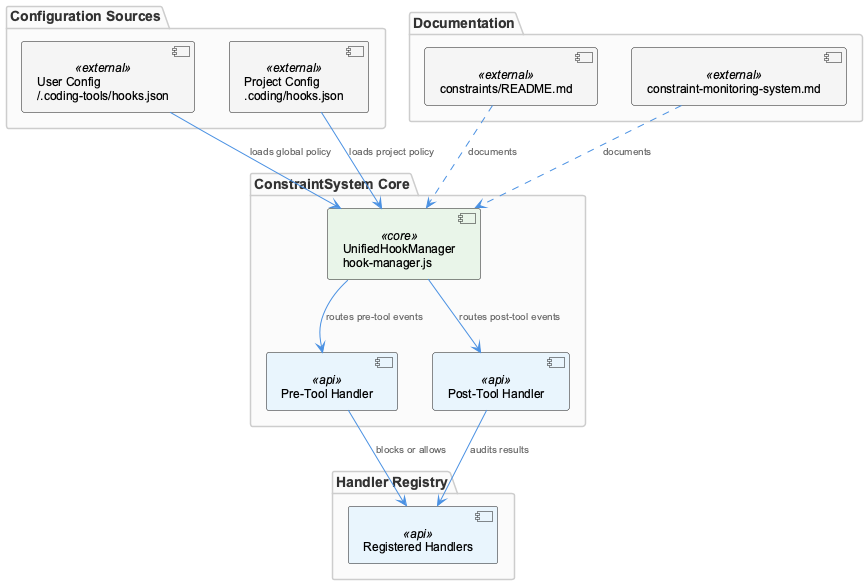
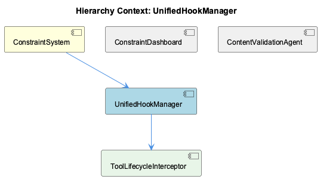

# UnifiedHookManager

**Type:** SubComponent

docs/constraints/README.md and docs/constraints/constraint-monitoring-system.md both document the hook pipeline, indicating UnifiedHookManager is the primary architectural entry point for the entire ConstraintSystem

# UnifiedHookManager — Technical Reference

## What It Is

UnifiedHookManager is implemented at `lib/agent-api/hooks/hook-manager.js` and functions as the single interception point for all agent tool lifecycle events within the ConstraintSystem. Its role is not merely coordination — it is the architectural entry point through which every tool invocation during a Claude Code session passes before execution and after completion. This centralized position is deliberate: rather than distributing constraint logic across individual tools or handlers, the system funnels all lifecycle events through one manager, ensuring consistent policy enforcement regardless of which tool is active.

The component is documented across two dedicated references — `docs/constraints/README.md` and `docs/constraints/constraint-monitoring-system.md` — which reflects its significance as the primary structural seam of the entire ConstraintSystem. Understanding UnifiedHookManager is effectively understanding how constraints are applied at runtime.

## Architecture and Design

The architectural approach centers on a **registration model**: handlers declare the event types they subscribe to, and the manager routes incoming lifecycle events to the appropriate registered handlers. This separates the routing concern (owned by UnifiedHookManager) from the enforcement concern (owned by individual handlers), allowing constraint policies to be added, removed, or modified without altering the core interception path.

The manager distinguishes at minimum two event phases: **pre-tool** and **post-tool**. This phased design encodes a meaningful policy distinction. Pre-tool hooks carry blocking authority — a handler can prevent an operation from executing at all, which is the enforcement mechanism for hard constraints. Post-tool hooks serve an auditing function, capturing results and outcomes after the fact without the ability to reverse execution. This asymmetry is a deliberate design trade-off: pre-tool enforcement is synchronous and blocking by necessity, while post-tool auditing can be treated as a side effect pipeline.

The child component ToolLifecycleInterceptor implements the centralized interceptor pattern described in the architecture, reinforcing that the design intentionally avoids per-tool hook registration. Instead of each tool managing its own lifecycle callbacks, a single interceptor captures all events and delegates upward to UnifiedHookManager for routing and handler dispatch.

## Implementation Details

Hook configuration is loaded from two scopes. User-level configuration lives at `~/.coding-tools/hooks.json`, establishing global constraint policies that apply across all projects for a given user. Project-level configuration lives at `.coding/hooks.json`, allowing per-repository overrides or additions. The manager loads both, enabling a layered policy model where project constraints can extend or specialize the user-level baseline.

The registration model means that `hook-manager.js` maintains a mapping from event types to handler collections. When a lifecycle event fires, the manager identifies the event phase (pre-tool, post-tool, or others potentially defined), looks up the registered handlers for that phase, and dispatches in sequence. The blocking semantics of pre-tool events imply that handler dispatch for that phase must be synchronous or at least await-capable — a handler returning a violation or rejection must halt the pipeline before tool execution proceeds.

ToolLifecycleInterceptor sits below the manager in the component hierarchy and is responsible for the actual interception mechanics — capturing tool invocations from the agent API layer and surfacing them as typed lifecycle events that UnifiedHookManager can route. This separation keeps the interception plumbing distinct from the routing and handler-dispatch logic.

## Integration Points

Within the ConstraintSystem parent, UnifiedHookManager is the operational hub connecting the agent API layer (through ToolLifecycleInterceptor) to the constraint enforcement handlers and, downstream, to violation persistence. Violations detected during pre-tool or post-tool phases are persisted to `.mcp-sync/violation-history.json`, the shared sync file that ConstraintDashboard reads for historical analysis. UnifiedHookManager therefore sits upstream of the dashboard's data source — every violation surfaced in ConstraintDashboard has passed through this manager's pipeline first.

The sibling component ContentValidationAgent operates independently of the hook pipeline, using git history as a staleness signal rather than intercepting live tool events. However, both ContentValidationAgent and UnifiedHookManager feed into the same ConstraintSystem, meaning their respective violation signals converge at the persistence and dashboard layer.

The two configuration files (`~/.coding-tools/hooks.json`, `.coding/hooks.json`) represent the primary external interface for operators and developers. These files control which handlers are registered and what policies are active, making them the configuration surface through which the manager's behavior is customized without code changes.

## Usage Guidelines

Developers extending the constraint pipeline should register handlers through the configuration files rather than modifying `hook-manager.js` directly. The registration model exists precisely to keep the core routing logic stable while allowing handler composition to vary per user or project. A handler must declare its target event phase explicitly — conflating pre-tool and post-tool semantics will produce incorrect behavior, since only pre-tool handlers have blocking authority.

When writing pre-tool handlers, blocking must be treated as a definitive signal. The pipeline design implies that a rejection from any pre-tool handler should prevent execution; handlers should not assume other handlers will compensate for a permissive response. Post-tool handlers, by contrast, should be written defensively — they receive results after the fact and cannot undo execution, so they are best suited for logging, auditing, and feeding violation records downstream to the `.mcp-sync/violation-history.json` file consumed by ConstraintDashboard.

Project-level configuration at `.coding/hooks.json` takes effect alongside user-level configuration at `~/.coding-tools/hooks.json`. Developers should be aware that both scopes are active simultaneously; project policies do not automatically supersede global ones unless the handler logic itself encodes that precedence. When diagnosing unexpected constraint behavior, both configuration files should be inspected as a first step, since the effective handler set is the union of both scopes as loaded by `hook-manager.js`.

## Hierarchy Context

### Parent
- [ConstraintSystem](./ConstraintSystem.md) -- The ConstraintSystem is a multi-layered enforcement framework that validates code actions and file operations during Claude Code sessions. It operates through a hook-based architecture where the UnifiedHookManager (lib/agent-api/hooks/hook-manager.js) intercepts agent tool events (pre-tool, post-tool, etc.) and routes them through registered handlers loaded from user-level (~/.coding-tools/hooks.json) and project-level (.coding/hooks.json) configuration files. Violations detected during these checks are captured, persisted, and surfaced through a dashboard for monitoring.

### Children
- [ToolLifecycleInterceptor](./ToolLifecycleInterceptor.md) -- Based on the SubComponent context, hook-manager.js at lib/agent-api/hooks/hook-manager.js is described as 'the single interception point for all agent tool lifecycle events', indicating a centralized interceptor pattern rather than per-tool hook registration.

### Siblings
- [ConstraintDashboard](./ConstraintDashboard.md) -- ConstraintDashboard reads violation data from .mcp-sync/violation-history.json, a shared sync file that persists violations across Claude Code sessions for historical analysis
- [ContentValidationAgent](./ContentValidationAgent.md) -- ContentValidationAgent uses git history as a staleness signal, comparing recorded entity observations against recent commits to flag observations that predate significant file changes

---

*Generated from 5 observations*
