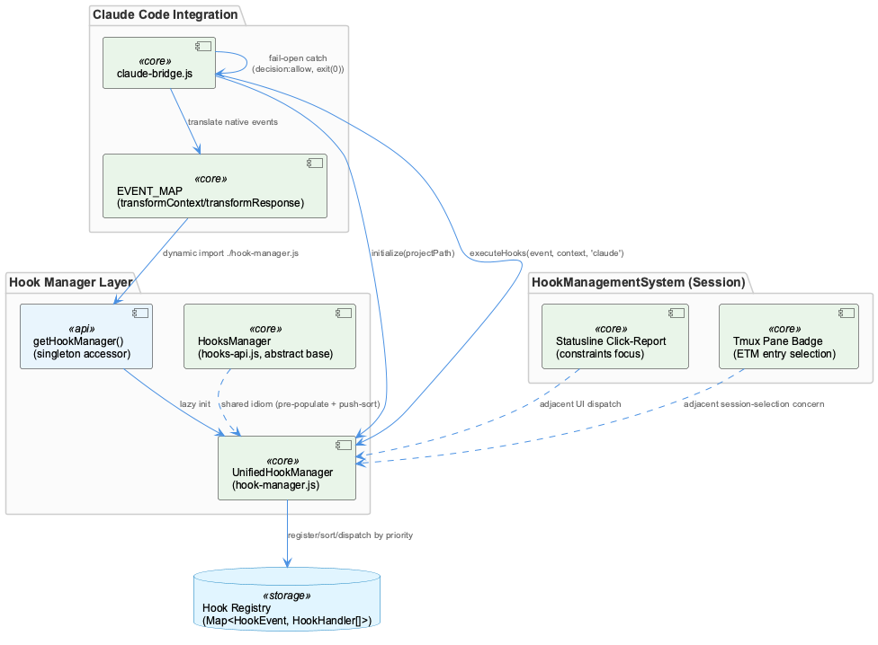
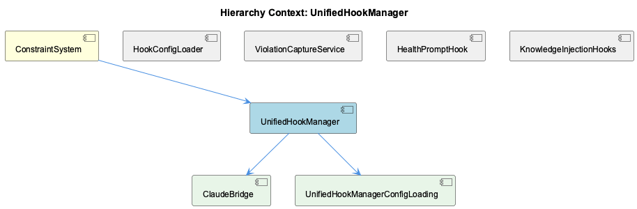

# UnifiedHookManager

**Type:** SubComponent

[Code References] lib/agent-api/hooks/hook-manager.js - UnifiedHookManager.registerHandler(): duplicate-ID find-and-replace plus sort-on-every-register; lib/agent-api/hooks/hook-manager.js - UnifiedHookManager.executeHooks(): enabled/agents filtering and dual stopOnError checks; lib/agent-api/hooks/hook-manager.js - UnifiedHookManager.loadConfig(): user-then-project config layering; lib/agent-api/hooks-api.js - HooksManager.registerHook(): always-push registration with no duplicate-ID guard; lib/agent-api/hooks-api.js - HooksManager.triggerHook(): fail-open per-handler try/catch loop; lib/agent-api/hooks/claude-bridge.js - main(): fail-open catch block forcing decision:'allow' and process.exit(0) on any error; lib/agent-api/hooks/claude-bridge.js - transformContext(): Claude-native to unified event/context translation via EVENT_MAP; lib/agent-api/hooks/migration-tool.js - writeUnifiedConfig(): direct JSON file write bypassing UnifiedHookManager's dedup path; lib/agent-api/hooks/migration-tool.js - migrateClaudeHooks()/migrateCopilotHooks(): Date.now()-suffixed handler IDs that break idempotent re-migration

# UnifiedHookManager — Technical Insight Document

## What It Is

UnifiedHookManager is a class implemented in `lib/agent-api/hooks/hook-manager.js` that serves as the runtime core of the ConstraintSystem's hook execution machinery. It maintains a `Map<event, HookHandler[]>` registry (`handlers`) and exposes `registerHandler()`, `unregisterHandler()`, `executeHooks()`, and `loadConfig()` as its primary interface. As a child of ConstraintSystem, it is responsible for the actual in-memory registration and dispatch logic that operationalizes the layered configuration described by its sibling `HookConfigLoader` — that is, once `HookConfigLoader` resolves the two-tier merge between `~/.coding-tools/hooks.json` and `.coding/hooks.json`, UnifiedHookManager is what turns that resolved configuration into live, invocable handlers.

## Architecture and Design

The dominant pattern is a central dispatch/mediator design: rather than handlers subscribing directly to their event sources, everything routes through UnifiedHookManager's single `Map<event, handler[]>`, mirrored structurally by the sibling `HooksManager` in `lib/agent-api/hooks-api.js`. Execution strategy is selected per-handler via a Strategy pattern inside `executeHandler()`, which switches on `handler.type` (`script`/`command`/`module`).

Configuration precedence is enforced not through explicit merge logic but through call order: `loadConfig()` is invoked once for user config and again for project config, relying entirely on `registerHandler()`'s idempotent upsert behavior (`findIndex` matching on `id`, replacing in place rather than appending) to realize the override semantics that `HookConfigLoader`'s parent-level `mergeConfigs()` conceptually describes. This is an elegant reuse of one mechanism (dedup-by-ID) to satisfy two purposes (reload-safety and config layering), but it also means the override guarantee is only as strong as ID stability — a fragile, implicit contract rather than an explicit one.

Bridge components like `claude-bridge.js` further layer an Adapter/Bridge pattern on top, translating agent-native event formats (`PreToolUse`, `sessionStart`) into the unified vocabulary (`pre-tool`, `startup`) via `EVENT_MAP` tables, and defer manager instantiation via dynamic `import('./hook-manager.js')` until the bridge process actually runs.

## Implementation Details

`registerHandler()` computes `existingIndex = eventHandlers.findIndex(h => h.id === id)` and overwrites the existing slot when a match is found, otherwise pushes a new entry; every call — replace or push — is followed by a full re-sort of the event's handler array by `priority`. This gives correct ordering at the cost of an O(n log n) re-sort per registration; since `loadConfig()` iterates `Object.entries(config.hooks)` in a nested loop calling `registerHandler()` once per handler, a large `hooks.json` produces a quadratic-ish re-sort cost during `initialize()` — tolerable at current scale (tens of entries) but a latent scalability concern.

`executeHooks()` applies two sequential filters before invoking `executeHandler()`: an `enabled` flag check and an `agents` allowlist check (`handler.agents?.length > 0 && !handler.agents.includes(fullContext.agentType)`). Both filters run at execution time rather than registration time, meaning disabled or agent-mismatched handlers still occupy memory and still participate in every priority sort — a design choice that trades a small memory/CPU cost for simplicity. The `stopOnError` setting is checked twice in the same loop — once after a non-throwing handler returns `{error: ...}`, once inside the `catch` block for a thrown exception — a duplication indicating the two failure modes were patched independently rather than unified, creating drift risk if stop-on-error semantics change.

Fail-open error handling is pervasive: `claude-bridge.js`'s `main()` converts any thrown error into `{decision: 'allow', message: 'Hook bridge error: ...'}` followed by `process.exit(0)`, ensuring a crashing bridge can warn but never block a tool call.

## Integration Points

UnifiedHookManager sits beneath ConstraintSystem alongside siblings `HookConfigLoader`, `ViolationCaptureService`, `ContentValidationAgent`, `KnowledgeInjectionHooks`, and `HealthPromptHook`. Its most consequential relationship is its structural duplication with `HooksManager` in `hooks-api.js`: both maintain nearly identical Map-based registries, priority-sort-on-register logic, and fail-open try/catch execution loops, but `HooksManager.registerHook()` always `push`es with no duplicate-ID guard — the safety property unique to UnifiedHookManager. No shared base class or delegation exists between them, as also independently noted by sibling `ContentValidationAgent`'s observations.

`migration-tool.js`'s `writeUnifiedConfig()` bypasses UnifiedHookManager entirely, writing raw JSON directly via `fs.mkdir`/`JSON.stringify` rather than calling `registerHandler()`, and generates `Date.now()`-suffixed handler IDs — meaning migrated configs lack the runtime dedup guarantee and re-running `coding migrate-hooks --force` appends duplicates rather than replacing them.

## Usage Guidelines

Handlers must supply a stable, caller-assigned `id` — omitting it triggers the fallback `${event}-${handler.type}-${Date.now()}` ID scheme, which silently defeats reload-safe deduplication and reintroduces duplicate-handler bugs across config reloads. When debugging "why didn't my hook run," check both the `enabled` flag and the `agents` allowlist filter in `executeHooks()`, since a handler scoped to `agents: ['claude']` will never fire under Copilot even when globally registered. Any fix to duplicate-ID handling, priority sorting, or stop-on-error semantics in UnifiedHookManager should be cross-checked against `HooksManager` in `hooks-api.js`, since the two implementations are unlinked and can drift. Finally, treat migration-tool output as a one-way, non-idempotent operation until it is routed through UnifiedHookManager's API — repeated migrations should be followed by manual verification of `hooks.json` for duplicate entries.

## Code Evidence

Key code artifacts grounding this entity's analysis:

**Structural:**
- UnifiedHookManager (class) in hook-manager.js

**Relationships:**
- Every call to registerHandler() re-sorts the full eventHandlers array with `eventHandlers.sort((a, b) => a.priority - b.priority)` immediately after either replacing or pushing a handler, confirming the parent's O(n log n)-per-registration tradeoff. Because loadConfig() iterates `Object.entries(config.hooks)` and calls registerHandler() once per handler in a nested loop, a hooks.json with many handlers for the same event triggers N re-sorts of a growing array during a single initialize() call — acceptable at typical hook-file sizes (tens of entries) but a quadratic-ish cost pattern if hook counts ever scale into the hundreds.

**Other:**
- UnifiedHookManager (lib/agent-api/hooks/hook-manager.js) implements registerHandler() with an in-place duplicate-ID replacement: it computes `existingIndex = eventHandlers.findIndex(h => h.id === id)` and overwrites that array slot rather than appending when the ID already exists in the `handlers` Map<event, HookHandler[]>. This directly confirms the parent observation about reload-safety — a project's .coding/hooks.json changing mid-session and being re-loaded via `loadConfig()` will replace existing handlers rather than duplicate them, but only because the handler `id` is stable across reloads; if `handler.id` is omitted, the fallback `${event}-${handler.type}-${Date.now()}` generates a fresh ID every call, silently defeating the dedup logic and re-introducing the duplicate-handler bug the code appears to guard against.
- executeHooks() in UnifiedHookManager layers two independent filters ahead of execution — `if (!handler.enabled) continue` and `if (handler.agents?.length > 0 && !handler.agents.includes(fullContext.agentType)) continue` — before dispatching to executeHandler()'s type switch (`script`/`command`/`module`). This mirrors the parent's description of ContentValidationAgent-style generalized validation: the same manager that dispatches enforcement hooks also silently skips handlers scoped to a different agent, meaning a handler authored for `agents: ['claude']` never fires under Copilot even if registered globally — a filtering behavior that is easy to overlook when debugging 'why didn't my hook run.'
- The `stopOnError` setting (config.stopOnError, default false) is checked in two different ways across the same executeHooks() loop: once via `if (this.config.stopOnError && result.error) break` after a successful (non-throwing) handler execution, and again via `if (this.config.stopOnError) break` inside the `catch` block for a handler that actually threw. This duplication suggests the two failure modes (a handler that returns `{error: ...}` vs. one that throws) were patched in separately rather than unified through a single failure path, increasing the chance the two branches drift out of sync if stop-on-error semantics are changed in only one location.
- claude-bridge.js's main() function hard-codes a fail-open contract at the process-exit boundary: any error thrown during context transformation or manager.executeHooks() is caught and converted into `{decision: 'allow', message: 'Hook bridge error: ...'}` followed by `process.exit(0)`, so a crashing bridge script can never block a Claude tool call — it can only fail to warn. This is consistent with HookConfigLoader.validateConfig()'s lenient-warning stance noted in the parent context, extending the 'availability over strict correctness' philosophy from config validation all the way to runtime bridge execution.

## Hierarchy Context

### Parent
- [ConstraintSystem](./ConstraintSystem.md) -- [LLM] The ConstraintSystem's configuration architecture follows a strict two-tier layered merge pattern implemented in HookConfigLoader (lib/agent-api/hooks/hook-config.js). User-level configuration lives at ~/.coding-tools/hooks.json and represents global defaults applicable across all projects, while project-level configuration at .coding/hooks.json can override specific handlers or add project-specific constraints. The mergeConfigs() function performs this layering, meaning a new developer modifying constraint behavior needs to understand which file actually takes effect at runtime — project config wins on key collisions, but non-overlapping keys from both sources are preserved. This design allows teams to ship organization-wide constraints via user config while individual projects retain the ability to loosen or tighten specific rules without forking the entire config file.

### Siblings
- [HookConfigLoader](./HookConfigLoader.md) -- [CGR] HookConfigLoader (class) in hook-config.js
- [ViolationCaptureService](./ViolationCaptureService.md) -- [CGR] ViolationCaptureService (class) in violation-capture-service.js
- [ContentValidationAgent](./ContentValidationAgent.md) -- [LLM] Two structurally similar but separately-maintained hook managers exist in this codebase: the abstract `HooksManager` class in lib/agent-api/hooks-api.js and the concrete `UnifiedHookManager` in lib/agent-api/hooks/hook-manager.js. Both independently implement a `Map<event, Handler[]>` registry, both re-sort the per-event array by numeric `priority` on every registration (`registerHook` in hooks-api.js vs `registerHandler` in hook-manager.js), and both generate a fallback ID using `Date.now()` when the caller doesn't supply one. This duplication suggests `HooksManager` was intended as a generic base class that `UnifiedHookManager` should have extended, but the two evolved independently — a maintenance risk if the duplicate-ID replacement fix (present in `registerHandler`) or the priority-sort fix ever needs to be applied to only one of them.
- [KnowledgeInjectionHooks](./KnowledgeInjectionHooks.md) -- knowledge-injection-hook.js gates injection per-process via isInjectionEnabled(), reading CODING_KNOWLEDGE_INJECTION and treating only '0'/'false'/'off' (case-insensitive) as disabling, defaulting ON otherwise
- [HealthPromptHook](./HealthPromptHook.md) -- [LLM] [object Object]

---

*Generated from 11 observations*
