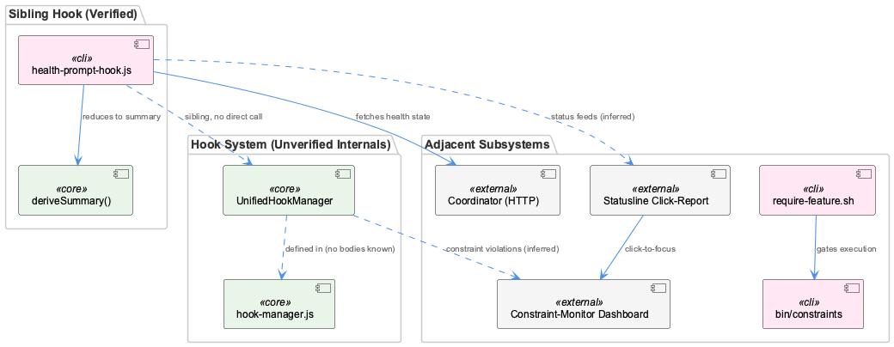
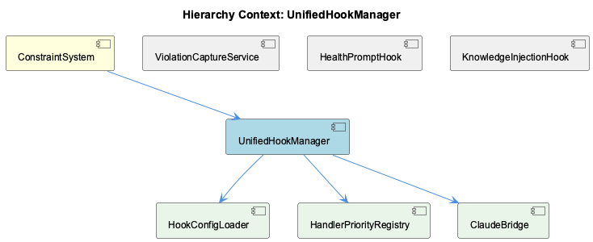

# UnifiedHookManager

**Type:** SubComponent

## What It Is

UnifiedHookManager is a class confirmed by code-graph reference (CGR) to exist in `hook-manager.js` (path referenced elsewhere as `lib/agent-api/hooks/hook-manager.js`). Beyond this bare class identity, this pass has no direct source access to the file: none of the supplied files in this batch — `scripts/health-prompt-hook.js`, its regression test, and two unrelated React "hooks" modules — implement or reference UnifiedHookManager, `HookEvent`, or `registerHandler`. Prior claims about its internals (a pre-seeded `Map<event, HookHandler[]>`, priority-based re-sorting in `registerHandler()`, equal-priority insertion-order fallback) are carried over from an earlier parent-record analysis and remain unverified in this pass.

## Architecture and Design

What can be said architecturally rests on the entity-relationship structure rather than verified source: UnifiedHookManager sits under parent ConstraintSystem and is described alongside siblings HookConfigLoader, ViolationCaptureService, HealthPromptHook, and KnowledgeInjectionHook. Notably, the relationship data shows an apparent inconsistency — HookConfigLoader is listed both as containing and contained by UnifiedHookManager — which should be treated as a data-quality flag rather than resolved architectural fact. Its children, HookConfigLoader, HandlerPriorityRegistry, and ClaudeBridge, suggest a design separating configuration loading, priority-based dispatch ordering, and an external bridge/adapter concern, but none of these children's internals were independently confirmed in this batch either.

The one architecturally grounded fact tying UnifiedHookManager into the wider system is behavioral: the Statusline Click-Report Feature establishes a live path from hook-handler enforcement (the kind UnifiedHookManager dispatches) to persisted violation data surfaced via the tmux statusline's "constraints" field, which opens the constraint-monitor dashboard on click. Any change to UnifiedHookManager's event set or dispatch order therefore has a downstream UX dependency through this click target.

## Implementation Details

No method signatures, event tables, or dispatch code for UnifiedHookManager were surfaced in this batch. What is available instead is contrast material from a sibling-adjacent script, `scripts/health-prompt-hook.js`, which is explicitly *not* UnifiedHookManager but is described as illustrating a different risk posture within the same "hooks" umbrella: it is fail-open (every path through `main()` and `main().catch()` ends in `process.exit(0)`), and its `deriveSummary()` implements SPEC R6 by refusing to collapse errors into "healthy," instead surfacing "unknown." This is contrasted with hook-manager.js's described (but unverified here) fail-soft config validation, where malformed entries reportedly degrade silently to a warning log — a materially different tolerance for silent failure than health-prompt-hook.js applies.

Care should be taken not to conflate these: the health-prompt-hook-stall regression test documents a real historical incident (a 31-hour observation-pipeline stall) and encodes green/amber status assertions, but this is evidence about HealthPromptHook's regression history, not UnifiedHookManager's handler-priority logic, despite living under the same directory naming convention.

## Integration Points

Structurally, UnifiedHookManager is declared to contain HookConfigLoader, HandlerPriorityRegistry, and ClaudeBridge, and to sit beneath ConstraintSystem alongside ViolationCaptureService, HealthPromptHook, and KnowledgeInjectionHook. The functional integration point that is actually evidenced is indirect: violation and health data produced downstream of hook dispatch feed a shared aggregator (`health-prompt-hook.js`) which in turn feeds two independently deployed frontends — a Next.js constraint-monitor dashboard and a Vite system-health-dashboard — and the statusline click path ties operator-visible violation inspection back to whatever UnifiedHookManager enforces at dispatch time.

No import, call, or config relationship between UnifiedHookManager and health-prompt-hook.js, hooks.ts, or usePolledFetch.ts was found in the supplied files; the co-location of "hooks" in filenames (health-prompt-hook.js, workflow/hooks.ts, hooks/usePolledFetch.ts) appears to be a retrieval artifact (filename substring match on "hooks") rather than a real dependency.

## Usage Guidelines

Given the evidence gap, the primary guideline is procedural: do not treat the React hooks (`useWorkflowDefinitions`, `usePolledFetch`) or `health-prompt-hook.js` as implementations of or stand-ins for UnifiedHookManager — they are naming collisions or sibling concerns, not this component. Developers extending UnifiedHookManager's event set or dispatch order should account for the downstream UX coupling through the statusline "constraints" click target, since that path depends on when/how violations get recorded. Any claims about registerHandler, priority sorting, or the Map<event, HookHandler[]> structure should be re-verified against `lib/agent-api/hooks/hook-manager.js` directly before being relied upon, since this document could only confirm the class's existence and location, not its method-level behavior.

## Code Evidence

Key code artifacts grounding this entity's analysis:

**Structural:**
- UnifiedHookManager (class) in hook-manager.js

## Work Record

What working sessions recorded about this entity — decisions taken, problems hit, and why things are the way they are:

- The Statusline Click-Report Feature record establishes that the tmux statusline's 'constraints' field opens or focuses the constraint-monitor dashboard tab on click, creating a direct path from live hook-handler enforcement (the kind UnifiedHookManager dispatches) to the persisted violation data an operator can inspect. Any change to UnifiedHookManager's event set or handler dispatch order that affects when/how violations are recorded has a downstream UX dependency through this click target.
- The HealthDashboard — Performance/System-Health/Token-Cost Dashboards record establishes that violation and health data are consumed by two independently built/deployed frontends (Next.js constraint-monitor dashboard and Vite system-health-dashboard), both fed by a shared aggregator, health-prompt-hook.js. This is directly evidenced in this batch: scripts/health-prompt-hook.js is present and is exactly that aggregator, though it is a UserPromptSubmit CLI hook, not the UnifiedHookManager class itself.

## Hierarchy Context

### Parent
- [ConstraintSystem](./ConstraintSystem.md) -- [SESSION] Statusline Click-Report Feature record establishes that clicking the 'constraints' field in the tmux statusline opens or focuses the constraint-monitor dashboard tab, tying HookManagementSystem's violation data to a click-driven UX surface

### Children
- [HookConfigLoader](./HookConfigLoader.md) -- [CGR] HookConfigLoader (class) in hook-config.js
- [HandlerPriorityRegistry](./HandlerPriorityRegistry.md) -- [LLM] None of the five supplied files — scripts/health-prompt-hook.js, tests/integration/health-prompt-hook-stall.test.mjs, integrations/system-health-dashboard/src/components/workflow/hooks.ts, integrations/system-health-dashboard/src/hooks/usePolledFetch.ts, and tests/features/cli-and-rules-gating.test.mjs — contain the string 'HandlerPriorityRegistry', 'registerHandler', 'HookHandler', or any priority-sort logic. This batch appears to have been retrieved by a filename/keyword substring match on 'hooks' (health-prompt-hook.js, workflow/hooks.ts, hooks/usePolledFetch.ts) rather than on the component under analysis, which the parent record already flags as living in lib/agent-api/hooks/hook-manager.js — a file absent from this pass as well as the prior one.
- [ClaudeBridge](./ClaudeBridge.md) -- [LLM] None of the supplied files — scripts/health-prompt-hook.js, its stall regression test, two React 'hooks' files in system-health-dashboard, and a CLI feature-gating test — reference a component named ClaudeBridge, nor do they import or export anything resembling a bridge/adapter class. The 'Detail' entity under analysis appears to have been retrieved purely by association with the parent UnifiedHookManager record, not by direct filename or symbol match.

### Siblings
- [HookConfigLoader](./HookConfigLoader.md) -- [CGR] HookConfigLoader (class) in hook-config.js
- [ViolationCaptureService](./ViolationCaptureService.md) -- [SESSION] Statusline Click-Report Feature record establishes that clicking the 'constraints' field in the tmux statusline opens or focuses the constraint-monitor dashboard tab, tying this service's persisted violation history to a click-driven UX surface
- [HealthPromptHook](./HealthPromptHook.md) -- [SESSION] obs-api Service Lifecycle and Dev Workflow Resumption record notes a related coverage-metric bug in obs-api counting 'observations' and 'digests' entity types in a ratio denominator that should exclude them, showing this hook's upstream data source has known accuracy gaps
- [KnowledgeInjectionHook](./KnowledgeInjectionHook.md) -- [LLM] None of the supplied code files implement or reference a component named 'KnowledgeInjectionHook'. scripts/health-prompt-hook.js implements a UserPromptSubmit hook that injects *health* status text into Claude's context via the SPEC R8 envelope (`{ hookSpecificOutput: { hookEventName: 'UserPromptSubmit', additionalContext } }`), which is structurally the kind of thing a knowledge-injection hook would also do (inject a context string ahead of a prompt), but it is a distinct, named component (health, not knowledge) with its own test file (tests/integration/health-prompt-hook-stall.test.mjs). The other two files, integrations/system-health-dashboard/src/components/workflow/hooks.ts and integrations/system-health-dashboard/src/hooks/usePolledFetch.ts, are React hooks for dashboard data-fetching (useWorkflowDefinitions, useRecentCalls, usePolledFetch) and have no relationship to knowledge injection at all — they surfaced only because the retrieval matched the generic term 'hooks'.

---

*Generated from 10 observations*
