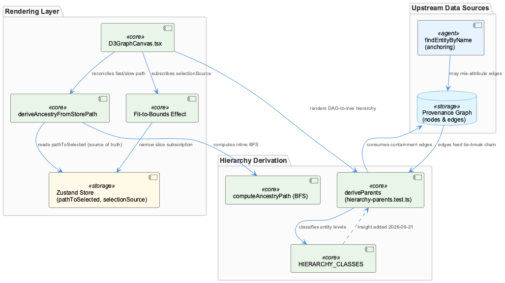
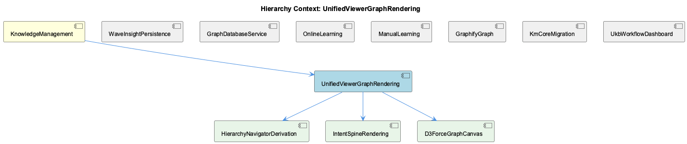

# UnifiedViewerGraphRendering

**Type:** SubComponent

## What It Is

UnifiedViewerGraphRendering is the graph-visualization layer of the Unified Viewer, living primarily in `integrations/unified-viewer/src/graph/D3GraphCanvas.tsx` and `integrations/unified-viewer/src/graph/hierarchy-parents.test.ts`. It encompasses the force-directed rendering canvas, the ancestry/selection-path derivation logic, and the DAG-to-tree reduction used by the Hierarchy Navigator. As a SubComponent under KnowledgeManagement, it sits alongside WaveInsightPersistence and GraphDatabaseService as one of the consumer-facing surfaces of the knowledge graph, and it decomposes into three children: HierarchyNavigatorDerivation, IntentSpineRendering (largely unconfirmed against current code), and D3ForceGraphCanvas.

## Architecture and Design

The dominant architectural pattern is **store-as-single-source-of-truth with local recomputation fallback**. `deriveAncestryFromStorePath` in D3GraphCanvas.tsx runs an inline BFS (`computeAncestryPath`) alongside the Zustand store's authoritative `pathToSelected` set; when the two disagree — e.g., a filter removed an intermediate node — the BFS result is pruned to store membership, with orphaned store-only nodes forced to render at max depth rather than dropped. This preserves a documented "single source of truth" contract from a prior state-flow audit.

A second defining decision is a **verbatim algorithm port across framework boundaries**: the force simulation (`d3.forceSimulation`, `forceLink(150)`, `forceManyBody(-500)`) is copied unchanged from memory-visualizer's `GraphVisualization.tsx`, explicitly because sigma + graphology-layout-* attempts drifted from the reference look. This is a conscious trade-off of architectural consistency (the viewer apparently has a sigma-based canvas elsewhere) in favor of visual/behavioral parity — a pattern worth preserving rather than "fixing" in future refactors.

Third, hierarchy derivation is implemented as a **pure, deterministic tie-break chain** decoupled from rendering: `deriveParents` (tested in hierarchy-parents.test.ts, implementation module not present in supplied files) reduces a DAG to a tree using metadata.parentId > containment edge rank (parent-child > contains > includes) > level-adjacency > parent-name, with explicit cycle-breaking guards to guarantee termination of the walk-up-to-root loop.

## Implementation Details

`D3GraphCanvas.tsx` exposes `deriveAncestryFromStorePath`, `calculateGraphBounds`, and `calculateCenterTransform`. It subscribes to many narrow Zustand store slices individually rather than one combined selector, a deliberate choice to control effect dependency lists and prevent unwanted simulation restarts on selection changes. A notable case is the multi-set fit-to-bounds `useEffect`, which re-introduces a `selectionSource` subscription previously retracted (Phase 56-04); it is scoped narrowly to feed only the fit-to-bounds effect and not the main SVG-rebuilding render effect, protecting a locked dependency-list invariant (Contract #3) so clicks don't restart the force simulation.

`hierarchy-parents.test.ts` acts as the executable specification for `deriveParents`, `HIERARCHY_CLASSES`, and `HIERARCHY_LEVEL`, covering System/Project/Component/SubComponent/Detail/Insight classes, with explicit tests for 2-node and 3-node cycle-breaking and for excluding non-containment edges (`related_to`, `has_insight`, `mentions`) from parent inference.

## Integration Points

This component depends on the Zustand store for selection state (`pathToSelected`, `selectionSource`) and on graph edge/entity data whose correctness is assumed, not verified — the duplicate-name entity anchoring bug (findEntityByName's "oldest wins" semantics) shows that upstream mis-attribution of edges can silently corrupt the containment edges `deriveParents` consumes, with no detection mechanism inside `deriveParents` itself.

It also shares a recurring blind spot with sibling WaveInsightPersistence: Insight-typed entities were historically excluded both from graph-node persistence (73 insight documents written with zero Insight graph nodes) and from `HIERARCHY_CLASSES` at Detail level in this component's hierarchy layer — the latter fixed on 2026-09-21, prior to which none of 975 live Insight entities appeared in the Hierarchy Navigator despite existing in the graph.

Child D3ForceGraphCanvas implements the ported force-simulation rendering; HierarchyNavigatorDerivation owns the `deriveParents` tie-break logic; IntentSpineRendering's relationship to this component is unconfirmed, as its Intent→aggregates→Insight taxonomy doesn't appear in `HIERARCHY_CLASSES`.

## Usage Guidelines

Future refactors must not merge the fit-to-bounds effect's `selectionSource` subscription into the main render effect — this would violate Contract #3 and risk restarting the force simulation on every click. Do not attempt to replace the ported d3 force parameters (`forceLink(150)`, `forceManyBody(-500)`) with sigma/graphology-layout equivalents without re-validating visual parity against memory-visualizer's reference. When modifying `deriveParents`, preserve the exact tie-break order (metadata.parentId > edge rank > level-adjacency > parent name) and the cycle-breaking guards, since tests encode these as load-bearing invariants. Finally, treat Insight-typed entities as a known risk area across subsystems: verify both graph-node persistence and `HIERARCHY_CLASSES` inclusion whenever a new entity type is introduced, since Insight's historical omission caused silent, large-scale invisibility (975 entities) without errors being raised.

## Code Evidence

Key code artifacts grounding this entity's analysis:

- hierarchy-parents.test.ts's deriveParents specification encodes a strict, none-obvious tie-break chain for the DAG→tree reduction: level-adjacency beats edge rank (parent-child > contains > includes), which beats parent name, and metadata.parentId always outranks any containment edge — with explicit tests for cycle-breaking (2-node and 3-node cycles) to guarantee the walk-up-to-root loop in the Hierarchy Navigator terminates.
- hierarchy-parents.test.ts documents that Insight was retroactively added to HIERARCHY_CLASSES at Detail level (2026-09-21); before that fix, deriveParents emitted no parent for any of the 975 Insight entities in the live graph, meaning the entire online-learning population was invisible in the Hierarchy Navigator tree despite existing in the underlying graph data.

## Work Record

What working sessions recorded about this entity — decisions taken, problems hit, and why things are the way they are:

- Unified Viewer — Intent-to-Code Drill-Down work record establishes drill-down from an intent-level entity to underlying code files, surfaced directly in the detail panel
- The Wave Insight Persistence work record (Provenance Graph Consolidation, Stage 6) establishes that Wave 4 batch analysis wrote 73 insight documents but zero Insight-typed graph nodes, since History UI filters strictly on entityType='Insight'; this is the same entityType category (Insight) that hierarchy-parents.test.ts shows was also excluded from the graph-rendering hierarchy layer until 2026-09-21, indicating Insight-typed entities were a recurring blind spot across both the document/graph persistence layer and the viewer's tree-derivation layer.
- The duplicate-name entity anchoring bug record establishes that findEntityByName's 'oldest wins' semantics let a new Detail-typed entity silently inherit 24 edges from an unrelated older SubComponent entity sharing the same name; this is directly relevant to deriveParents' edge-based parent inference (D3GraphCanvas's hierarchy layer), since any upstream anchoring error of this kind would corrupt the containment edges deriveParents consumes to build the tree, without deriveParents itself having any way to detect the mis-attribution.

## Hierarchy Context

### Parent
- [KnowledgeManagement](./KnowledgeManagement.md) -- [SESSION] Wave Insight Persistence work record establishes that Wave 4 was writing 73 insight documents but zero Insight graph nodes, meaning History UI (which filters to entityType='Insight') could never show batch results — fixed by explicitly creating Insight entities stamped with source/subsystem='wave-analysis'

### Children
- [HierarchyNavigatorDerivation](./HierarchyNavigatorDerivation.md) -- [LLM] hierarchy-parents.test.ts is the executable specification for `deriveParents`, `HIERARCHY_CLASSES`, and `HIERARCHY_LEVEL` — the actual DAG→tree reduction module (`./hierarchy-parents`) is not included among the supplied code files, only its test suite. The suite pins down a strict, multi-stage tie-break: `metadata.parentId` (if it names a known, non-self id) outranks any containment edge outright ('metadata.parentId outranks a containment edge', 'metadata.parentId places an Insight that has no containment edge'); absent that, candidates are filtered to containment edge types (`parent-child`/`contains`/`includes` — the test 'non-containment edge types are not parent edges' explicitly excludes `related_to`/`has_insight`/`mentions`); then level-adjacency (exactly one HIERARCHY_LEVEL step up) beats edge-type rank, which beats parent name as a final deterministic tie-break ('final tie-break is parent name, so the result is stable across edge order').
- [IntentSpineRendering](./IntentSpineRendering.md) -- [LLM] None of the supplied code files implement or reference an entity named 'IntentSpineRendering'. The closest candidate, `integrations/unified-viewer/src/graph/hierarchy-parents.test.ts`, defines `deriveParents`/`HIERARCHY_CLASSES`/`HIERARCHY_LEVEL` for a DAG→tree reduction over ontology classes (System, Project, Component, SubComponent, Detail, Insight) — this is a general Hierarchy Navigator, not the Intent-specific spine (Intent →`aggregates`→ Insight) described in the parent's session record. The parent context's own tree describes intents and aggregated insights, a taxonomy-driven structure that appears nowhere in `hierarchy-parents.test.ts`'s HIERARCHY_CLASSES set (which lists Insight but never Intent).
- [D3ForceGraphCanvas](./D3ForceGraphCanvas.md) -- [LLM] D3GraphCanvas.tsx explicitly frames itself as a deliberate port of memory-visualizer's GraphVisualization.tsx, keeping d3.forceSimulation with forceLink(150) and forceManyBody(-500) verbatim; the inline comment states 'every attempt to reproduce VKB's force-directed look with sigma + graphology-layout-* drifted further from the reference,' documenting visual parity being chosen over architectural consistency with a sigma-based canvas elsewhere in the viewer.

### Siblings
- [WaveInsightPersistence](./WaveInsightPersistence.md) -- [SESSION] Wave Insight Persistence work record establishes that Wave 4 was writing 73 insight documents but zero Insight graph nodes, fixed by explicitly creating Insight entities stamped with source/subsystem='wave-analysis'
- [GraphDatabaseService](./GraphDatabaseService.md) -- [LLM] None of the supplied files contain a GraphDatabaseService class, module, or method. config/knowledge-management.json declares the storage backend the service presumably wraps ('database': { 'type': 'graphology-level', 'path': '.data/knowledge-graph', 'options': { 'multi': true, 'valueEncoding': 'json' } }), but this is configuration data consumed by some unseen service, not the service's implementation — there is no _persistGraphToLevel(), no findEntityByName, no <AWS_SECRET_REDACTED> in any file above, despite the parent context naming those exact methods as the site of two recent bugfixes.
- [OnlineLearning](./OnlineLearning.md) -- [SESSION] Intent Spine Derivation Pipeline work record establishes a single consolidated producer script folding five prior ad-hoc scripts into one, clustering insights into Intent entities
- [ManualLearning](./ManualLearning.md) -- [LLM] None of the supplied code files contain a class, type, string literal, or module named "ManualLearning": config/knowledge-management.json only configures embeddings, ontology layers, and inference budgets; integrations/system-health-dashboard/src/components/ukb-workflow-modal.tsx and src/store/slices/ukbSlice.ts model the UKB batch-workflow UI (StepInfo, UKBProcess, WorkflowExecutionState); integrations/unified-viewer/src/graph/D3GraphCanvas.tsx renders the force-directed knowledge graph; and hierarchy-parents.test.ts tests deriveParents over System/Project/Component/Detail/Insight hierarchy classes. This is parent-component and sibling-component material for KnowledgeManagement, not ManualLearning's own implementation.
- [GraphifyGraph](./GraphifyGraph.md) -- [LLM] None of the supplied code files implement or reference GraphifyGraph. integrations/system-health-dashboard/src/components/ukb-workflow-modal.tsx and integrations/system-health-dashboard/src/store/slices/ukbSlice.ts belong to the UKB workflow dashboard UI (workflow progress, ETA calculation, Redux state for run history); integrations/unified-viewer/src/graph/D3GraphCanvas.tsx and integrations/unified-viewer/src/graph/hierarchy-parents.test.ts belong to the unified-viewer's D3/force-directed rendering and hierarchy-derivation logic. None of the four imports, calls, or mentions integrations/semantic-analysis/src/agents/graphify-graph.ts, GraphifyGraph, EntityKind, or graph.json — the artifacts the parent context says define this component.
- [KmCoreMigration](./KmCoreMigration.md) -- [SESSION] UKB Backfill and Metadata Repair Pipeline work record describes a dry-run-then-production migration pattern against the live entity store to repair parent-metadata clobbering
- [UkbWorkflowDashboard](./UkbWorkflowDashboard.md) -- [SESSION] Unified Viewer — Intent-to-Code Drill-Down work record notes drill-down from intent-level entities to code files is surfaced in this dashboard's detail panel rather than only abstract text

---

*Generated from 11 observations*
