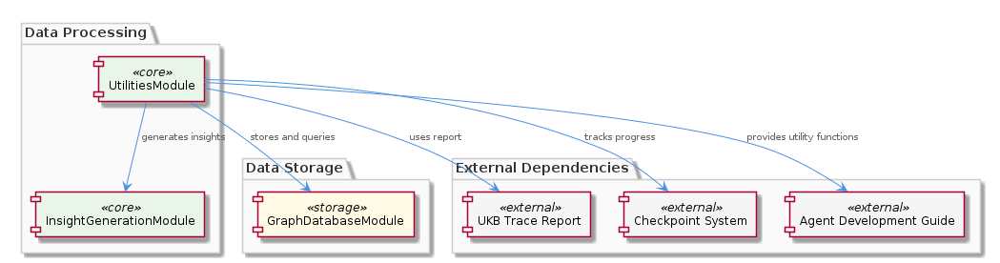
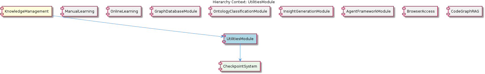

# UtilitiesModule

**Type:** SubComponent

UtilitiesModule involves the use of the agent development guide in integrations/copi/docs/hooks.md to provide utility functions for agent development.

## What It Is  

The **UtilitiesModule** is a sub‑component of the **KnowledgeManagement** domain.  It lives within the same repository hierarchy as the other knowledge‑centric services and is referenced from the agent development guide located at `integrations/copi/docs/hooks.md`.  Its primary responsibility is to provide a suite of utility functions that support agent development, data‑processing pipelines, and insight generation.  The module leverages a **CheckpointSystem** (its child component) to record intermediate state, consumes the **UKB trace report** to feed downstream analytics, and acts as a bridge between raw utility data and higher‑level services such as the **InsightGenerationModule** and **GraphDatabaseModule**.

## Architecture and Design  

The design of **UtilitiesModule** follows a **cohesive utility‑service pattern** where a focused set of helper capabilities are encapsulated behind a thin façade.  Rather than being a monolithic library, the module is deliberately split into functional concerns that map onto existing sibling components:

* **Progress tracking** is handled through the **CheckpointSystem**, ensuring that long‑running utility tasks can be resumed or rolled back without loss of consistency.  
* **Data provenance** is supplied by the **UKB trace report**, which the module forwards to the **InsightGenerationModule** for further processing.  
* **Persistence** of utility‑derived entities is delegated to the **GraphDatabaseModule**, which already provides a `GraphDatabaseAdapter` (see the parent component description) for interacting with the Graphology + LevelDB knowledge graph.

These interactions are orchestrated through well‑defined interfaces rather than tight coupling, allowing each sibling to evolve independently.  The architecture can be visualised in the diagram below, which shows the internal layers of **UtilitiesModule** and its external connectors.

## Implementation Details  

Although the source tree does not expose concrete class definitions for the module itself, the observations make clear which concrete pieces are in play:

1. **CheckpointSystem** – Implemented as a child component, it likely provides an API such as `createCheckpoint(id, state)` and `restoreCheckpoint(id)`.  By persisting checkpoint metadata (possibly in the same LevelDB store used by the graph adapter), it guarantees data consistency across utility operations.

2. **UKB Trace Report Integration** – The module consumes the UKB trace output, probably via a parser or loader routine referenced in the agent development guide.  This data is transformed into a format consumable by the **InsightGenerationModule**, which expects a structured trace to generate actionable insights.

3. **GraphDatabaseModule Interaction** – Calls to the graph layer are performed through the existing `GraphDatabaseAdapter` (implemented in `integrations/mcp-server-semantic-analysis/src/storage/graph-database-adapter.ts`).  Utility entities are stored using methods such as `upsertNode(entity)` or `queryEdges(criteria)`, enabling later retrieval by analytics or agent components.

4. **Hook Integration** – The file `integrations/copi/docs/hooks.md` documents the hooks that expose utility functions to external agents.  These hooks likely register callbacks or RPC endpoints that agents can invoke, ensuring that utility logic is reusable across the platform.

Collectively, these pieces form a pipeline: raw utility work → checkpointed state → persisted in the graph database → enriched by UKB trace data → fed into insight generation.

## Integration Points  

**UtilitiesModule** sits at the nexus of several core services:

* **Parent – KnowledgeManagement**: By residing under KnowledgeManagement, the module inherits the same data‑consistency guarantees provided by the `migrateGraphDatabase` script (`scripts/migrate-graph-db-entity-types.js`).  This ensures that any schema changes in the graph are reflected in utility‑stored entities without manual migration.

* **Sibling – GraphDatabaseModule**: Direct interaction occurs through the shared `GraphDatabaseAdapter`.  The module does not implement its own persistence layer; instead, it relies on the graph adapter’s JSON export sync to keep utility data aligned with the central knowledge graph.

* **Sibling – InsightGenerationModule**: The UKB trace report generated (or consumed) by UtilitiesModule is the primary input for InsightGenerationModule’s analytics.  This relationship is illustrated in the relationship diagram below.

* **Sibling – AgentFrameworkModule & BrowserAccess**: Through the hooks documented in `integrations/copi/docs/hooks.md`, agents built on the AgentFramework can call utility functions, while BrowserAccess can surface utility‑derived insights to end‑users.

* **Child – CheckpointSystem**: All long‑running utility processes invoke checkpoint APIs before mutating shared state, guaranteeing that failures can be recovered gracefully.

## Usage Guidelines  

1. **Always checkpoint before mutating state** – Invoke the CheckpointSystem API at the start of any utility routine that may span multiple asynchronous steps.  This preserves consistency and aligns with the module’s design for fault tolerance.

2. **Pass UKB trace data through the documented hook** – When extending agents, use the hook signatures described in `integrations/copi/docs/hooks.md`.  Supplying a correctly formatted trace object enables downstream insight generation without additional transformation.

3. **Persist via the GraphDatabaseAdapter** – Do not write directly to LevelDB or Graphology.  Use the adapter’s `upsertNode` and `queryEdges` methods so that the automatic JSON export sync remains functional and the knowledge graph stays coherent.

4. **Respect the migration script** – If schema changes are required for utility‑generated entities, coordinate with the `scripts/migrate-graph-db-entity-types.js` workflow.  This ensures that all sibling modules see a consistent view of entity types.

5. **Limit cross‑module side effects** – UtilitiesModule should remain a pure provider of helper functions; any business logic that impacts other domains belongs in the appropriate sibling (e.g., InsightGenerationModule for analytics, OnlineLearning for code‑graph extraction).

---

### Architectural patterns identified  

* **Utility‑Service Facade** – Centralises reusable helper logic behind a thin, well‑defined interface.  
* **Checkpoint‑Based Consistency** – Employs a checkpoint pattern to guarantee recoverability of long‑running operations.  
* **Adapter Pattern** – Uses the `GraphDatabaseAdapter` to abstract persistence details from the utilities.  

### Design decisions and trade‑offs  

* **Separation of concerns** – By delegating persistence to GraphDatabaseModule, UtilitiesModule stays lightweight but becomes dependent on the adapter’s stability.  
* **Checkpoint overhead** – Introducing checkpoints adds I/O cost; however, it greatly reduces risk of data corruption in failure scenarios.  
* **Hook‑driven extensibility** – Exposing utilities via documented hooks simplifies agent integration but requires strict versioning of hook contracts.  

### System structure insights  

The module is positioned as a middle layer between raw data processing (checkpoint & UKB trace) and higher‑level analytics (InsightGeneration).  Its child, CheckpointSystem, provides the only state‑ful component, while all storage responsibilities are delegated outward, reinforcing a clear vertical slice architecture.

### Scalability considerations  

* **Checkpoint storage** scales with the number of concurrent utility tasks; using LevelDB ensures low‑latency writes but may need sharding for massive parallelism.  
* **Graph database writes** are bottlenecked by the adapter; horizontal scaling of the underlying Graphology + LevelDB cluster would directly benefit UtilitiesModule throughput.  
* **UKB trace size** can grow; streaming parsers or chunked processing should be employed if trace files become large.  

### Maintainability assessment  

UtilitiesModule benefits from high modularity: each concern (checkpointing, tracing, persistence) is isolated behind interfaces.  The reliance on shared adapters and migration scripts centralises change management, reducing duplication.  The primary maintenance risk lies in keeping the hook contracts in `integrations/copi/docs/hooks.md` synchronized with agent expectations; disciplined documentation and versioning are essential to mitigate this.

## Hierarchy Context

### Parent
- [KnowledgeManagement](./KnowledgeManagement.md) -- [LLM] The KnowledgeManagement component utilizes a GraphDatabaseAdapter for persistence, which is implemented in the file integrations/mcp-server-semantic-analysis/src/storage/graph-database-adapter.ts. This adapter provides an interface for agents to interact with the central Graphology + LevelDB knowledge graph. The adapter also includes automatic JSON export sync, ensuring that the knowledge graph remains up-to-date. Furthermore, the migrateGraphDatabase script, located in scripts/migrate-graph-db-entity-types.js, is used to update entity types in the live LevelDB/Graphology database, demonstrating a clear focus on data consistency and integrity.

### Children
- [CheckpointSystem](./CheckpointSystem.md) -- The checkpoint system is mentioned in the context of the UtilitiesModule, implying its importance in the module's operation.

### Siblings
- [ManualLearning](./ManualLearning.md) -- ManualLearning relies on the migrateGraphDatabase script in scripts/migrate-graph-db-entity-types.js to update entity types in the live LevelDB/Graphology database.
- [OnlineLearning](./OnlineLearning.md) -- OnlineLearning uses the Code Graph RAG system in integrations/code-graph-rag to extract knowledge from codebases.
- [GraphDatabaseModule](./GraphDatabaseModule.md) -- GraphDatabaseModule uses the GraphDatabaseAdapter to interact with the Graphology + LevelDB knowledge graph.
- [OntologyClassificationModule](./OntologyClassificationModule.md) -- OntologyClassificationModule uses the OntologySystem to classify entities based on their types and properties.
- [InsightGenerationModule](./InsightGenerationModule.md) -- InsightGenerationModule uses the UKB trace report from the UtilitiesModule to generate insights.
- [AgentFrameworkModule](./AgentFrameworkModule.md) -- AgentFrameworkModule uses the agent development guide in integrations/copi/docs/hooks.md to provide a framework for agent development.
- [BrowserAccess](./BrowserAccess.md) -- BrowserAccess uses the browser access guide in integrations/browser-access/README.md to provide browser access to the MCP server.
- [CodeGraphRAG](./CodeGraphRAG.md) -- CodeGraphRAG uses the code-graph-rag guide in integrations/code-graph-rag/README.md to provide a graph-based RAG system.

---

*Generated from 5 observations*
