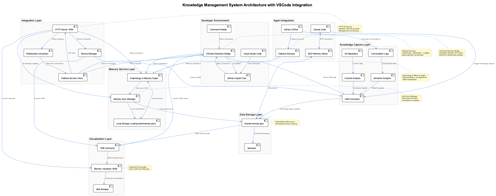
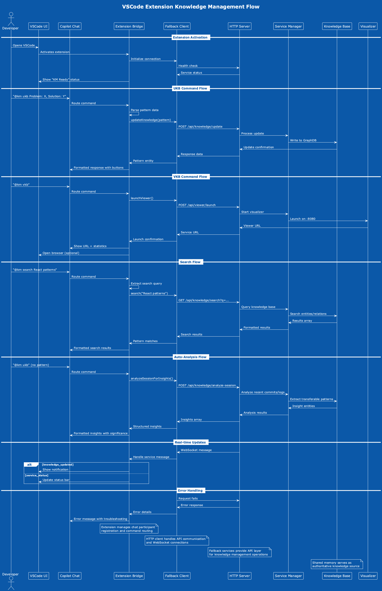
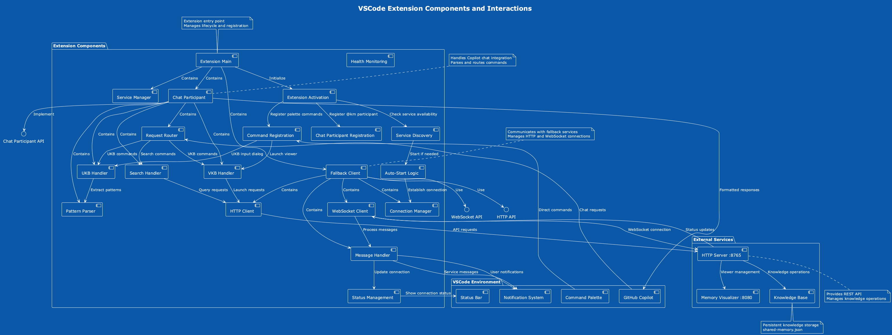

# VSCode Extension Bridge Pattern

**Pattern Type:** TransferablePattern  
**Significance:** 9/10  
**Project:** Coding  
**Created:** 2025-06-16T15:30:47Z

## Table of Contents

- [Problem](#problem)
  - [Symptoms](#symptoms)
  - [Impact](#impact)
- [Solution](#solution)
  - [Implementation Approach](#implementation-approach)
  - [Code Example](#code-example)
- [Architecture](#architecture)
  - [Component Flow](#component-flow)
  - [Component Relationships](#component-relationships)
- [Key Features](#key-features)
  - [Chat Participant Integration](#chat-participant-integration)
  - [Command Support](#command-support)
  - [Real-time Updates](#real-time-updates)
- [Performance Metrics](#performance-metrics)
- [Applicability](#applicability)
- [Technologies](#technologies)
- [Related Files](#related-files)
  - [Implementation](#implementation)
  - [Documentation](#documentation)
  - [External References](#external-references)
- [Related Patterns](#related-patterns)
- [Usage Examples](#usage-examples)
  - [Basic Pattern Capture](#basic-pattern-capture)
  - [Knowledge Search](#knowledge-search)
  - [Auto-Analysis](#auto-analysis)
- [Benefits](#benefits)
  - [Developer Experience](#developer-experience)
  - [Knowledge Management](#knowledge-management)
  - [Team Collaboration](#team-collaboration)
- [Implementation Notes](#implementation-notes)
  - [Extension Architecture](#extension-architecture)
  - [Service Communication](#service-communication)
  - [Error Handling](#error-handling)
- [Future Enhancements](#future-enhancements)

## Problem

Developers need to capture knowledge insights without leaving their IDE or switching between tools, which breaks development flow and reduces the likelihood of documenting patterns.

### Symptoms
- Context switching disrupts development flow
- Knowledge capture tools require separate applications  
- Manual documentation is often skipped

### Impact
High - Significant disruption to developer productivity and knowledge loss

## Solution

Integrate ukb/vkb commands directly into GitHub Copilot chat through VSCode extension bridge, providing natural language interface with real-time feedback.

### Implementation Approach

VSCode extension with chat participant registration, HTTP API client, WebSocket real-time updates, and fallback service management.

### Code Example

```javascript
// Extension Registration
const participant = vscode.chat.createChatParticipant('km-assistant', async (request, context, response, token) => {
    await chatParticipant.handleRequest(request, context, response, token);
});

// HTTP Client Integration
async updateKnowledge(pattern) {
    const response = await axios.post(`${this.baseUrl}/api/knowledge/update`, {
        entity: pattern
    });
    return response.data;
}
```

## Architecture



### Component Flow



### Component Relationships



## Key Features

### Chat Participant Integration
- **@KM** participant in GitHub Copilot chat
- Natural language command processing
- Real-time formatted responses
- Action buttons for quick navigation

### Command Support
- **UKB**: `@KM ukb Problem: X, Solution: Y` - Pattern capture
- **VKB**: `@KM vkb` - Knowledge graph visualization  
- **Search**: `@KM search React patterns` - Knowledge base search
- **Auto-analysis**: `@KM ukb` (no pattern) - Session insight extraction

### Real-time Updates
- WebSocket connection for live service status
- Instant notifications for knowledge updates
- Service health monitoring in status bar

## Performance Metrics

- **Response Time**: < 500ms for chat responses
- **Real-time Updates**: WebSocket-based notifications
- **Service Discovery**: Automatic fallback service detection

## Applicability

This pattern is applicable for:
- VSCode extension development for developer tools
- GitHub Copilot chat participant integration
- IDE-based knowledge management systems
- Developer experience optimization tools

## Technologies

- VSCode Extension API
- GitHub Copilot Chat API
- HTTP/WebSocket communication
- Node.js
- Knowledge Management systems

## Related Files

### Implementation
- `vscode-km-copilot/src/extension.js` - Main extension entry point
- `vscode-km-copilot/src/chatParticipant.js` - Copilot integration
- `vscode-km-copilot/src/fallbackClient.js` - HTTP/WebSocket client
- `vscode-km-copilot/src/serviceManager.js` - Service lifecycle

### Documentation
- [VSCode Extension Bridge](../../docs/vscode-extension-bridge.md)
- [Enhanced Knowledge Workflow](../../docs/enhanced-knowledge-workflow.md)

### External References
- [VSCode Chat Extension Guide](https://code.visualstudio.com/api/extension-guides/chat)
- [VSCode API Reference](https://code.visualstudio.com/api/references/vscode-api)

## Related Patterns

- **MCPMemoryLoggingIntegrationPattern**: Extends logging integration concepts
- **KnowledgePersistencePattern**: Enhances knowledge persistence mechanisms
- **UKBComprehensiveAnalysisPattern**: Integrates with comprehensive analysis features

## Usage Examples

### Basic Pattern Capture
```
Developer: @KM ukb Problem: API responses slow, Solution: Redis caching
Extension: ✅ Knowledge base updated successfully!
Entity: APICachingPattern
Type: Pattern
Significance: 8/10
```

### Knowledge Search
```
Developer: @KM search state management
Extension: Found 5 results:
### ReduxStateManagementPattern (9/10)
Problem: Complex state mutations difficult to track
Solution: Use Redux Toolkit with typed slices
```

### Auto-Analysis
```
Developer: @KM ukb
Extension: 🔍 Auto-analyzing session data...
Found 3 transferable insights with significance > 7
```

## Benefits

### Developer Experience
- No context switching required
- Natural language interface
- Instant visual feedback
- Seamless integration with existing workflow

### Knowledge Management
- Continuous pattern capture
- Real-time knowledge graph updates
- Team-wide knowledge sharing
- Reduced documentation overhead

### Team Collaboration
- Standardized knowledge capture process
- Shared vocabulary and patterns
- Onboarding acceleration
- Best practice propagation

## Implementation Notes

### Extension Architecture
1. **Extension Main**: Lifecycle management and service discovery
2. **Chat Participant**: Command parsing and response formatting
3. **Fallback Client**: HTTP API and WebSocket communication
4. **Service Manager**: Automatic service startup and health monitoring

### Service Communication
- HTTP API endpoints for knowledge operations
- WebSocket for real-time status updates
- Health checks for service availability
- Automatic reconnection on failure

### Error Handling
- Graceful degradation when services unavailable
- User-friendly error messages
- Automatic retry mechanisms
- Service status indicators

## Future Enhancements

- AI-powered pattern suggestions
- Team collaboration features
- Enhanced auto-completion
- Metrics and analytics dashboard
- Integration with external tools (JIRA, Slack, GitHub)

---

*This pattern represents a significant advancement in developer tool integration, providing seamless knowledge management capabilities directly within the IDE environment.*