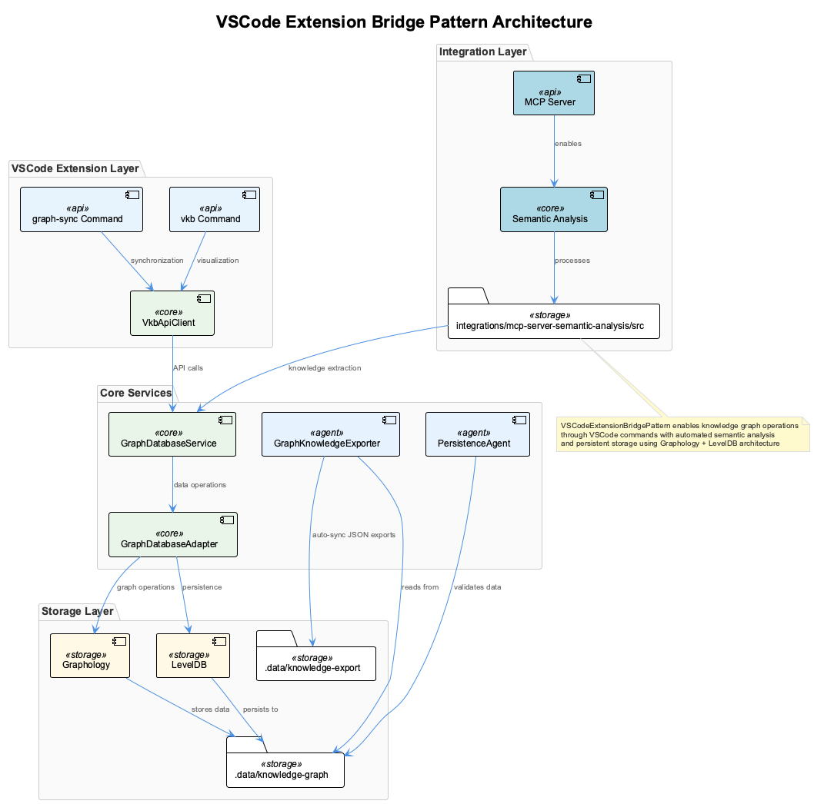
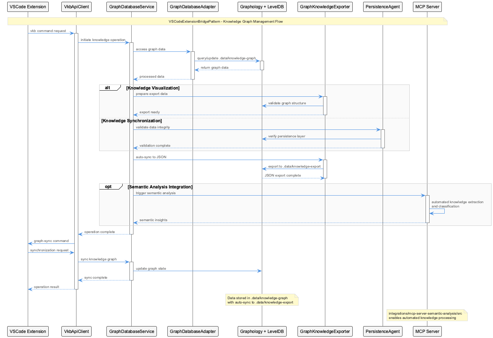
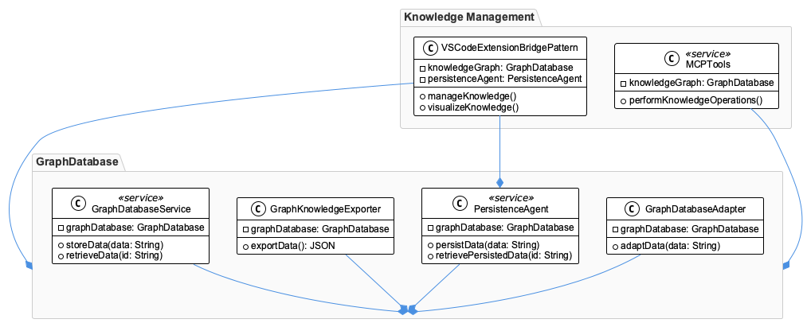
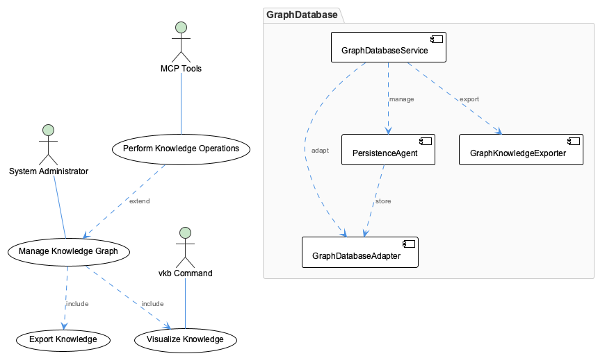

# VSCodeExtensionBridgePattern

**Type:** TransferablePattern

Current architecture uses Graphology + LevelDB at .data/knowledge-graph with auto-sync to JSON exports at .data/knowledge-export, managed by GraphDatabaseService and GraphDatabaseAdapter components

## What It Is

- Knowledge operations are accessed through vkb command for visualization and graph-sync for synchronization, with VkbApiClient handling API communications

- Recent commits show active development on constraint handling and semantic analysis integration, with shared-memory.json removal indicating architectural migration

- PersistenceAgent and GraphKnowledgeExporter provide data validation and export capabilities for the knowledge graph stored in .data directories

- MCP server semantic analysis integration at integrations/mcp-server-semantic-analysis/src enables automated knowledge extraction and classification

## Diagrams

### Architecture

### Sequence

### Class

### Use cases

---

*Generated from 5 observations*
