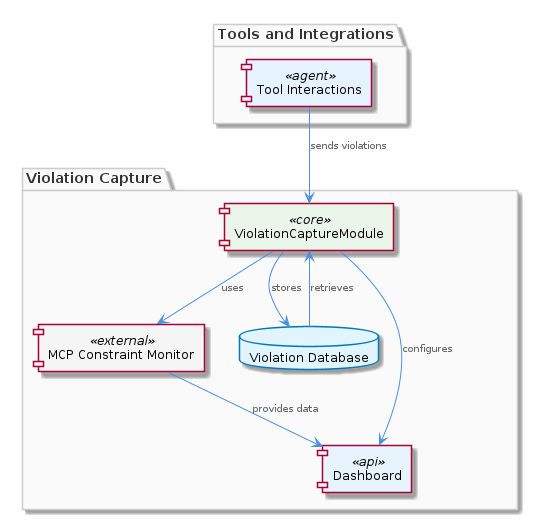
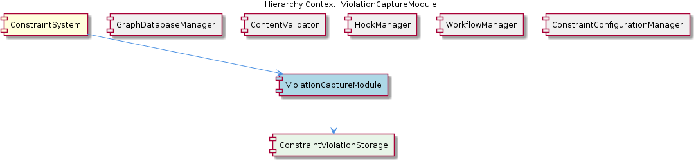

# ViolationCaptureModule

**Type:** SubComponent

The ViolationCaptureModule utilizes the integrations/mcp-constraint-monitor/docs/constraint-configuration.md documentation to provide a guide for constraint configuration.

**ViolationCaptureModule – Technical Insight Document**  

---

### What It Is  

The **ViolationCaptureModule** lives inside the *mcp‑constraint‑monitor* integration and is the component responsible for detecting, capturing, and persisting constraint‑violation events that arise during batch analysis.  Its primary artefacts are the documentation files  

* `integrations/mcp-constraint-monitor/docs/constraint-configuration.md` – the **ConstraintConfigurationGuide** that drives how constraints are expressed, and  
* `integrations/mcp-constraint-monitor/README.md` – an overview that ties the module to the broader **ConstraintSystem**.  

At runtime the module participates in a **DAG‑based execution model** defined in `batch-analysis.yaml`, where each step is topologically sorted to guarantee that violations are recorded only after the prerequisite analyses have completed.  The captured violations are stored in a form that can be efficiently queried, and a shared ontology metadata field is populated to avoid re‑classifying the same code fragment with an LLM later on.

---

### Architecture and Design  

The observations reveal a **modular architecture** that mirrors the overall design of its parent, **ConstraintSystem**.  The system is split into self‑contained sub‑components—ViolationCaptureModule, ContentValidationModule, HookManagementModule, GraphDatabaseAdapter, and SemanticAnalysisModule—each addressing a distinct concern of constraint monitoring.  This decomposition follows a *separation‑of‑concerns* pattern, allowing each module to be built, tested, and released independently (Observation 4).

Interaction between modules is orchestrated through a **directed‑acyclic‑graph (DAG) execution model**.  The `batch-analysis.yaml` file defines a series of analysis steps; a topological sort ensures that dependent steps (e.g., semantic analysis) run before violation capture, guaranteeing that the necessary context is available.  This workflow‑oriented pattern provides deterministic ordering without circular dependencies.

A second design element is the **shared ontology metadata field** (Observation 5).  Both ViolationCaptureModule and GraphDatabaseAdapter write to this field, effectively acting as a cache that prevents redundant LLM re‑classification of the same code entity.  The pattern here is a lightweight *metadata‑driven cache* that reduces costly LLM invocations while keeping the ontology consistent across modules.

Documentation is treated as a first‑class integration artifact.  The module reads its configuration rules from `constraint-configuration.md`, and its public contract is described in the README.  This *documentation‑driven configuration* pattern keeps the runtime behaviour decoupled from hard‑coded values and makes the system adaptable to new constraints without code changes.

---

### Implementation Details  

* **Configuration Guide** – The file `integrations/mcp-constraint-monitor/docs/constraint-configuration.md` is parsed by the ViolationCaptureModule at start‑up.  It defines the syntax and semantics of each constraint (e.g., naming conventions, dependency rules).  Because the guide is a child component of the module, any change to the markdown is immediately reflected in the next analysis run, eliminating the need for recompilation.

* **DAG Execution** – The workflow is declared in `batch-analysis.yaml`.  Each node represents a processing stage (e.g., “SemanticConstraintDetection”, “CaptureViolations”).  The module registers its “CaptureViolations” node with a list of prerequisite nodes.  The orchestrator performs a **topological sort** to produce an execution order; nodes with no dependencies can be processed in parallel, while the ViolationCapture step is scheduled after all detection steps have finished.  This guarantees that the module receives a complete set of candidate violations.

* **Violation Capture & Storage** – When invoked, the module iterates over the list of detected constraint breaches, enriches each record with the shared ontology metadata (preventing duplicate LLM classification), and persists the result.  Although the concrete storage backend is not listed in the observations, the parent **ConstraintSystem** employs a **GraphDatabaseAdapter**, suggesting that violations are likely stored in a graph database to support complex relationship queries.

* **Shared Ontology Metadata** – Both ViolationCaptureModule and GraphDatabaseAdapter write a canonical metadata field (e.g., `ontologyClassId`) into the persisted entity.  This field acts as a deterministic identifier for the LLM‑derived classification, allowing downstream components to skip re‑classification if the identifier is already present.  The design reduces LLM latency and cost while preserving semantic fidelity.

* **Independence** – Because the module’s logic is encapsulated behind the DAG step and its configuration is externalised, developers can replace the underlying capture algorithm or swap the storage adapter without touching sibling modules.  The modular boundary is reinforced by the fact that the module does not import code from ContentValidationModule, HookManagementModule, or SemanticAnalysisModule; it only consumes their outputs via the DAG.

---

### Integration Points  

* **Parent – ConstraintSystem** – ViolationCaptureModule is a child of **ConstraintSystem**, which coordinates all monitoring sub‑components.  The parent provides the overall DAG definition (`batch-analysis.yaml`) and ensures that the module’s output (captured violations) is fed into higher‑level analytics or reporting pipelines.

* **Sibling – GraphDatabaseAdapter** – The adapter is responsible for persisting entities, including the ontology metadata that ViolationCaptureModule writes.  This tight coupling around the shared metadata field enables the “prevent redundant LLM re‑classification” optimisation (Observation 5).

* **Sibling – SemanticAnalysisModule** – Generates the raw constraint‑violation candidates that ViolationCaptureModule later records.  The module consumes the semantic analysis results via the DAG’s data flow, but does not directly call any of its classes; the dependency is declarative in `batch-analysis.yaml`.

* **Sibling – HookManagementModule** – While not directly invoked, the hook system may be used to trigger custom actions after violations are stored (e.g., notifications).  The presence of a hook framework suggests that ViolationCaptureModule could expose hook points for extensions.

* **Child – ConstraintConfigurationGuide** – The markdown guide (`constraint-configuration.md`) is read at runtime to configure which constraints are active and how they should be interpreted.  Any addition of new constraint types is performed by editing this guide, making the module highly extensible without code changes.

---

### Usage Guidelines  

1. **Keep the configuration guide up‑to‑date** – When adding or deprecating constraints, edit `integrations/mcp-constraint-monitor/docs/constraint-configuration.md`.  The module reads this file on each batch run, so no code changes are required.

2. **Respect the DAG ordering** – Do not manually invoke the capture step outside of the `batch-analysis.yaml` workflow.  The topological sort guarantees that all prerequisite analyses have completed; bypassing it can lead to incomplete or inconsistent violation records.

3. **Leverage the shared ontology metadata** – When extending the ontology (e.g., adding new classification types), ensure that the metadata field name remains unchanged.  This preserves the cache‑like behaviour that prevents redundant LLM calls across GraphDatabaseAdapter and ViolationCaptureModule.

4. **Prefer read‑only interactions** – Treat the module as a consumer of analysis results; it should not modify the outputs of sibling modules.  This maintains the clear separation of concerns that underpins the modular design.

5. **Monitor storage performance** – Since violations are stored for efficient querying, ensure that the underlying graph database (or whatever persistence layer is used) is sized appropriately for the expected volume of violations.  Periodic cleanup of stale violation records can keep query latency low.

---

## Architectural Patterns Identified  

1. **Modular / Component‑Based Architecture** – Independent sub‑components (ViolationCaptureModule, ContentValidationModule, etc.) that can be built and deployed separately.  
2. **DAG‑Based Workflow Execution** – `batch-analysis.yaml` defines a directed acyclic graph of analysis steps with topological sorting.  
3. **Documentation‑Driven Configuration** – Runtime behaviour is driven by external markdown files (`constraint-configuration.md`).  
4. **Metadata‑Driven Caching** – Shared ontology metadata field used to avoid redundant LLM classification.

## Design Decisions and Trade‑offs  

| Decision | Rationale | Trade‑off |
|----------|-----------|-----------|
| Modular decomposition of monitoring concerns | Enables independent development, testing, and maintenance (Obs 4). | Introduces inter‑module coordination overhead (DAG orchestration). |
| DAG execution with topological sort | Guarantees deterministic ordering and allows parallel execution of independent steps. | Requires careful definition of dependencies; adds complexity to pipeline configuration. |
| External markdown guide for constraint configuration | Allows non‑developers to adjust constraints without code changes. | Validation of the guide must be robust; malformed markdown can cause runtime errors. |
| Shared ontology metadata field as a cache | Reduces costly LLM re‑classification, improving performance (Obs 5). | Couples modules to a specific metadata schema; schema changes ripple across modules. |

## System Structure Insights  

* **Parent‑Child Relationship:** ViolationCaptureModule is a child of **ConstraintSystem** and owns the **ConstraintConfigurationGuide**.  
* **Sibling Interaction:** It consumes outputs from **SemanticAnalysisModule** and writes metadata consumed by **GraphDatabaseAdapter**; all interactions are orchestrated by the parent’s DAG.  
* **Isolation:** No direct code imports between siblings; communication is data‑flow driven via the DAG, reinforcing loose coupling.  

## Scalability Considerations  

* **Horizontal Scaling of DAG Nodes:** Independent DAG branches (e.g., semantic analysis) can be parallelised across workers, allowing the capture step to keep pace with larger codebases.  
* **Storage Scalability:** Since violations are stored for efficient querying, the underlying persistence layer must support high‑write throughput and indexed retrieval—graph databases are a natural fit given the parent’s use of GraphDatabaseAdapter.  
* **Metadata Cache Effectiveness:** The shared ontology field reduces LLM load, which is a major scalability bottleneck; as the number of code entities grows, the cache’s hit‑rate becomes increasingly important.  

## Maintainability Assessment  

The **modular design** and **documentation‑driven configuration** give the ViolationCaptureModule a high maintainability rating.  Developers can modify constraint rules by editing a markdown file, and the DAG ensures that new analysis steps can be added without touching the capture logic.  The only maintenance risk lies in the tight coupling to the ontology metadata schema; any change to that schema must be propagated to both ViolationCaptureModule and GraphDatabaseAdapter.  Overall, the clear separation of concerns, explicit execution ordering, and reliance on external documentation make the module straightforward to evolve and debug.

## Diagrams

### Relationship

### Architecture

## Architecture Diagrams

## Hierarchy Context

### Parent
- [ConstraintSystem](./ConstraintSystem.md) -- [LLM] The ConstraintSystem component employs a modular architecture, with separate modules for different aspects of constraint monitoring. For instance, the ContentValidationAgent (integrations/mcp-server-semantic-analysis/src/agents/content-validation-agent.ts) utilizes the GraphDatabaseAdapter for graph database persistence and semantic analysis. This design decision allows for efficient and reliable operation, as each module can be developed, tested, and maintained independently. The use of graph database persistence enables the system to efficiently store and query complex relationships between code entities, while semantic analysis enables the system to understand the meaning and context of code actions and file operations.

### Children
- [ConstraintConfigurationGuide](./ConstraintConfigurationGuide.md) -- The integrations/mcp-constraint-monitor/docs/constraint-configuration.md file provides a comprehensive guide for constraint configuration, which is utilized by the ViolationCaptureModule.

### Siblings
- [ContentValidationModule](./ContentValidationModule.md) -- The ContentValidationAgent in integrations/mcp-server-semantic-analysis/src/agents/content-validation-agent.ts utilizes the GraphDatabaseAdapter for graph database persistence and semantic analysis.
- [HookManagementModule](./HookManagementModule.md) -- The HookManagementModule utilizes the integrations/copi/docs/hooks.md documentation to provide a reference for hook functions.
- [GraphDatabaseAdapter](./GraphDatabaseAdapter.md) -- The GraphDatabaseAdapter is used by the ContentValidationModule to pre-populate ontology metadata fields and prevent redundant LLM re-classification.
- [SemanticAnalysisModule](./SemanticAnalysisModule.md) -- The SemanticAnalysisModule utilizes the integrations/mcp-constraint-monitor/docs/semantic-constraint-detection.md documentation to provide a guide for semantic constraint detection.

---

*Generated from 7 observations*
