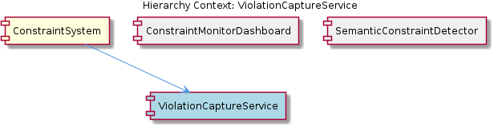
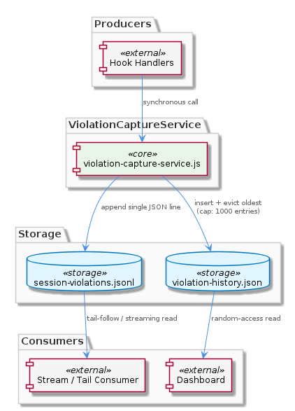

# ViolationCaptureService

**Type:** SubComponent

The violation-history.json store enforces a hard cap of 1000 entries; once at capacity, the oldest entry is evicted and the entire array is re-serialized on each append, creating a write hotspot under high violation rates

# ViolationCaptureService — Technical Reference

## What It Is

`ViolationCaptureService` is implemented in `scripts/violation-capture-service.js` and serves as the persistence layer for constraint violations within the `ConstraintSystem`. Its sole responsibility is recording violations produced by hook handlers into durable storage in a form that satisfies two distinct consumer contracts simultaneously: real-time stream consumers that tail an append-log, and dashboard consumers that need random-access reads over a bounded history.

The service writes every violation to two files: `.mcp-sync/session-violations.jsonl` and `.mcp-sync/violation-history.json`. These are not redundant copies — they encode fundamentally different access semantics, and each file is optimized for a different class of reader.

---

## Architecture and Design

The central architectural decision in `ViolationCaptureService` is the **dual-store write strategy**: a single inbound violation event triggers two independent persistence operations, each targeting a file format chosen to match its downstream consumer's access pattern.

The JSONL file at `.mcp-sync/session-violations.jsonl` is an unbounded append log. Each violation is serialized as a single JSON line and appended to the file. This format is explicitly designed for tail-following — a consumer can `tail -f` or stream-read from a known offset without ever needing to parse the entire file or hold it in memory. This makes it suitable for real-time pipelines, log shippers, or any consumer that processes violations as they arrive rather than querying historical ranges.

The JSON array at `.mcp-sync/violation-history.json` takes the opposite approach: it is a bounded, fully-parsed structure capped at 1000 entries. This cap encodes an explicit contract with `ConstraintMonitorDashboard`, which reads this file directly. By keeping the file bounded, the dashboard never encounters an unbounded parse cost regardless of how long the system has been running. The tradeoff is a write penalty: once the cap is active, every append requires evicting the oldest entry and re-serializing the entire array to disk — a full rewrite on each violation event.

The producer-consumer relationship is deliberately decoupled. Hook handlers call into `ViolationCaptureService` synchronously, but the dashboard reads `violation-history.json` independently. There is no shared queue, lock, or callback between producer and dashboard reader, meaning producer throughput is never gated by how fast the dashboard polls or renders. This is a clean separation that avoids backpressure propagating from UI reads into the hook execution path.

---

## Implementation Details

On each violation event, `ViolationCaptureService` performs two writes in sequence. The JSONL append is a low-cost operation: serialize the violation object to a single JSON string, append it with a newline terminator to `.mcp-sync/session-violations.jsonl`. This is an O(1) append with no read-before-write required.

The `violation-history.json` write is more expensive. The service must read the current array (or hold it in memory), check whether the entry count has reached the 1000-entry hard cap, conditionally evict the oldest entry (index 0), push the new violation, and then re-serialize the entire array back to disk. Once the cap is active, this is an O(n) write where n is capped at 1000 — bounded but non-trivial under high violation rates. At sustained high throughput, this file becomes a write hotspot, as every violation triggers a full rewrite of a potentially large JSON document.

The 1000-entry cap is a hard architectural constant, not a configurable parameter based on the available observations. It represents a design judgment about the useful horizon of dashboard-visible history — enough to show meaningful recent activity without allowing unbounded file growth.

---

## Integration Points

Within `ConstraintSystem`, `ViolationCaptureService` sits between two groups of actors: upstream producers (hook handlers that detect and report violations) and downstream consumers (the dashboard and any stream readers).

`ConstraintMonitorDashboard` is the primary consumer of `violation-history.json`. The dashboard's isolation from the raw JSONL stream is a deliberate design choice — it trades access to the full unbounded history for a predictable, bounded parse cost on every read. The dashboard never needs to know about session duration or total violation volume; it always sees at most 1000 entries.

`SemanticConstraintDetector` operates upstream in the detection pipeline. While the observations don't describe a direct API contract between `SemanticConstraintDetector` and `ViolationCaptureService`, both are siblings within `ConstraintSystem`, and it is reasonable to treat `SemanticConstraintDetector` as a producer that ultimately feeds violations into `ViolationCaptureService`'s write path via the hook handler layer.

The `.mcp-sync/` directory is the shared integration surface. Both output files live here, and any external tooling (log forwarders, monitoring agents) that consumes violations should target the JSONL file rather than the JSON array, since the JSONL file is explicitly designed for that access pattern.

---

## Usage Guidelines

**Choose the right file for your consumer type.** If you are building a real-time consumer, a stream processor, or anything that tails output, read from `.mcp-sync/session-violations.jsonl`. If you are building a UI or query interface that needs bounded, random-access reads over recent history, read from `.mcp-sync/violation-history.json`. Mixing these up — for example, parsing the full JSONL for a dashboard — will create unnecessary load and defeats the purpose of the dual-store design.

**Be aware of the write hotspot under high violation rates.** The `violation-history.json` rewrite-on-append behavior is bounded by the 1000-entry cap, but it is still a full file rewrite on every event. Systems that generate violations at high frequency (e.g., during bulk operations or aggressive constraint checking) will exercise this path heavily. If write latency becomes a concern, the hotspot is localized to this file's update logic in `scripts/violation-capture-service.js`.

**Do not bypass `ViolationCaptureService` to write violations directly.** Both files must remain consistent with each other; writing to one without the other breaks the consumer contracts. All violation persistence should flow through `ViolationCaptureService` as the single authoritative write path.

**The 1000-entry cap is a design constant, not a bug.** Consumers of `violation-history.json` should not assume they can see the full session history — only the most recent 1000 violations are guaranteed to be present. For full session history, the JSONL file is the authoritative source.

## Hierarchy Context

### Parent
- [ConstraintSystem](./ConstraintSystem.md) -- [LLM] The ConstraintSystem employs a dual-store persistence strategy in ViolationCaptureService (scripts/violation-capture-service.js) that separates concerns between live streaming and historical querying. Violations are written to two distinct files: a JSONL append-log at .mcp-sync/session-violations.jsonl where each line is a JSON-serialized violation event suitable for tail-following and real-time consumption, and a capped JSON array at .mcp-sync/violation-history.json that never exceeds 1000 entries and is intended for dashboard reads. This design means producers (the hook handlers) never block on dashboard consumers, and the dashboard never needs to parse an unbounded stream. The tradeoff is that the history file requires a full rewrite on each append once the cap is active, since the oldest entry must be evicted and the array re-serialized, which can become a write hotspot under high violation rates.

### Siblings
- [ConstraintMonitorDashboard](./ConstraintMonitorDashboard.md) -- ConstraintMonitorDashboard consumes .mcp-sync/violation-history.json (a capped 1000-entry JSON array) rather than the raw JSONL append-log, isolating the UI from unbounded stream parsing as described in the ViolationCaptureService dual-store design
- [SemanticConstraintDetector](./SemanticConstraintDetector.md) -- SemanticConstraintDetector is documented across two dedicated files—integrations/mcp-constraint-monitor/docs/semantic-constraint-detection.md and docs/semantic-detection-design.md—indicating the detection strategy is complex enough to warrant both a user-facing guide and an internal design document

---

*Generated from 5 observations*
