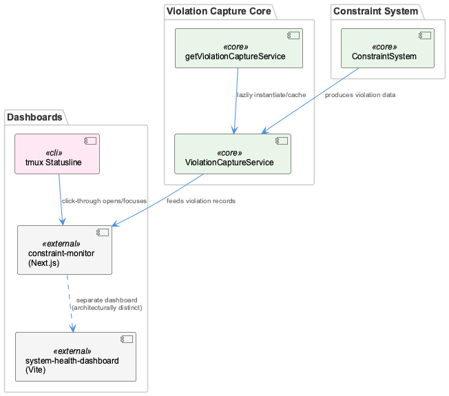
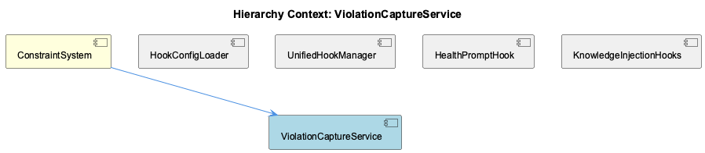

# ViolationCaptureService

**Type:** SubComponent

[LLM+CGR] The code graph identifies exactly two symbols for this component: the `ViolationCaptureService` class and a `getViolationCaptureService` accessor function, both in `scripts/violation-capture-service.js`. The presence of a dedicated getter function alongside the class is a strong signal of a singleton-accessor pattern — the same shape used elsewhere in this codebase's agent-hook layer (e.g. `getHookManager()` in `lib/agent-api/hooks/hook-manager.js`, called from `lib/agent-api/hooks/claude-bridge.js`'s `main()`). This suggests `ViolationCaptureService` is instantiated once per process and shared across all callers that need to record a violation, rather than being constructed ad hoc at each call site, which avoids redundant file-handle/state setup for the same `.mcp-sync/violation-history.json` target.

# ViolationCaptureService — Technical Insight Document

## What It Is

`ViolationCaptureService` is implemented in `scripts/violation-capture-service.js`, alongside a companion accessor function, `getViolationCaptureService()`, defined in the same file. Together these two symbols constitute the entirety of the component's code-graph footprint: a class encapsulating sanitization, persistence, and statistics logic, and a getter that exposes a shared instance to callers. The service exists to capture, redact, persist, and summarize violations — records generated when a tool call is denied — writing its output to `.mcp-sync/violation-history.json`.

As a child of ConstraintSystem, `ViolationCaptureService` plays a narrowly-scoped supporting role within the broader constraint-enforcement architecture, sitting alongside siblings such as HookConfigLoader and UnifiedHookManager but serving a distinct purpose: it doesn't decide what gets blocked, it records what already was.

## Architecture and Design

The most prominent architectural signal is the singleton-accessor pattern: `getViolationCaptureService()` mirrors `getHookManager()` in `lib/agent-api/hooks/hook-manager.js` (invoked from `lib/agent-api/hooks/claude-bridge.js`'s `main()`). This shape implies a single shared instance per process, avoiding redundant setup against the same on-disk target and establishing a codebase-wide convention for stateful service access.

Structurally, the service is a pure downstream consumer. `UnifiedHookManager.executeHooks()` returns `{ allow, messages, results }`, and a handler setting `result.allow === false` is the natural upstream trigger for capture. Critically, `ViolationCaptureService` contains no dispatch or priority-sorting logic itself — that responsibility belongs entirely to `UnifiedHookManager.registerHandler()`'s priority-sort-on-insert and duplicate-ID-replace behavior. This is a deliberate separation of concerns: producer (hook dispatch) and recorder (violation capture) are decoupled, keeping this component's responsibility limited to sanitization, persistence, and statistics.

Three further patterns define its internal design: data-masking at the write boundary (`sanitizeParams()`), a rolling-window bounded log (the 1000-entry cap in `updateViolationHistory()`), and on-demand recomputation over incremental state (`calculateStatistics()`). Each represents a deliberate trade-off favoring correctness and simplicity over raw performance or completeness.

## Implementation Details

`sanitizeParams()` strips or masks parameter keys matching patterns like `password`, `token`, `key`, `secret`, or `auth` before a violation is serialized as JSONL. This makes the function the last code to touch a payload before it becomes durable, dashboard-visible history — a genuine trust boundary rather than a convenience filter.

`updateViolationHistory()` enforces a hard cap of 1000 entries on `.mcp-sync/violation-history.json`, converting what might otherwise be an audit log into a rolling-window store. There is no archival mechanism inside the component; anything past the cap is silently dropped.

`calculateStatistics()` recomputes severity breakdowns, 24-hour recency counts, and most-common-violation metrics from scratch on every update, rather than maintaining incremental counters. Because the underlying array is capped, this keeps per-call cost bounded, at the expense of O(n)-with-capped-n write-path latency instead of O(1) — a simplicity-over-micro-optimization choice consistent with the component's broader philosophy.

## Integration Points

The service's primary upstream dependency is the hook dispatch machinery in `lib/agent-api/hooks/hook-manager.js`, specifically `UnifiedHookManager.executeHooks()` and its denial (`allow: false`) results. It does not integrate with `registerHandler()`'s priority-sort or duplicate-ID logic directly — that remains UnifiedHookManager's exclusive concern, and a sibling relationship worth noting: ContentValidationAgent's observations flag a similar, independently-maintained `HooksManager` in `lib/agent-api/hooks-api.js` that duplicates much of `UnifiedHookManager`'s registration logic, a maintenance risk that does not directly touch `ViolationCaptureService` but underscores the fragility of the layer it depends on.

Its persistence target, `.mcp-sync/violation-history.json`, is consumed by dashboard-facing statistics views, making this file an implicit interface contract: consumers must understand it represents a bounded rolling window, not a complete audit trail.

## Usage Guidelines

Developers extending or calling this service should treat `sanitizeParams()` as the authoritative, non-bypassable redaction point — callers should not assume upstream hook handlers (including those governed by HookConfigLoader's merged user/project configuration) have already redacted sensitive data, since this component is explicitly designed not to trust its callers on that front. This fail-safe posture intentionally contrasts with the fail-open error handling in `claude-bridge.js`'s `main()`, which returns `{ decision: 'allow' }` on failure to avoid blocking Claude — availability failures should not block tool execution, but privacy failures here must never leak, even under partial failure.

Anyone building dashboard or trend-analysis features on `.mcp-sync/violation-history.json` must account for the 1000-entry cap; a separate archival path is required if full historical completeness is needed, since none exists inside this component. Finally, always obtain the instance via `getViolationCaptureService()` rather than constructing `ViolationCaptureService` directly, preserving the singleton discipline shared with `getHookManager()` and avoiding duplicate file-handle/state setup against the same JSON target.

## Code Evidence

Key code artifacts grounding this entity's analysis:

**Structural:**
- ViolationCaptureService (class) in violation-capture-service.js
- getViolationCaptureService (function) in violation-capture-service.js

**Other:**
- The code graph identifies exactly two symbols for this component: the `ViolationCaptureService` class and a `getViolationCaptureService` accessor function, both in `scripts/violation-capture-service.js`. The presence of a dedicated getter function alongside the class is a strong signal of a singleton-accessor pattern — the same shape used elsewhere in this codebase's agent-hook layer (e.g. `getHookManager()` in `lib/agent-api/hooks/hook-manager.js`, called from `lib/agent-api/hooks/claude-bridge.js`'s `main()`). This suggests `ViolationCaptureService` is instantiated once per process and shared across all callers that need to record a violation, rather than being constructed ad hoc at each call site, which avoids redundant file-handle/state setup for the same `.mcp-sync/violation-history.json` target.

## Hierarchy Context

### Parent
- [ConstraintSystem](./ConstraintSystem.md) -- [LLM] The ConstraintSystem's configuration architecture follows a strict two-tier layered merge pattern implemented in HookConfigLoader (lib/agent-api/hooks/hook-config.js). User-level configuration lives at ~/.coding-tools/hooks.json and represents global defaults applicable across all projects, while project-level configuration at .coding/hooks.json can override specific handlers or add project-specific constraints. The mergeConfigs() function performs this layering, meaning a new developer modifying constraint behavior needs to understand which file actually takes effect at runtime — project config wins on key collisions, but non-overlapping keys from both sources are preserved. This design allows teams to ship organization-wide constraints via user config while individual projects retain the ability to loosen or tighten specific rules without forking the entire config file.

### Siblings
- [HookConfigLoader](./HookConfigLoader.md) -- [CGR] HookConfigLoader (class) in hook-config.js
- [UnifiedHookManager](./UnifiedHookManager.md) -- [CGR] UnifiedHookManager (class) in hook-manager.js
- [ContentValidationAgent](./ContentValidationAgent.md) -- [LLM] Two structurally similar but separately-maintained hook managers exist in this codebase: the abstract `HooksManager` class in lib/agent-api/hooks-api.js and the concrete `UnifiedHookManager` in lib/agent-api/hooks/hook-manager.js. Both independently implement a `Map<event, Handler[]>` registry, both re-sort the per-event array by numeric `priority` on every registration (`registerHook` in hooks-api.js vs `registerHandler` in hook-manager.js), and both generate a fallback ID using `Date.now()` when the caller doesn't supply one. This duplication suggests `HooksManager` was intended as a generic base class that `UnifiedHookManager` should have extended, but the two evolved independently — a maintenance risk if the duplicate-ID replacement fix (present in `registerHandler`) or the priority-sort fix ever needs to be applied to only one of them.
- [KnowledgeInjectionHooks](./KnowledgeInjectionHooks.md) -- knowledge-injection-hook.js gates injection per-process via isInjectionEnabled(), reading CODING_KNOWLEDGE_INJECTION and treating only '0'/'false'/'off' (case-insensitive) as disabling, defaulting ON otherwise
- [HealthPromptHook](./HealthPromptHook.md) -- [LLM] [object Object]

---

*Generated from 11 observations*
