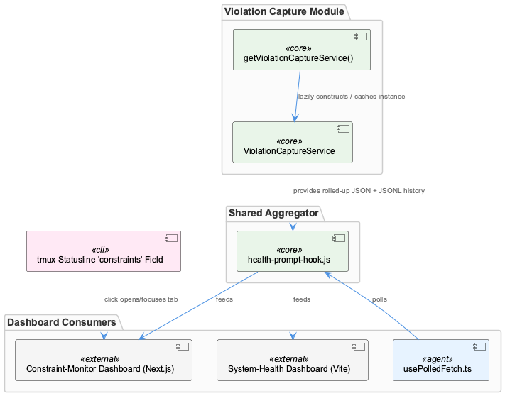
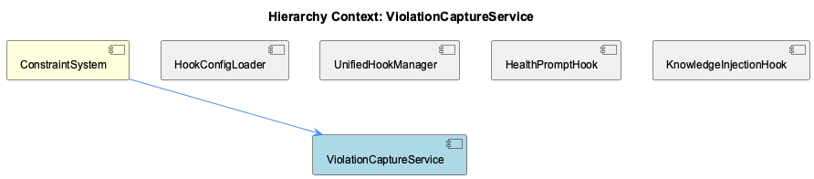

# ViolationCaptureService

**Type:** SubComponent

## What It Is

ViolationCaptureService is implemented in `violation-capture-service.js`, exposing a `ViolationCaptureService` class alongside a `getViolationCaptureService` function. It is a child component of ConstraintSystem, which itself sits under the broader HookManagementSystem umbrella alongside siblings HookConfigLoader, UnifiedHookManager, HealthPromptHook, and KnowledgeInjectionHook. Beyond these two named artifacts, the retrieved code graph pass returned no method bodies, field names, or call sites, so this document is deliberately limited to what can be confirmed rather than restating unverified prior claims.

## Architecture and Design

The pairing of a bare `getX()` accessor function with a class (`getViolationCaptureService` / `ViolationCaptureService`) is consistent with a singleton-accessor pattern — lazily constructing and caching a single instance — but this is inferred from naming conventions only and is not confirmed by any retrieved source in this pass.

At the parent level, a shared-aggregator fan-out pattern is evident: violation data produced by this service is described elsewhere as being consumed through `health-prompt-hook.js` by two independently built and deployed frontends — a Next.js constraint-monitor dashboard and a Vite-based system-health-dashboard. This means ViolationCaptureService sits upstream of a one-to-many data distribution topology, even though the internal mechanics of how it writes or exposes that data could not be verified in this retrieval pass.

## Implementation Details

No method bodies, fields, or internal logic were retrieved for `ViolationCaptureService` or `getViolationCaptureService` in this pass. Prior claims about specifics — such as a 1000-entry cap via array slicing on a rolled-up history file, or a denylist-substring `sanitizeParams()` redaction step — are explicitly not re-confirmed here and are omitted rather than restated as verified fact. The four files actually retrieved during this analysis (`scripts/health-prompt-hook.js`, its stall-detection test, and the dashboard hooks `hooks.ts` and `usePolledFetch.ts`) belong to a sibling concern — the health-coordinator polling path and dashboard live-refresh hooks — not to this module, and none import, instantiate, or reference either artifact of ViolationCaptureService.

## Integration Points

Despite the lack of direct call-site evidence, session-level records establish real integration surfaces. Violation history this service is described as producing is tied to a UX path: the tmux statusline's "constraints" field opens or focuses the constraint-monitor dashboard tab, creating a hard dependency from a live terminal status indicator down to this service's persisted output. That output is also consumed through the shared aggregator `health-prompt-hook.js` by two separately versioned frontends (Next.js constraint-monitor dashboard and Vite-based system-health-dashboard), meaning any future schema change to what ViolationCaptureService writes must satisfy both consumers simultaneously. Within the ConstraintSystem parent, this service is grouped conceptually with HookConfigLoader and UnifiedHookManager, though no direct code-level relationship among them was retrieved.

## Usage Guidelines

Given the thin evidentiary base, the primary guideline is caution: do not assume the singleton pattern, the 1000-entry cap, or the `sanitizeParams()` redaction behavior are current without re-verifying against actual source in `violation-capture-service.js`. One work record ("Rec Project — Multi-Repo Commit Hygiene") is tagged against this component in the work-record index but describes an unrelated workspace entirely, and should be treated as a tagging error rather than genuine evidence. Any change to this service's output location, format, or tab-routing behavior must account for the tmux statusline's hard-coded click target and the dual-dashboard consumption path, since both are downstream dependents that were not designed against a single consumer.

INSUFFICIENT_EVIDENCE note (partial): while the component's existence and its two named artifacts are confirmed via code graph, deeper implementation claims cannot be verified — future retrieval should specifically target `violation-capture-service.js` source rather than health-hook or dashboard files.

## Code Evidence

Key code artifacts grounding this entity's analysis:

**Structural:**
- ViolationCaptureService (class) in violation-capture-service.js
- getViolationCaptureService (function) in violation-capture-service.js

**Other:**
- The code graph confirms only two artifacts for this component: the `ViolationCaptureService` class and a `getViolationCaptureService` function, both located in `violation-capture-service.js`. No method bodies, field names, or call sites were returned by this retrieval pass, so the graph establishes that the module exists and exposes what looks like a singleton-accessor pattern (a bare `getX()` function paired with a class is a common way to lazily construct and cache one instance) but cannot confirm that shape from actual source.

## Work Record

What working sessions recorded about this entity — decisions taken, problems hit, and why things are the way they are:

- Statusline Click-Report Feature record establishes that clicking the 'constraints' field in the tmux statusline opens or focuses the constraint-monitor dashboard tab, tying this service's persisted violation history to a click-driven UX surface
- HealthDashboard — Performance/System-Health/Token-Cost Dashboards record distinguishes the Next.js-based constraint-monitor dashboard (consumer of this service's data) from the separate Vite-based system-health-dashboard
- The 'HealthDashboard — Performance/System-Health/Token-Cost Dashboards' work record establishes that violation data is consumed by two independently built and deployed frontends — a Next.js constraint-monitor dashboard and a Vite-based system-health-dashboard — both fed through the shared aggregator `health-prompt-hook.js`. This means any schema change to the artifacts ViolationCaptureService is described elsewhere as writing (a rolled-up JSON plus an append-only JSONL) has to satisfy two separately versioned consumers, not one, which raises the cost of any future migration of that data contract.
- The 'Statusline Click-Report Feature' work record establishes that the tmux statusline's 'constraints' field is wired to open or focus the constraint-monitor dashboard tab on click, creating a direct UX path from live hook enforcement to the persisted violation data this component is described as producing. This ties any future change to ViolationCaptureService's output location or tab routing to a hard dependency from the terminal status line, since the click target must remain addressable.
- A 'Rec Project — Multi-Repo Commit Hygiene' work record is tagged against ViolationCaptureService in the work-record index but its own summary describes an unrelated workspace (GHE repo management, meeting transcription, EF-412 feedback filing) with no mention of violations, hooks, or capture logic. This looks like a tagging/attribution error in the recorder rather than genuine evidence about this component, and should not be treated as informative about ViolationCaptureService's behavior.

## Hierarchy Context

### Parent
- [ConstraintSystem](./ConstraintSystem.md) -- [SESSION] Statusline Click-Report Feature record establishes that clicking the 'constraints' field in the tmux statusline opens or focuses the constraint-monitor dashboard tab, tying HookManagementSystem's violation data to a click-driven UX surface

### Siblings
- [HookConfigLoader](./HookConfigLoader.md) -- [CGR] HookConfigLoader (class) in hook-config.js
- [UnifiedHookManager](./UnifiedHookManager.md) -- [CGR] UnifiedHookManager (class) in hook-manager.js
- [HealthPromptHook](./HealthPromptHook.md) -- [SESSION] obs-api Service Lifecycle and Dev Workflow Resumption record notes a related coverage-metric bug in obs-api counting 'observations' and 'digests' entity types in a ratio denominator that should exclude them, showing this hook's upstream data source has known accuracy gaps
- [KnowledgeInjectionHook](./KnowledgeInjectionHook.md) -- [LLM] None of the supplied code files implement or reference a component named 'KnowledgeInjectionHook'. scripts/health-prompt-hook.js implements a UserPromptSubmit hook that injects *health* status text into Claude's context via the SPEC R8 envelope (`{ hookSpecificOutput: { hookEventName: 'UserPromptSubmit', additionalContext } }`), which is structurally the kind of thing a knowledge-injection hook would also do (inject a context string ahead of a prompt), but it is a distinct, named component (health, not knowledge) with its own test file (tests/integration/health-prompt-hook-stall.test.mjs). The other two files, integrations/system-health-dashboard/src/components/workflow/hooks.ts and integrations/system-health-dashboard/src/hooks/usePolledFetch.ts, are React hooks for dashboard data-fetching (useWorkflowDefinitions, useRecentCalls, usePolledFetch) and have no relationship to knowledge injection at all — they surfaced only because the retrieval matched the generic term 'hooks'.

---

*Generated from 13 observations*
