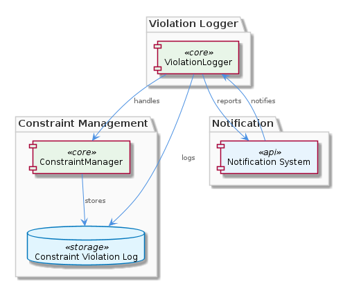
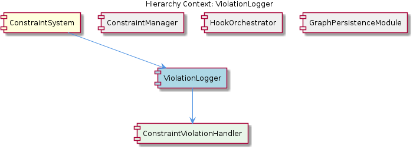

# ViolationLogger

**Type:** SubComponent

The ViolationLogger might have a mechanism to report constraint violations, potentially using a notification system or API.

## What It Is  

The **ViolationLogger** is a sub‑component of the **ConstraintSystem** that is responsible for recording, persisting, and exposing constraint‑violation events.  Although the exact source file is not enumerated in the observations, the component is expected to live in a module named `violation-logger.ts`, following the naming convention used by other TypeScript sources in the codebase.  Its primary purpose is to capture violations identified by the **ConstraintManager** and make them available to downstream consumers such as monitoring agents, reporting dashboards, or automated remediation workflows.  

Within the hierarchy, the ViolationLogger owns a **ConstraintViolationHandler** child, which encapsulates the logic for interpreting raw violation data and converting it into a structured log entry.  By delegating this work to a dedicated handler, the logger remains focused on storage and notification concerns while the handler deals with domain‑specific parsing and enrichment.  

The component sits alongside siblings **ConstraintManager**, **HookOrchestrator**, and **GraphPersistenceModule** inside the same parent **ConstraintSystem**.  All of these siblings share a common reliance on the **GraphDatabaseAdapter** (implemented in `storage/graph-database-adapter.ts`) for durable persistence, suggesting that the ViolationLogger may also lean on that adapter—directly or through an abstraction—to record violations in the graph database.

---

## Architecture and Design  

The observations point to a **Repository‑style** design for the ViolationLogger.  Rather than scattering persistence logic throughout the system, the logger likely presents a clean API (`logViolation`, `queryViolations`, etc.) that abstracts the underlying storage mechanism—whether that be an in‑memory log, a relational table, or the existing graph database used by the **ConstraintSystem**.  This aligns with the hinted “Repository pattern” and encourages a separation of concerns: the logger focuses on *what* to store, while the repository implementation decides *how* to store it.  

Interaction with other components follows a **pipeline** pattern.  The **ConstraintManager** detects a rule breach, creates a **ConstraintViolation** object, and forwards it to the ViolationLogger.  The logger then invokes its **ConstraintViolationHandler** child to enrich the payload (e.g., add timestamps, severity tags, or contextual metadata).  After enrichment, the logger persists the entry via its repository and optionally triggers a notification channel (e.g., an event bus or API endpoint) so that observers such as the **ContentValidationAgent** can react in near‑real time.  

The component also appears to support **filtering and prioritization**.  Observations mention the ability to “filter or prioritize constraint violations based on severity or other factors.”  This suggests that the logger either stores severity as a first‑class attribute or provides query helpers that allow callers to retrieve only high‑impact violations.  Such a design enables downstream services to focus on the most critical issues without scanning the entire log.

---

## Implementation Details  

* **File location** – The most probable implementation file is `violation-logger.ts`.  The naming mirrors other TypeScript modules in the repository (e.g., `content-validation-agent.ts`) and provides a clear entry point for importers.  

* **Core class / interface** – Although no symbols were discovered, the component is expected to expose a class or service named `ViolationLogger`.  Typical methods inferred from the observations include:  
  * `logViolation(violation: ConstraintViolation): Promise<void>` – receives a violation object from the **ConstraintManager** and forwards it to the handler.  
  * `getViolations(filter?: ViolationFilter): Promise<ConstraintViolation[]>` – queries the underlying repository, applying severity or timestamp filters.  
  * `subscribe(callback: (violation: ConstraintViolation) => void): UnsubscribeHandle` – registers a listener for real‑time notification.  

* **ConstraintViolationHandler** – Implemented as a child component, this handler likely lives in a file such as `constraint-violation-handler.ts`.  Its responsibilities include:  
  * Normalizing raw violation data into a consistent schema.  
  * Attaching contextual information (e.g., the rule identifier, affected entity, execution trace).  
  * Determining severity based on rule metadata, which feeds the logger’s filtering logic.  

* **Repository abstraction** – The logger probably depends on an interface like `ViolationRepository` that abstracts persistence.  Concrete implementations may delegate to the **GraphDatabaseAdapter** (leveraging Graphology/LevelDB) or to a simpler file‑based log for lightweight deployments.  This abstraction makes it straightforward to swap storage back‑ends without affecting callers.  

* **Notification mechanism** – While the exact channel is not enumerated, the observation that the logger “might have a mechanism to report constraint violations, potentially using a notification system or API” implies an event emitter or HTTP webhook integration.  The logger could emit an event (`violationRecorded`) that the **HookOrchestrator** or external monitoring agents listen to.  

* **Severity filtering** – The logger likely stores a `severity` field (e.g., `LOW`, `MEDIUM`, `HIGH`) alongside each violation.  Query helpers can then apply `WHERE severity = 'HIGH'`‑style filters, enabling prioritized processing.

---

## Integration Points  

The ViolationLogger sits at the intersection of several system layers:  

1. **Upstream – ConstraintManager** – When a rule defined in the constraint configuration (see `integrations/mcp-constraint-monitor/docs/constraint-configuration.md`) fails, the **ConstraintManager** creates a `ConstraintViolation` object and calls `ViolationLogger.logViolation`.  This direct method call constitutes the primary integration surface.  

2. **Persistence – GraphDatabaseAdapter** – The logger’s repository is expected to reuse the same persistence stack as the rest of the **ConstraintSystem**.  By delegating to the `storage/graph-database-adapter.ts` module, the logger ensures that violation data lives in the same graph database that stores constraint definitions, enabling powerful cross‑entity queries (e.g., “which constraints on entity X have the most high‑severity violations?”).  

3. **Downstream – ContentValidationAgent & HookOrchestrator** – Both agents consume violation events to trigger alerts or corrective hooks.  The logger’s notification API (event emitter or webhook) provides a clean contract for these consumers, allowing them to react without tightly coupling to the logger’s internal storage format.  

4. **Sibling Collaboration** – While the **GraphPersistenceModule** focuses on generic graph persistence, the ViolationLogger specializes that capability for violation‑specific data.  The shared use of the graph adapter reduces duplication and promotes a unified data model across siblings.  

5. **External APIs** – If the system exposes a public API for audit purposes, the logger’s `getViolations` method can be wrapped by an HTTP controller, delivering JSON payloads to UI dashboards or third‑party compliance tools.

---

## Usage Guidelines  

* **Always route violations through the logger** – Directly writing to the graph database bypasses the enrichment performed by the **ConstraintViolationHandler** and skips the notification pipeline.  Use `ViolationLogger.logViolation` for every constraint breach.  

* **Leverage severity filtering** – When querying for violations, specify a `ViolationFilter` that includes a severity threshold.  This reduces data transfer and focuses attention on the most impactful issues.  

* **Subscribe to real‑time events for reactive workflows** – Services that need immediate awareness of violations (e.g., remediation bots) should register via `ViolationLogger.subscribe`.  Unsubscribe when the listener is no longer needed to avoid memory leaks.  

* **Prefer repository injection over concrete implementation** – When extending or testing the logger, inject a mock `ViolationRepository` rather than relying on the production graph adapter.  This keeps unit tests fast and deterministic.  

* **Document custom constraint rules** – Since the logger’s handler enriches violations based on rule metadata, ensure that any new constraint added to the configuration file (`constraint-configuration.md`) includes severity and contextual fields.  Missing metadata can lead to default low‑severity classification, which may hide critical problems.

---

### Architectural patterns identified  

* **Repository pattern** – abstracts persistence of violation records.  
* **Pipeline / Handler pattern** – `ConstraintViolationHandler` processes raw violations before storage.  
* **Observer / Event‑Driven pattern** – optional subscription mechanism for real‑time notification.  

### Design decisions and trade‑offs  

* **Centralized logging vs. distributed storage** – By funneling all violations through a single logger, the system gains consistency and a single point for enrichment, at the cost of a potential bottleneck under extreme violation rates.  
* **Graph database reuse** – Leveraging the existing `GraphDatabaseAdapter` avoids duplicate storage solutions but couples violation data to graph‑specific schemas, which may limit straightforward export to relational analytics tools.  
* **Severity‑first filtering** – Prioritizing high‑severity violations improves operational focus but requires accurate severity metadata; mis‑classification can either flood the system with noise or hide serious issues.  

### System structure insights  

The ViolationLogger is a leaf node in the **ConstraintSystem** hierarchy, directly under the parent and exposing a child handler.  Its position mirrors that of other subsystem loggers (e.g., a hypothetical **HookOrchestrator** logger) and shares the graph persistence backbone with its siblings, reinforcing a cohesive architectural layer for stateful components.  

### Scalability considerations  

* **Throughput** – If the volume of violations spikes (e.g., during bulk data imports), the logger’s repository must support batch writes or async buffering to avoid back‑pressure on the **ConstraintManager**.  
* **Horizontal scaling** – Because the logger’s persistence is abstracted, scaling out can be achieved by deploying multiple logger instances behind a load balancer, all pointing to a shared graph database cluster.  
* **Event fan‑out** – The subscription model should employ a lightweight message broker (e.g., Redis Pub/Sub) rather than direct in‑process callbacks when many downstream consumers exist, to prevent excessive CPU usage.  

### Maintainability assessment  

The clear separation between **ViolationLogger**, **ConstraintViolationHandler**, and the repository interface makes the component highly modular.  Adding new storage back‑ends or extending the enrichment logic can be done in isolation, reducing regression risk.  However, the reliance on the shared `GraphDatabaseAdapter` means that changes to that adapter (e.g., schema migrations) must be coordinated across all siblings, introducing a coupling point that requires careful versioning and integration testing.

## Hierarchy Context

### Parent
- [ConstraintSystem](./ConstraintSystem.md) -- [LLM] The ConstraintSystem component utilizes the GraphDatabaseAdapter for persistence, which is implemented in the storage/graph-database-adapter.ts file. This adapter enables the system to store and manage constraints in a graph database, utilizing Graphology and LevelDB for efficient data storage and retrieval. The adapter also features automatic JSON export sync, allowing for seamless data exchange between the graph database and other components. For example, the ContentValidationAgent, located in integrations/mcp-server-semantic-analysis/src/agents/content-validation-agent.ts, relies on the GraphDatabaseAdapter to retrieve and validate entity content against configured rules.

### Children
- [ConstraintViolationHandler](./ConstraintViolationHandler.md) -- The integrations/mcp-constraint-monitor/docs/constraint-configuration.md file suggests that constraint configuration is a critical aspect of the system, implying that the ViolationLogger must handle various types of constraint violations.

### Siblings
- [ConstraintManager](./ConstraintManager.md) -- The ConstraintManager likely interacts with the GraphDatabaseAdapter in storage/graph-database-adapter.ts to store and manage constraints.
- [HookOrchestrator](./HookOrchestrator.md) -- The HookOrchestrator might be related to the Copi project in integrations/copi, which has documentation on hook functions and usage.
- [GraphPersistenceModule](./GraphPersistenceModule.md) -- The GraphPersistenceModule might be related to the GraphDatabaseAdapter, as it utilizes Graphology and LevelDB for persistence.

---

*Generated from 6 observations*
