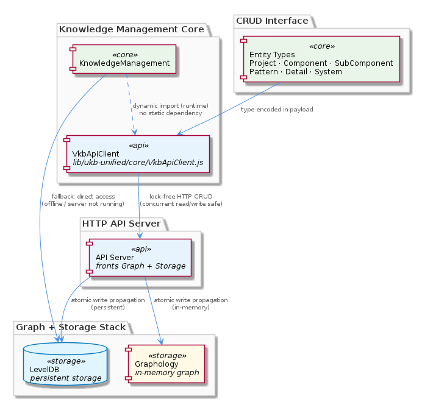
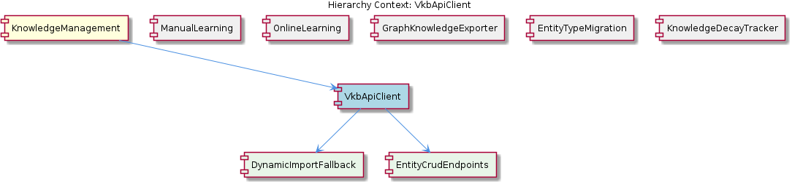

# VkbApiClient

**Type:** SubComponent

VkbApiClient is located at lib/ukb-unified/core/VkbApiClient.js and is dynamically imported at runtime, so callers must handle the case where the import fails (server not running) and fall back to direct LevelDB access

# VkbApiClient — Technical Insight Document

## What It Is

VkbApiClient is implemented at `lib/ukb-unified/core/VkbApiClient.js` and serves as the HTTP-based client interface to the VKB (Versioned Knowledge Base) server within the broader KnowledgeManagement component. Rather than being statically wired into the module graph, it is loaded via dynamic import at runtime, which fundamentally shapes how callers must interact with it. The client exposes lock-free entity CRUD operations across all six canonical entity types — Project, Component, SubComponent, Pattern, Detail, and System — that flow through the KnowledgeManagement subsystem.

Architecturally, VkbApiClient occupies a privileged position within KnowledgeManagement: it is the *preferred* path for entity manipulation when the VKB server is running, with direct LevelDB access (via GraphDatabaseService) serving only as a fallback. The client communicates with a server that fronts the Graphology in-memory graph plus LevelDB persistent storage stack, so writes propagate atomically (from the client's perspective) to both layers.

## Architecture and Design

The defining architectural decision in VkbApiClient is the **dynamic import strategy**. By being loaded only at call time rather than at application startup, VkbApiClient introduces no static dependency in the module graph of its parent KnowledgeManagement component. This is what enables the parent component to advertise itself as runnable in offline/embedded scenarios — if the VKB HTTP server is not running, the core knowledge management code does not fail to load; it simply falls back to the direct file access path through GraphDatabaseService. This design responsibility is captured concretely by the child sub-entity `DynamicImportFallback`, which formalizes the requirement that callers wrap the import in try/catch or equivalent promise rejection handling.

The second defining architectural choice is **lock-free entity CRUD**. Concurrent readers and writers do not block one another, which is the primary architectural justification for preferring the HTTP API over direct file access. Direct LevelDB access from multiple processes is inherently more contention-prone, whereas funneling through the server allows the server to coordinate access on behalf of all clients. This trade-off — accepting an extra network hop in exchange for concurrency safety and atomic dual-layer (graph + LevelDB) propagation — is the key reason VkbApiClient exists as a distinct sub-component.

The endpoint surface itself is articulated by the child sub-entity `EntityCrudEndpoints`, which dictates that the routes must cover at minimum the entity types tracked by the knowledge graph (nodes, edges, typed entities) with distinct routes per operation. The entity type is encoded in the request payload rather than encoded into a proliferation of type-specific endpoints, meaning a single CRUD pipeline handles all six canonical entity types uniformly.

## Implementation Details

The module at `lib/ukb-unified/core/VkbApiClient.js` is structured around the dynamic-import lifecycle. Because the import can fail at call time (rather than at process startup), the client's calling convention demands defensive code at every invocation site: a try/catch around the import, followed by either using the resolved client or branching to the GraphDatabaseService fallback. This pattern is what `DynamicImportFallback` codifies as a child concern of VkbApiClient.

The CRUD interface is type-agnostic at the API boundary — the entity's type (Project, Component, SubComponent, Pattern, Detail, or System) is a field within the request payload. This keeps the client's surface area small: rather than `createProject`, `createComponent`, etc., callers issue a generic create call with type metadata embedded. This uniformity matches how the parent KnowledgeManagement component models all six canonical types with the same Graphology + LevelDB substrate and the same ontology classification, bi-temporal staleness tracking, embedding vectors, and hierarchy relationship metadata.

On the server side (which VkbApiClient does not implement but which it depends on), the receiving endpoints translate the HTTP request into a Graphology graph mutation and a LevelDB persistence operation. From the client's perspective, these are atomic — the client never observes a state where the in-memory graph and the persistent storage disagree about a write it issued.

## Integration Points

VkbApiClient is contained by KnowledgeManagement, which is the component responsible for graph-based knowledge storage, entity lifecycle management, and query capabilities. KnowledgeManagement combines a Graphology in-memory graph with LevelDB persistent storage via GraphDatabaseService, and VkbApiClient is the lock-free HTTP route into that stack.

The client's children — `DynamicImportFallback` and `EntityCrudEndpoints` — represent the two facets of its contract with callers: the loading discipline (fallback handling on import failure) and the API surface (per-operation routes covering all tracked entity types).

Among its siblings within KnowledgeManagement, VkbApiClient interoperates with several components that touch the same underlying graph:
- **ManualLearning** writes typed nodes (the same six canonical types) into the GraphDatabaseService-backed graph; when the server is running, these writes can be routed through VkbApiClient to benefit from lock-free concurrency.
- **OnlineLearning** ingests git history, LSL sessions, and code analysis outputs and maps findings to the same canonical typed entity set before writing — making it another natural consumer of the VkbApiClient CRUD path.
- **GraphKnowledgeExporter** subscribes to `entity:stored` events from GraphDatabaseService. Because VkbApiClient writes propagate through the server to GraphDatabaseService, exports remain eventually consistent with VkbApiClient-originated mutations.
- **EntityTypeMigration** (`scripts/migrate-graph-db-entity-types.js`) operates on the same canonical six-type set that VkbApiClient routes through its CRUD endpoints, ensuring schema alignment between historical data and the client's current type contract.
- **KnowledgeDecayTracker** embeds staleness state directly in `EntityMetadata`, so any read served by VkbApiClient already includes decay signals without additional <USER_ID_REDACTED>.

## Usage Guidelines

The most important rule when using VkbApiClient is to **always treat the import as failable**. Because the module is loaded via dynamic import, the resolution itself can throw or reject at call time — typically when the VKB server is not running. Callers must wrap the import in `try/catch` or attach `.catch()` handlers to the import promise, and on failure, route the operation to direct GraphDatabaseService access instead. This is not optional; it is the architectural contract that allows KnowledgeManagement to function in offline and embedded scenarios.

**Prefer VkbApiClient when the server is running.** The lock-free CRUD semantics are the reason this client exists. Direct file access through GraphDatabaseService should be the explicit fallback, not the default choice, because direct access does not coordinate concurrent readers and writers in the same way.

**Encode entity type in the payload, not in the route choice.** All six canonical types (Project, Component, SubComponent, Pattern, Detail, System) share the same CRUD interface. Do not introduce type-specific client wrappers that defeat this uniformity — the design intent is a single, type-parameterized API surface that mirrors the underlying Graphology/LevelDB schema.

**Treat writes as atomically dual-layered.** From the client's vantage point, a successful CRUD response means both the in-memory Graphology graph and the persistent LevelDB store have been updated. Do not write follow-up code that separately reconciles these layers; that responsibility belongs to the server. Conversely, downstream consumers like GraphKnowledgeExporter become eventually consistent through their event subscriptions, not through additional client-side coordination.

**Do not assume the static module graph contains VkbApiClient.** Tooling that walks `require`/`import` statements will not find this client as a dependency of KnowledgeManagement, and that is by design. Any analysis or bundling logic must account for the dynamic import to correctly model the dependency relationship.

## Hierarchy Context

### Parent
- [KnowledgeManagement](./KnowledgeManagement.md) -- The KnowledgeManagement component provides graph-based knowledge storage, entity lifecycle management, and query capabilities for the Coding project. At its core it combines a Graphology in-memory graph with LevelDB persistent storage (via GraphDatabaseService), accessed either through a lock-free VKB HTTP API when the server is running or through direct file access as a fallback. The component manages typed entities (Project, Component, SubComponent, Pattern, Detail, System) with rich metadata including ontology classification, bi-temporal staleness tracking, embedding vectors, and hierarchy relationships.

### Children
- [DynamicImportFallback](./DynamicImportFallback.md) -- VkbApiClient at lib/ukb-unified/core/VkbApiClient.js is loaded via dynamic import (not static require/import), which means the module resolution can fail at call time rather than at application startup — callers must wrap the import in try/catch or equivalent promise rejection handling.
- [EntityCrudEndpoints](./EntityCrudEndpoints.md) -- VkbApiClient (lib/ukb-unified/core/VkbApiClient.js) serves the KnowledgeManagement component, so its endpoint surface must cover at minimum the entity types tracked by the knowledge graph (nodes, edges, typed entities) with distinct routes per operation.

### Siblings
- [ManualLearning](./ManualLearning.md) -- ManualLearning entities are stored as typed nodes (Project, Component, SubComponent, Pattern, Detail, System) in the GraphDatabaseService-backed graph, using the same ontology classification fields as automated entities
- [OnlineLearning](./OnlineLearning.md) -- The batch analysis pipeline ingests git history, LSL sessions, and code analysis outputs, mapping findings to the canonical typed entity set (Project, Component, SubComponent, Pattern, Detail, System) before writing to GraphDatabaseService
- [GraphKnowledgeExporter](./GraphKnowledgeExporter.md) -- GraphKnowledgeExporter subscribes to entity:stored events emitted by GraphDatabaseService, making exports eventually consistent with writes rather than synchronously blocking them
- [EntityTypeMigration](./EntityTypeMigration.md) -- scripts/migrate-graph-db-entity-types.js consolidates legacy entity type names into the canonical six-type set (Project, Component, SubComponent, Pattern, Detail, System), rewriting node attributes in the Graphology graph
- [KnowledgeDecayTracker](./KnowledgeDecayTracker.md) -- KnowledgeDecayTracker embeds staleness state directly in EntityMetadata rather than a separate store, so every entity read returns its own decay signal without additional <USER_ID_REDACTED>

---

*Generated from 5 observations*
