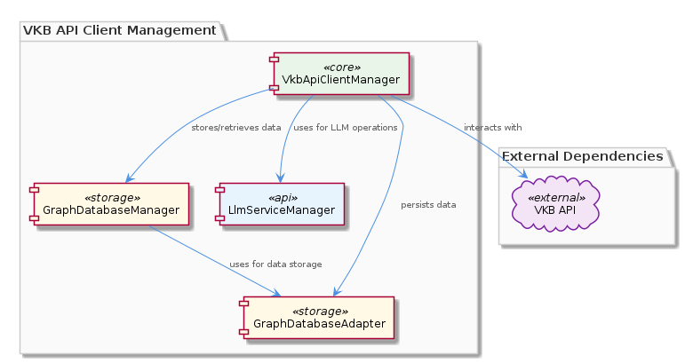
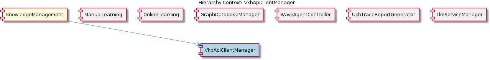

# VkbApiClientManager

**Type:** SubComponent

VkbApiClientManager likely interacts with the GraphDatabaseManager for storing and retrieving data related to VKB API interactions.

## What It Is  

`VkbApiClientManager` is a sub‑component of the **KnowledgeManagement** layer. Although the source repository does not expose concrete symbols for this manager, the surrounding observations make its role clear: it is the orchestrator for all interactions with the VKB (Virtual Knowledge Base) API. It lives alongside sibling components such as **ManualLearning**, **OnlineLearning**, **GraphDatabaseManager**, **WaveAgentController**, **UkbTraceReportGenerator**, and **LlmServiceManager**. The manager is expected to sit in the same package hierarchy as these peers and to be invoked by higher‑level services that need to query, update, or otherwise manipulate VKB‑backed knowledge.

The manager’s primary responsibilities include:

* Translating client‑side VKB requests into calls that the **GraphDatabaseManager** can persist or retrieve.  
* Leveraging the **GraphDatabaseAdapter** (found at `integrations/mcp-server-semantic-analysis/src/storage/graph-database-adapter.ts`) for low‑level graph storage operations.  
* Coordinating with **LlmServiceManager** when language‑model‑driven enrichment of VKB data is required.  
* Applying intelligent routing logic and, where possible, serverless access patterns to the underlying knowledge graph.  
* Employing caching or other performance‑optimisation techniques to keep VKB‑related latency low.

These responsibilities position `VkbApiClientManager` as the “gateway” through which external callers reach the knowledge graph while abstracting away the complexities of storage, LLM integration, and routing.

---

## Architecture and Design  

The design of `VkbApiClientManager` follows a **layered orchestration** pattern. At the top level it receives API calls, then delegates to lower‑level services:

1. **Routing Layer** – Determines the optimal path for a request, possibly selecting a serverless function or a cached response. The mention of “intelligent routing” suggests a decision‑making component that evaluates request characteristics (e.g., read‑vs‑write, latency requirements) before forwarding.

2. **Persistence Layer** – Calls into **GraphDatabaseManager**, which itself uses **GraphDatabaseAdapter** (`integrations/mcp-server-semantic-analysis/src/storage/graph-database-adapter.ts`). This adapter provides Graphology + LevelDB persistence, enabling efficient graph storage and automatic JSON export synchronization. The manager therefore does not directly manipulate the graph; it relies on the manager‑adapter contract.

3. **LLM Enrichment Layer** – When a VKB request requires natural‑language processing or knowledge synthesis, the manager invokes **LlmServiceManager**. This mirrors the pattern used by **WaveAgentController**, which also depends on the LLM service for initialization and inference.

4. **Caching Layer** – The observation that the manager “may utilize caching or other optimisation techniques” indicates a typical read‑through/write‑through cache placed between the routing and persistence layers. This improves throughput for frequently accessed VKB entities.

The overall architecture is **modular**: each sibling component (ManualLearning, OnlineLearning, etc.) shares the same underlying persistence and LLM services, promoting reuse and consistency. The relationship diagram below visualises these connections.

### Architectural Patterns Identified
* Layered orchestration (routing → persistence → LLM enrichment)  
* Adapter pattern (via `GraphDatabaseAdapter`)  
* Cache‑aside / read‑through caching  
* Service‑oriented interaction between sibling components (shared use of GraphDatabaseManager and LlmServiceManager)  

---

## Implementation Details  

While the concrete class names and methods are not listed, the implementation can be inferred from the surrounding ecosystem:

* **Entry Point** – A public method such as `handleVkbRequest(request: VkbRequest): Promise<VkbResponse>` would accept a structured request object, validate it, and forward it to the routing logic.  
* **Routing Logic** – Likely encapsulated in a helper like `VkbRouter` that evaluates request metadata (e.g., operation type, required latency) and decides whether to serve from cache, invoke a serverless function, or go straight to the graph manager.  
* **Graph Interaction** – The manager would call `GraphDatabaseManager.storeVkbEntity(entity)` or `GraphDatabaseManager.fetchVkbEntity(id)`. Under the hood, `GraphDatabaseManager` uses the **GraphDatabaseAdapter** (`integrations/mcp-server-semantic-analysis/src/storage/graph-database-adapter.ts`) which abstracts Graphology operations and LevelDB persistence. This adapter also handles automatic JSON export, ensuring that VKB data is consistently serialized for downstream consumers.  
* **LLM Integration** – When enrichment is required, the manager forwards the relevant payload to `LlmServiceManager.processVkbPayload(payload)`. The LLM service may return synthesized knowledge that the manager then merges back into the graph via the persistence layer.  
* **Caching** – A cache client (e.g., Redis or an in‑process LRU cache) would be consulted before hitting the graph. Cache keys could be derived from VKB entity identifiers, and write‑through semantics would keep the cache coherent after updates.  

Because the component is part of **KnowledgeManagement**, it inherits the same error‑handling and logging conventions used across the sibling services, ensuring uniform observability.

---

## Integration Points  

`VkbApiClientManager` sits at the crossroads of several critical subsystems:

| Integration Target | Interaction Detail | Reason |
|--------------------|--------------------|--------|
| **GraphDatabaseManager** | Calls for persisting or retrieving VKB entities. | Centralised graph storage; leverages the adapter for low‑level operations. |
| **GraphDatabaseAdapter** (`integrations/mcp-server-semantic-analysis/src/storage/graph-database-adapter.ts`) | Indirectly used via the manager. | Provides Graphology + LevelDB persistence and automatic JSON export. |
| **LlmServiceManager** | Invoked for language‑model‑driven enrichment or inference. | Mirrors the pattern used by **WaveAgentController**. |
| **Caching Layer** (unspecified cache implementation) | Read‑through/write‑through cache checks before graph access. | Improves performance for hot VKB data. |
| **Sibling Components** (ManualLearning, OnlineLearning, etc.) | Share the same persistence and LLM services; may call `VkbApiClientManager` for VKB‑specific operations. | Promotes consistency across knowledge‑related workflows. |

These integration points reflect a **service‑oriented** design where each subsystem offers a well‑defined interface, reducing coupling and simplifying testing.

---

## Usage Guidelines  

1. **Prefer the Manager for All VKB Access** – Direct interaction with `GraphDatabaseManager` or the adapter should be avoided by external callers; the manager encapsulates routing, caching, and LLM enrichment logic.  
2. **Leverage Caching Transparently** – When reading VKB entities, simply request through the manager; the internal cache will be consulted automatically. Avoid manual cache invalidation unless you are updating the underlying graph directly (which is discouraged).  
3. **Handle LLM‑Related Errors Gracefully** – Calls that trigger `LlmServiceManager` may fail due to model latency or quota limits. Wrap manager calls in try/catch blocks and provide fallback logic (e.g., serve stale cached data).  
4. **Observe Idempotency** – Update operations should be designed to be idempotent because the manager may retry after transient failures, especially in serverless execution contexts.  
5. **Monitor Performance** – Use the logging and metrics hooks provided by the KnowledgeManagement layer to track cache hit ratios, routing decisions, and graph latency. This data is essential for tuning the intelligent routing algorithms.  

---

### Design Decisions and Trade‑offs  

* **Adapter‑Based Persistence** – By delegating graph operations to `GraphDatabaseAdapter`, the system gains flexibility (swap LevelDB for another store) but adds an extra indirection layer that can complicate debugging.  
* **Intelligent Routing vs. Simplicity** – Routing decisions improve latency and cost (via serverless execution) but increase the complexity of the manager’s control flow.  
* **Caching Layer** – Provides performance gains at the cost of cache coherence management; the manager must ensure write‑through semantics to avoid stale reads.  

### System Structure Insights  

* The manager is a **central hub** within KnowledgeManagement, mirroring the role of other hubs like `WaveAgentController`.  
* Shared dependencies (GraphDatabaseManager, LlmServiceManager) create a **common service backbone** that all sibling components rely on, fostering uniform behaviour across the knowledge pipeline.  

### Scalability Considerations  

* **Horizontal Scaling** – Because the manager’s routing can invoke serverless functions, it can scale out automatically under load without a single point of contention.  
* **Cache Sharding** – For very large VKB workloads, the cache should be sharded or distributed to avoid bottlenecks.  
* **Graph Backend** – Graphology + LevelDB offers good read performance, but write‑heavy scenarios may need a more robust graph store; the adapter pattern makes such a migration feasible.  

### Maintainability Assessment  

* **Modular Interfaces** – Clear separation between routing, persistence, and LLM enrichment keeps the codebase approachable.  
* **Shared Adapters** – Centralising graph access in `GraphDatabaseAdapter` reduces duplication but makes the adapter a critical piece; any change must be carefully versioned.  
* **Observability** – Leveraging the same logging/metrics framework as sibling components simplifies operational monitoring.  

Overall, `VkbApiClientManager` embodies a well‑structured, service‑oriented approach that balances performance (through caching and intelligent routing) with maintainability (via adapters and shared services).

## Hierarchy Context

### Parent
- [KnowledgeManagement](./KnowledgeManagement.md) -- [LLM] The KnowledgeManagement component utilizes the GraphDatabaseAdapter (integrations/mcp-server-semantic-analysis/src/storage/graph-database-adapter.ts) for persisting data in a graph database with automatic JSON export synchronization. This design decision enables efficient storage and retrieval of knowledge entities and relationships, which is crucial for the system's overall goals of knowledge discovery and insight generation. Furthermore, the use of Graphology+LevelDB persistence ensures a scalable and performant solution for managing the knowledge graph.

### Siblings
- [ManualLearning](./ManualLearning.md) -- ManualLearning likely interacts with the GraphDatabaseManager to store and retrieve manually created knowledge entities and relationships.
- [OnlineLearning](./OnlineLearning.md) -- OnlineLearning likely employs the GraphDatabaseManager to store and manage automatically extracted knowledge entities and relationships.
- [GraphDatabaseManager](./GraphDatabaseManager.md) -- GraphDatabaseManager likely utilizes the GraphDatabaseAdapter for interacting with the graph database.
- [WaveAgentController](./WaveAgentController.md) -- WaveAgentController likely interacts with the LlmServiceManager for LLM operations and initialization.
- [UkbTraceReportGenerator](./UkbTraceReportGenerator.md) -- UkbTraceReportGenerator likely interacts with the GraphDatabaseManager to retrieve data for trace reports.
- [LlmServiceManager](./LlmServiceManager.md) -- LlmServiceManager likely interacts with other components for LLM-related tasks, such as the GraphDatabaseManager and WaveAgentController.

---

*Generated from 6 observations*
