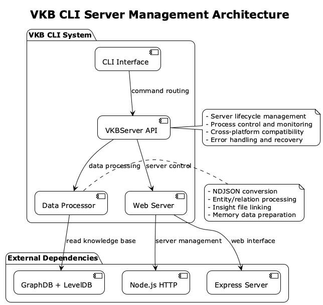
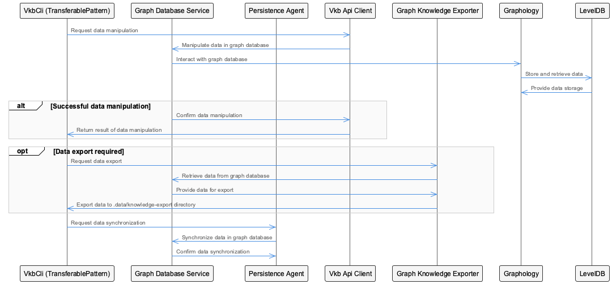
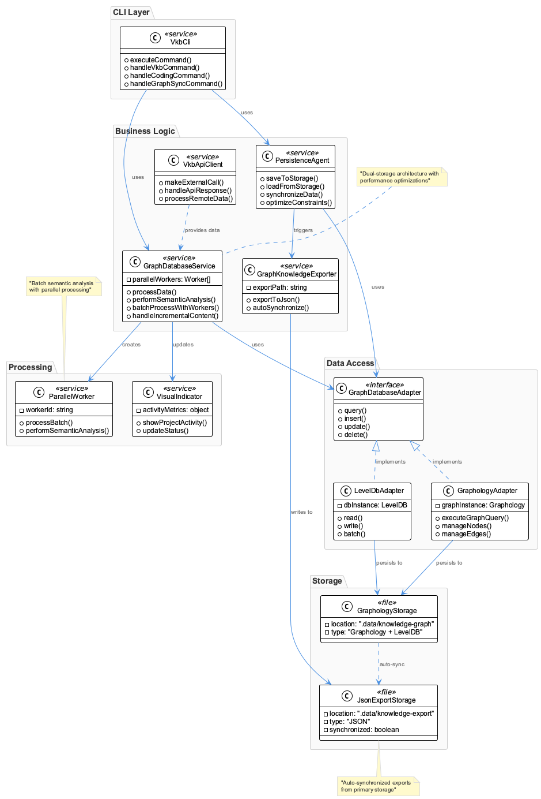
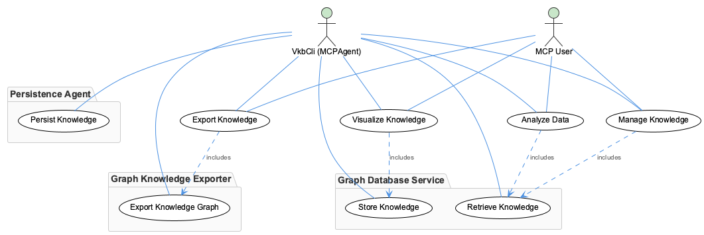

# VkbCli

**Type:** GraphDatabase

Recent development activity focuses on performance improvements with parallel workers for batch semantic analysis, constraint optimization for incremental content handling in edit/write operations, an...

# VkbCli: Deep Architectural Analysis

## System Purpose and Problem Domain

VkbCli represents a sophisticated knowledge management system that addresses the fundamental challenge of maintaining both performance-optimized graph data structures and human-readable knowledge exports. The system solves the dual problem of enabling efficient graph-based queries and operations while simultaneously maintaining accessible JSON representations for external consumption, version control, and data portability.

The core insight here is that VkbCli recognizes knowledge as inherently relational data that requires both computational efficiency and human accessibility. By implementing a dual-storage strategy, it acknowledges that different consumers of knowledge data have fundamentally different requirements - internal operations need graph traversal performance, while external integrations and human users need structured, portable formats.

## Architectural Patterns and Design Philosophy

The system demonstrates a clear implementation of the **Command Query Responsibility Segregation (CQRS)** pattern through its dual-storage architecture. The Graphology + LevelDB combination serves as the write-optimized command store, while the JSON exports function as the read-optimized query store for external consumers. This separation allows each storage mechanism to be optimized for its specific use case without compromising the other.

The **Adapter Pattern** is prominently featured through the GraphDatabaseAdapter, which abstracts data access operations and provides a clean boundary between business logic and storage implementation. This design decision enables the system to evolve its storage strategy without affecting higher-level components.

The architecture also exhibits characteristics of **Domain-Driven Design**, with clear separation between the GraphDatabaseService (domain logic), PersistenceAgent (infrastructure), and VkbApiClient (external integration). The VkbCli doesn't just manage data - it manages a knowledge domain with specific business rules and operations.

## Storage Strategy and Implementation Sophistication

The choice of Graphology + LevelDB for primary storage reveals sophisticated understanding of graph database requirements. Graphology provides in-memory graph manipulation capabilities with efficient algorithms, while LevelDB offers persistent, key-value storage with excellent write performance and built-in compression. This combination suggests the system prioritizes write-heavy workloads with complex graph operations.

The auto-synchronized JSON export mechanism represents a **materialized view pattern**, where complex graph data is pre-computed into simplified formats. The `.data/knowledge-export` directory structure suggests a file-based approach that leverages filesystem semantics for organization and access control.

The recent introduction of parallel workers for batch semantic analysis indicates the system has evolved beyond simple CRUD operations to include computationally intensive knowledge processing. This suggests VkbCli is not just storing knowledge but actively analyzing and enriching it through semantic operations.

## Integration Architecture and System Boundaries

The three-command CLI interface (`vkb`, `coding`, `graph-sync`) reveals a thoughtful separation of concerns. This structure suggests `vkb` handles general knowledge operations, `coding` manages development-specific workflows, and `graph-sync` orchestrates the dual-storage synchronization. This separation indicates the system serves multiple user personas with distinct workflows.

The VkbApiClient component suggests VkbCli operates within a larger ecosystem, likely consuming or publishing knowledge data to external services. This positions VkbCli as a local knowledge management node in a distributed knowledge network, rather than an isolated system.

The GraphKnowledgeExporter's specific targeting of the `.data/knowledge-export` directory indicates a standardized interface for external systems. This directory likely serves as a contract point for other tools, CI/CD systems, or documentation generators.

## Performance and Scalability Considerations

The recent focus on constraint optimization for incremental content handling reveals the system has encountered real-world performance challenges with large knowledge bases. The shift toward incremental processing rather than full dataset operations suggests VkbCli has matured beyond prototype stage to handle substantial knowledge volumes.

Parallel workers for semantic analysis indicate the system recognizes that knowledge processing operations are CPU-intensive and benefit from horizontal scaling within a single node. This architectural choice suggests the system prioritizes response time over resource efficiency, indicating it serves interactive workflows.

The deprecation of `shared-memory.json` provides insight into the system's evolution - it likely started with simpler shared-state mechanisms but evolved toward more sophisticated persistence strategies as complexity increased.

## Maintainability and Evolution Trajectory

The clear separation between GraphDatabaseService and GraphDatabaseAdapter demonstrates forward-thinking design that anticipates storage technology evolution. The system can migrate from LevelDB to other persistence engines without disrupting business logic.

The dual-storage architecture, while adding complexity, actually enhances long-term maintainability by providing multiple recovery paths and reducing coupling between internal operations and external integrations. If either storage mechanism fails, the system maintains operational capability through the other.

The component-based architecture with distinct responsibilities (PersistenceAgent, VkbApiClient, GraphKnowledgeExporter) suggests the system is designed for incremental enhancement rather than monolithic rebuilds. Each component can evolve independently as requirements change.

The emphasis on visual project activity indicators suggests the system recognizes the importance of operational visibility, indicating mature consideration of the human factors in knowledge management system adoption and daily use.

## Diagrams

### Architecture

### Sequence

### Class

### Use cases

---

*Generated from 3 observations*
