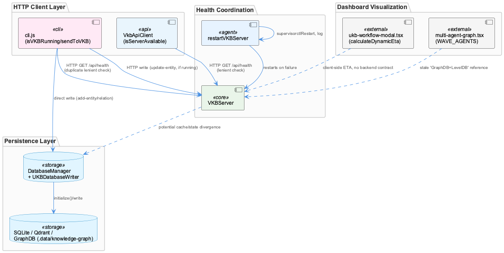
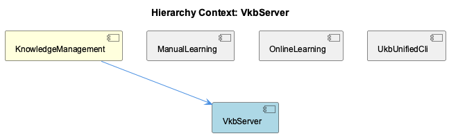

# VkbServer

**Type:** SubComponent

[Architecture Notes] VKBServer (index.js) is externally monitored and restartable via health-remediation-actions.js's restartVKBServer, implying it participates in the health-coordinator's automated recovery loop; Two independent CLI surfaces (lib/ukb-database/cli.js, lib/ukb-unified/cli.js via VkbApiClient) both speak to the VKB server over HTTP on a hardcoded localhost:8080 default, with no shared client library between them; Entity/relation writes can occur through two different paths (direct DatabaseManager/UKBDatabaseWriter vs. VKB server HTTP API), creating potential cache/state divergence given the parent component's caching layer; Dashboard visualization layer (system-health-dashboard) maintains its own hardcoded model of the backend pipeline's agents/substeps/storage targets, decoupled from and potentially drifting from the actual backend implementation (e.g., stale 'GraphDB + LevelDB' references post-KMCore migration); ETA/ timing estimation logic lives client-side in the dashboard rather than being computed and served by the workflow backend

# VkbServer — Technical Insight Document

## What It Is

VkbServer is the core long-running process of the KnowledgeManagement component, defined as the `VKBServer` class in `index.js`. It is the primary server-side implementation backing the Virtual Knowledge Base described by its parent component: a process that implements query logic, caching, and decay scheduling atop the KMCore graph database backend, rather than acting as a thin passthrough. Unlike typical stateless request handlers, VkbServer is explicitly treated as a monitored, restartable service — it has a dedicated recovery path, `restartVKBServer`, defined in `health-remediation-actions.js`, which calls `log` and `supervisorctlRestart` when failure conditions are detected.

## Architecture and Design

The dominant architectural pattern is **health-check-and-remediate**: VkbServer is paired with a purpose-built remediation action rather than relying on generic process supervision. This implies a health-coordinator subsystem that detects VKB-specific failure/hang states and triggers `restartVKBServer` — a design choice that acknowledges the server carries in-memory state (caches, decay schedules) that a naive restart could disrupt if not handled carefully.

A second defining pattern is **optimistic availability probing**. Both `VkbApiClient.isServerAvailable()` (`lib/ukb-unified/core/VkbApiClient.js:20-33`) and the near-identical `isVKBRunning()` in `lib/ukb-database/cli.js:33-41` treat any HTTP 200 from `/api/health` as sufficient evidence of availability, deliberately avoiding a strict `graph === true` gate. The inline rationale — "Entity APIs work via HTTP even if graph health check has issues" — reflects a trade-off favoring uptime/optimism over strict correctness, deferring failure detection to the actual CRUD call.

Third, the system exhibits a **dual-path (split-brain) persistence pattern**: some CLI commands (`add-entity`, `add-relation`) write directly to SQLite, Qdrant, and the graph DB path (`.data/knowledge-graph`) via `DatabaseManager`/`UKBDatabaseWriter` in `initializeDatabase()`, bypassing VkbServer entirely, while others (`update-entity`, via `updateEntityFromStdin()`) explicitly check `isVKBRunning()` first and prefer routing through the live server. This inconsistency creates a real risk that VkbServer's caching layer becomes stale relative to direct database writes.

## Implementation Details

At the core sits the `VKBServer` class (`index.js`), exposing HTTP endpoints (including `/api/health`) consumed by external clients. Its lifecycle is externally governed: `restartVKBServer` in `health-remediation-actions.js` orchestrates recovery by logging and invoking `supervisorctlRestart`.

Two structurally similar but independently implemented HTTP clients target this server's REST surface: the `VkbApiClient` class and the inline `sendToVKB`/`isVKBRunning` functions in `lib/ukb-database/cli.js`. Both hardcode `http://localhost:8080` as a default (overridable via `VKB_SERVER_URL` env var for the CLI, or constructor option for the client class), both wrap `fetch` with `AbortSignal.timeout`, and both parse JSON error bodies for `error.message`. This duplication means the HTTP contract (health/entities/relations) is stable enough to be reimplemented twice, but any server-side contract change must be manually mirrored in both places since neither imports the other.

On the dashboard side, `integrations/system-health-dashboard/src/components/workflow/multi-agent-graph.tsx` and `ukb-workflow-modal.tsx` maintain a hardcoded model of the backend pipeline (`WAVE_AGENTS`, `AGENT_SUBSTEPS`), including a `persistence` agent whose substeps still reference "GraphDB + LevelDB storage" — a documentation drift artifact from before the KMCore migration (guarded on the backend by `migrate-leveldb-to-kmcore.test.ts`, but not reflected in this UI metadata). The same modal implements `calculateDynamicEta()`, a hybrid, self-correcting ETA estimator blending live batch-duration averages, historical step medians (`getStepMedianDuration()`), and a linear-interpolation fallback, clamped to 30%–200% of the linear estimate with 1-second/30-minute absolute bounds.

## Integration Points

VkbServer integrates with the health-coordinator subsystem via `restartVKBServer`, participating in an automated recovery loop rather than passive supervision. It is consumed over HTTP by at least two independent CLI surfaces — `lib/ukb-database/cli.js` and `lib/ukb-unified/cli.js` (via `VkbApiClient`) — both defaulting to `localhost:8080`. Sibling component **UkbUnifiedCli** builds on `VkbApiClient` and orchestration classes (`WorkflowOrchestrator`, `TeamCheckpointManager`, `GapAnalyzer`) for incremental workflows, while sibling **ManualLearning** represents the same substrate accessed via three parallel mutation paths: direct DB writes, HTTP API writes, and the orchestrated pipeline — none of which enforce mutual exclusion. Sibling **OnlineLearning** reuses the same `calculateDynamicEta()` logic as a genuine online-learning loop for progress estimation, separate from VkbServer's own state. The dashboard's visualization layer maintains a decoupled, potentially drifting model of VkbServer's backend pipeline and storage targets.

## Usage Guidelines

Developers should treat VkbServer as stateful infrastructure, not a disposable process — any restart logic must account for caching and decay scheduling. Because `isServerAvailable()`/`isVKBRunning()` checks are intentionally lenient, callers should not assume a 200 health response guarantees full graph subsystem correctness; downstream code should handle CRUD-time failures explicitly. When modifying the VKB HTTP contract (endpoints, error shapes), update both `VkbApiClient` and `lib/ukb-database/cli.js` in lockstep, since there is no shared client library. Avoid introducing new direct-database-write code paths without considering cache staleness against a running VkbServer; prefer routing mutations through the server when it's live, following the `updateEntityFromStdin()` precedent. Finally, dashboard maintainers should treat `AGENT_SUBSTEPS` and ETA estimation logic as drift-prone: unlike the KMCore migration path (covered by `migrate-leveldb-to-kmcore.test.ts`), this UI metadata and `calculateDynamicEta()` lack regression tests and should be updated whenever backend batch/step semantics or storage backends change.

## Code Evidence

Key code artifacts grounding this entity's analysis:

**Structural:**
- VKBServer (class) in index.js
- restartVKBServer (method) in health-remediation-actions.js

**Relationships:**
- Calls: log, supervisorctlRestart

**Other:**
- The code graph identifies `VKBServer` as a class in `index.js` and `restartVKBServer` as a method in `health-remediation-actions.js`. This pairing indicates the VKB server is treated as a monitored, restartable long-running process rather than a stateless request handler — the existence of a dedicated remediation action implies the health-coordinator subsystem detects VKB server failure/hang conditions and has an automated recovery path distinct from a generic process supervisor restart. This aligns with the parent component's note that the server 'implements query logic, caching, and decay scheduling that must be preserved across any storage backend swap' — state that a naive restart could disrupt if not handled carefully by `restartVKBServer`.

## Hierarchy Context

### Parent
- [KnowledgeManagement](./KnowledgeManagement.md) -- [LLM] The KnowledgeManagement component centers on the VKB (Virtual Knowledge Base) server, which acts as the primary interface for storing, querying, and decaying knowledge graph entities. This server sits atop a graph database backend (KMCore) that replaced an earlier LevelDB-based storage engine. Developers working on this component should understand that the VKB server is not just a passthrough to the database—it implements query logic, caching, and decay scheduling that must be preserved across any storage backend swap, as evidenced by the dedicated migration test suite.

### Siblings
- [ManualLearning](./ManualLearning.md) -- [LLM] The 'ManualLearning' component, as represented by the supplied files, is not a single cohesive module but a set of parallel entry points into the same knowledge-graph substrate: `lib/ukb-database/cli.js` writes via `DatabaseManager`/`UKBDatabaseWriter` directly to SQLite + Qdrant, `lib/ukb-unified/cli.js` orchestrates a higher-level incremental workflow via `WorkflowOrchestrator`/`TeamCheckpointManager`/`GapAnalyzer`, and `lib/ukb-unified/core/VkbApiClient.js` talks to the same data over HTTP against a running VKB server (`http://localhost:8080`). This means there are at least three distinct code paths capable of mutating the same knowledge entities/relations — direct DB writes, HTTP API writes, and an orchestrated incremental pipeline — and nothing in the shown code enforces that they can't race or diverge.
- [OnlineLearning](./OnlineLearning.md) -- [LLM] The OnlineLearning subcomponent's most detailed artifact, integrations/system-health-dashboard/src/components/ukb-workflow-modal.tsx, is not a learning engine itself but an operator-facing ETA/progress predictor for the wave-analysis workflow. `calculateDynamicEta()` implements a genuine online-learning loop: it computes `learnedAvgBatchMs` from batches completed *within the current run* (falling back to historical `workflowStats.avgBatchDurationMs` only when zero batches have finished), then blends that live estimate with a `linearEtaMs` sanity check that clamps the result to `[linearEtaMs * 0.3, linearEtaMs * 2.0]`. This is a textbook exponential-refinement pattern applied to progress estimation rather than model weights — the system 'learns' the current run's throughput characteristics and self-corrects as more batches complete, with `completedBatchCount === 1` handled specially (a 1.2x conservative multiplier) to avoid overfitting to a single noisy sample.
- [UkbUnifiedCli](./UkbUnifiedCli.md) -- [LLM] lib/ukb-unified/cli.js implements the UKBCli class as the top-level entry point for knowledge base updates, and its defaultCommand() method (around line ~150) encodes a deliberate incremental-first philosophy: it loads a TeamCheckpointManager checkpoint, and if none exists it explicitly refuses to run a full analysis, instead printing a recommendation to use `ukb --full`. This is a safety valve against an unbounded first-run cost (analyzing the entire git history and session log corpus) being triggered accidentally by a bare `ukb` invocation — the CLI treats 'first run' as a distinct, opt-in code path rather than silently falling back to full analysis.

---

*Generated from 12 observations*
