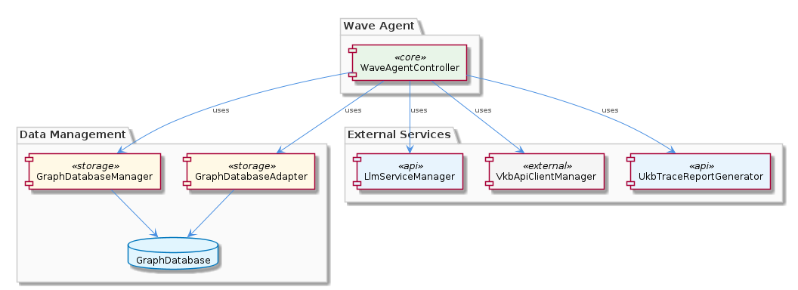
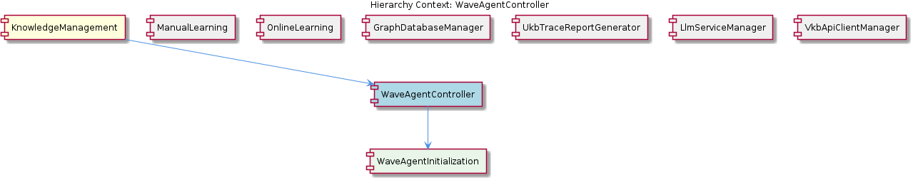

# WaveAgentController

**Type:** SubComponent

WaveAgentController probably relies on specific modules or files for managing Wave agent concurrency and initialization.

## What It Is  

**WaveAgentController** is a sub‑component that lives inside the **KnowledgeManagement** module. Although no concrete source files are listed in the current observation set, the surrounding hierarchy makes its location clear: it is part of the same package tree that contains the `GraphDatabaseAdapter` (found at `integrations/mcp-server-semantic-analysis/src/storage/graph-database-adapter.ts`). WaveAgentController is responsible for orchestrating the lifecycle of a *Wave* agent – from initialization through execution – and for tying that lifecycle to the broader knowledge‑graph infrastructure used throughout the platform.

The controller sits directly above **WaveAgentInitialization**, its child component, and works side‑by‑side with sibling services such as **LlmServiceManager**, **GraphDatabaseManager**, **VkbApiClientManager**, **UkbTraceReportGenerator**, **ManualLearning**, and **OnlineLearning**. Its primary purpose is to coordinate these services so that a Wave agent can request LLM‑driven reasoning, persist intermediate results in the graph database, and emit trace reports for downstream analysis.

---

## Architecture and Design  

The architectural stance of WaveAgentController is **coordinator‑centric**: it does not implement domain logic itself but delegates to specialized managers. This is evident from the observations that it *likely interacts* with the **LlmServiceManager** for language‑model operations, the **GraphDatabaseManager** (and by extension the **GraphDatabaseAdapter**) for persistence, and the **VkbApiClientManager** for external VKB API calls. The design therefore follows a **Facade**‑like pattern, exposing a simplified API to higher‑level callers while hiding the complexity of the underlying services.

Because WaveAgentController resides within the **KnowledgeManagement** component, it inherits the graph‑oriented persistence strategy already described for the parent: the `GraphDatabaseAdapter` leverages **Graphology+LevelDB** to store JSON‑exportable entities. This choice yields a **single source of truth** for both static knowledge (handled by ManualLearning/OnlineLearning) and dynamic agent state (handled by WaveAgentController). The controller’s reliance on **UkbTraceReportGenerator** suggests a **reporting** sub‑pattern where execution traces are collected, stored, and later visualized, reinforcing a **separation of concerns** between execution and observability.

The relationship diagram below clarifies the interaction web: WaveAgentController sits at the hub, pulling in LLM services, persisting state, invoking VKB APIs, and finally delegating trace generation.

---

## Implementation Details  

Even though the source symbols for WaveAgentController are not listed, the surrounding code base gives strong clues about its internal composition:

1. **Dependency Injection** – The controller almost certainly receives instances of `LlmServiceManager`, `GraphDatabaseManager`, `VkbApiClientManager`, and `UkbTraceReportGenerator` via constructor injection or a service locator. This enables the controller to remain agnostic of concrete implementations while still orchestrating their behavior.

2. **WaveAgentInitialization** – As a child component, this module likely encapsulates the steps required to spin up a new Wave agent (e.g., allocating a unique identifier, preparing a runtime context, and registering callbacks). WaveAgentController would invoke an `initialize()` method on this child, passing in configuration derived from the LLM service or incoming request payload.

3. **Graph Persistence** – When the agent produces intermediate knowledge artifacts (entities, relationships, or reasoning steps), WaveAgentController forwards them to the **GraphDatabaseManager**, which in turn uses the `GraphDatabaseAdapter` (`integrations/mcp-server-semantic-analysis/src/storage/graph-database-adapter.ts`). The adapter abstracts LevelDB storage, automatically synchronizing JSON exports, ensuring that the knowledge graph stays consistent across agent runs.

4. **LLM Interaction** – Calls to the **LlmServiceManager** are likely wrapped in async methods such as `runPrompt(prompt: string): Promise<LlmResponse>`. The controller would handle retries, token limits, and response parsing before feeding results back into the graph.

5. **VKB API Calls** – For any external knowledge lookup or enrichment, WaveAgentController delegates to `VkbApiClientManager`. Expected methods include `fetchConcept(id: string)` or `search(query: string)`, returning structured data that can be merged into the graph.

6. **Trace Reporting** – Upon completion (or failure) of an agent run, the controller assembles a trace payload and hands it to `UkbTraceReportGenerator`. This component likely formats the trace into a consumable report (e.g., JSON, PDF) and stores it back in the graph or a separate reporting store.

All these interactions are orchestrated in a sequential or partially concurrent flow, depending on the agent’s workload. The controller’s design therefore emphasizes **thin orchestration** rather than heavy business logic, making it easier to test and replace individual managers.

---

## Integration Points  

WaveAgentController is a nexus of several system boundaries:

| Integration Target | Purpose | Observed Connection |
|--------------------|---------|---------------------|
| **LlmServiceManager** | Executes LLM prompts for reasoning | “interacts with … for LLM operations and initialization” |
| **GraphDatabaseManager** | Persists agent state and knowledge artifacts | “utilizes … for storing and retrieving data related to Wave agent execution” |
| **GraphDatabaseAdapter** | Low‑level graph storage (LevelDB) | Path: `integrations/mcp-server-semantic-analysis/src/storage/graph-database-adapter.ts` |
| **VkbApiClientManager** | Calls external VKB APIs during execution | “employs … for VKB API interactions” |
| **UkbTraceReportGenerator** | Generates trace reports post‑execution | “involves … for generating trace reports” |
| **WaveAgentInitialization** | Sets up agent runtime context | Child component; “interacts … implying a connection to WaveAgentInitialization” |
| **ManualLearning / OnlineLearning** | May share the same graph persistence layer | Sibling components that also use `GraphDatabaseManager` |

These integration points are all **explicitly mentioned** in the observations, allowing developers to trace data flow: an incoming request triggers WaveAgentController → WaveAgentInitialization → LLM call → graph persistence → optional VKB enrichment → trace generation.

---

## Usage Guidelines  

1. **Instantiate via the KnowledgeManagement container** – Because WaveAgentController is a sub‑component of KnowledgeManagement, it should be obtained from the same dependency‑injection container that provides the sibling managers. This guarantees that all injected services share the same configuration (e.g., same graph database instance).

2. **Prefer async orchestration** – All external calls (LLM, VKB, graph writes) are network or I/O bound. Controllers should `await` each step and handle timeouts/retries locally to avoid cascading failures.

3. **Keep business logic out of the controller** – Any domain‑specific reasoning should be encapsulated in separate services (e.g., a “WaveAgentStrategy” class). The controller’s responsibility is limited to wiring together existing managers.

4. **Leverage trace reporting** – After each agent run, invoke the `UkbTraceReportGenerator` through the controller. This ensures observability and aids debugging of complex agent workflows.

5. **Respect graph transaction boundaries** – When persisting multiple related entities, batch them through the `GraphDatabaseManager` to benefit from the atomicity guarantees provided by the underlying `GraphDatabaseAdapter`.

---

### Architectural Patterns Identified  

* **Facade / Coordinator** – WaveAgentController abstracts a suite of managers behind a single, cohesive API.  
* **Dependency Injection** – Implied by the need to supply multiple managers to the controller.  
* **Separation of Concerns** – Distinct responsibilities for LLM processing, graph persistence, external API calls, and trace generation.  

### Design Decisions and Trade‑offs  

* **Thin orchestration vs. embedded logic** – By keeping the controller lightweight, the system gains testability and modularity, but it requires disciplined placement of business rules elsewhere.  
* **Graph‑centric persistence** – Using the `GraphDatabaseAdapter` (LevelDB + Graphology) provides fast look‑ups and natural representation of knowledge relationships, at the cost of a steeper learning curve for developers unfamiliar with graph databases.  
* **Synchronous chaining of async services** – Guarantees deterministic execution order, yet may limit throughput for highly parallelizable workloads; future refinements could introduce more granular concurrency.  

### System Structure Insights  

* The **KnowledgeManagement** component acts as the umbrella for all knowledge‑related services, with WaveAgentController as the execution engine for dynamic agents.  
* Sibling components (ManualLearning, OnlineLearning) share the same persistence layer, promoting data consistency across static and dynamic knowledge sources.  
* The controller’s child, **WaveAgentInitialization**, isolates startup concerns, allowing the parent to focus on runtime orchestration.  

### Scalability Considerations  

* **GraphDatabaseAdapter** backed by LevelDB scales well for read‑heavy workloads and can be sharded across multiple nodes if needed.  
* Because WaveAgentController delegates heavy lifting to external managers, horizontal scaling can be achieved by deploying multiple instances of the controller behind a load balancer, each with its own set of manager instances.  
* The LLM service may become a bottleneck; the controller should incorporate back‑pressure mechanisms (e.g., request queuing) to avoid overwhelming the LlmServiceManager.  

### Maintainability Assessment  

* The clear separation between controller and managers makes the codebase **highly maintainable** – changes to LLM handling, graph schema, or VKB API contracts can be made in their respective modules without touching the orchestration logic.  
* The reliance on explicit interfaces (as inferred) supports **unit testing** of WaveAgentController by mocking each manager.  
* However, the lack of concrete source symbols in the current observation set suggests that documentation and code navigation may be challenging; developers should ensure that the controller’s public API is well‑documented and that the dependency graph is visualized (as done with the provided diagrams).  

---  

*Prepared from the supplied observations, preserving all referenced file paths, class names, and component relationships.*

## Hierarchy Context

### Parent
- [KnowledgeManagement](./KnowledgeManagement.md) -- [LLM] The KnowledgeManagement component utilizes the GraphDatabaseAdapter (integrations/mcp-server-semantic-analysis/src/storage/graph-database-adapter.ts) for persisting data in a graph database with automatic JSON export synchronization. This design decision enables efficient storage and retrieval of knowledge entities and relationships, which is crucial for the system's overall goals of knowledge discovery and insight generation. Furthermore, the use of Graphology+LevelDB persistence ensures a scalable and performant solution for managing the knowledge graph.

### Children
- [WaveAgentInitialization](./WaveAgentInitialization.md) -- The parent component analysis suggests that WaveAgentController interacts with the LlmServiceManager for LLM operations and initialization, implying a connection to WaveAgentInitialization.

### Siblings
- [ManualLearning](./ManualLearning.md) -- ManualLearning likely interacts with the GraphDatabaseManager to store and retrieve manually created knowledge entities and relationships.
- [OnlineLearning](./OnlineLearning.md) -- OnlineLearning likely employs the GraphDatabaseManager to store and manage automatically extracted knowledge entities and relationships.
- [GraphDatabaseManager](./GraphDatabaseManager.md) -- GraphDatabaseManager likely utilizes the GraphDatabaseAdapter for interacting with the graph database.
- [UkbTraceReportGenerator](./UkbTraceReportGenerator.md) -- UkbTraceReportGenerator likely interacts with the GraphDatabaseManager to retrieve data for trace reports.
- [LlmServiceManager](./LlmServiceManager.md) -- LlmServiceManager likely interacts with other components for LLM-related tasks, such as the GraphDatabaseManager and WaveAgentController.
- [VkbApiClientManager](./VkbApiClientManager.md) -- VkbApiClientManager likely interacts with the GraphDatabaseManager for storing and retrieving data related to VKB API interactions.

---

*Generated from 6 observations*
