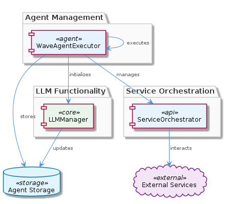
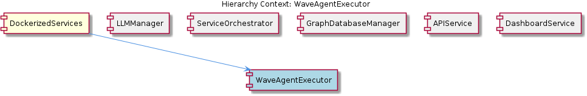

# WaveAgentExecutor

**Type:** SubComponent

The WaveAgentExecutor might be designed to work with other sub-components, such as the ServiceOrchestrator, to manage complex workflows.

## What It Is  

WaveAgentExecutor is a **sub‑component** that lives inside the **DockerizedServices** container.  Although the repository does not expose a concrete file path for its source (the “Code Structure” entry reports *0 code symbols found*), its logical placement is within the DockerizedServices module that coordinates the runtime of many other services (e.g., `lib/llm/llm-service.ts` for LLM operations and `lib/service‑starter.js` for robust service startup).  The executor’s primary responsibility is to **manage the lifecycle of “wave‑based” agents** – specialized agents that operate in a wave‑oriented execution model.  It supplies a constructor‑based initialization routine, runs agents on demand, and captures any runtime exceptions so that higher‑level orchestrators can continue safely.

The component is deliberately lightweight: it does not embed business logic itself but acts as a façade that other sub‑systems (such as **LLMManager** and **ServiceOrchestrator**) call when they need to spin up or control a wave agent.  In this sense, WaveAgentExecutor is the execution engine that bridges the abstract agent definitions with the concrete Dockerized runtime environment.  

---

## Architecture and Design  

The design of WaveAgentExecutor follows the **constructor‑injection / orchestration pattern** that is already evident in its parent, DockerizedServices.  The parent component uses dependency injection (see `lib/llm/llm-service.ts` and `lib/service‑starter.js`) to keep services loosely coupled; WaveAgentExecutor inherits the same philosophy by accepting its collaborators (e.g., an LLM client from **LLMManager** or a workflow controller from **ServiceOrchestrator**) through its constructor.  This makes the executor easily mockable in unit tests and replaceable when the underlying wave engine evolves.

Execution is organized as a **command‑style workflow**: a caller creates an instance of WaveAgentExecutor, passes a wave‑agent definition, and invokes an `execute()`‑like method.  The executor then:

1. **Initializes** any required LLM resources via the LLMManager, ensuring the agent has the language model context it needs.  
2. **Registers** the agent with the ServiceOrchestrator so that the broader workflow graph can track its progress and handle retries or timeouts.  
3. **Runs** the agent in a controlled environment, catching exceptions and translating them into standardized error objects that downstream services understand.  

The relationship diagram below illustrates these interaction points, showing WaveAgentExecutor at the hub of LLMManager, ServiceOrchestrator, and sibling services such as GraphDatabaseManager and APIService.  

Because the executor does not embed persistence logic, it delegates state storage to **GraphDatabaseManager** (which uses Graphology/LevelDB) and reporting to **DashboardService**.  This separation of concerns keeps the executor focused on *execution* rather than *state management*.

---

## Implementation Details  

Even though the source files are not listed, the observations give us enough clues to reconstruct the core implementation shape:

| Element | Likely Signature / Role | Reasoning |
|---------|------------------------|-----------|
| **Constructor** | `new WaveAgentExecutor({ llmManager, serviceOrchestrator, logger })` | Observation 1 mentions a “specific constructor and execution pattern”. The parent component’s DI style suggests dependencies are injected here. |
| **execute(agentSpec)** | `Promise<ExecutionResult>` | Observation 1 & 3 describe “execute wave‑based agents”. The method would accept a specification (e.g., a JSON wave definition) and return a promise that resolves with success or failure. |
| **handleError(error)** | `void` or `ExecutionResult` | Observation 7 explicitly calls out error/exception handling. A private helper would translate raw exceptions into a uniform error contract. |
| **registerWithOrchestrator(agentId)** | `void` | Observation 4 notes collaboration with ServiceOrchestrator for complex workflows. Registration allows the orchestrator to monitor progress and apply retries. |
| **initializeLLMContext(agentId)** | `Promise<void>` | Observation 2 points to interaction with LLMManager to “initialize LLM functionality”. This step likely fetches model configuration or token limits before execution. |

The executor probably follows a **try/catch** block around the core agent run, logging via a shared logger (inherited from DockerizedServices) and propagating a clean error object to the orchestrator.  Because the parent component already implements robust startup logic (`ServiceStarter`), WaveAgentExecutor can rely on those mechanisms for container health checks and graceful shutdown.

---

## Integration Points  

1. **LLMManager** – WaveAgentExecutor calls into LLMManager to obtain a ready‑to‑use LLM client.  This ensures that each wave agent runs with the correct model version, temperature, and token limits.  The dependency is injected at construction time, mirroring the pattern used by **LLMManager** itself (`LLMService` in `lib/llm/llm-service.ts`).  

2. **ServiceOrchestrator** – Before execution, the executor registers the agent with ServiceOrchestrator, which tracks the agent’s state across the broader workflow graph.  ServiceOrchestrator, in turn, uses the same `ServiceStarter` logic that powers other services (e.g., APIService) for retries and timeout handling.  

3. **GraphDatabaseManager** – While WaveAgentExecutor does not store data directly, it emits lifecycle events that GraphDatabaseManager persists.  This allows later analysis of wave‑agent performance and debugging.  

4. **DashboardService** – Execution results and error metrics are streamed to DashboardService for real‑time monitoring.  Because DashboardService already integrates with the constraint‑monitoring dashboard, the executor’s telemetry fits naturally into existing UI panels.  

5. **APIService** – External clients invoke WaveAgentExecutor indirectly via APIService endpoints.  The API layer validates input, then forwards the request to the executor, ensuring a clean separation between transport concerns and execution logic.

All these connections are orchestrated within the **DockerizedServices** container, which provides the runtime environment, dependency injection container, and health‑check hooks.

---

## Usage Guidelines  

* **Instantiate via DI Container** – Do not call `new WaveAgentExecutor()` manually in application code; instead, request it from the DockerizedServices DI container so that LLMManager, ServiceOrchestrator, and logger are correctly wired.  

* **Supply a Complete Agent Specification** – The `execute()` method expects a fully‑formed wave‑agent definition (including model parameters, input payload, and any required callbacks).  Incomplete specs will trigger validation errors early in the LLMManager initialization step.  

* **Handle the Returned Promise** – Always `await` the execution promise or attach `.then/.catch` handlers.  The promise resolves to an `ExecutionResult` object that contains `status`, `output`, and optional `errorDetails`.  Ignoring the promise can lead to unobserved rejections and silent failures.  

* **Respect Orchestrator Contracts** – If you need custom retry logic, configure it through ServiceOrchestrator rather than embedding loops inside the agent code.  This keeps the executor’s responsibilities focused on a single run and avoids duplicated error‑handling logic.  

* **Log Strategically** – Use the injected logger to emit structured logs at key lifecycle moments (initialization, start, success, failure).  Consistent logging enables DashboardService to surface accurate metrics.  

* **Test with Mocks** – Because dependencies are injected, unit tests should replace LLMManager and ServiceOrchestrator with lightweight mocks that simulate success and failure paths.  This aligns with the maintainability approach already used in DockerizedServices (e.g., mocking `ServiceStarter` in integration tests).  

---

### Architectural Patterns Identified  
* **Constructor‑based Dependency Injection** – mirrors the pattern in the parent DockerizedServices component.  
* **Command/Executor Pattern** – WaveAgentExecutor encapsulates the “run a wave agent” command behind a single `execute` method.  
* **Observer‑like Event Emission** – lifecycle events are emitted to GraphDatabaseManager and DashboardService.  

### Design Decisions and Trade‑offs  
* **Separation of Execution vs. State** – By delegating persistence to GraphDatabaseManager, the executor stays lightweight, improving throughput but requiring reliable event pipelines.  
* **Centralized Error Normalization** – Handling all exceptions inside the executor simplifies downstream error handling but adds a single point of failure if the normalization logic is buggy.  

### System Structure Insights  
WaveAgentExecutor sits at the intersection of **LLM‑driven computation** (LLMManager) and **workflow orchestration** (ServiceOrchestrator).  Its placement inside DockerizedServices gives it access to the same DI container and health‑check mechanisms used by sibling services, ensuring uniform lifecycle management across the system.  

### Scalability Considerations  
Because the executor is stateless, multiple instances can be run in parallel inside the DockerizedServices cluster.  Scaling horizontally simply requires adding more container replicas; the orchestrator will distribute wave‑agent tasks accordingly.  The primary bottleneck is the underlying LLM service; therefore, capacity planning should focus on LLMManager’s model provisioning and rate‑limit handling.  

### Maintainability Assessment  
The heavy reliance on dependency injection and clear separation of concerns makes WaveAgentExecutor **highly maintainable**.  Changes to the LLM integration or orchestration logic can be made in the respective sibling components without touching the executor’s core.  The explicit error‑handling path and standardized `ExecutionResult` contract further reduce the risk of regression when extending functionality.  The main maintenance risk lies in the lack of a dedicated test suite for the executor itself; however, the DI‑friendly design encourages straightforward mocking, mitigating that risk.

## Hierarchy Context

### Parent
- [DockerizedServices](./DockerizedServices.md) -- [LLM] The DockerizedServices component utilizes dependency injection to manage complex workflows and handle multiple requests efficiently. This is evident in the lib/llm/llm-service.ts file, where the LLMService class is used for high-level LLM operations, including mode routing, caching, and provider fallback. The use of dependency injection allows for loose coupling between components, making it easier to test and maintain the codebase. Furthermore, the ServiceStarter class in lib/service-starter.js provides robust service startup with retry, timeout, and graceful degradation, ensuring that the component can recover from failures and provide a responsive user experience.

### Siblings
- [LLMManager](./LLMManager.md) -- LLMManager utilizes the LLMService class in lib/llm/llm-service.ts for high-level LLM operations.
- [ServiceOrchestrator](./ServiceOrchestrator.md) -- ServiceOrchestrator uses the ServiceStarter class in lib/service-starter.js to provide robust service startup with retry, timeout, and graceful degradation.
- [GraphDatabaseManager](./GraphDatabaseManager.md) -- GraphDatabaseManager likely uses Graphology and LevelDB to provide persistence and data storage capabilities.
- [APIService](./APIService.md) -- APIService likely interacts with the constraint monitoring API server to provide easy startup and management.
- [DashboardService](./DashboardService.md) -- DashboardService likely interacts with the constraint monitoring dashboard to provide easy startup and management.

---

*Generated from 7 observations*
