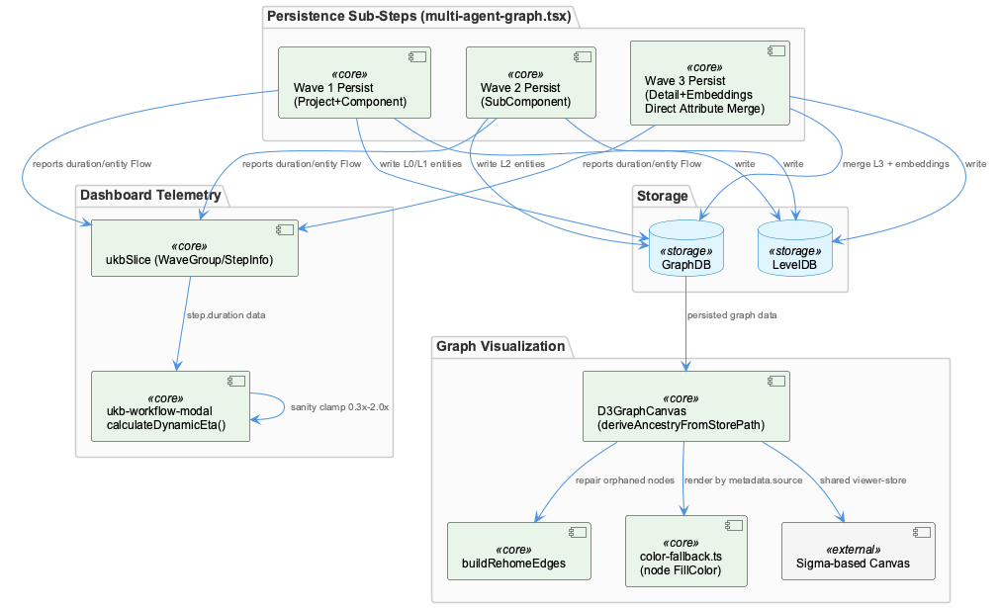
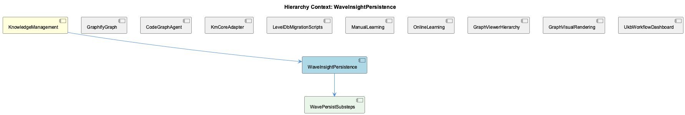

# WaveInsightPersistence

**Type:** SubComponent

# WaveInsightPersistence

## What It Is

WaveInsightPersistence is the mechanical write path of the knowledge-management pipeline, defined in `integrations/system-health-dashboard/src/components/workflow/multi-agent-graph.tsx` as the `persistence` entry in `AGENT_SUBSTEPS`. It is modeled as exactly three sequential sub-steps, implemented as its child component **WavePersistSubsteps**: `w1` ("Wave 1 Persist" — L0 Project + L1 Component entities), `w2` ("Wave 2 Persist" — L2 SubComponent entities), and `w3` ("Wave 3 Persist" — L3 Detail entities plus operator-refined fields and embeddings). All three declare `llmUsage: 'none'` and `techNote: 'GraphDB + LevelDB storage'`, making persistence the only agent in the entire AGENT_SUBSTEPS table that is fully LLM-free across all its sub-steps. As a child of **KnowledgeManagement**, WaveInsightPersistence sits downstream of the LLM-driven synthesis stages (kg_operators, semantic_analysis, insight_generation) and is responsible solely for committing already-synthesized entities to storage.

## Architecture and Design

The core architectural pattern is **multi-wave staged persistence with increasing entity specificity**: Project/Component entities land first, SubComponent entities follow, and Detail entities plus embeddings arrive last. Critically, `w3`'s `techNote` uniquely includes "direct attribute merge," indicating that Wave 3 does not simply insert nodes but merges operator-enriched fields (embeddings, refinements) onto entities potentially created in earlier waves — meaning duplicate-entity reconciliation happens at persistence time in Wave 3, not upstream during insight generation.

This design cleanly separates inference from storage: all LLM work happens before persistence is invoked, and persistence's declared `llmUsage: 'none'` is a static, UI-trusted contract rather than something derived at runtime. This is a maintainability risk noted at the WavePersistSubsteps level — if a future Wave 3 reconciliation step becomes LLM-backed (plausible given the "direct attribute merge" semantics), nothing in the `SubStep` interface enforces updating `llmUsage`, so the dashboard's LLM-usage legend could silently misrepresent reality.

## Implementation Details

Telemetry for these sub-steps flows through `ukbSlice.ts`'s `WaveGroup` interface, which groups `StepInfo` entries by wave number and carries a `TraceEntityFlow` (produced/passedQA/persisted/rejectedReasons) alongside `itemsCompleted`/`itemsTotal`. A "Phase 52 D-15" comment notes these completion fields are intentionally optional so legacy progress files without per-item emission still render via the existing entity-flow arrow display — evidence that the persistence layer's telemetry schema evolved incrementally and the UI must tolerate multiple vintages simultaneously.

Because persistence exposes only post-hoc `duration` values and no explicit ETA, `calculateDynamicEta` in `ukb-workflow-modal.tsx` reconstructs progress forecasting client-side: summing `step.duration` across `batch.steps` when `allStepsComplete`, falling back to `avgBatchDurationMs`, and clamping estimates to 0.3x–2.0x of a linear projection to compensate for unreliable early-batch signals from a persistence step that has just begun writing LevelDB entries.

Downstream, `color-fallback.ts`'s `nodeFillColor` distinguishes persisted (batch) entities via `BATCH_PALETTE` (teal/blue, keyed by ontologyClass depth) from `ONLINE_PALETTE` (red/pink) entities via `isOnlineLearned(node)` — auditing at render time which nodes came from the wave pipeline versus online learning, purely from a `metadata.source` stamp rather than any explicit marker recorded by persistence itself.

## Integration Points

WaveInsightPersistence's output feeds two independent graph-rendering engines — D3GraphCanvas and an implied Sigma-based canvas — both of which must agree on topology despite consuming the same persisted structure. `D3GraphCanvas.tsx`'s `deriveAncestryFromStorePath` and its `buildRehomeEdges` import exist specifically to repair structural gaps (orphaned or under-connected nodes) left by the write path, paralleling the wave-controller's own orphan-prevention anchoring (`findBestParent`/`projectAnchorName='Coding'`) documented in the parent context — the visualization layer is effectively a second safety net for the same class of bug. A prior "duplicated source-of-truth" audit finding (S3) led to the current store-authoritative-with-inline-fallback design, where `pathToSelected` is read from the Zustand store and only recomputed inline when empty.

Within the sibling landscape, WaveInsightPersistence contrasts with **GraphifyGraph** and **CodeGraphAgent**, which treat a static `graph.json` as system of record; notably, `AGENT_SUBSTEPS['code_graph']` still carries a stale `techNote: 'Cypher queries on Memgraph'`, a documentation-drift issue distinct from but adjacent to persistence's own metadata-accuracy risk. **LevelDbMigrationScripts** (migrate-graph-db-entity-types.js, migrate-leveldb-to-kmcore.mjs) governs the underlying LevelDB/km-core shape that persistence writes into, with an implicit, unenforced ordering contract between taxonomy simplification and UUIDv7/legacyId re-platforming.

## Usage Guidelines

Developers should treat the `w1/w2/w3` `llmUsage: 'none'` declarations as authoritative UI metadata, not runtime-verified fact — any change to Wave 3's reconciliation logic that introduces inference must manually update this contract. When modifying `WaveGroup`/`StepInfo` telemetry shapes, preserve optional fields for backward compatibility with older persistence-emitted progress files. Because ETA is reconstructed client-side rather than reported by persistence, avoid assuming per-step progress is directly observable early in a batch. Finally, any consumer rendering persisted graph data should rely on the shared viewer-store's authoritative ancestry path rather than recomputing rehoming logic independently, to avoid the divergence the store-authoritative pattern was built to eliminate.

## Hierarchy Context

### Parent
- [KnowledgeManagement](./KnowledgeManagement.md) -- [LLM] The GraphifyGraph reader (integrations/semantic-analysis/src/agents/graphify-graph.ts) represents a deliberate architectural simplification: rather than maintaining a live graph database connection (Memgraph via Cypher), the component now treats a static graph.json artifact produced by the graphify service as the source of truth for code-structure knowledge. This file, a NetworkX node-link JSON export, can be tens of megabytes, so GraphifyGraph implements mtime-based lazy caching — it stat()s the file and only re-parses when the mtime has changed since the last load. This pattern trades real-time graph mutation capability for drastically simpler deployment (no separate DB process) and fast repeated reads, at the cost of only picking up graph changes when the underlying analysis pipeline re-writes graph.json.

### Children
- [WavePersistSubsteps](./WavePersistSubsteps.md) -- [LLM] The 'persistence' entry in AGENT_SUBSTEPS (integrations/system-health-dashboard/src/components/workflow/multi-agent-graph.tsx) hard-codes exactly three sub-steps — w1, w2, w3 — each with llmUsage:'none', making persistence the one agent in the AGENT_SUBSTEPS table that is entirely LLM-free across all its sub-steps (every other agent, e.g. 'kg_operators' or 'insight_generation', mixes 'none' with 'fast'/'standard'/'premium'). This is a structural signal baked directly into UI metadata rather than derived at runtime: the modal and graph components have no way to discover at execution time that persistence performs no inference — they simply trust this static declaration. If a future wave adds an LLM-backed reconciliation step to w3 (plausible given its 'direct attribute merge' techNote), nothing in the type system (SubStep interface, same file) forces llmUsage to be updated, so the UI's LLM-usage legend/coloring could silently misrepresent an actual LLM call.

### Siblings
- [GraphifyGraph](./GraphifyGraph.md) -- [LLM] GraphifyGraph (integrations/semantic-analysis/src/agents/graphify-graph.ts) inverts the conventional graph-database architecture by treating a flat, periodically-regenerated graph.json file as the system of record instead of a live queryable store. The mtime-based lazy-caching strategy — stat() the file, compare against the last-seen mtime, and only re-parse the (potentially tens-of-megabytes) NetworkX node-link export when it changes — is a classic read-heavy optimization, but it also means GraphifyGraph is fundamentally a batch-consistency component: it cannot see a code-structure change until the separate graphify analysis pipeline finishes a full re-write of the JSON artifact. This is architecturally similar to the mtime/staleness problem the dashboard integration explicitly worked around elsewhere in this codebase (system-health-dashboard's bind-mount VirtioFS caching required a forced container restart to invalidate a stale read) — both are instances of 'a file on disk is the API' trading real-time correctness for operational simplicity.
- [CodeGraphAgent](./CodeGraphAgent.md) -- [LLM] There is a concrete documentation-drift artifact visible in integrations/system-health-dashboard/src/components/workflow/multi-agent-graph.tsx: the `AGENT_SUBSTEPS['code_graph']` array still describes its `query` sub-step with `techNote: 'Cypher queries on Memgraph'` (multi-agent-graph.tsx, code_graph entry, 'query' id). This directly contradicts the parent-context claim that CodeGraphAgent now delegates every call to GraphifyGraph's static graph.json reader and no longer speaks Cypher to a live Memgraph instance. Because this dashboard copy is what renders in the UKB workflow visualization modal (ukb-workflow-modal.tsx via MultiAgentGraph), any operator inspecting the live workflow graph is shown stale technology labels for a component whose backend was already migrated — exactly the kind of subtle trap the parent observation warned about with `checkMemgraphConnection` being a preserved-but-stubbed method name.
- [KmCoreAdapter](./KmCoreAdapter.md) -- [LLM] The provided code files (ukb-workflow-modal.tsx, multi-agent-graph.tsx, ukbSlice.ts, D3GraphCanvas.tsx, color-fallback.ts) belong to system-health-dashboard and unified-viewer, not directly to the KmCoreAdapter/GraphifyGraph pipeline described in the parent observations. This suggests KmCoreAdapter's output (graph.json, entity types, relationship taxonomy) is consumed downstream by visualization layers like D3GraphCanvas and the AGENT_SUBSTEPS 'code_graph' definitions in multi-agent-graph.tsx, which explicitly reference 'Cypher queries on Memgraph' as a techNote — a stale artifact from before the GraphifyGraph migration described in the parent context, meaning the UI's descriptive text has not been updated to reflect the Memgraph-to-graphify strangler-fig migration.
- [LevelDbMigrationScripts](./LevelDbMigrationScripts.md) -- [LLM] The two migration scripts referenced in the parent context — migrate-graph-db-entity-types.js and migrate-leveldb-to-kmcore.mjs — represent sequential, non-idempotent phases of the same underlying transition: first a taxonomy simplification (collapsing TransferablePattern/WorkflowPattern/TechnicalIssue into System/Project/Pattern) performed in-place against the live Graphology in-memory graph, then a structural re-platforming that assigns UUIDv7 identifiers, a layer='evidence' classification, and a legacyId.system='B' backward-reference tag to every entity. Because the second script depends on entities already conforming to the three-category taxonomy (any code still testing for the old fine-grained type strings would silently fail), these scripts form an implicit ordering contract that is not enforced by any shared orchestration file — a developer running migrate-leveldb-to-kmcore.mjs before migrate-graph-db-entity-types.js has completed would migrate stale/incorrect type data into the new km-core shape with no runtime error to signal the mistake.
- [ManualLearning](./ManualLearning.md) -- [LLM] The ukb-workflow-modal.tsx file documents its own evolution through inline comments rather than commit messages — the HISTORY_PAGE_SIZE constant carries a multi-paragraph comment explaining that raising it from 50 to 500 was 'close to free' because /api/ukb/history parses every report regardless of limit and only slices at the end. This is a case of manual/institutional learning being encoded directly in source as a durable artifact: a future maintainer who considers lowering this constant for 'performance' will read the comment and understand the tradeoff (response size vs. server work) before making that mistake again, effectively preventing regression of a fix that had no automated test to catch it.
- [OnlineLearning](./OnlineLearning.md) -- [LLM] The 'OnlineLearning' distinction is implemented as a data-driven color/shape overlay rather than a structural entity type: `integrations/unified-viewer/src/graph/color-fallback.ts` defines two parallel palettes, `BATCH_PALETTE` (teal/blue shades keyed by hierarchy depth: System/Project/Component/SubComponent/Detail) and `ONLINE_PALETTE` (red/pink shades for the same hierarchy levels), and `classColor()` picks between them purely based on whether `isOnlineLearned({ metadata: { source } })` returns true. This means 'online-learned' is not a first-class ontology class but a metadata flag (`source: 'auto'` or `'online'`) riding along on any entity, decoupled from what class/type that entity otherwise has.
- [GraphViewerHierarchy](./GraphViewerHierarchy.md) -- [LLM] D3GraphCanvas.tsx (integrations/unified-viewer/src/graph/D3GraphCanvas.tsx) is an explicit, well-documented port of a Redux-based component (memory-visualizer's GraphVisualization.tsx) into a Zustand-store-driven architecture, but it does not simply swap state libraries — it re-derives a large amount of selection/ancestry logic to keep two independently-maintained rendering paths (this D3/SVG canvas and a parallel Sigma/WebGL canvas referenced in comments as 'graph-builder.ts') in sync. The `deriveAncestryFromStorePath()` function is the clearest evidence of this: rather than trusting either the store's `pathToSelected` set or its own inline `computeAncestryPath()` BFS in isolation, it runs both and reconciles them with a 'writer's intent wins' rule — nodes the store claims are in-path but the local BFS can't reach get a synthetic max-depth slot so they still render, while nodes the BFS finds but the store doesn't tag are dropped. This reconciliation is a symptom of maintaining two rendering engines against one shared selection model without a shared traversal implementation.
- [GraphVisualRendering](./GraphVisualRendering.md) -- [LLM] The GraphVisualRendering surface is split across two independently-evolved implementations that never share code: `integrations/system-health-dashboard/src/components/workflow/multi-agent-graph.tsx` renders the UKB workflow pipeline as a fixed-topology SVG (`WAVE_AGENTS`, `KG_OPERATOR_CHILDREN`, `MULTI_AGENT_EDGES` from `./constants`), while `integrations/unified-viewer/src/graph/D3GraphCanvas.tsx` renders the knowledge graph itself as a force-directed D3 simulation (`d3.forceSimulation` + `d3.forceLink(150)` + `d3.forceManyBody(-500)`). The former is a static, hand-authored process diagram; the latter is a dynamic layout engine over live entity/relation data pulled through `useGraphData`. They happen to share the word 'graph' and the general shape of node/edge rendering, but there is no common rendering abstraction, color resolver, or type between them — any visual-consistency fix (e.g. dark-mode palette) has to be applied twice.
- [UkbWorkflowDashboard](./UkbWorkflowDashboard.md) -- [LLM] The HISTORY_PAGE_SIZE constant in ukb-workflow-modal.tsx (currently 500, previously 50) documents a concrete production incident in its own comment block: with the old cap, `/api/ukb/history` silently truncated the report list at 50 entries even though 119+ reports existed, making the single most important run — the batch-analysis run whose Pipeline Totals card shows commits/sessions/entity counts — permanently unreachable from the UI because it sat at position ~51. The fix works because the API route reads and parses every report on every call regardless of `limit`, slicing only at the very end, so raising the page size costs response payload size (roughly 13 header fields per report) rather than server-side work. This is a case where a UI paging constant silently created a data-loss illusion — the data was never lost, just permanently unreachable — and the comment functions as a postmortem note baked directly into source rather than a separate incident doc.

---

*Generated from 9 observations*
