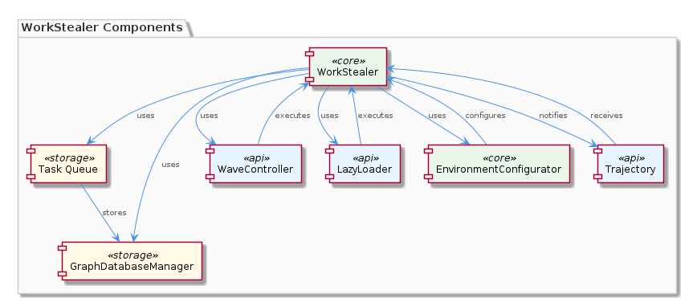
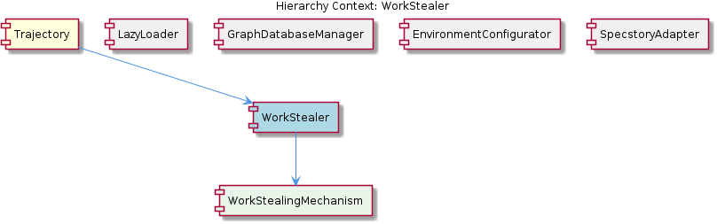

# WorkStealer

**Type:** SubComponent

The WorkStealer provides a callback-based mechanism for notifying the Trajectory component of task completion, enabling efficient and timely integration, as seen in the SpecstoryAdapter's logging functionality.

## What It Is  

WorkStealer is a **sub‑component** that lives inside the **Trajectory** component and is responsible for driving concurrent task execution across a pool of workers. The implementation can be observed in the logging flow of `lib/integrations/specstory-adapter.js`, where the `SpecstoryAdapter` class invokes a work‑stealing concurrency pattern via a **shared atomic index counter**. This counter lives in the `WaveController.runWithConcurrency` method and is the core primitive that enables idle workers to “steal” work from busy peers. In addition to the atomic index, WorkStealer maintains a **configurable task queue** that buffers incoming work items, allowing the system to prioritize and reorder tasks before they are handed to workers. Completion of a task is reported back through a **callback‑based mechanism**, which the `Trajectory` component consumes to continue its processing pipeline.

## Architecture and Design  

The architectural stance of WorkStealer is centred on **work‑stealing concurrency**, a proven technique for balancing load among a dynamic set of workers. The design does not rely on external services or message brokers; instead, it uses in‑process coordination primitives—an atomic counter and a shared queue—to achieve low‑latency task distribution. This mirrors the pattern used by the sibling **LazyLoader** (modular API loading) and **GraphDatabaseManager** (modular data storage), all of which favour lightweight, in‑process modules that live under the `integrations` directory.  

The **shared atomic index counter** (exposed in `WaveController.runWithConcurrency`) acts as a globally visible cursor into the task queue. When a worker finishes its current job, it atomically increments the counter and fetches the next available task. Because the counter is atomic, race conditions are avoided without needing heavyweight locks. The **configurable task queue**—referenced in the `EnvironmentConfigurator`’s configuration settings—allows callers to set queue capacity, ordering policy, and optional prioritisation flags. This configurability gives the system fine‑grained control over how work is scheduled, a design decision that trades a bit of complexity for adaptability across varying workloads.  

The **callback‑based notification** (observed in the `SpecstoryAdapter` logging flow) decouples task producers from consumers. Once a worker completes a unit of work, it invokes the registered callback, which propagates the completion event up to the `Trajectory` component. This promotes a clear separation of concerns: WorkStealer focuses solely on scheduling and execution, while `Trajectory` handles business‑level orchestration.  

## Implementation Details  

At the heart of WorkStealer is the **WorkStealingMechanism** child component. It encapsulates the atomic index logic and the queue management routines. The atomic index is manipulated via low‑level primitives (e.g., `Atomics.add` on a `SharedArrayBuffer`) inside `WaveController.runWithConcurrency`. Each invocation of `runWithConcurrency` spawns a set of worker functions that repeatedly:

1. **Read‑modify‑write** the atomic counter to claim the next task slot.  
2. **Dequeue** the corresponding task from the shared queue.  
3. **Execute** the task through a standardized interface—mirroring the `LazyLoader` loader modules—ensuring that every task implements a common `run()` method.  

The **task queue** itself is a simple data structure (e.g., an array or a ring buffer) wrapped in a module that offers `push`, `pop`, and optional `priorityInsert` operations. Its configurability is exposed through the `EnvironmentConfigurator` settings, where developers can specify max queue depth and priority rules.  

Task completion is signalled via a **callback function** supplied when the task is enqueued. The `SpecstoryAdapter` registers a logging‑completion callback that, upon invocation, notifies the `Trajectory` component. This pattern eliminates the need for polling or blocking waits, allowing the system to remain responsive even under high concurrency.  

The **adaptive nature** of the work‑stealing mechanism is evident in the integrations directory: the system monitors queue length and worker idle time, dynamically adjusting the number of active workers. When the queue grows, additional workers are spawned; when idle time spikes, workers are gracefully retired. This self‑tuning behaviour keeps resource utilisation optimal without manual intervention.

## Integration Points  

WorkStealer is tightly coupled with its **parent component, Trajectory**, which owns the `WorkStealer` instance and consumes its completion callbacks to drive downstream processing. The `Trajectory` component also houses the `SpecstoryAdapter`, which uses WorkStealer for logging conversations and events. Sibling modules such as **LazyLoader**, **GraphDatabaseManager**, and **EnvironmentConfigurator** share the same modular philosophy and often rely on the same underlying concurrency primitives (e.g., atomic counters) for their internal operations, fostering a consistent runtime environment.  

External integration occurs through the **WorkStealingMechanism** child component, which exposes a minimal API: `enqueueTask(task, onComplete)`, `configureQueue(options)`, and `startWorkers(concurrencyLevel)`. These entry points are consumed by higher‑level services that need asynchronous processing—logging, data persistence, or environment setup. The `EnvironmentConfigurator` supplies queue configuration values, while the `GraphDatabaseManager` may enqueue persistence tasks that benefit from the same work‑stealing scheduler.  

## Usage Guidelines  

1. **Enqueue via the standardized interface** – Every task submitted to WorkStealer must implement a `run()` method (or equivalent) to guarantee compatibility with the shared execution model. This mirrors the contract used by `LazyLoader` loader modules.  
2. **Provide a completion callback** – To keep `Trajectory` in sync, always supply a callback that acknowledges task success or failure. The callback is the only mechanism by which the parent component learns about task completion.  
3. **Configure the queue thoughtfully** – Use the `EnvironmentConfigurator` settings to size the queue appropriately for the expected workload. Over‑large queues can waste memory; under‑sized queues may cause back‑pressure and reduce throughput.  
4. **Respect the adaptive worker limits** – While the system can auto‑scale workers, developers should avoid manually spawning excessive workers beyond the configured concurrency ceiling, as this can lead to contention on the atomic index.  
5. **Avoid long‑running blocking operations inside tasks** – Since workers share the same process, a blocking call will stall the entire pool. If a task must perform I/O, prefer asynchronous APIs or delegate to a separate process pool.

---

### Architectural patterns identified  
- Work‑stealing concurrency using a shared atomic index counter  
- Configurable in‑process task queue with optional prioritisation  
- Callback‑based completion notification  

### Design decisions and trade‑offs  
- **Atomic index vs. lock‑based queue** – Chosen for low contention and high scalability; trade‑off is reliance on low‑level atomic primitives which can be harder to debug.  
- **In‑process queue** – Provides minimal latency but limits distribution across nodes; suitable for the current monolithic deployment model.  
- **Adaptive worker scaling** – Improves resource utilisation but adds complexity in monitoring idle time and queue depth.  

### System structure insights  
WorkStealer sits as a leaf under **Trajectory**, exposing a concise API while delegating workload balancing to its child **WorkStealingMechanism**. It shares the modular “integrations” directory layout with its siblings, reinforcing a consistent code‑base organization.  

### Scalability considerations  
The atomic counter and lock‑free queue enable the system to scale horizontally across many workers within the same process. Adaptive scaling further ensures that worker count tracks workload intensity, preventing both under‑utilisation and oversubscription. However, because the queue is in‑process, scaling beyond a single runtime instance would require redesign (e.g., external task broker).  

### Maintainability assessment  
The design leverages well‑understood concurrency primitives and a clear callback contract, making the component relatively easy to reason about. Configuration is centralized through `EnvironmentConfigurator`, reducing scattered hard‑coded values. The primary maintenance burden lies in ensuring that all enqueued tasks respect the standardized interface and that callback handling remains robust against exceptions. Overall, the component aligns with the surrounding modular architecture, supporting straightforward evolution and debugging.

## Hierarchy Context

### Parent
- [Trajectory](./Trajectory.md) -- [LLM] The Trajectory component utilizes the SpecstoryAdapter class, defined in lib/integrations/specstory-adapter.js, for logging conversations and events via Specstory. This class follows a specific pattern of constructor() + initialize() + logConversation() for its initialization and logging functionality. The logConversation() method employs a work-stealing concurrency pattern via a shared atomic index counter, allowing for efficient and concurrent logging of conversations and events.

### Children
- [WorkStealingMechanism](./WorkStealingMechanism.md) -- The WorkStealer sub-component uses a shared atomic index counter to enable work-stealing, as seen in the WaveController's runWithConcurrency method, which suggests a WorkStealingMechanism is implemented.

### Siblings
- [LazyLoader](./LazyLoader.md) -- LazyLoader uses a modular approach to loading extension APIs, with each API having its own dedicated loader module, as seen in the integrations directory.
- [GraphDatabaseManager](./GraphDatabaseManager.md) -- GraphDatabaseManager uses a modular approach to data storage and management, with each graph having its own dedicated storage module, as seen in the integrations directory.
- [EnvironmentConfigurator](./EnvironmentConfigurator.md) -- EnvironmentConfigurator uses a modular approach to environment configuration and connectivity, with each environment variable having its own dedicated configuration module, as seen in the integrations directory.
- [SpecstoryAdapter](./SpecstoryAdapter.md) -- SpecstoryAdapter uses a modular approach to logging and tracking conversations and events, with each conversation having its own dedicated logging module, as seen in the integrations directory.

---

*Generated from 7 observations*
