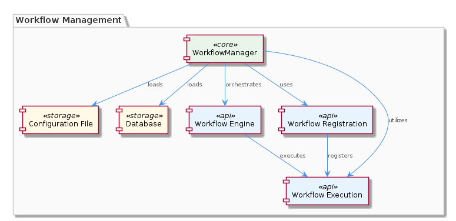
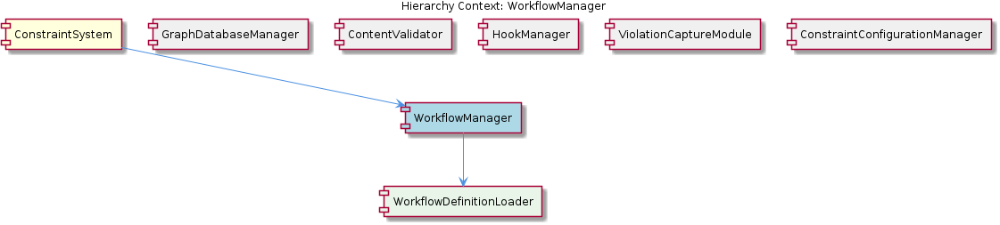

# WorkflowManager

**Type:** SubComponent

WorkflowManager works with the integrations/copi/USAGE.md file to provide workflow usage documentation.

## What It Is  

**WorkflowManager** is a **SubComponent** that lives inside the **ConstraintSystem** component. Its implementation is centred around the ability to **load workflow definitions** (either from a configuration file or a database) and to **orchestrate their execution** through a dedicated workflow engine. All workflow‑related usage documentation is maintained in the file **`integrations/copi/USAGE.md`**, which the manager consults when exposing its capabilities to developers or external tools. The manager also provides a **registration mechanism** that lets individual workflows declare themselves as executable units, and it oversees the full **lifecycle** of each workflow—from registration, through execution, to completion or termination.  

The component’s internal structure includes a child called **WorkflowDefinitionLoader**, whose sole responsibility is to fetch and parse the workflow definitions from the configured source. Because **ConstraintSystem** contains **WorkflowManager**, the manager inherits the broader system’s context (e.g., access to persistence via the GraphDatabaseAdapter used by sibling components) while remaining focused on workflow concerns.

---

## Architecture and Design  

The design of **WorkflowManager** follows an **orchestrator‑plus‑registry** style. The manager acts as the central orchestrator that receives execution requests and delegates them to the underlying **workflow engine**. Workflows must first **register** themselves via the manager’s registration API, creating a clear contract between the workflow definition and the execution layer. This pattern enables loose coupling: new workflows can be added without modifying the core engine, simply by registering themselves.

The component also embodies a **loader‑facade** pattern through its child **WorkflowDefinitionLoader**. The loader abstracts away the details of whether a definition originates from a file or a database, presenting a uniform interface to the manager. The manager therefore does not need to know the source specifics; it only invokes the loader to obtain ready‑to‑use definitions.

All documentation references are externalised in **`integrations/copi/USAGE.md`**, which the manager reads to provide runtime help or to generate usage messages. This separation of code and documentation follows a **documentation‑as‑code** approach, keeping the operational logic clean while still offering developers clear guidance.

### Architectural Patterns Identified  

| Pattern | Evidence from Observations |
|---------|----------------------------|
| **Orchestrator** | “WorkflowManager orchestrates the execution of workflows using a workflow engine.” |
| **Registry / Plugin** | “WorkflowManager uses a workflow registration mechanism to allow workflows to register for execution.” |
| **Loader / Facade** | “WorkflowManager contains WorkflowDefinitionLoader” and “loads workflow definitions from a configuration file or database.” |
| **Documentation‑as‑Code** | “relies on the integrations/copi/USAGE.md file for workflow usage documentation.” |

### Design Decisions & Trade‑offs  

* **Explicit registration** – forces developers to declare workflows up‑front, improving discoverability but adding a registration step before execution.  
* **Separate loader component** – isolates source‑specific logic (file vs. DB) which enhances maintainability; however, it introduces an extra indirection layer.  
* **External usage docs** – keeps code tidy and allows non‑code contributors to update docs, but runtime reads of a markdown file can add I/O overhead if not cached.

---

## Implementation Details  

At the heart of the implementation is the **WorkflowManager** class (exact file path not listed, but it resides within the **ConstraintSystem** hierarchy). Its primary responsibilities are:

1. **Loading Definitions** – It delegates to **WorkflowDefinitionLoader**, which checks a configuration file location or queries a database. The loader returns a structured representation of each workflow (e.g., a JSON/YAML object) that the manager can later hand to the engine.

2. **Registration Mechanism** – The manager maintains an internal registry (likely a map keyed by workflow name or ID). When a workflow module calls the registration API, the manager stores the workflow’s metadata and a reference to its execution handler.

3. **Execution Orchestration** – Upon receiving a request to run a workflow, the manager looks up the workflow in its registry, validates its lifecycle state, and forwards the request to the **workflow engine**. The engine performs the actual step‑by‑step processing, while the manager tracks start, success, failure, and termination events.

4. **Lifecycle Management** – The manager tracks each workflow’s state (e.g., *registered*, *running*, *completed*, *failed*). It can clean up resources, emit status updates, and ensure that completed workflows are deregistered if appropriate.

5. **Documentation Integration** – When developers request help (e.g., via a CLI flag or API call), the manager reads **`integrations/copi/USAGE.md`** and returns the relevant sections. This tight coupling ensures that usage guidance stays synchronized with the actual capabilities exposed by the manager.

Because **ConstraintSystem** contains **WorkflowManager**, the manager can also leverage shared services such as the **GraphDatabaseAdapter** (used by sibling components) for persisting workflow execution logs or state, though this is not explicitly detailed in the observations.

---

## Integration Points  

**WorkflowManager** sits at a nexus of several system interactions:

* **Parent – ConstraintSystem**: As a child of **ConstraintSystem**, the manager inherits system‑wide configuration and can access persistence layers (e.g., the graph database) that siblings use. This enables it to store workflow execution metadata alongside constraint data if needed.

* **Sibling Components** –  
  * **GraphDatabaseManager** and **ViolationCaptureModule** may consume workflow execution results to enrich graph data or capture constraint violations.  
  * **HookManager** could trigger hook events before or after workflow execution, leveraging the registration mechanism to attach hooks to specific workflow lifecycles.  
  * **ConstraintConfigurationManager** and **ContentValidator** might provide validation rules that workflows need to respect, ensuring that workflow steps do not violate system constraints.

* **Child – WorkflowDefinitionLoader**: The loader abstracts the source of definitions, allowing the manager to remain agnostic about whether definitions come from a static file or a dynamic database query.

* **External Documentation – `integrations/copi/USAGE.md`**: The manager reads this markdown file to surface usage instructions, ensuring that developers have a single source of truth for workflow capabilities.

* **Workflow Engine** – Though not named, the engine is the execution backend that the manager invokes. It likely resides as a separate module or library that the manager calls via a well‑defined API.

---

## Usage Guidelines  

1. **Define Workflows in the Expected Source** – Place workflow definitions in the configured file path or ensure they are persisted in the designated database. Consistency in format (e.g., JSON or YAML) is essential for the **WorkflowDefinitionLoader** to parse them correctly.

2. **Register Before Execution** – Every workflow must invoke the registration API of **WorkflowManager** during application start‑up or module initialization. Failure to register will result in the manager being unable to locate the workflow when an execution request arrives.

3. **Consult `integrations/copi/USAGE.md`** – Developers should reference the usage markdown for the correct command‑line flags, API signatures, and expected input/output formats. Keeping this file up‑to‑date is crucial because the manager surfaces its contents directly to end‑users.

4. **Observe Lifecycle Hooks** – If custom behaviour is needed around workflow start or completion, attach listeners via the registration metadata or use the **HookManager** to bind pre‑/post‑execution hooks.

5. **Persist Execution State When Needed** – For long‑running or audit‑required workflows, store execution metadata using the system’s graph database (available through the parent **ConstraintSystem**). This enables later analysis by **ViolationCaptureModule** or other audit tools.

6. **Avoid Direct Engine Calls** – All interactions with the workflow engine should go through **WorkflowManager** to ensure proper lifecycle tracking and documentation linkage.

---

### Summary of Requested Insights  

**1. Architectural patterns identified** – Orchestrator, Registry/Plugin, Loader/Facade, Documentation‑as‑Code.  

**2. Design decisions and trade‑offs** – Explicit registration improves discoverability but adds a step; separate loader isolates source logic at the cost of indirection; external markdown keeps docs in sync but may introduce I/O overhead.  

**3. System structure insights** – WorkflowManager is a child of **ConstraintSystem**, contains **WorkflowDefinitionLoader**, and collaborates with siblings (GraphDatabaseManager, HookManager, etc.) through shared services and event hooks.  

**4. Scalability considerations** – Because registration and execution are decoupled, new workflows can be added without touching the core engine, supporting horizontal scaling of workflow definitions. The loader can be extended to stream definitions from a distributed store, and the manager’s registry can be sharded if the number of workflows grows dramatically.  

**5. Maintainability assessment** – The clear separation between loading, registration, execution, and documentation promotes high maintainability. Updating a workflow definition only requires changes to the source file or DB entry, while the manager code remains untouched. However, reliance on an external markdown file for usage means that documentation hygiene is a critical maintenance task.

## Hierarchy Context

### Parent
- [ConstraintSystem](./ConstraintSystem.md) -- [LLM] The ConstraintSystem component utilizes a GraphDatabaseAdapter for persistence, which is implemented in the storage/graph-database-adapter.ts file. This adapter enables the system to store and retrieve graph structures using Graphology and LevelDB, with automatic JSON export sync. The use of Graphology allows for efficient graph operations, while LevelDB provides a robust and scalable storage solution. The GraphDatabaseAdapter class in storage/graph-database-adapter.ts is responsible for managing the graph database, including creating and deleting graphs, as well as handling graph queries. The automatic JSON export sync feature ensures that the graph data is consistently updated and available for other components to access.

### Children
- [WorkflowDefinitionLoader](./WorkflowDefinitionLoader.md) -- The WorkflowManager loads workflow definitions from a configuration file or database as mentioned in the Hierarchy Context.

### Siblings
- [GraphDatabaseManager](./GraphDatabaseManager.md) -- GraphDatabaseManager uses the GraphDatabaseAdapter class in storage/graph-database-adapter.ts to manage graph database operations.
- [ContentValidator](./ContentValidator.md) -- ContentValidator checks entity content against predefined validation rules to ensure accuracy and consistency.
- [HookManager](./HookManager.md) -- HookManager loads hook events from a configuration file or database.
- [ViolationCaptureModule](./ViolationCaptureModule.md) -- ViolationCaptureModule captures constraint violations from tool interactions and stores them in a database.
- [ConstraintConfigurationManager](./ConstraintConfigurationManager.md) -- ConstraintConfigurationManager loads constraint configurations from a configuration file or database.

---

*Generated from 7 observations*
