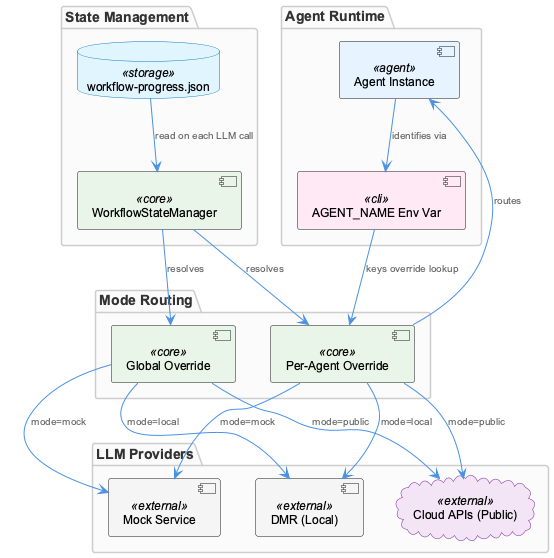
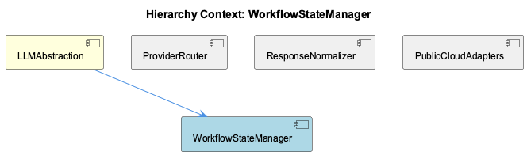

# WorkflowStateManager

**Type:** SubComponent

workflow-progress.json acts as the single source of truth for LLM mode state, storing both a global override and per-agent overrides, as described in the LLMAbstraction parent component description

# WorkflowStateManager — Technical Insight Document

## What It Is

WorkflowStateManager is a subcomponent of LLMAbstraction responsible for reading, interpreting, and serving the routing state that determines which LLM backend any given agent will use at call time. Its authoritative data source is `workflow-progress.json`, a state file that functions not as passive configuration but as an active routing directive — the distinction being that its values directly encode provider categories (`mock`, `local`, `public`) rather than raw connection strings or feature flags. WorkflowStateManager sits at the head of the LLMAbstraction decision chain: before ProviderRouter can evaluate its environment variable priority chain, and before ResponseNormalizer has anything to normalize, WorkflowStateManager must resolve which mode is in effect for the calling agent.

## Architecture and Design

The central architectural decision in WorkflowStateManager is the **two-tier override model** stored in `workflow-progress.json`. The file carries both a global mode value and a map of per-agent overrides keyed by agent name — the same name surfaced through the `AGENT_NAME` environment variable documented elsewhere in the project. This design allows a fleet of agents to operate simultaneously against different backends: one agent might run in `mock` mode for testing while another hits `public` cloud APIs in production, all without any code change or process restart.

The three discrete mode values — `mock`, `local`, `public` — are not arbitrary labels. They map one-to-one onto the provider categories that LLMAbstraction manages: the mock service (for testing), the Docker Model Runner accessed via DMR (local), and cloud APIs such as Anthropic and OpenAI (public). This means WorkflowStateManager's output is a direct routing signal that collapses the complexity of backend selection into a single enum value, which ProviderRouter then translates into concrete endpoint resolution via its `RAPID_LLM_PROXY_URL` / `LLM_CLI_PROXY_URL` / `LLM_PROXY_URL` priority chain.

A notable trade-off in this architecture is **runtime mutability over startup-time certainty**. Because runtime switching without code changes is a documented capability, the state file must be re-read on each LLM call rather than cached at initialization. This is a deliberate choice that prioritizes operational flexibility — operators or orchestration tooling can redirect an agent mid-run by editing `workflow-progress.json` — at the cost of repeated I/O on the hot path. The design implicitly accepts this overhead as acceptable given the use case (LLM calls, which are themselves high-latency operations, dwarf any file-read cost).

## Implementation Details

The resolution logic WorkflowStateManager must implement follows a clear precedence rule: if `workflow-progress.json` contains a per-agent override matching the current `AGENT_NAME`, that value wins; otherwise the global override applies. This two-level lookup means the component needs to (1) read and parse the state file on each invocation, (2) extract the calling agent's identity from the environment, (3) check for a per-agent key match, and (4) fall back to the global value if none is found. The output in all cases is one of the three mode strings.

The state file's role as a "routing directive rather than raw configuration" (per the observations) is architecturally significant. WorkflowStateManager does not store URLs, credentials, or model names — those belong to the environment variables consumed by ProviderRouter and the PublicCloudAdapters. WorkflowStateManager only stores the *category* of provider, keeping concerns cleanly separated: state management knows *what class* of backend to use; ProviderRouter knows *which specific endpoint* within that class.

No code symbols were located in the current index, so specific function signatures and class structures cannot be confirmed from source. The behavioral contract, however, is well-grounded in the observations and the parent LLMAbstraction description.

## Integration Points

WorkflowStateManager's primary downstream consumer is ProviderRouter. Once WorkflowStateManager resolves a mode for the current agent, ProviderRouter uses that mode to select among its three environment-variable-backed endpoints. The `mock` mode presumably bypasses the proxy chain entirely and routes to the mock service; `local` targets DMR via one of the proxy URLs; `public` routes to Anthropic or OpenAI through their respective adapters in PublicCloudAdapters.

The `AGENT_NAME` environment variable is the critical runtime input that WorkflowStateManager reads to perform per-agent lookup. This creates a soft coupling: any process invoking the LLM stack must have `AGENT_NAME` set to a value that matches (or intentionally does not match) a key in `workflow-progress.json`. An absent or mismatched `AGENT_NAME` causes graceful fallback to the global override, which is the correct default behavior but means per-agent configuration silently degrades rather than errors.

ResponseNormalizer is downstream of WorkflowStateManager's effects but has no direct dependency on it — by the time a response reaches ResponseNormalizer for mapping to its four-field schema (`content`, `model`, `provider`, `token usage`), the routing decision is already resolved and executed. WorkflowStateManager's influence is felt in which adapter's native response format ResponseNormalizer receives, not in normalization logic itself.

## Usage Guidelines

**Editing `workflow-progress.json` is the intended operational interface.** Developers should treat this file as a live control plane, not a deploy-time artifact. Because the file is re-read per call, changes take effect on the next LLM invocation with no restart required — but this also means accidental edits to the file during a run will immediately affect routing, so write access should be controlled in production environments.

**Per-agent keys must exactly match the `AGENT_NAME` environment variable.** There is no fuzzy matching or aliasing implied by the observations. If an agent's `AGENT_NAME` is `"summarizer-agent"`, the key in `workflow-progress.json` must be `"summarizer-agent"` verbatim. Mismatches fall through silently to the global override, which can mask misconfiguration.

**The three mode values are the complete valid set.** `mock`, `local`, and `public` are the only meaningful states. Any other value written into `workflow-progress.json` would be unrecognized by ProviderRouter and should be treated as a misconfiguration. Developers adding new backend categories to LLMAbstraction would need to extend this enum in concert with WorkflowStateManager's resolution logic and ProviderRouter's dispatch table.

**For testing**, the `mock` mode global override is the recommended approach to isolate the entire agent fleet from live backends. Per-agent `mock` overrides are appropriate for selectively testing one agent while keeping others on live backends — a capability that distinguishes this design from simpler single-flag feature switches.

## Hierarchy Context

### Parent
- [LLMAbstraction](./LLMAbstraction.md) -- LLMAbstraction is the provider-agnostic layer that routes LLM calls across multiple backends: public cloud providers (Anthropic, OpenAI), a local Docker Model Runner (DMR), a rapid-llm-proxy middleware, and a mock service for testing. The architecture centers on a workflow-progress.json state file that stores global and per-agent LLM mode overrides (mock/local/public), enabling dynamic runtime switching without code changes. Provider selection flows through environment variables (RAPID_LLM_PROXY_URL, LLM_CLI_PROXY_URL, LLM_PROXY_URL) with a defined priority chain, and all providers normalize their responses to a shared shape containing content, model, provider, and token usage fields.

### Siblings
- [ProviderRouter](./ProviderRouter.md) -- Provider selection follows a defined priority chain across three environment variables—RAPID_LLM_PROXY_URL, LLM_CLI_PROXY_URL, and LLM_PROXY_URL—meaning the first set variable wins, as documented in docs/architecture/system-overview.md
- [ResponseNormalizer](./ResponseNormalizer.md) -- The normalized response schema carries four fields—content, model, provider, and token usage—as specified in the LLMAbstraction description, meaning every backend adapter must map its native response to this contract
- [PublicCloudAdapters](./PublicCloudAdapters.md) -- Anthropic and OpenAI are listed as distinct backends, requiring separate adapters because their request schemas, authentication headers (ANTHROPIC_API_KEY vs OPENAI_API_KEY as documented), and response envelopes differ

---

*Generated from 4 observations*
