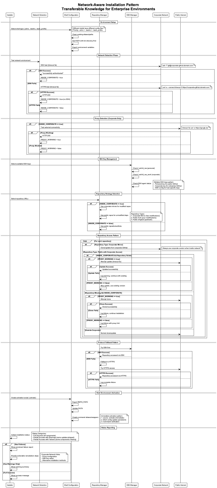

# Network-Aware Installation Patterns for Enterprise Environments

## Overview

This document captures transferable knowledge about implementing network-aware installation systems that intelligently adapt to different network environments (corporate networks vs. public internet). These patterns are essential for enterprise software that needs to work seamlessly across different network contexts while handling security restrictions, proxy configurations, and multiple repository sources.

## Core Concepts

### Network Environment Detection

**Problem:** Software installations must adapt to different network environments without user intervention.

**Solution Pattern:** Multi-stage network detection with graceful fallbacks.

```bash
# Stage 1: SSH connectivity test
timeout 5s ssh -o BatchMode=yes -o ConnectTimeout=5 -T git@corporate-github.domain.com

# Stage 2: HTTPS fallback test  
timeout 5s curl -s --connect-timeout 5 https://corporate-github.domain.com

# Stage 3: External connectivity test (corporate networks only)
timeout 5s curl -s --connect-timeout 5 https://google.de
```

**Key Principles:**

- Always use timeouts to prevent hanging
- Test specific functionality, not just network reachability
- Provide clear success/failure criteria
- Fall back gracefully through multiple detection methods



### Repository Strategy Patterns

**Repository Types in Enterprise Context:**

1. **Corporate Mirrors** - Internal copies with modifications
   - Use when: Inside corporate network + repo has team customizations
   - Example: `git@corporate-github.domain.com:team/modified-tool.git`

2. **Public Forks** - Your team's public modifications  
   - Use when: Outside corporate network + repo has team customizations
   - Example: `git@github.com:yourteam/modified-tool.git`

3. **Public Originals** - Upstream repositories
   - Use when: No team modifications needed
   - Example: `git@github.com:upstream/original-tool.git`

**Selection Logic:**

```
if (inside_corporate_network) {
    if (repo_has_corporate_mirror) {
        use corporate_mirror
    } else {
        use public_repo_with_proxy_handling
    }
} else {
    if (repo_has_public_fork) {
        use public_fork
    } else {
        use public_original
    }
}
```

### Shell Environment Management

**Challenge:** Different shells use different configuration files and have different PATH precedence rules.

**Solution Pattern:** Universal shell configuration with detection and cleanup.

```bash
# Shell detection priority
config_files=(
    "$HOME/.zshrc"      # macOS default (zsh)
    "$HOME/.bashrc"     # Linux default  
    "$HOME/.bash_profile" # macOS fallback
)

# Configuration strategy
1. Detect current shell type
2. Clean existing aliases/paths (remove old installations)
3. Add PATH modification with new location first
4. Export environment variables
5. Create immediate activation script
```

**PATH Management Best Practices:**

- Always put your bin directory first in PATH
- Remove existing entries before adding new ones
- Use absolute paths, not relative paths
- Test command availability after PATH updates

### SSH Key Management for Multiple GitHub Instances

**Common Scenario:** Developers need access to both corporate GitHub and public GitHub with different SSH keys.


**SSH Config Pattern:**

```ssh
# ~/.ssh/config
Host corporate-github
    HostName cc-github.bmwgroup.net
    User git
    IdentityFile ~/.ssh/id_rsa_work
    IdentitiesOnly yes

Host github.com
    User git  
    IdentityFile ~/.ssh/id_rsa_personal
    IdentitiesOnly yes
```

**Key Management Commands:**

```bash
# Generate separate keys
ssh-keygen -t rsa -f ~/.ssh/id_rsa_work -C "work@company.com"
ssh-keygen -t rsa -f ~/.ssh/id_rsa_personal -C "personal@email.com"

# Add to SSH agent
ssh-add ~/.ssh/id_rsa_work
ssh-add ~/.ssh/id_rsa_personal

# Test connectivity
ssh -T git@corporate-github
ssh -T git@github.com
```

### Protocol Fallback Strategy

**Pattern:** SSH-first with HTTPS fallback for maximum compatibility.

```bash
clone_with_fallback() {
    local ssh_url="$1"
    local https_url="$2"
    local target_dir="$3"
    
    # Try SSH first (faster, key-based auth)
    if git clone "$ssh_url" "$target_dir" 2>/dev/null; then
        echo "Cloned via SSH"
        return 0
    fi
    
    # Fallback to HTTPS (works through proxies)
    if git clone "$https_url" "$target_dir"; then
        echo "Cloned via HTTPS"
        return 0
    fi
    
    echo "Both SSH and HTTPS failed"
    return 1
}
```

### Timeout-Based State Detection

**Problem:** Network operations can hang indefinitely in corporate environments.

**Solution:** Aggressive timeouts with context-specific values.

```bash
# Connection timeouts (seconds)
SSH_TEST_TIMEOUT=5      # Quick SSH connectivity test
HTTPS_TEST_TIMEOUT=5    # Quick HTTPS connectivity test  
GIT_CLONE_TIMEOUT=30    # Git operations (larger repos)
GIT_UPDATE_TIMEOUT=10   # Git pull operations
```

**Implementation Pattern:**

```bash
# Using timeout command
timeout ${TIMEOUT}s command args

# Using SSH options
ssh -o ConnectTimeout=${TIMEOUT} -o BatchMode=yes

# Using curl options  
curl --connect-timeout ${TIMEOUT} --max-time ${TIMEOUT}
```

### Graceful Degradation Strategy

**Success Levels:**

1. **Full Success (🟢)**
   - All repositories accessible and updated
   - All components built successfully
   - Full functionality available

2. **Partial Success with Warnings (🟡)**
   - Core components installed
   - Some repositories couldn't be updated (existing versions used)
   - Most functionality available

3. **Partial Success with Failures (🔴)**
   - Core components installed  
   - Some repositories missing and couldn't be cloned
   - Reduced functionality with clear user guidance

**Status Tracking Pattern:**

```bash
# Global status arrays
WARNINGS=()
FAILURES=()

# Adding status items
WARNINGS+=("Component X: Could not update due to proxy restrictions")
FAILURES+=("Component Y: Missing and cannot clone without external access")

# Reporting
if [[ ${#FAILURES[@]} -gt 0 ]]; then
    echo "Installation completed with failures"
    show_remediation_hints
elif [[ ${#WARNINGS[@]} -gt 0 ]]; then
    echo "Installation completed with warnings"
else
    echo "Installation completed successfully"
fi
```

### Proxy Detection and Handling

**Corporate Network Challenge:** External repository access may be blocked or require proxy configuration.

**Detection Method:**

```bash
test_external_connectivity() {
    # Use a reliable external endpoint
    if timeout 5s curl -s --connect-timeout 5 https://google.de >/dev/null 2>&1; then
        return 0  # Proxy working or direct access
    else
        return 1  # External access blocked
    fi
}
```

**Handling Strategy:**

```bash
handle_external_repo() {
    local repo_name="$1"
    local target_dir="$2"
    
    if [[ -d "$target_dir" ]]; then
        # Repository exists - attempt update
        if test_external_connectivity; then
            git pull || warn "Could not update $repo_name"
        else
            warn "Skipping $repo_name update - no external access"
        fi
    else
        # Repository missing - attempt clone
        if test_external_connectivity; then
            clone_repository || fail "Could not clone $repo_name"
        else
            fail "$repo_name missing and no external access to clone"
        fi
    fi
}
```

## Implementation Guidelines

### Error Handling Best Practices

1. **Always provide context** in error messages
2. **Include remediation steps** where possible
3. **Distinguish between** temporary network issues and configuration problems
4. **Log detailed information** for debugging while showing user-friendly messages

### User Experience Patterns

1. **Progress indication** for long-running operations
2. **Clear success/warning/failure** status with color coding
3. **Actionable next steps** for any issues encountered
4. **Environment-specific guidance** (inside vs outside corporate network)

### Testing Strategies

**Local Testing:**

```bash
# Test different network conditions
# 1. Inside corporate network with proxy
# 2. Inside corporate network without proxy  
# 3. Outside corporate network
# 4. SSH keys available vs not available
# 5. Repositories exist vs missing
```

**Validation Commands:**

```bash
# Network detection
ssh -T git@corporate-github.domain.com
curl -I https://corporate-github.domain.com
curl -I https://google.de

# Repository access
git ls-remote git@corporate-github.domain.com:repo/name.git
git ls-remote https://github.com/user/repo.git

# SSH key validation
ssh-add -l
ssh -T git@github.com
```

## Real-World Applications

This pattern applies to:

- **Enterprise development tools** that need to work across network boundaries
- **CI/CD systems** that run in different environments
- **Developer onboarding scripts** that must handle various network configurations
- **Multi-repository projects** with mixed public/private dependencies
- **Cross-platform installations** that adapt to network restrictions

## Key Takeaways

1. **Network detection should be multi-staged** with clear fallbacks
2. **Repository strategy must account for** corporate mirrors, public forks, and originals
3. **SSH key management becomes complex** with multiple GitHub instances
4. **Timeouts are essential** to prevent hanging in corporate networks
5. **Graceful degradation provides better UX** than complete failures
6. **Status reporting should be actionable** with environment-specific guidance

These patterns enable robust, enterprise-ready installation systems that work reliably across diverse network environments while providing clear feedback and remediation paths for users.

## Related Documentation

- [Detailed Implementation](../../docs/installation-architecture.md) - Technical deep-dive into our specific implementation
- [User Guide](../../TEAM_KNOWLEDGE_SETUP.md) - End-user installation instructions
- [Network Troubleshooting](../../docs/network-troubleshooting.md) - Common issues and solutions
