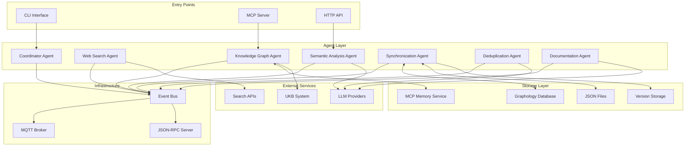
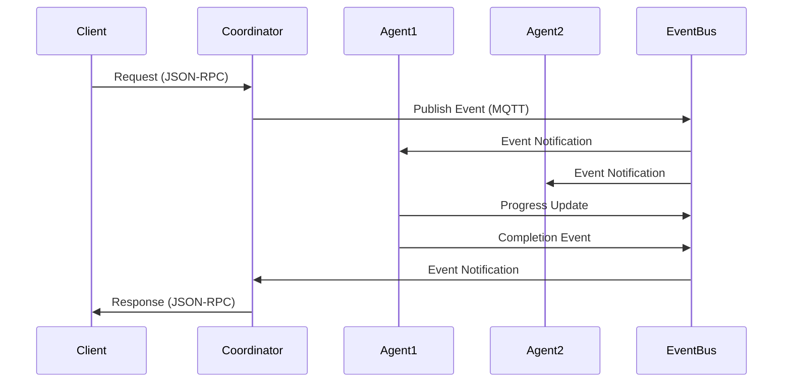
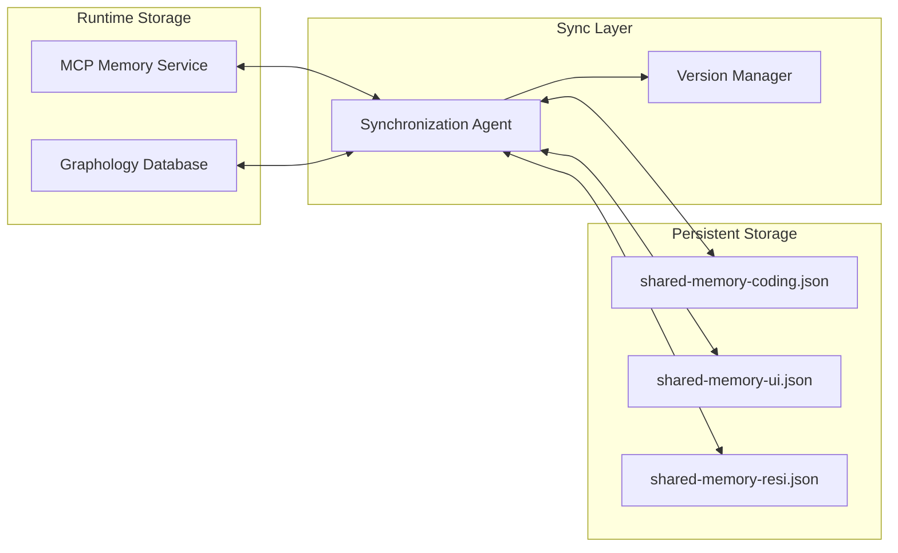
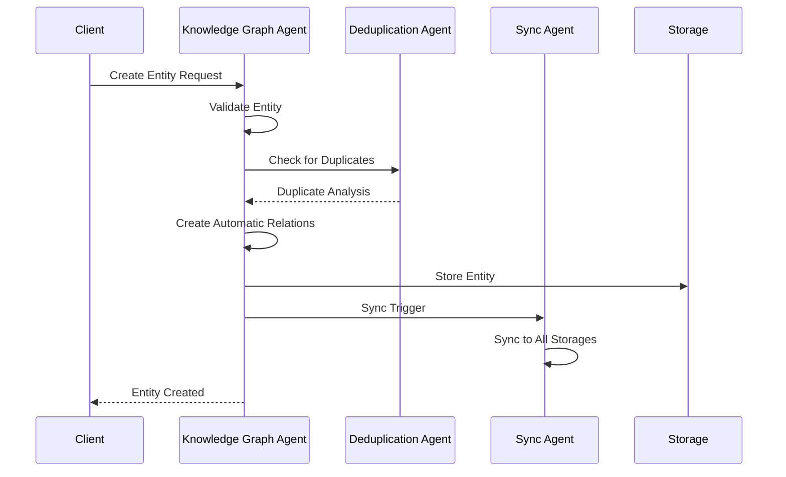
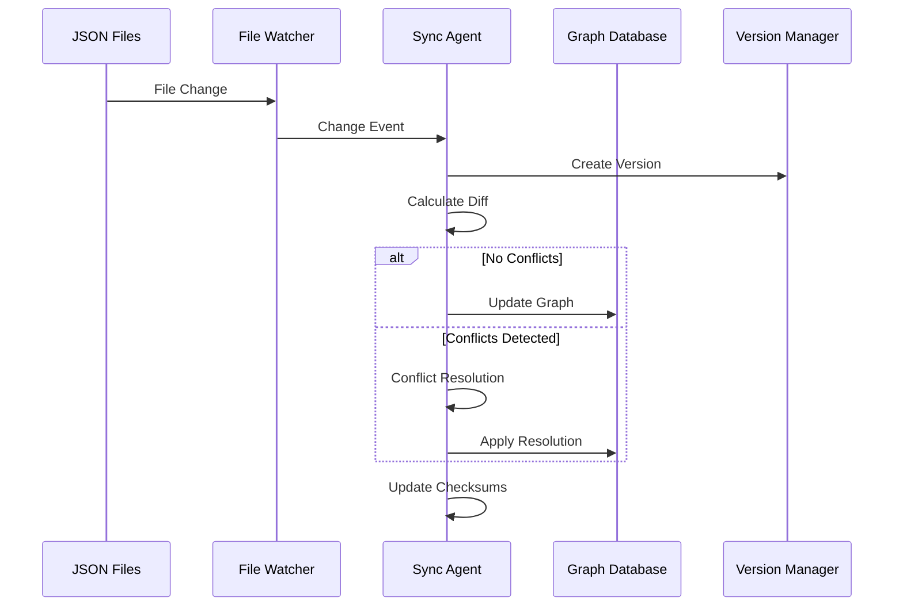

# Semantic Analysis System Architecture

## Overview

The Semantic Analysis System is a modular, distributed agent system designed for semantic analysis of code, conversations, and technical documentation. It features a hybrid communication architecture using MQTT for events and JSON-RPC for commands, with comprehensive synchronization and deduplication capabilities.

## System Architecture



## Agent Architecture

### Core Agents

#### 1. Semantic Analysis Agent
**Purpose**: Analyzes code commits, conversations, and extracts patterns

**Capabilities**:
- Code repository analysis
- Conversation analysis
- Pattern extraction
- Significance scoring
- Multi-LLM support (Claude, OpenAI)

**Key Components**:
- `ClaudeProvider` / `OpenAIProvider`: LLM integrations
- `CodeAnalyzer`: Git history and commit analysis
- Analysis cache with TTL

#### 2. Knowledge Graph Agent
**Purpose**: Manages knowledge entities and relations with automatic connectivity

**Enhanced Capabilities**:
- ✅ **Automatic relation creation** to CollectiveKnowledge and project nodes
- ✅ **Entity validation** with comprehensive checks
- ✅ **Duplicate detection** before entity creation
- ✅ **Type-based relations** (Patterns, Documentation, Insights hubs)
- ✅ **Technology relations** based on metadata

**Key Components**:
- `KnowledgeAPI`: File-based knowledge storage
- `UkbIntegration`: UKB system synchronization
- `EntityProcessor`: Entity data processing and validation

#### 3. Synchronization Agent
**Purpose**: Ensures bidirectional sync between graph databases and JSON files

**Capabilities**:
- ✅ **Multi-adapter support**: MCP Memory Service + Graphology Database
- ✅ **File watching**: Real-time change detection with debouncing
- ✅ **Conflict resolution**: Latest-wins, merge, manual strategies
- ✅ **Version management**: Rollback capabilities with history
- ✅ **Checksum validation**: Prevents infinite sync loops

**Key Components**:
- `MCPAdapter` / `GraphologyAdapter`: Database adapters
- `FileWatcher`: File system monitoring
- `ConflictResolver`: Conflict detection and resolution
- `VersionManager`: Version control and rollback

#### 4. Deduplication Agent
**Purpose**: Detects and merges semantically similar entities

**Capabilities**:
- ✅ **Embedding generation**: OpenAI, sentence-transformers, local TF-IDF
- ✅ **Similarity detection**: Cosine, Euclidean, Manhattan, Pearson, Jaccard
- ✅ **Automatic merging**: Configurable strategies and thresholds
- ✅ **Batch processing**: Periodic deduplication with performance optimization
- ✅ **Entity grouping**: Visualization support for similar entities

**Key Components**:
- `EmbeddingGenerator`: Vector embedding creation
- `SimilarityDetector`: Multi-metric similarity calculation
- `EntityMerger`: Intelligent entity merging with multiple strategies

#### 5. Coordinator Agent
**Purpose**: Orchestrates workflows and ensures quality assurance

**Capabilities**:
- Workflow orchestration across agents
- Multi-agent coordination
- Task scheduling
- Agent discovery and capability management
- **Quality assurance checks** (pending enhancement)

**Key Components**:
- `WorkflowEngine`: Workflow execution and management
- `WorkflowBuilder`: Dynamic workflow creation
- `TaskScheduler`: Task scheduling and execution

#### 6. Web Search Agent
**Purpose**: Performs context-aware web searches and validates references

**Capabilities**:
- Context-aware web searches
- Reference validation
- Content extraction
- Documentation discovery

#### 7. Documentation Agent
**Purpose**: Generates comprehensive insight documents (pending implementation)

**Planned Capabilities**:
- Markdown document generation
- PlantUML/Mermaid diagram creation
- Code snippet integration
- Reference validation and enrichment

## Communication Architecture

### Hybrid Communication Protocol



### Event-Driven Architecture

**MQTT Topics**:
- `analysis/*`: Analysis-related events
- `knowledge/*`: Knowledge graph events
- `sync/*`: Synchronization events
- `deduplication/*`: Deduplication events
- `workflow/*`: Workflow orchestration events

**JSON-RPC Commands**:
- Synchronous request-response operations
- Direct agent communication
- MCP tool integration

## Storage Architecture

### Multi-Storage Strategy



### Knowledge Graph Structure

**Central Nodes**:
- `CollectiveKnowledge`: Root hub for all knowledge
- `Coding`, `UI`, `Resi`: Team-specific knowledge nodes
- `Patterns`: Collection of reusable patterns
- `Documentation`: System documentation
- `Insights`: Collected insights and learnings
- `Technology:*`: Technology-specific nodes

**Automatic Relations**:
- All entities → `CollectiveKnowledge` (contains)
- Team entities → Team node (contains)
- Patterns → `Patterns` hub (includes)
- Documentation → `Documentation` hub (includes)
- Technology usage → `Technology:*` nodes (uses)

## Data Flow

### Entity Creation Flow



### Synchronization Flow



## Quality Assurance

### Entity Validation Rules

1. **Name Validation**:
   - Required, non-empty
   - Maximum 200 characters
   - Valid character set: `[a-zA-Z0-9\s\-_:.()] `

2. **Type Validation**:
   - Must be from approved list
   - Warning for unknown types

3. **Significance Validation**:
   - Range: 1-10
   - Required field

4. **Metadata Validation**:
   - Team assignment (default: 'coding')
   - Technology array validation
   - Reference URL validation

### Automatic Relation Rules

1. **Central Connectivity**:
   - All entities connect to `CollectiveKnowledge`
   - Team-based categorization

2. **Type-Based Relations**:
   - Patterns → Pattern hubs
   - Documentation → Doc hubs
   - Insights → Insight hubs

3. **Technology Relations**:
   - Technology metadata → Technology nodes
   - Automatic technology node creation

## Configuration

### Agent Configuration

```yaml
agents:
  semantic-analysis:
    llm:
      primary: claude
      fallback: openai
    analysis:
      significanceThreshold: 7
      maxCommits: 50
  
  synchronization:
    graphDb:
      type: mcp  # or 'graphology'
    files:
      sharedMemoryPaths:
        - /path/to/shared-memory-coding.json
        - /path/to/shared-memory-ui.json
    conflict:
      strategy: latest-wins  # or 'manual', 'merge'
  
  deduplication:
    embedding:
      provider: openai  # or 'sentence-transformers', 'local'
      model: text-embedding-ada-002
    similarity:
      metric: cosine
      threshold: 0.8
    merging:
      strategy: auto  # or 'weighted', 'priority', 'manual'
```

### Infrastructure Configuration

```yaml
mqtt:
  broker:
    host: localhost
    port: 1883
  
rpc:
  server:
    host: localhost
    port: 8080

mcp:
  server:
    port: 3001
```

## Deployment

### Single Machine Deployment

```bash
# Start all services
npm run start:agents

# Start MCP server
npm run start:mcp
```

### Distributed Deployment

```bash
# Configure shared MQTT broker
export MQTT_BROKER_HOST=mqtt.your-domain.com

# Deploy agents to different machines
docker-compose -f docker-compose.distributed.yml up
```

## Performance Considerations

### Synchronization Performance

- **Debounced file watching**: Prevents excessive sync operations
- **Checksum validation**: Avoids unnecessary processing
- **Batch operations**: Optimizes bulk updates
- **Version compression**: Reduces storage overhead

### Deduplication Performance

- **Embedding caching**: Reduces computation overhead
- **Batch processing**: Optimizes similarity calculations
- **Configurable thresholds**: Balances accuracy vs. performance
- **Periodic scheduling**: Spreads load over time

### Memory Management

- **LRU caching**: Automatic cache eviction
- **Connection pooling**: Efficient resource utilization
- **Graceful degradation**: Fallback strategies for failures

## Security Considerations

- **API key management**: Environment variable configuration
- **Input validation**: Comprehensive data sanitization
- **Access control**: Role-based permissions (future)
- **Audit logging**: Complete operation tracking

## Monitoring and Observability

### Metrics

- **Agent health**: Status monitoring and alerting
- **Sync performance**: Latency and throughput metrics
- **Deduplication effectiveness**: Merge success rates
- **Storage utilization**: Capacity and growth tracking

### Logging

- **Structured logging**: JSON-formatted logs
- **Log levels**: DEBUG, INFO, WARN, ERROR
- **Correlation IDs**: Request tracing across agents
- **Performance logs**: Timing and resource usage

## Future Enhancements

1. **Documentation Agent**: Automated insight document generation
2. **Quality Assurance Agent**: Advanced validation and compliance
3. **Analytics Dashboard**: Real-time system monitoring
4. **Machine Learning**: Enhanced similarity detection
5. **Distributed Deployment**: Kubernetes orchestration
6. **API Gateway**: Unified access point with rate limiting