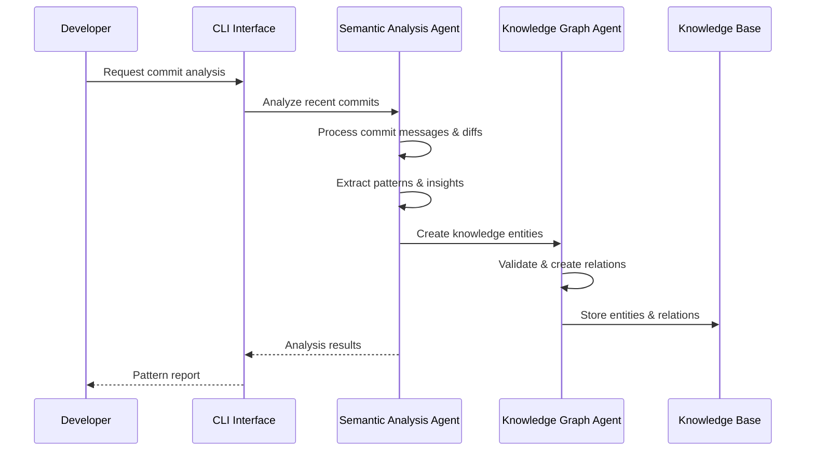
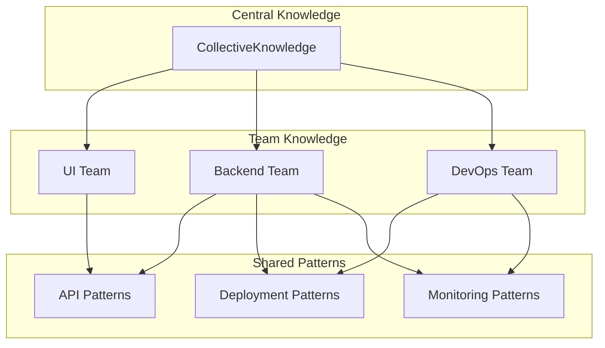
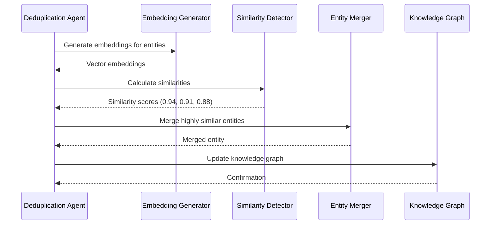
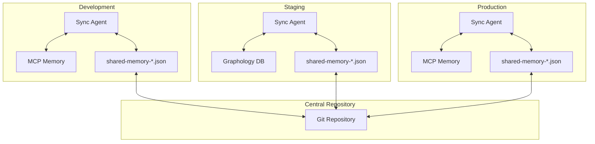
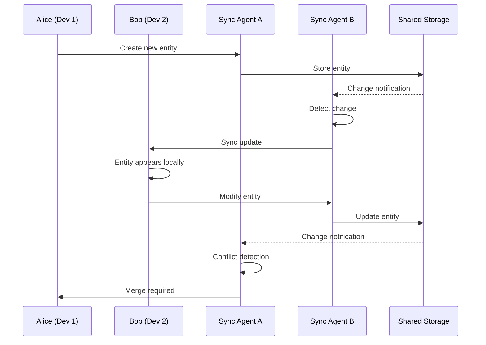

# Use Cases and Examples

## Overview

The Semantic Analysis System supports a wide range of use cases for automated knowledge management, pattern detection, and code analysis. This document provides comprehensive examples and workflows for different scenarios.

## Table of Contents

1. [Code Analysis Use Cases](#code-analysis-use-cases)
2. [Knowledge Management Use Cases](#knowledge-management-use-cases)
3. [Deduplication Use Cases](#deduplication-use-cases)
4. [Synchronization Use Cases](#synchronization-use-cases)
5. [Team Collaboration Use Cases](#team-collaboration-use-cases)
6. [Integration Use Cases](#integration-use-cases)

## Code Analysis Use Cases

### Use Case 1: Repository Pattern Analysis

**Scenario**: Analyze a repository for architectural patterns and best practices

**Implementation**:
```bash
# Via CLI
semantic-cli analyze code --repo /path/to/repo --depth 20 --threshold 8

# Via API
curl -X POST http://localhost:8080/semantic-analysis/analyze/code \
  -H "Content-Type: application/json" \
  -d '{
    "repository": "/path/to/repo",
    "depth": 20,
    "significanceThreshold": 8,
    "includePatterns": true
  }'
```

**Expected Output**:
```json
{
  "analysisId": "analysis_20241230_001",
  "repository": "/path/to/repo",
  "patterns": [
    {
      "name": "React Hook Pattern",
      "type": "ArchitecturalPattern",
      "significance": 9,
      "occurrences": 15,
      "files": ["src/hooks/useAuth.js", "src/hooks/useApi.js"],
      "description": "Custom React hooks for state management"
    },
    {
      "name": "Repository Pattern",
      "type": "DesignPattern",
      "significance": 8,
      "occurrences": 8,
      "files": ["src/repositories/UserRepository.js"],
      "description": "Data access abstraction layer"
    }
  ],
  "insights": [
    {
      "title": "Consistent Error Handling",
      "significance": 7,
      "observation": "Error handling follows consistent pattern across components"
    }
  ],
  "metrics": {
    "totalCommits": 20,
    "analyzedFiles": 156,
    "patternsFound": 12,
    "significantPatterns": 2
  }
}
```

### Use Case 2: Commit History Analysis

**Scenario**: Analyze recent commits for emerging patterns and technical debt

**Workflow**:


**Implementation**:
```javascript
// Automated commit analysis
const analysis = await coordinatorAgent.analyzeRepository({
  repository: '/path/to/repo',
  depth: 50,
  analysisTypes: ['commits', 'patterns', 'debt'],
  autoCreateEntities: true
});

console.log(`Found ${analysis.patterns.length} patterns`);
console.log(`Created ${analysis.entities.length} knowledge entities`);
```

## Knowledge Management Use Cases

### Use Case 3: Automatic Knowledge Base Population

**Scenario**: Automatically populate knowledge base from conversation logs and documentation

**Implementation**:
```bash
# Batch process conversation files
for file in .specstory/history/*.md; do
  semantic-cli analyze conversation --file "$file" --extract-insights
done

# Process with auto-entity creation
semantic-cli batch process \
  --input-dir .specstory/history/ \
  --output-format knowledge-entities \
  --auto-relate \
  --team coding
```

**Entity Creation Example**:
```json
{
  "name": "Redux State Management Pattern",
  "entityType": "TransferablePattern",
  "significance": 9,
  "observations": [
    "Redux Toolkit implementation with typed hooks",
    "Feature-based slices organization",
    "State persistence at slice level",
    "Handles non-serializable objects gracefully"
  ],
  "metadata": {
    "team": "ui",
    "technologies": ["React", "Redux", "TypeScript"],
    "sourceFiles": ["src/store/index.ts", "src/hooks/redux.ts"],
    "extractedFrom": "conversation-2024-12-30.md"
  }
}
```

### Use Case 4: Cross-Team Knowledge Sharing

**Scenario**: Share patterns between UI, Backend, and DevOps teams

**Knowledge Graph Structure**:


**Implementation**:
```javascript
// Create cross-team pattern
await knowledgeGraphAgent.createEntity({
  name: "Microservice Communication Pattern",
  entityType: "TransferablePattern",
  significance: 9,
  observations: [
    "gRPC for internal service communication",
    "REST APIs for external interfaces",
    "Event-driven architecture with message queues"
  ],
  metadata: {
    team: "backend",
    sharedWith: ["ui", "devops"],
    technologies: ["gRPC", "REST", "RabbitMQ"],
    applicability: "All microservice implementations"
  }
});

// Automatic relations created:
// CollectiveKnowledge -> contains -> Microservice Communication Pattern
// Backend -> contains -> Microservice Communication Pattern
// Patterns -> includes -> Microservice Communication Pattern
// Technology:gRPC -> uses -> Microservice Communication Pattern
```

## Deduplication Use Cases

### Use Case 5: Semantic Duplicate Detection

**Scenario**: Detect and merge semantically similar knowledge entities

**Before Deduplication**:
```json
[
  {
    "name": "React Component Pattern",
    "entityType": "Pattern",
    "observations": ["Functional components with hooks"]
  },
  {
    "name": "React Functional Component Approach",
    "entityType": "TransferablePattern", 
    "observations": ["Using hooks for state management in functional components"]
  },
  {
    "name": "Modern React Component Design",
    "entityType": "Pattern",
    "observations": ["Hooks-based functional component architecture"]
  }
]
```

**Deduplication Process**:


**After Deduplication**:
```json
{
  "name": "React Functional Component Pattern",
  "entityType": "TransferablePattern",
  "significance": 9,
  "observations": [
    "Functional components with hooks for state management",
    "Modern React component architecture using hooks",
    "Hooks-based functional component design approach"
  ],
  "metadata": {
    "merged": true,
    "mergedAt": "2024-12-30T13:17:23.837Z",
    "sourceEntities": [
      {"id": "entity_1", "name": "React Component Pattern"},
      {"id": "entity_2", "name": "React Functional Component Approach"},
      {"id": "entity_3", "name": "Modern React Component Design"}
    ],
    "mergeStrategy": "auto",
    "similarity": 0.94
  }
}
```

### Use Case 6: Batch Deduplication Analysis

**Scenario**: Analyze entire knowledge base for potential duplicates

**Implementation**:
```bash
# Analyze all entities for duplicates
semantic-cli dedup analyze --threshold 0.85 --scope all

# Generate deduplication report
semantic-cli dedup report --format json --output dedup-report.json

# Preview merges before applying
semantic-cli dedup preview --threshold 0.90

# Apply automatic merges
semantic-cli dedup merge --auto --threshold 0.95
```

**Analysis Report**:
```json
{
  "analysis": {
    "totalEntities": 1247,
    "duplicateGroups": 23,
    "potentialMerges": 67,
    "spaceReduction": {
      "entities": 67,
      "percentage": 5.4
    }
  },
  "groups": [
    {
      "primary": {
        "name": "Docker Deployment Pattern",
        "significance": 8
      },
      "duplicates": [
        {
          "name": "Container Deployment Approach",
          "similarity": 0.92
        },
        {
          "name": "Docker-based Deployment Strategy", 
          "similarity": 0.89
        }
      ]
    }
  ],
  "recommendations": [
    {
      "action": "auto-merge",
      "confidence": "high",
      "entities": 34
    },
    {
      "action": "review",
      "confidence": "medium", 
      "entities": 21
    },
    {
      "action": "ignore",
      "confidence": "low",
      "entities": 12
    }
  ]
}
```

## Synchronization Use Cases

### Use Case 7: Multi-Environment Synchronization

**Scenario**: Synchronize knowledge base across development, staging, and production environments

**Architecture**:


**Implementation**:
```bash
# Development to staging sync
semantic-cli sync push --from dev --to staging --entities new

# Staging to production sync (safe mode)
semantic-cli sync push --from staging --to production --dry-run
semantic-cli sync push --from staging --to production --confirm

# Bidirectional sync with conflict resolution
semantic-cli sync bidirectional --resolve latest-wins
```

### Use Case 8: Real-time Collaboration

**Scenario**: Real-time knowledge updates across team members

**Sync Workflow**:


**Configuration**:
```yaml
synchronization:
  realtime:
    enabled: true
    conflictResolution: prompt  # prompt, auto, manual
    notificationChannels:
      - webhook: https://hooks.slack.com/team-notifications
      - email: team@company.com
  
  watching:
    debounceDelay: 500  # Fast response for collaboration
    checksumValidation: true
    
  backup:
    createOnConflict: true
    retentionDays: 30
```

## Team Collaboration Use Cases

### Use Case 9: Onboarding New Team Members

**Scenario**: Help new developers understand codebase patterns and practices

**Onboarding Workflow**:
```bash
# Generate onboarding knowledge pack
semantic-cli onboard generate \
  --repo /path/to/repo \
  --team backend \
  --level beginner \
  --output onboarding-pack.md

# Create personalized learning path
semantic-cli onboard path \
  --skills "React,TypeScript" \
  --role "Frontend Developer" \
  --experience junior
```

**Generated Knowledge Pack**:
```markdown
# Backend Team Onboarding - Knowledge Pack

## Architecture Patterns (Significance: 9-10)
1. **Microservice Communication Pattern**
   - gRPC for internal services
   - REST for external APIs
   - Implementation: `src/services/grpc/`

2. **Database Access Pattern**
   - Repository pattern with TypeORM
   - Connection pooling
   - Implementation: `src/repositories/`

## Code Practices (Significance: 8-9)
1. **Error Handling Strategy**
   - Centralized error middleware
   - Structured logging
   - Implementation: `src/middleware/errors.ts`

## Testing Patterns (Significance: 7-8)
1. **Integration Testing Approach**
   - Test containers for databases
   - Mock external services
   - Implementation: `tests/integration/`
```

### Use Case 10: Cross-Project Pattern Reuse

**Scenario**: Identify and promote patterns across multiple projects

**Pattern Discovery**:
```javascript
// Discover patterns across projects
const crossProjectAnalysis = await coordinatorAgent.analyzeCrossProject({
  projects: [
    '/path/to/project-a',
    '/path/to/project-b', 
    '/path/to/project-c'
  ],
  findCommonPatterns: true,
  significanceThreshold: 8,
  similarity: 0.85
});

// Results: Common patterns found across projects
console.log(crossProjectAnalysis.commonPatterns);
/*
[
  {
    "name": "Authentication Middleware Pattern",
    "foundIn": ["project-a", "project-b", "project-c"],
    "implementations": [
      "middleware/auth.js",
      "src/auth/middleware.ts",
      "lib/authentication.js"
    ],
    "transferability": 0.95,
    "recommendation": "Create shared library"
  }
]
*/
```

## Integration Use Cases

### Use Case 11: CI/CD Pipeline Integration

**Scenario**: Integrate semantic analysis into continuous integration pipeline

**GitHub Actions Workflow**:
```yaml
name: Semantic Analysis
on:
  push:
    branches: [main, develop]
  pull_request:
    branches: [main]

jobs:
  semantic-analysis:
    runs-on: ubuntu-latest
    steps:
      - uses: actions/checkout@v3
      
      - name: Setup Semantic Analysis
        run: |
          npm install -g semantic-analysis-cli
          export ANTHROPIC_API_KEY=${{ secrets.ANTHROPIC_API_KEY }}
      
      - name: Analyze Recent Changes
        run: |
          semantic-cli analyze code \
            --repo . \
            --depth 10 \
            --format github-comment \
            --output analysis-results.md
      
      - name: Update Knowledge Base
        run: |
          semantic-cli knowledge update \
            --source analysis-results.md \
            --auto-create-entities \
            --team ${{ github.repository_owner }}
      
      - name: Comment on PR
        if: github.event_name == 'pull_request'
        uses: actions/github-script@v6
        with:
          script: |
            const fs = require('fs');
            const analysis = fs.readFileSync('analysis-results.md', 'utf8');
            github.rest.issues.createComment({
              issue_number: context.issue.number,
              owner: context.repo.owner,
              repo: context.repo.repo,
              body: analysis
            });
```

### Use Case 12: IDE Integration

**Scenario**: Provide real-time pattern suggestions in VS Code

**VS Code Extension Configuration**:
```json
{
  "semanticAnalysis.enabled": true,
  "semanticAnalysis.endpoint": "http://localhost:8080",
  "semanticAnalysis.features": {
    "patternSuggestions": true,
    "duplicateDetection": true,
    "knowledgeTooltips": true
  },
  "semanticAnalysis.triggers": {
    "onSave": true,
    "onType": false,
    "onCommit": true
  }
}
```

**Real-time Integration**:
```javascript
// VS Code Extension API
const provider = {
  provideCodeActions(document, range, context, token) {
    return semanticAnalysisClient.analyzeCurrent({
      file: document.fileName,
      content: document.getText(range),
      context: 'code-action'
    }).then(analysis => {
      return analysis.suggestions.map(suggestion => ({
        title: `Apply ${suggestion.pattern}`,
        kind: vscode.CodeActionKind.Refactor,
        edit: suggestion.edit
      }));
    });
  }
};
```

## Advanced Use Cases

### Use Case 13: Machine Learning Model Training

**Scenario**: Use collected patterns to train custom models for pattern detection

**Data Preparation**:
```javascript
// Export training data
const trainingData = await knowledgeGraphAgent.exportTrainingData({
  entityTypes: ['Pattern', 'TransferablePattern'],
  includeEmbeddings: true,
  format: 'jsonl',
  splitRatio: { train: 0.8, validation: 0.1, test: 0.1 }
});

// Format for model training
const examples = trainingData.map(entity => ({
  input: entity.observations.join(' '),
  output: {
    pattern_type: entity.entityType,
    significance: entity.significance,
    technologies: entity.metadata.technologies
  }
}));
```

### Use Case 14: Automated Documentation Generation

**Scenario**: Generate comprehensive documentation from knowledge base

**Documentation Generation**:
```bash
# Generate architecture documentation
semantic-cli docs generate \
  --type architecture \
  --include-diagrams \
  --output docs/architecture.md

# Generate API documentation
semantic-cli docs generate \
  --type api \
  --include-examples \
  --format openapi \
  --output docs/api.yaml

# Generate pattern catalog
semantic-cli docs generate \
  --type patterns \
  --team-filter all \
  --significance-min 7 \
  --output docs/patterns.md
```

### Use Case 15: Performance Optimization

**Scenario**: Identify performance patterns and anti-patterns

**Performance Analysis**:
```javascript
// Analyze performance patterns
const perfAnalysis = await semanticAnalysisAgent.analyzePerformance({
  repository: '/path/to/repo',
  metrics: ['response_time', 'memory_usage', 'cpu_utilization'],
  timeRange: '30d',
  correlateWithPatterns: true
});

// Results show correlation between patterns and performance
console.log(perfAnalysis.correlations);
/*
{
  "patterns": [
    {
      "name": "N+1 Query Pattern",
      "impact": "negative",
      "performance_impact": -45,
      "recommendations": ["Use eager loading", "Implement query batching"]
    },
    {
      "name": "Caching Strategy Pattern", 
      "impact": "positive",
      "performance_impact": +67,
      "recommendations": ["Expand cache usage", "Implement cache warming"]
    }
  ]
}
*/
```

## Best Practices

### 1. Entity Naming Conventions

```javascript
// Good naming examples
const goodNames = [
  "React Component Lifecycle Pattern",
  "Database Connection Pool Strategy",
  "Microservice Authentication Flow",
  "Error Handling Middleware Pattern"
];

// Avoid generic names
const badNames = [
  "Pattern1",
  "Strategy", 
  "Component",
  "Database Thing"
];
```

### 2. Significance Scoring Guidelines

| Significance | Criteria | Examples |
|-------------|----------|----------|
| 9-10 | Critical architectural patterns | Microservice architecture, Authentication system |
| 7-8 | Important implementation patterns | Error handling, Logging strategy |
| 5-6 | Useful code patterns | Helper functions, Utility classes |
| 3-4 | Minor patterns | Naming conventions, Code formatting |
| 1-2 | Trivial observations | Comments, Debug statements |

### 3. Metadata Best Practices

```javascript
// Comprehensive metadata example
const entityMetadata = {
  team: "backend",
  technologies: ["Node.js", "Express", "PostgreSQL"],
  references: [
    "https://expressjs.com/guide/error-handling.html",
    "https://nodejs.org/api/errors.html"
  ],
  codeFiles: [
    "src/middleware/error-handler.js",
    "src/utils/logger.js"
  ],
  relatedPatterns: ["Logging Strategy", "Monitoring Pattern"],
  difficulty: "intermediate",
  maturity: "stable",
  license: "MIT"
};
```

### 4. Deduplication Strategies

```yaml
deduplication:
  strategies:
    high_confidence:  # >95% similarity
      action: auto-merge
      review: false
    
    medium_confidence:  # 85-95% similarity  
      action: suggest-merge
      review: true
      
    low_confidence:  # 70-85% similarity
      action: group
      review: false
      
    no_confidence:  # <70% similarity
      action: ignore
```

This comprehensive use case documentation provides practical examples for implementing and using the enhanced semantic analysis system across various scenarios and team configurations.