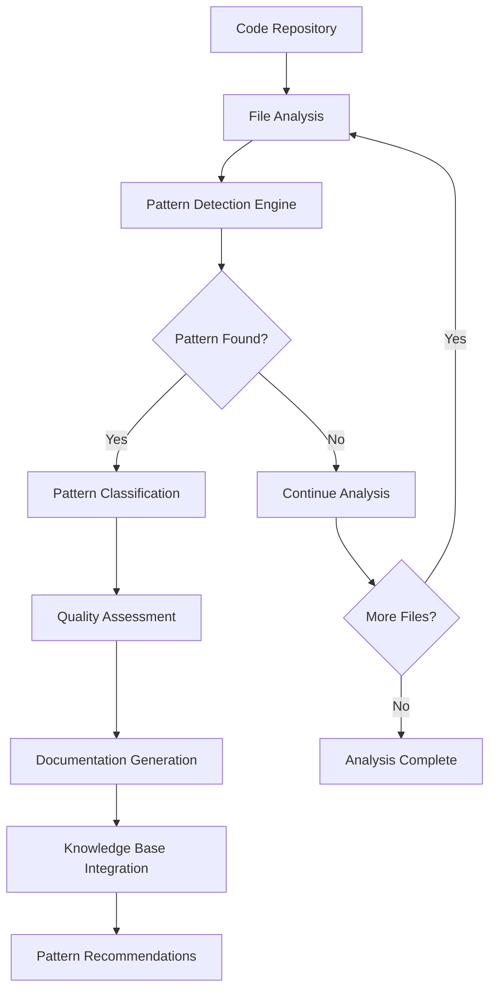

# Code Pattern Analysis

Automatic detection and documentation of architectural patterns, anti-patterns, and best practices within codebases.

## Overview

The Semantic Analysis System automatically identifies, analyzes, and documents code patterns across repositories. This capability enables development teams to:

- **Detect Architectural Patterns**: Identify common design patterns (Singleton, Observer, Factory, etc.)
- **Spot Anti-Patterns**: Find problematic code structures and suggest improvements
- **Enforce Best Practices**: Ensure consistency across codebases and team development
- **Generate Pattern Documentation**: Create living documentation of project patterns

## How It Works

### Pattern Analysis Workflow



### Sequence Diagram


### 1. Pattern Detection Engine

The system uses LLM-powered analysis to examine code structure and identify patterns:

```javascript
// Example: Detecting Singleton Pattern
const analysis = await coordinator.analyzeCode({
  repository: '/path/to/project',
  patterns: ['singleton', 'factory', 'observer'],
  depth: 10
});
```

### 2. Pattern Classification

Detected patterns are classified by:
- **Type**: Creational, Structural, Behavioral, Anti-pattern
- **Significance**: 1-10 score based on impact and usage
- **Context**: Where and how the pattern is implemented
- **Quality**: Assessment of implementation quality

### 3. Documentation Generation

Patterns are automatically documented with:
- Code examples
- Usage recommendations
- Implementation notes
- Related patterns

## Usage Examples

### Basic Pattern Analysis

```bash
# Analyze patterns in current repository
semantic-cli analyze patterns --repo . --depth 20

# Focus on specific pattern types
semantic-cli analyze patterns --types "creational,behavioral" --repo .
```

### Programmatic Usage

```javascript
import { CoordinatorClient } from './clients/coordinator-client.js';

const coordinator = new CoordinatorClient({
  rpcEndpoint: 'http://localhost:8080'
});

// Comprehensive pattern analysis
const patternAnalysis = await coordinator.analyzePatterns({
  repository: '/path/to/codebase',
  includeAntiPatterns: true,
  significanceThreshold: 6,
  maxFiles: 100
});

console.log('Detected Patterns:', patternAnalysis.patterns);
console.log('Anti-Patterns Found:', patternAnalysis.antiPatterns);
console.log('Recommendations:', patternAnalysis.recommendations);
```

### MCP Tool Integration

```javascript
// Available as MCP tool in Claude Desktop
const patterns = await mcp.call('semantic_analyze_patterns', {
  repository: '/path/to/repo',
  types: ['architectural', 'performance', 'security'],
  includeExamples: true
});
```

## Pattern Types Detected

### Architectural Patterns
- **MVC/MVP/MVVM**: Model-View-Controller variants
- **Repository Pattern**: Data access abstraction
- **Service Layer**: Business logic encapsulation
- **Dependency Injection**: Inversion of Control

### Design Patterns
- **Creational**: Singleton, Factory, Builder, Prototype
- **Structural**: Adapter, Decorator, Facade, Proxy
- **Behavioral**: Observer, Strategy, Command, State

### Anti-Patterns
- **God Objects**: Overly complex classes
- **Spaghetti Code**: Unstructured program flow
- **Magic Numbers**: Unexplained constants
- **Dead Code**: Unused code sections

### Performance Patterns
- **Lazy Loading**: Deferred initialization
- **Caching Strategies**: Memoization, LRU, etc.
- **Object Pooling**: Resource reuse
- **Batch Processing**: Bulk operations

## Integration with Knowledge Base

Pattern analysis results are automatically integrated with the UKB system:

```bash
# Patterns are automatically captured
ukb --auto --include-patterns

# View pattern-specific knowledge
vkb --filter "type:TechnicalPattern"
```

## Configuration

Configure pattern detection in `config/agents.yaml`:

```yaml
agents:
  semantic-analysis:
    patterns:
      detection:
        enabled: true
        types: ['architectural', 'design', 'performance', 'anti-patterns']
        significanceThreshold: 5
        maxDepth: 15
      documentation:
        includeExamples: true
        generateRecommendations: true
        linkRelatedPatterns: true
```

## Output Format

Pattern analysis produces structured results:

```javascript
{
  "patterns": [
    {
      "name": "SingletonLogger",
      "type": "CreationalPattern",
      "subtype": "Singleton",
      "significance": 8,
      "files": ["src/utils/logger.js"],
      "implementation": {
        "code": "class Logger { static instance; static getInstance() {...} }",
        "quality": "good",
        "recommendations": ["Consider dependency injection for testability"]
      },
      "usage": {
        "frequency": 15,
        "contexts": ["logging", "configuration", "database connections"]
      }
    }
  ],
  "antiPatterns": [
    {
      "name": "GodObject",
      "type": "AntiPattern",
      "significance": 9,
      "files": ["src/controllers/MainController.js"],
      "issues": ["Too many responsibilities", "High coupling"],
      "refactoring": ["Split into smaller controllers", "Apply SRP"]
    }
  ],
  "metrics": {
    "totalPatterns": 12,
    "patternDensity": 0.65,
    "antiPatternCount": 3,
    "qualityScore": 7.2
  }
}
```

## Benefits

### For Development Teams
- **Consistency**: Ensure uniform pattern usage across projects
- **Learning**: Identify and understand patterns in existing code
- **Refactoring**: Find opportunities for code improvement
- **Onboarding**: Help new team members understand codebase architecture

### For Code Quality
- **Maintainability**: Better structured, more maintainable code
- **Performance**: Identify performance-related patterns and anti-patterns
- **Security**: Detect security-related patterns and vulnerabilities
- **Scalability**: Recognize scalable architectural approaches

## Advanced Features

### Custom Pattern Definition

Define custom patterns for your organization:

```yaml
# config/custom-patterns.yaml
patterns:
  - name: "CompanySpecificMVP"
    description: "Our MVP implementation standard"
    detection:
      files: ["**/mvp/**/*.js"]
      signatures: ["class *Presenter", "interface *View"]
    validation:
      required: ["presenter", "view", "model"]
```

### Pattern Evolution Tracking

Track how patterns evolve over time:

```javascript
const evolution = await coordinator.trackPatternEvolution({
  repository: '/path/to/repo',
  timeRange: '6months',
  patterns: ['singleton', 'factory']
});
```

### Cross-Repository Pattern Analysis

Analyze patterns across multiple repositories:

```javascript
const crossRepoAnalysis = await coordinator.analyzePatternsAcrossRepos({
  repositories: ['/repo1', '/repo2', '/repo3'],
  findCommonPatterns: true,
  identifyInconsistencies: true
});
```

This use case enables teams to maintain high code quality and architectural consistency while learning from existing codebases and continuously improving development practices.