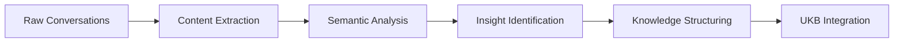

# Conversation Insight Extraction

Extracting valuable technical insights from team discussions, code reviews, and AI interactions for knowledge management and continuous learning.

## Overview

The Semantic Analysis System automatically processes conversations, meetings, code reviews, and AI interactions to extract actionable technical insights. This capability transforms informal knowledge sharing into structured, searchable documentation.

## Key Benefits

- **Capture Tribal Knowledge**: Convert team discussions into documented insights
- **Learning from Code Reviews**: Extract patterns and best practices from PR discussions
- **AI Conversation Mining**: Learn from Claude Code sessions and other AI interactions
- **Meeting Intelligence**: Transform technical meetings into actionable knowledge
- **Continuous Learning**: Build organizational memory from everyday interactions

## How It Works

### 1. Conversation Processing Pipeline

The system analyzes various conversation formats:



### Sequence Diagram


### 2. Supported Conversation Types

- **Slack/Teams Messages**: Technical discussions and problem-solving
- **Code Review Comments**: PR discussions and feedback
- **Meeting Transcripts**: Technical meetings and architecture discussions
- **AI Chat Logs**: Claude Code sessions, ChatGPT conversations
- **Documentation Comments**: Inline code discussions

### 3. Insight Categories

The system identifies and categorizes:

- **Technical Solutions**: Problem-solving approaches and implementations
- **Best Practices**: Coding standards and architectural decisions
- **Lessons Learned**: Mistakes, gotchas, and preventive measures
- **Tool Recommendations**: Technology choices and tool evaluations
- **Process Insights**: Development workflow improvements

## Usage Examples

### Basic Conversation Analysis

```bash
# Analyze a conversation file
semantic-cli analyze conversation --file ./team-discussion.md

# Analyze Slack export
semantic-cli analyze conversation --source slack --file ./slack-export.json

# Analyze code review discussions
semantic-cli analyze conversation --source github --pr-number 123
```

### Programmatic Usage

```javascript
import { CoordinatorClient } from './clients/coordinator-client.js';

const coordinator = new CoordinatorClient({
  rpcEndpoint: 'http://localhost:8080'
});

// Analyze conversation for insights
const insights = await coordinator.analyzeConversation({
  conversationPath: './technical-discussion.md',
  extractInsights: true,
  significanceThreshold: 6,
  categories: ['technical-solution', 'best-practice', 'lesson-learned']
});

console.log('Extracted Insights:', insights.insights);
console.log('Key Participants:', insights.participants);
console.log('Technical Topics:', insights.topics);
```

### MCP Tool Integration

```javascript
// Available as MCP tool in Claude Desktop
const conversationAnalysis = await mcp.call('semantic_analyze_conversation', {
  conversationText: 'Full conversation content here...',
  extractActionItems: true,
  identifyDecisions: true,
  captureInsights: true
});
```

## Conversation Formats Supported

### Markdown Conversations
```markdown
# Technical Discussion: React State Management

**Alice**: We're seeing performance issues with our current Redux setup.

**Bob**: Have you considered using Zustand? It's much lighter than Redux for our use case.

**Charlie**: +1 for Zustand. We used it in the last project and saw 30% bundle size reduction.

**Alice**: Interesting. What about TypeScript support?

**Bob**: Excellent TS support. Here's how we set it up:
[code example]
```

### Slack/Teams JSON
```json
{
  "messages": [
    {
      "user": "alice",
      "text": "Anyone know why our CI is failing on the feature branch?",
      "timestamp": "2024-01-15T10:30:00Z"
    },
    {
      "user": "bob", 
      "text": "It's the new ESLint rules. Here's the fix: [code]",
      "timestamp": "2024-01-15T10:32:00Z"
    }
  ]
}
```

### Code Review Comments
```yaml
# GitHub PR Analysis
pr_number: 456
comments:
  - author: reviewer1
    comment: "Consider using async/await instead of .then() for better readability"
    file: "src/api/client.js"
    line: 23
  - author: author
    comment: "Good point, refactored to use async/await"
    type: "resolution"
```

## Output Format

Conversation analysis produces structured insights:

```javascript
{
  "conversation": {
    "id": "tech-discussion-2024-01-15",
    "source": "slack",
    "participants": ["alice", "bob", "charlie"],
    "duration": "45 minutes",
    "topics": ["React", "Redux", "Zustand", "Performance"]
  },
  "insights": [
    {
      "type": "technical-solution",
      "title": "Zustand as Redux Alternative",
      "significance": 8,
      "content": "Team identified Zustand as lighter alternative to Redux for state management",
      "participants": ["bob", "charlie"],
      "evidence": [
        "30% bundle size reduction mentioned",
        "Excellent TypeScript support",
        "Code example provided"
      ],
      "actionItems": [
        "Evaluate Zustand for current project",
        "Create migration plan from Redux"
      ],
      "tags": ["state-management", "performance", "react"]
    }
  ],
  "decisions": [
    {
      "decision": "Migrate from Redux to Zustand",
      "rationale": "Better performance and smaller bundle size",
      "participants": ["alice", "bob", "charlie"],
      "status": "proposed"
    }
  ],
  "actionItems": [
    {
      "item": "Create Zustand POC",
      "assignee": "alice",
      "priority": "high",
      "deadline": "2024-01-22"
    }
  ],
  "knowledgeEntities": [
    {
      "name": "ZustandMigrationPattern",
      "type": "TechnicalPattern",
      "significance": 8,
      "description": "Pattern for migrating from Redux to Zustand"
    }
  ]
}
```

## Advanced Features

### Multi-Source Analysis

Analyze conversations across multiple platforms:

```javascript
const crossPlatformAnalysis = await coordinator.analyzeCrossPlat Conversations({
  sources: [
    { type: 'slack', channel: '#engineering' },
    { type: 'github', repository: 'org/repo' },
    { type: 'meetings', transcript: './standup-notes.md' }
  ],
  timeRange: '2weeks',
  correlateTopics: true
});
```

### Sentiment and Tone Analysis

Understanding team dynamics and technical confidence:

```javascript
const sentimentAnalysis = await coordinator.analyzeConversationSentiment({
  conversationPath: './technical-debate.md',
  trackConfidence: true,
  identifyUncertainty: true,
  measureAgreement: true
});
```

### Real-time Processing

Process conversations as they happen:

```javascript
// Set up real-time conversation processing
const processor = new ConversationProcessor({
  sources: ['slack-webhook', 'github-webhook'],
  realtime: true,
  significanceThreshold: 6
});

processor.on('insight-detected', async (insight) => {
  await ukb.captureInsight(insight);
  await notify.team(insight);
});
```

## Integration Workflows

### Automatic UKB Integration

Insights are automatically captured in the knowledge base:

```bash
# Configure automatic insight capture
ukb --configure --auto-conversation-capture=true
ukb --configure --significance-threshold=6

# Manual insight capture from conversations
ukb --source conversation --file ./discussion.md
```

### Post-Meeting Processing

Automated workflow for meeting insights:

```javascript
// Example workflow for meeting processing
const meetingWorkflow = {
  trigger: 'meeting-end',
  steps: [
    'extract-transcript',
    'analyze-conversation', 
    'identify-insights',
    'create-action-items',
    'update-knowledge-base',
    'notify-participants'
  ]
};
```

### Code Review Learning

Extract patterns from code review discussions:

```bash
# Analyze all PR discussions for patterns
semantic-cli analyze code-reviews --repo . --since="1month"

# Focus on specific review topics
semantic-cli analyze code-reviews --topics="performance,security"
```

## Configuration

Configure conversation analysis in `config/agents.yaml`:

```yaml
agents:
  semantic-analysis:
    conversation:
      analysis:
        enabled: true
        sources: ['slack', 'github', 'transcript', 'markdown']
        significanceThreshold: 6
        extractActionItems: true
        identifyDecisions: true
        trackParticipants: true
      processing:
        realtime: false
        batchSize: 10
        retentionPeriod: '6months'
      integration:
        ukbAutoCapture: true
        notifyOnInsights: true
        createActionItems: true
```

## Privacy and Security

### Data Handling
- **Anonymization**: Option to anonymize participant names
- **Filtering**: Exclude sensitive topics or keywords
- **Retention**: Configurable data retention policies
- **Access Control**: Role-based access to conversation insights

### Configuration Example
```yaml
privacy:
  anonymizeParticipants: true
  excludeKeywords: ['password', 'api-key', 'secret']
  retentionDays: 90
  accessControl:
    insights: ['tech-lead', 'senior-dev']
    raw-conversations: ['admin-only']
```

## Metrics and Analytics

Track conversation insight effectiveness:

```javascript
const metrics = await coordinator.getConversationMetrics({
  timeRange: '1month',
  metrics: [
    'insights-extracted',
    'action-items-created', 
    'knowledge-entities-added',
    'participant-engagement',
    'topic-distribution'
  ]
});
```

This use case transforms everyday team conversations into valuable, searchable knowledge that helps teams learn faster, make better decisions, and build institutional memory.