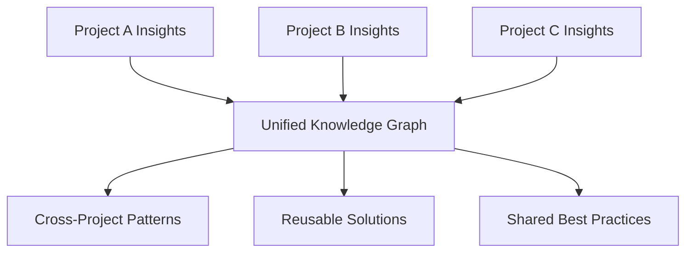

# Cross-Project Learning

How knowledge accumulates across multiple projects and benefits the entire team through intelligent knowledge transfer and pattern recognition.

## Overview

The Semantic Analysis System enables organizations to learn from patterns, solutions, and insights across multiple projects, creating a shared intelligence that grows stronger with each project. This cross-pollination of knowledge prevents teams from solving the same problems repeatedly and accelerates development across all projects.

## Key Benefits

- **Prevent Duplicate Solutions**: Identify when similar problems have been solved before
- **Accelerate Onboarding**: New projects start with accumulated organizational knowledge
- **Pattern Reuse**: Apply successful patterns from one project to another
- **Risk Mitigation**: Learn from failures and anti-patterns across projects
- **Skill Development**: Team members learn from approaches used in other projects

## How It Works

### 1. Knowledge Aggregation

The system maintains a unified knowledge graph that spans multiple projects:



### Sequence Diagram


### 2. Pattern Recognition Across Projects

```javascript
// Detect similar patterns across projects
const crossProjectPatterns = await coordinator.findCrossProjectPatterns({
  projects: ['/project-a', '/project-b', '/project-c'],
  patternTypes: ['architectural', 'performance', 'security'],
  minimumSimilarity: 0.7
});
```

### 3. Knowledge Transfer Mechanisms

- **Automatic Suggestions**: "Project X solved a similar problem this way..."
- **Pattern Libraries**: Reusable code patterns and architectural solutions
- **Lesson Propagation**: Share learnings and gotchas across teams
- **Best Practice Evolution**: Continuously refine practices based on multi-project experience

## Usage Examples

### Cross-Project Analysis

```bash
# Analyze patterns across multiple projects
semantic-cli analyze cross-project --projects ./project-a,./project-b,./project-c

# Find similar solutions across projects
semantic-cli find similarities --problem "authentication" --projects ./proj-*

# Generate cross-project insights report
semantic-cli report cross-learning --output ./cross-project-insights.md
```

### Programmatic Knowledge Transfer

```javascript
import { CoordinatorClient } from './clients/coordinator-client.js';

const coordinator = new CoordinatorClient({
  rpcEndpoint: 'http://localhost:8080'
});

// Find solutions from other projects
const solutions = await coordinator.findSimilarSolutions({
  currentProblem: "React component state management",
  searchProjects: ['/proj-a', '/proj-b', '/proj-c'],
  includeMetrics: true,
  minSuccessRate: 0.8
});

// Get project recommendations
const recommendations = await coordinator.getProjectRecommendations({
  currentProject: '/new-project',
  basedOnProjects: ['/similar-proj-1', '/similar-proj-2'],
  recommendationTypes: ['architecture', 'tooling', 'patterns']
});
```

### MCP Integration

```javascript
// Cross-project learning via MCP tools
const crossInsights = await mcp.call('semantic_cross_project_learning', {
  projects: ['/proj1', '/proj2', '/proj3'],
  learningFocus: 'performance-optimization',
  generateReport: true
});
```

## Knowledge Transfer Scenarios

### 1. New Project Kickoff

When starting a new project, leverage accumulated knowledge:

```javascript
const projectKickoff = await coordinator.generateProjectKickoffInsights({
  projectType: 'react-spa',
  teamSize: 'medium',
  complexity: 'high',
  learningSource: 'all-previous-projects'
});

// Results include:
// - Recommended architecture patterns
// - Tooling suggestions based on team success
// - Common pitfalls to avoid
// - Performance optimization strategies
```

### 2. Problem-Solving Assistance

When facing a technical challenge:

```javascript
const problemSolving = await coordinator.findSimilarProblems({
  problem: {
    description: "High memory usage in React app",
    context: "Large data tables with real-time updates",
    constraints: ["< 500MB memory", "60fps performance"]
  },
  searchAcross: 'all-projects',
  includeSolutions: true,
  includeMetrics: true
});
```

### 3. Architecture Decision Support

Making architectural decisions with cross-project insights:

```javascript
const architectureSupport = await coordinator.getArchitectureRecommendations({
  decision: "Choosing state management solution",
  projectConstraints: {
    teamSize: 8,
    complexity: 'high',
    performance: 'critical'
  },
  basedOnExperience: {
    includeSuccesses: true,
    includeFailures: true,
    minimumProjectCount: 2
  }
});
```

## Knowledge Categories

### Technical Patterns
- **Architectural Solutions**: Proven architectural approaches
- **Code Patterns**: Reusable code structures and implementations
- **Performance Optimizations**: Techniques that improved performance
- **Security Implementations**: Security patterns and solutions

### Process Insights
- **Development Workflows**: Effective development processes
- **Testing Strategies**: Successful testing approaches
- **Deployment Patterns**: Reliable deployment strategies
- **Team Collaboration**: Effective team communication patterns

### Tool Evaluations
- **Technology Choices**: Success/failure rates of different technologies
- **Library Assessments**: Performance and usability of libraries
- **Tool Combinations**: Effective tool stacks and integrations
- **Migration Experiences**: Lessons from technology migrations

## Cross-Project Knowledge Structure

```javascript
{
  "crossProjectInsight": {
    "id": "react-performance-optimization-2024",
    "pattern": "Virtual Scrolling Implementation",
    "significance": 9,
    "projects": [
      {
        "name": "project-dashboard",
        "implementation": "react-window with custom hooks",
        "outcome": "90% performance improvement",
        "metrics": { "memoryReduction": "60%", "renderTime": "15ms" }
      },
      {
        "name": "project-analytics", 
        "implementation": "react-virtualized with Redux",
        "outcome": "70% performance improvement",
        "metrics": { "memoryReduction": "45%", "renderTime": "25ms" }
      }
    ],
    "consolidatedLearning": {
      "bestApproach": "react-window with custom hooks",
      "keyFactors": ["data size", "scroll frequency", "memory constraints"],
      "recommendations": [
        "Use react-window for > 1000 items",
        "Implement custom hooks for state management",
        "Monitor memory usage during development"
      ],
      "avoidance": [
        "Don't virtualize small lists (< 100 items)",
        "Avoid complex animations with virtualization"
      ]
    }
  }
}
```

## Implementation Patterns

### 1. Knowledge Synchronization

Sync knowledge across project repositories:

```bash
# Sync knowledge from other projects
ukb --sync --from-projects="../project-a,../project-b"

# Share current project insights with central knowledge base
ukb --share --to-central-kb

# Update project-specific knowledge with cross-project insights
ukb --update --with-cross-project-insights
```

### 2. Automated Learning Pipeline

Set up automatic knowledge transfer:

```javascript
// Automated cross-project learning configuration
const learningPipeline = {
  triggers: ['project-completion', 'milestone-reached', 'weekly'],
  analysis: {
    compareProjects: true,
    extractPatterns: true,
    identifyImprovements: true,
    updateRecommendations: true
  },
  distribution: {
    updateCentralKB: true,
    notifyRelevantTeams: true,
    generateReports: true
  }
};
```

### 3. Smart Recommendations Engine

Provide contextual recommendations based on cross-project knowledge:

```javascript
const recommendationEngine = await coordinator.createRecommendationEngine({
  basedOnProjects: 'all',
  contexts: ['architecture', 'performance', 'testing', 'deployment'],
  updateFrequency: 'daily',
  confidenceThreshold: 0.75
});

// Get recommendations for current context
const recommendations = await recommendationEngine.getRecommendations({
  context: 'choosing-database',
  projectRequirements: {
    scale: 'medium',
    consistency: 'eventual',
    budget: 'low'
  }
});
```

## Metrics and Success Tracking

### Knowledge Reuse Metrics

```javascript
const reuseMetrics = await coordinator.getKnowledgeReuseMetrics({
  timeRange: '6months',
  projects: 'all',
  metrics: [
    'pattern-reuse-rate',
    'problem-solving-time-reduction',
    'cross-project-references',
    'recommendation-adoption-rate'
  ]
});

// Example output:
{
  "patternReuseRate": 0.73,          // 73% of patterns were reused
  "timeReduction": 0.45,             // 45% faster problem solving
  "crossReferences": 89,             // 89 cross-project references
  "recommendationAdoption": 0.62     // 62% of recommendations adopted
}
```

### Learning Effectiveness

Track how cross-project learning improves outcomes:

```javascript
const learningEffectiveness = {
  beforeCrossProjectLearning: {
    avgProblemSolvingTime: '2.5 days',
    patternReimplementationRate: 0.85,
    architectureDecisionTime: '1 week'
  },
  afterCrossProjectLearning: {
    avgProblemSolvingTime: '1.2 days', // 52% improvement
    patternReimplementationRate: 0.23,  // 73% reduction
    architectureDecisionTime: '2 days'  // 71% improvement
  }
};
```

## Configuration

Configure cross-project learning in `config/agents.yaml`:

```yaml
agents:
  semantic-analysis:
    crossProject:
      learning:
        enabled: true
        projectPaths: ['../proj1', '../proj2', '../proj3']
        knowledgeBase: 'shared'
        syncFrequency: 'daily'
      patterns:
        crossProjectSimilarity: 0.7
        patternMatchingTypes: ['architectural', 'performance', 'security']
        recommendationConfidence: 0.75
      recommendations:
        contextualSuggestions: true
        preventDuplication: true
        shareSuccesses: true
        shareFailures: true
```

## Team Collaboration Features

### Knowledge Sharing Dashboard

Visual interface for cross-project insights:

```bash
# Start cross-project knowledge dashboard
vkb --cross-project --port 8080

# View specific project comparisons
vkb --compare --projects "proj-a,proj-b" --focus "architecture"
```

### Notification System

Automated notifications for relevant cross-project insights:

```javascript
const notifications = {
  "new-similar-solution": "Project B solved a similar authentication problem",
  "pattern-opportunity": "Consider applying the caching pattern from Project A",
  "anti-pattern-warning": "Project C encountered issues with this approach"
};
```

## Advanced Features

### Intelligent Project Clustering

Group projects by similarity for better knowledge transfer:

```javascript
const projectClusters = await coordinator.clusterProjects({
  projects: 'all',
  clusterBy: ['technology-stack', 'architecture-patterns', 'team-size'],
  generateInsights: true
});
```

### Predictive Problem Detection

Use cross-project knowledge to predict potential issues:

```javascript
const riskPrediction = await coordinator.predictProjectRisks({
  currentProject: '/new-project',
  basedOnSimilarProjects: 'auto-detect',
  riskCategories: ['performance', 'scalability', 'maintenance']
});
```

This use case transforms isolated project knowledge into organizational intelligence, enabling teams to build on each other's successes and learn from shared experiences.