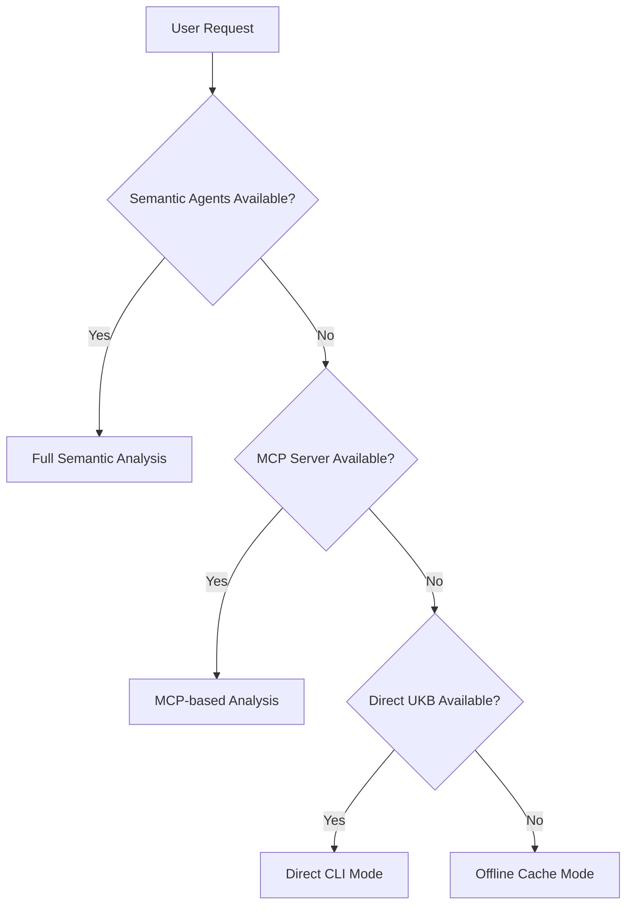

# Fallback Service Utilization

How the system gracefully degrades when semantic agents are unavailable, using direct ukb-cli access and ensuring continuous operation.

## Overview

The Semantic Analysis System is designed with multiple layers of fallback mechanisms to ensure continuous operation even when primary semantic agents are unavailable. This resilient architecture provides users with degraded but functional service rather than complete system failure.

## Fallback Architecture

The system implements a multi-tier fallback strategy:



### Sequence Diagram


## Fallback Levels

### Level 1: Full Semantic Analysis (Primary)
- **Services**: All semantic agents running
- **Capabilities**: Complete analysis, insights, cross-project learning
- **Performance**: Optimal response times and quality

### Level 2: MCP-only Mode (First Fallback)
- **Services**: MCP server running, agents down
- **Capabilities**: Basic analysis via cached models, limited insights
- **Performance**: Reduced functionality but maintained core operations

### Level 3: Direct CLI Mode (Second Fallback)
- **Services**: Direct ukb-cli access only
- **Capabilities**: Knowledge base operations, basic pattern matching
- **Performance**: Manual operations, no automatic insights

### Level 4: Offline Cache Mode (Last Resort)
- **Services**: All network services down
- **Capabilities**: Access to cached knowledge, read-only operations
- **Performance**: Minimal functionality, historical data only

## Implementation Details

### Automatic Fallback Detection

The system continuously monitors service health:

```javascript
// Health check system
class FallbackManager {
  constructor() {
    this.services = {
      semanticAgents: { status: 'unknown', lastCheck: null },
      mcpServer: { status: 'unknown', lastCheck: null },
      ukbCli: { status: 'unknown', lastCheck: null }
    };
    this.checkInterval = 30000; // 30 seconds
  }

  async checkServiceHealth() {
    // Check semantic agents
    try {
      await coordinator.ping();
      this.services.semanticAgents.status = 'healthy';
    } catch (error) {
      this.services.semanticAgents.status = 'unavailable';
      this.triggerFallback('semantic-agents-down');
    }

    // Check MCP server
    try {
      await mcp.call('health_check');
      this.services.mcpServer.status = 'healthy';
    } catch (error) {
      this.services.mcpServer.status = 'unavailable';
      this.triggerFallback('mcp-server-down');
    }

    // Check UKB CLI
    try {
      await exec('ukb --health');
      this.services.ukbCli.status = 'healthy';
    } catch (error) {
      this.services.ukbCli.status = 'unavailable';
      this.triggerFallback('ukb-cli-unavailable');
    }
  }
}
```

### Service Routing Logic

```javascript
// Intelligent service routing based on availability
class ServiceRouter {
  async routeRequest(request) {
    const availability = await this.checkAvailability();
    
    switch (availability.level) {
      case 'full':
        return await this.handleFullService(request);
      case 'mcp-only':
        return await this.handleMcpOnlyService(request);
      case 'cli-only':
        return await this.handleCliOnlyService(request);
      case 'offline':
        return await this.handleOfflineService(request);
      default:
        throw new Error('No fallback services available');
    }
  }

  async handleFullService(request) {
    // Full semantic analysis with all agents
    return await coordinator.processRequest(request);
  }

  async handleMcpOnlyService(request) {
    // Limited analysis via MCP tools
    return await mcp.call('semantic_analyze_basic', request);
  }

  async handleCliOnlyService(request) {
    // Direct CLI operations
    return await this.executeUkbCommand(request);
  }

  async handleOfflineService(request) {
    // Cached data and offline operations
    return await this.accessCache(request);
  }
}
```

## Fallback Capabilities by Level

### Full Service (Level 1)
✅ **Available:**
- Complete semantic analysis
- Cross-project learning
- Real-time insights extraction
- Pattern detection and analysis
- Conversation analysis
- Web search integration
- Knowledge graph operations
- Real-time recommendations

### MCP-Only Mode (Level 2)
✅ **Available:**
- Basic semantic analysis (cached models)
- Knowledge base queries
- Simple pattern matching
- Historical data access
- Basic recommendations

❌ **Limited:**
- Real-time learning (delayed)
- Complex cross-project analysis
- Live conversation processing
- Web search capabilities

### CLI-Only Mode (Level 3)
✅ **Available:**
- Knowledge base CRUD operations
- Manual insight capture
- Basic pattern queries
- Historical analysis
- Local knowledge search

❌ **Limited:**
- Automatic analysis
- Real-time processing
- AI-powered insights
- Cross-agent communication

### Offline Mode (Level 4)
✅ **Available:**
- Cached knowledge access
- Historical patterns
- Previously captured insights
- Local search within cache

❌ **Limited:**
- New analysis
- Updates to knowledge base
- Network-dependent features
- Real-time data

## User Experience During Fallbacks

### Transparent Degradation

Users are informed about service level changes:

```javascript
// User notification system
class FallbackNotificationManager {
  notifyServiceLevel(level, reason) {
    const messages = {
      'mcp-only': 'Operating in limited mode. Some advanced features unavailable.',
      'cli-only': 'Using basic mode. Manual operations available via CLI.',
      'offline': 'Offline mode. Access to cached data only.'
    };

    this.showNotification({
      level: 'warning',
      message: messages[level],
      reason: reason,
      suggestion: this.getSuggestion(level)
    });
  }

  getSuggestion(level) {
    const suggestions = {
      'mcp-only': 'Check semantic agent status with: npm run check:agents',
      'cli-only': 'Restart MCP server with: npm run start:mcp',
      'offline': 'Check network connection and restart services'
    };
    return suggestions[level];
  }
}
```

### Graceful Feature Degradation

Features adapt to available services:

```javascript
// Feature adaptation based on service availability
class AdaptiveFeatures {
  async analyzeCode(request) {
    const serviceLevel = await this.getServiceLevel();
    
    switch (serviceLevel) {
      case 'full':
        return await this.fullCodeAnalysis(request);
      case 'mcp-only':
        return await this.basicCodeAnalysis(request);
      case 'cli-only':
        return await this.manualCodeAnalysis(request);
      case 'offline':
        return await this.cachedCodeAnalysis(request);
    }
  }

  async fullCodeAnalysis(request) {
    // Complete analysis with all agents
    return {
      insights: await semanticAgent.analyzeCode(request),
      patterns: await patternAgent.detectPatterns(request),
      crossProject: await coordinator.findSimilarProjects(request),
      recommendations: await recommendationEngine.suggest(request)
    };
  }

  async basicCodeAnalysis(request) {
    // Limited analysis via MCP
    return {
      insights: await mcp.call('basic_code_analysis', request),
      patterns: await this.getCachedPatterns(request),
      message: 'Limited analysis mode - some features unavailable'
    };
  }

  async manualCodeAnalysis(request) {
    // CLI-based analysis
    return {
      insights: await this.runUkbAnalysis(request),
      patterns: 'Manual pattern detection required',
      suggestion: 'Use: ukb --analyze --file ' + request.file
    };
  }

  async cachedCodeAnalysis(request) {
    // Offline cached data
    return {
      insights: await this.getCachedInsights(request),
      patterns: await this.getCachedPatterns(request),
      note: 'Offline mode - showing cached results only'
    };
  }
}
```

## Configuration and Monitoring

### Fallback Configuration

Configure fallback behavior in `config/agents.yaml`:

```yaml
fallback:
  detection:
    healthCheckInterval: 30000    # 30 seconds
    timeoutThreshold: 5000       # 5 seconds
    retryAttempts: 3
    retryDelay: 1000            # 1 second
  
  behavior:
    notifyUsers: true
    logFallbacks: true
    autoRecovery: true
    gracefulDegradation: true
  
  services:
    semanticAgents:
      priority: 1
      healthEndpoint: '/health'
      fallbackTo: 'mcpServer'
    mcpServer:
      priority: 2
      healthEndpoint: '/mcp/health'
      fallbackTo: 'ukbCli'
    ukbCli:
      priority: 3
      healthCommand: 'ukb --health'
      fallbackTo: 'offlineCache'
  
  cache:
    enabled: true
    duration: '24h'
    maxSize: '500MB'
    updateFrequency: '1h'
```

### Monitoring and Alerting

Track fallback events and system health:

```javascript
// Fallback monitoring system
class FallbackMonitor {
  constructor() {
    this.metrics = {
      fallbackEvents: [],
      serviceUptime: {},
      recoveryTimes: {},
      userImpact: {}
    };
  }

  logFallbackEvent(event) {
    const fallbackEvent = {
      timestamp: new Date(),
      fromService: event.from,
      toService: event.to,
      reason: event.reason,
      affectedUsers: event.userCount,
      duration: null // will be updated on recovery
    };
    
    this.metrics.fallbackEvents.push(fallbackEvent);
    this.alertAdministrators(fallbackEvent);
  }

  async generateFallbackReport() {
    return {
      summary: {
        totalFallbackEvents: this.metrics.fallbackEvents.length,
        avgServiceUptime: this.calculateAvgUptime(),
        mostCommonFailureReason: this.getMostCommonReason(),
        avgRecoveryTime: this.calculateAvgRecoveryTime()
      },
      recentEvents: this.metrics.fallbackEvents.slice(-10),
      recommendations: await this.generateRecommendations()
    };
  }
}
```

## Recovery Procedures

### Automatic Recovery

The system attempts automatic recovery when services become available:

```javascript
// Automatic service recovery
class ServiceRecovery {
  async attemptRecovery() {
    const downServices = await this.getDownServices();
    
    for (const service of downServices) {
      try {
        await this.restartService(service);
        await this.verifyServiceHealth(service);
        await this.updateServiceStatus(service, 'healthy');
        this.notifySuccessfulRecovery(service);
      } catch (error) {
        this.logRecoveryFailure(service, error);
        await this.scheduleRetry(service);
      }
    }
  }

  async restartService(service) {
    const restartCommands = {
      'semantic-agents': 'npm run start:agents',
      'mcp-server': 'npm run start:mcp',
      'ukb-cli': 'ukb --restart-daemon'
    };
    
    await exec(restartCommands[service]);
  }
}
```

### Manual Recovery

Provide clear instructions for manual recovery:

```bash
# Check service status
npm run check:services

# Restart individual services
npm run restart:agents      # Restart semantic agents
npm run restart:mcp         # Restart MCP server
ukb --restart-daemon        # Restart UKB daemon

# Full system recovery
npm run recovery:full

# Check fallback status
npm run fallback:status
```

## Testing Fallback Scenarios

### Automated Fallback Testing

```javascript
// Test suite for fallback scenarios
describe('Fallback Service Utilization', () => {
  it('should fallback to MCP when agents are down', async () => {
    await simulateAgentFailure();
    const result = await performAnalysis();
    expect(result.serviceLevel).toBe('mcp-only');
    expect(result.functionality).toInclude('basic-analysis');
  });

  it('should use CLI mode when MCP is unavailable', async () => {
    await simulateAllServiceFailures();
    const result = await performAnalysis();
    expect(result.serviceLevel).toBe('cli-only');
    expect(result.suggestion).toContain('ukb --analyze');
  });

  it('should recover automatically when services return', async () => {
    await simulateServiceRecovery();
    await waitForRecovery();
    const result = await performAnalysis();
    expect(result.serviceLevel).toBe('full');
  });
});
```

### Manual Testing

```bash
# Test fallback scenarios manually
npm run test:fallback:mcp-down
npm run test:fallback:agents-down  
npm run test:fallback:complete-failure
npm run test:fallback:recovery
```

## Best Practices

### 1. Graceful Degradation Design
- Always provide some level of functionality
- Inform users about service limitations
- Offer alternative approaches when possible

### 2. Monitoring and Alerting
- Monitor service health continuously
- Alert administrators immediately on fallbacks
- Track user impact and recovery times

### 3. Cache Management
- Maintain fresh caches for offline operation
- Prioritize most frequently accessed data
- Implement intelligent cache warming

### 4. Recovery Planning
- Test recovery procedures regularly
- Document manual recovery steps
- Implement automatic recovery where possible

This fallback system ensures that users always have access to some level of functionality, making the Semantic Analysis System highly reliable and resilient to failures.